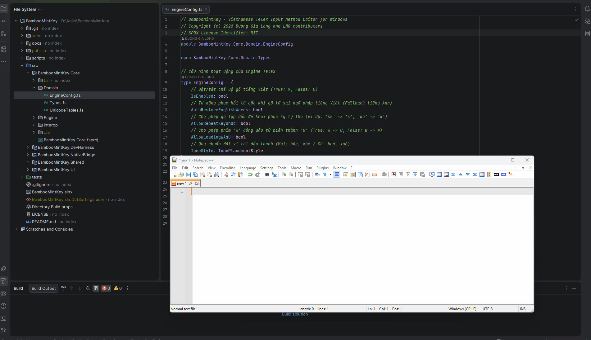
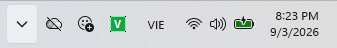
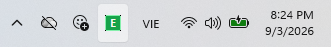

<!--
  BambooMintKey - Vietnamese Telex Input Method Editor for Windows & Linux
  Copyright (c) 2026 Dương Gia Long and LMO contributors
  SPDX-License-Identifier: MIT
-->

# BambooMintKey

**Bộ gõ tiếng Việt Telex cho Windows (TSF) và Linux (Fcitx5).**

BambooMintKey là bộ gõ tiếng Việt với **lõi xử lý ngôn ngữ thuần chức năng (F#) dùng chung** cho cả hai nền tảng:

- **Windows** — Text Input Processor (TIP) chạy như In-Process COM Server bên trong tiến trình ứng dụng, tích hợp sâu vào Text Services Framework (TSF).
- **Linux** — Fcitx5 addon (C++) gọi engine qua C-ABI, kèm giao diện cài đặt Avalonia độc lập.



---

## Tính Năng (Windows)

- **Gõ Telex tiếng Việt chuẩn** (`aa` → `â`, `dd` → `đ`, `as` → `á`, v.v.).
- **Tích hợp Windows TSF**: hiển thị trên Language Bar, chuyển đổi bằng `Win + Space`.
- **In-Process NativeAOT**: toàn bộ bộ gõ được biên dịch thành một DLL C gốc duy nhất (`BambooMintKey.dll`).
- **Xử lý phím mức hệ thống** qua `ITfKeyEventSink`, không dựa vào giả lập phím.
- **Lõi F# thuần chức năng**: engine Telex, parser vần, bảng Unicode được viết bằng F# và liên kết tĩnh với C# NativeBridge.
- **Taskbar icon động V/E** tích hợp Windows Input Indicator, cho phép chuyển chế độ bằng click chuột trái.
- **Context menu trên Taskbar** để chuyển nhanh chế độ gõ, kiểu gõ, bảng mã và mở cài đặt.
- **Cửa sổ Settings GUI độc lập** (Avalonia) với gõ thử nghiệm trực tiếp, phím tắt tùy chỉnh và cấu hình đa tab.
- **Cấu hình đồng bộ thời gian thực** giữa TIP, taskbar và Settings GUI qua shared memory + `config.json`.

---

## Linux (Fcitx5)

BambooMintKey chạy trên Linux qua **Fcitx5**, tái sử dụng nguyên lõi engine F# (không can thiệp code Windows). Gồm 3 thành phần:

| Thành phần | Công nghệ | Vai trò |
|---|---|---|
| `BambooMintKey.Core.Native` | C# NativeAOT | Đóng gói engine F# thành C-ABI `BambooMintKeyCore.so` |
| `BambooMintKey.Fcitx5` | C++ / CMake | Addon Fcitx5 `libbamboomintkey.so`, D-Bus V/E, icon động |
| `BambooMintKey.UI.Linux` | Avalonia / F# | Giao diện cài đặt độc lập (6 tab) |

### Tính năng chính

- Gõ Telex chuẩn — dùng chung engine F# với Windows.
- Chuyển V/E bằng phím `` ` `` (grave, dưới Esc), icon V/E động trên khay hệ thống.
- Đồng bộ trạng thái V/E qua D-Bus (signal `ModeChanged`).
- Cấu hình XDG `~/.config/bamboomintkey/config.json`, hot-reload qua `inotify`.
- Cài đặt native trong `fcitx5-configtool` + GUI Avalonia.
- Hỗ trợ **Ubuntu/Debian** và **Fedora** (apt/rpm).

### Cài đặt nhanh

```bash
cd /đường/dẫn/tới/BambooMintKey
./scripts/install_linux.sh      # build + cài vào /usr (cần sudo)
./scripts/uninstall_linux.sh    # gỡ sạch
```

Hướng dẫn chi tiết: [`docs/BUILD_LINUX.md`](docs/BUILD_LINUX.md) · Thiết kế & tiến độ: [`docs/2.Design/Phase7/`](docs/2.Design/Phase7/).

---

## Trạng Thái Hiện Tại (Windows)

Dự án đã hoàn thành **Phase 1** (nguyên cứu & thiết kế), **Phase 2** (core engine F# + TSF NativeAOT bridge) và **triển khai phần lớn Phase 3** (User Interface & Context Management).

### Phase 3 — Đã triển khai

| Hạng mục | Trạng thái | Ghi chú |
|----------|------------|---------|
| Taskbar Button COM Bridge (`ITfLangBarItemButton`) | ✅ Hoạt động | Đăng ký / gỡ bỏ qua `ITfLangBarItemMgr`. |
| Icon động V/E trên Taskbar | ✅ Hoạt động | Vẽ GDI năng động, caching + `CopyIcon`, đồng bộ `Input Mode Compartment`. |
| Context menu chuột phải | ✅ Hoạt động | Toggle tiếng Việt, chọn kiểu gõ, bảng mã, mở Settings/About. |
| Shared Configuration (`config.json`) | ✅ Hoạt động | Lưu tại `%AppData%\BambooMintKey\config.json`, reload không cần restart. |
| Settings GUI (Avalonia) | ✅ Hoạt động | 4 tab: Bàn phím & Phím tắt, Tùy chọn gõ, Gõ thử, Thông tin. |
| Đồng bộ trạng thái cross-process | ✅ Hoạt động | Shared memory + Manual-Reset event broadcast giữa các tiến trình. |

Các tính năng còn lại của Phase 3 (nếu có) đang trong giai đoạn tinh chỉnh và ổn định hóa dựa trên log/runtime.

### Ảnh Chụp Màn Hình

| Taskbar icon tiếng Việt (V) | Taskbar icon tiếng Anh (E) |
|:---------------------------:|:--------------------------:|
|  |  |


| Tab Bàn phím & Phím tắt | Tab Tùy chọn gõ |
|:-----------------------:|:---------------:|
|  |  |


---

## Yêu Cầu

### Windows

| Thành phần | Phiên bản |
|------------|-----------|
| Windows | Windows 10/11 (64-bit) |
| .NET SDK | 10.0 hoặc mới hơn |
| Công cụ build | `dotnet` CLI |
| Windows SDK | Được khuyến nghị để phát triển TSF |

### Linux

| Thành phần | Phiên bản |
|------------|-----------|
| Fcitx5 | 5.1.x |
| .NET SDK | 10.0 |
| CMake + g++ | 3.16+ / C++17 |
| clang + lld | — (cho NativeAOT) |

Chi tiết cài dependency: [`docs/BUILD_LINUX.md`](docs/BUILD_LINUX.md).

---

## Bắt Đầu Nhanh (Windows)

### 1. Build

```powershell
# Build toàn bộ solution
dotnet build BambooMintKey.slnx -c Release

# Publish NativeAOT DLL để chạy trên Windows
dotnet publish src/BambooMintKey.NativeBridge/BambooMintKey.NativeBridge.csproj `
  -c Release -r win-x64 --self-contained `
  -o publish/win-x64 `
  -p:NativeLib=Shared -p:PublishAot=true
```

> **Lưu ý khi publish bị lỗi "file is being used by another process":**
> Nếu `BambooMintKey.dll` trong `publish/win-x64` bị khóa bởi Windows Explorer hoặc IDE (Rider, VS), hãy restart Windows Explorer:
>
> ```powershell
> Stop-Process -Name explorer -Force
> Start-Process explorer
> ```
>
> Sau đó chạy lại lệnh `dotnet publish`.

### 2. Đăng Ký Bộ Gõ (Administrator)

```powershell
pwsh -File scripts/test-register.ps1
```

Script sẽ:
- Đăng ký CLSID COM In-Process Server.
- Tạo TSF Language Profile cho tiếng Việt (`0x042A`).
- Đăng ký Category `GUID_TFCAT_TIP_KEYBOARD`.

### 3. Kích Hoạt Cho User Hiện Tại

```powershell
pwsh -File scripts/enable-tip.ps1
```

Sau đó restart `ctfmon`:

```powershell
Stop-Process -Name ctfmon -Force -ErrorAction SilentlyContinue
Start-Process ctfmon
```

### 4. Kiểm Tra

```powershell
(Get-WinUserLanguageList | Where-Object { $_.LanguageTag -eq 'vi' }).InputMethodTips
```

Bạn sẽ thấy BambooMintKey trong danh sách input method của Vietnamese.

---

## Kiến Trúc

```
┌─────────────────────────────────────────────────────────────────────┐
| Ứng dụng đích (Notepad, Word, Chrome, ...)                          |
|                                                                     |
|  ┌──────────────────────────────────────────────────────────────┐  |
|  | Windows TSF Subsystem (msctf.dll)                            |  |
|  └───────────────────────┬──────────────────────────────────────┘  |
|                         │ COM Interface Calls                       |
|  ┌──────────────────────▼──────────────────────────────────────┐  |
|  | [C# NativeAOT] BambooMintKey.NativeBridge (BambooMintKey.dll)|  |
|  |  - COM Exports: DllGetClassObject, DllRegisterServer, ...     |  |
|  |  - TSF Interfaces: ITfTextInputProcessorEx, ITfKeyEventSink   |  |
|  |  - State Bridge & Composition Manager                          |  |
|  └───────────────────────┬──────────────────────────────────────┘  |
|                         │ In-Memory Fast Call                       |
|  ┌──────────────────────▼──────────────────────────────────────┐  |
|  | [F#] BambooMintKey.Core                                       |  |
|  |  - Telex Engine, Syllable Parser, Unicode Tables             |  |
|  └───────────────────────────────────────────────────────────────┘  |
└─────────────────────────────────────────────────────────────────────┘
```

Chi tiết kiến trúc hệ thống toàn diện có sơ đồ xem tại [Tài liệu Kiến trúc Hệ thống (System Architecture)](docs/SYSTEM_ARCHITECTURE.md). Chi tiết thiết kế xem tại [`docs/2.Design/Phase2/`](docs/2.Design/Phase2/) và trạng thái UI/Context Management tại [`docs/2.Design/Phase3/`](docs/2.Design/Phase3/).

---

## Cấu Trúc Thư Mục

| Thư mục | Mô tả |
|---------|-------|
| `src/BambooMintKey.Core` | Lõi F#: engine Telex, parser, domain types. |
| `src/BambooMintKey.NativeBridge` | C# NativeAOT: COM server, TSF interfaces, bridge sang F#. |
| `src/BambooMintKey.Shared` | Thư viện dùng chung giữa Core và NativeBridge. |
| `src/BambooMintKey.UI` | Giao diện Avalonia độc lập: Settings, About và khung gõ thử nghiệm. |
| `src/BambooMintKey.DevHarness` | Console harness kiểm thử COM/TSF nội bộ. |
| `src/BambooMintKey.Core.Native` | C# NativeAOT: thư viện C-ABI `BambooMintKeyCore.so` cho Linux. |
| `src/BambooMintKey.Fcitx5` | Addon Fcitx5 (C++/CMake): `libbamboomintkey.so`, D-Bus, icon. |
| `src/BambooMintKey.UI.Linux` | Giao diện cài đặt Avalonia (F#) cho Linux. |
| `tests/BambooMintKey.Core.Tests` | Unit tests cho Telex engine. |
| `scripts/` | Script đăng ký TIP (Windows) + cài đặt/gỡ bỏ Linux (`install_linux.sh`, `uninstall_linux.sh`). |
| `docs/` | Tài liệu thiết kế và hướng dẫn. |
| `docs/3.Issue/` | Template báo lỗi gõ tiếng Việt (issue templates). |

---

## Giấy Phép

Dự án được phát hành dưới [MIT License](LICENSE).

Copyright (c) 2026 Dương Gia Long and LMO contributors
