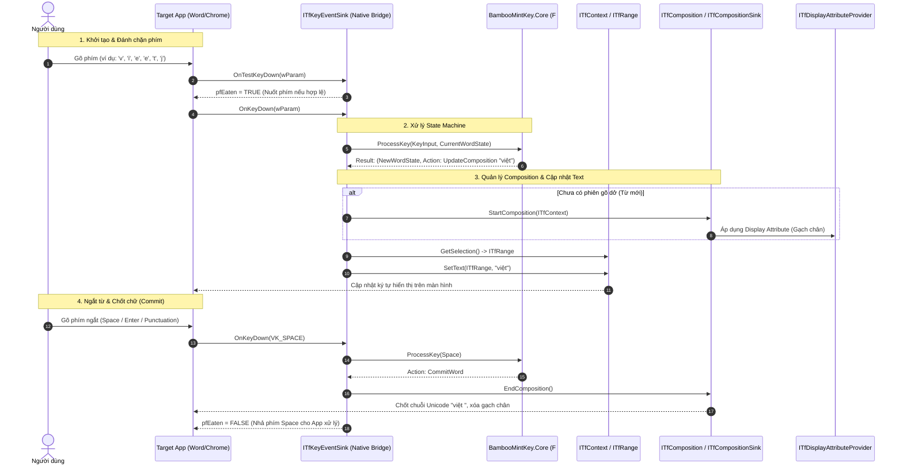

Xây dựng một bộ gõ tiếng Việt tích hợp trực tiếp vào **Windows Text Services Framework (TSF)** bằng **F#** (~90%) và **C#** (~10%)/.NET trên **JetBrains Rider** và **Avalonia UI**, áp dụng mô hình phân tách rõ ràng giữa **Core Native In-Process** (nơi TSF inject vào ứng dụng) và **Managed Layer / UI Layer**.

### 1. Kiến trúc hệ thống tổng thể (Architectural Design)

TSF chạy dưới dạng **In-process COM Server DLL**, nghĩa là file DLL của bộ gõ sẽ được inject trực tiếp vào mọi tiến trình nhận input trên Windows (Win32, UWP/WinUI 3, Chromium, Electron, Games).

```
┌────────────────────────────────────────────────────────────────────────┐
│ Target Application Process (Word, Chrome, Discord, Game, etc.)         │
│                                                                        │
│   ┌────────────────────────────────────────────────────────────────┐   │
│   │ [C#] BambooMintKey.NativeBridge (NativeAOT / Native Export)    │   │
│   │ - Xuất DllGetClassObject, DllRegisterServer                    │   │
│   │ - Implement ITfTextInputProcessorEx, ITfKeyEventSink           │   │
│   └───────────────────────────────┬────────────────────────────────┘   │
│                                   │ In-memory Fast Call                │
│   ┌───────────────────────────────▼────────────────────────────────┐   │
│   │ [F#] BambooMintKey.Core (Pure Functional Engine)               │   │
│   │ - Telex State Machine (Discriminated Unions & Pattern Match)   │   │
│   │ - Word Buffer, Backspace History Stack                         │   │
│   │ - Pure Functions xử lý dấu thanh & Unicode Normalization       │   │
│   └────────────────────────────────────────────────────────────────┘   │
└───────────────────────────────────┬────────────────────────────────────┘
                                    │ IPC (Named Pipes / Memory Mapped File)
┌───────────────────────────────────▼────────────────────────────────────┐
│ [F#] BambooMintKey.UI (Avalonia UI Standalone)                         │
│ - Settings Window, Hotkey Management, Tray Icon                        │
└────────────────────────────────────────────────────────────────────────┘
```

**Điểm chung của mọi bộ gõ TSF**

- **In-process COM Server bắt buộc:** Bất kỳ bộ gõ TSF nào cũng phải đóng gói thành DLL. Khi người dùng mở Notepad, Word hay Chrome, Windows sẽ nạp trực tiếp file DLL đó vào không gian bộ nhớ của tiến trình đích.  

- **Phân tách In-Process và Out-of-Process:** Tất cả các IME hiện đại đều tách UI cài đặt/quản lý sang một tiến trình riêng (Out-of-Process) và giao tiếp qua IPC để tránh làm phình RAM của app đích hoặc bị chặn bởi các cơ chế bảo mật (Anti-Cheat, Windows Sandbox, AppContainer).  

- **Vòng lặp tương tác (Input Pipeline):** Đều đi theo chu trình: `Bắt phím (KeyEventSink)` ー＞ `Đưa vào Engine` ー＞ `Mở phiên gõ tạm (Composition)` ー＞ `Gửi ký tự hoàn chỉnh (Commit/InsertAtSelection)`.


**Vì sao cần tách Out-of-Process cho Avalonia?**

- TSF DLL được tải vào hàng trăm tiến trình cùng lúc. Tránh load toàn bộ Avalonia runtime vào từng tiến trình để không làm tăng RAM và không xung đột với các ứng dụng bảo mật (Game Anti-Cheat, Banking, AppContainer).
- **Avalonia** chạy độc lập (Settings/Tray UI) và giao tiếp cấu hình qua IPC hoặc Shared State/Registry.

### 2. Các Interface TSF cốt lõi & Khảo sát kiến trúc (TSF Interfaces & Investigation)

Hệ thống Windows Text Services Framework (TSF) cung cấp **hơn 110 COM Interfaces** (định nghĩa trong `msctf.h` và `ctfutb.h`) để phục vụ mọi hình thức nhập liệu từ nhận dạng giọng nói, chữ viết tay đến các bộ gõ chữ tượng hình phức tạp (CJK).

Trong các bộ gõ tiếng Việt hiện đại theo chuẩn TSF TIP (như OpenKey), số lượng interface được tinh giản tối đa chỉ còn khoảng **8 đến 12 interfaces**. Với **BambooMintKey**, hệ thống tập trung hiện thực và tương tác với nhóm interface cốt lõi tạo thành một chu trình khép kín tối thiểu (Minimal Working Loop).

#### Bảng đặc tả các Interface cốt lõi

| **TSF Interface**                              | **Chiều tương tác**         | **Vai trò kỹ thuật trong BambooMintKey**                     |
| ---------------------------------------------- | --------------------------- | ------------------------------------------------------------ |
| `ITfTextInputProcessorEx`                      | **Implement** (Server Side) | Khởi tạo (`ActivateEx`) và giải phóng (`Deactivate`) vòng đời của Text Service khi ô nhập liệu nhận/mất focus. |
| `ITfThreadMgrEventSink`                        | **Implement** (Server Side) | Lắng nghe các sự kiện thay đổi focus tài liệu giữa các ứng dụng hoặc giữa các tab. |
| `ITfKeyEventSink`                              | **Implement** (Server Side) | Đánh chặn phím nhấn (`OnTestKeyDown`, `OnKeyDown`, `OnKeyUp`). Nuốt phím (`*pfEaten = TRUE`) khi gặp phím xử lý Telex (`s, f, r, x, j, a, w, e, o, d`) hoặc nhả phím cho hệ điều hành. |
| `ITfCompositionSink`                           | **Implement** (Server Side) | Nhận callback xử lý khi một phiên gõ (composition) bị hủy đột ngột từ phía ứng dụng (ví dụ: người dùng click chuột ra vị trí khác). |
| `ITfDisplayAttributeProvider`                  | **Implement** (Server Side) | Định nghĩa style gạch chân inline cho ký tự đang trong phiên gõ dở dang theo chuẩn giao diện Windows. |
| `ITfThreadMgr` & `ITfContext`                  | **Call** (Client Side)      | Quản lý luồng TSF và đọc ngữ cảnh tài liệu xung quanh con trỏ để thay thế chuỗi ký tự mà không cần giả lập phím Backspace. |
| `ITfComposition` & `ITfRange`                  | **Call** (Client Side)      | Thao tác chọn vùng văn bản (range), chèn, sửa và commit chuỗi Unicode hoàn chỉnh vào tài liệu. |
| `ITfInputProcessorProfiles` & `ITfCategoryMgr` | **Call** (Setup/COM)        | Đăng ký CLSID của TIP vào Category bàn phím (`GUID_TFCAT_TIP_KEYBOARD`) và ngôn ngữ hiển thị trên Taskbar. |

#### Khảo sát & Đối sánh kiến trúc: Tiếng Việt vs CJK (Trung - Nhật)

Khác với tiếng Trung/Nhật là ánh xạ **1-Nhiều (1-to-Many)** bắt buộc phải dùng các interface tạo popup gợi ý (`ITfCandidateListUIElement`, `ITfUIElementMgr`) để người dùng chọn chữ Hán, kiểu gõ Telex tiếng Việt là ánh xạ **1-1 tất định (1-to-1 Deterministic Mapping)**:

- Chuỗi phím `v-i-e-e-t-j` chỉ có một kết quả hợp lệ duy nhất là `việt`.  
- Văn bản được xuất trực tiếp tại chỗ (Direct Replacement) mà không cần làm gián đoạn dòng nhập liệu bằng cửa sổ chọn từ.
- Do đó, toàn bộ các Candidate UI Interfaces cồng kềnh được lược bỏ hoàn toàn ở giai đoạn này để tối ưu tối đa độ trễ phản hồi (keystroke latency).

#### Phân tầng xử lý ngữ cảnh (Context Handling Scope)

1. **Ngữ cảnh trong từ (Intra-word Context - Phạm vi hiện tại):**
   - Hoàn toàn do **`BambooMintKey.Core` (F# Engine)** quản lý.
   - Xử lý vị trí đặt dấu thanh động theo nguyên âm đi kèm và phụ âm đóng (`hóa` vs `hoàn`, `thủy` vs `thuận`).
   - Hỗ trợ quy tắc dấu mới (`òa, óa, úy`) vs kiểu cũ (`oà, oá, uý`).  
   - Cơ chế tự động khôi phục từ (Undo/Escape) khi chuỗi ký tự vi phạm cấu trúc từ tiếng Việt.  
2. **Ngữ cảnh liên từ / toàn câu (Inter-word Context - Mở rộng tương lai):**
   - Đọc ngữ cảnh nhiều từ trước con trỏ qua `ITfContext` để phục vụ các tính năng như gợi ý từ tiếp theo hoặc tự động sửa lỗi chính tả ngữ nghĩa (`giành giật` / `dành dụm`). Interface TSF được thiết kế sẵn sàng để cắm thêm module này khi cần.





### 3. Thiết kế Engine Telex & Bảng mã Unicode (Engine Design & Encoding)

Lõi xử lý ngôn ngữ **`BambooMintKey.Core`** được xây dựng theo mô hình hàm thuần túy (Pure Functional) bằng **F#**, tách biệt hoàn toàn khỏi các API hệ điều hành để đảm bảo độ trễ thấp nhất và khả năng kiểm thử độc lập.

#### 3.1. Đặc tả Bảng mã & Biểu diễn Ký tự (Encoding Scope)

- **Bảng mã mục tiêu:**
  - **Unicode Dựng sẵn (NFC - Canonical Composition):** Là định dạng đầu ra mặc định và duy nhất. Bảng tra cứu (Lookup Tables) trong Core được định nghĩa sẵn ở dạng NFC chuẩn UTF-16.  
  - **Unicode Tổ hợp (NFD):** Tự động chuẩn hóa về NFC qua `string.Normalize(NormalizationForm.FormC)` trước khi đẩy sang tầng TSF Interface.  
- **Biểu diễn ký tự UTF-16 & Xử lý Emoji / Ký tự mở rộng:**
  - Windows TSF giao tiếp văn bản hoàn toàn qua mảng `wchar_t*` (UTF-16 code units).  
  - **Ký tự tiếng Việt cơ bản (BMP):** Nằm trong dải code point $\le \text{0xFFFF}$, tương ứng chính xác với **1 `char` (2 bytes)** trong .NET.
  - **Xử lý Emoji & Surrogate Pairs (SMP - Supplementary Multilingual Plane):**
    - Các ký tự Emoji (ví dụ: 😀, 👍) hoặc biểu tượng mở rộng có code point $> \text{0xFFFF}$ sẽ chiếm **2 `char` (4 bytes - High Surrogate + Low Surrogate)**.
    - **Quy tắc tính Range Length:** Khi TSF yêu cầu chọn vùng văn bản (`ITfRange`), độ dài chuỗi (Text Length) bắt buộc phải tính theo **số lượng UTF-16 code units (`string.Length`)**, tuyệt đối không tính theo số lượng ký tự hiển thị (Grapheme Clusters / Runes) để tránh gây lệch vị trí con trỏ chuột.
    - **Quy tắc ngắt từ (Word Boundary):** Khi bộ đệm phím gặp bất kỳ cặp Surrogate Pair hoặc ký tự ngoài bảng chữ cái tiếng Việt (bao gồm Emoji), Engine coi đó là một điểm ngắt từ (Word Break), tự động kết thúc phiên composition hiện tại để chốt chữ.  
- **Cấu trúc tra cứu nhanh (Fast Lookup Classification):**
  - Sử dụng các cấu trúc `Set<char>` hoặc bitmask/array lookup tĩnh cho:
    - Nguyên âm đơn (`a, e, i, o, u, y`) và nguyên âm có dấu mũ/móc (`â, ă, ê, ô, ơ, ư`).
    - Phụ âm ghép đầu (`th, ph, tr, gi, qu, ng, ngh, ch, nh, kh, gh`) và phụ âm cuối (`nh, ng, ch, c, p, t, m, n`).

#### 3.2. Cơ chế Telex State Machine (Finite State Machine with Backtracking)

Telex State Machine là **trái tim cốt lõi** của bộ gõ. Mỗi từ tiếng Việt trong bộ đệm được mô hình hóa theo cấu trúc ngữ pháp 4 thành phần:

WordState = {InitialConsonant, VowelNucleus, FinalConsonant, Tone}

Engine nhận vào trạng thái hiện tại cùng phím vừa gõ, thực hiện ánh xạ hàm thuần túy để sinh ra trạng thái mới:

ProcessKey :WordState, KeyInput)  -> (NewWordState, EngineAction)

```
                            ┌──────────────────────────────────────────────┐
                            │             Trạng thái từ hiện tại           │
                            │  - RawKeys: ['t', 'h', 'u', 'y', 'e', 'e']   │
                            │  - Structure: Initial="th", Vowel="uyê", ... │
                            │  - CurrentTone: None                         │
                            └──────────────────────┬───────────────────────┘
                                                   │
                                           Nhận phím 'n' (Phụ âm cuối)
                                                   │
                                                   ▼
                            ┌──────────────────────────────────────────────┐
                            │             Trạng thái từ kế tiếp            │
                            │  - RawKeys: [..., 'n']                       │
                            │  - Structure: ..., Final="n"                 │
                            └──────────────────────┬───────────────────────┘
                                                   │
                                           Nhận phím 's' (Dấu sắc)
                                                   │
                                                   ▼
                            ┌──────────────────────────────────────────────┐
                            │          Áp dụng quy tắc dấu thanh           │
                            │  - Tone = Acute (Sắc)                        │
                            │  - Target Vowel: "ê"                         │
                            │  - Output: "thuyến"                          │
                            └──────────────────────────────────────────────┘
```

#### 3.3 Nhiệm vụ vận hành chính của State Machine

1. **Biến đổi thuận (Forward Transitions):**
   - **Dấu mũ / móc / ngang:** `aa` ー＞ â, `aw` ー＞ ă, `ee` ー＞ ê, `oo` ー＞ ô, `ow` ー＞ ơ, `uw` ー＞ ư, `dd` ー＞ đ.  
   - **Dấu thanh:** `s` (sắc), `f` (huyền), `r` (hỏi), `x` (ngã), `j` (nặng).  
   - **Quy tắc đặt dấu thanh động:**
     - Từ có phụ âm cuối: Ưu tiên đặt trên âm chính đi liền trước phụ âm cuối (ví dụ: `hoàn`, `thuyết`, `mượn`).
     - Từ không có phụ âm cuối: Áp dụng tùy chọn chuẩn mới (`hòa, hóa, thúy`) hoặc chuẩn cũ (`hoà, hoá, thuý`).  
2. **Khôi phục phím & Hoàn tác (Undo / Reversal Transitions):**
   - **Lặp phím dấu/mũ:** Khi bấm lặp lại phím dấu một lần nữa, engine tự động hủy biến đổi và khôi phục chuỗi phím thô (ví dụ: `â` + `a` ー＞ `aa`, `má` + `s` ー＞ `mas`).
   - **Xóa ký tự (Backspace):** Ngăn xếp lịch sử (History Stack) lưu trữ từng bước biến đổi, cho phép lui về chính xác trạng thái trước đó khi người dùng nhấn phím Backspace.
3. **Phát hiện từ không hợp lệ (English / Invalid Structure Fallback):**
   - Khi người dùng gõ từ ngoại ngữ hoặc từ không tuân theo quy tắc âm tiết tiếng Việt (ví dụ: `code`, `start`, `print`, `system`), State Machine tự động nhận diện cấu trúc sai và chuyển sang chế độ nhả toàn bộ chuỗi ký tự thô (`Raw Text`) mà không áp dụng dấu tiếng Việt.

### 4. Cơ chế đăng ký Windows Language Bar

Để Windows nhận diện và hiển thị trong danh mục ngôn ngữ (`VIE / ENG` trên Taskbar):

1. **COM Registration:**
   - Đăng ký CLSID của Text Service vào Registry tại `HKCR\CLSID\{YOUR-IME-GUID}`.
   - Xuất các hàm DLL chuẩn: `DllGetClassObject`, `DllCanUnloadNow`, `DllRegisterServer`, `DllUnregisterServer`.
2. **TSF Category Registration:**
   - Dùng `ITfCategoryMgr::RegisterCategory` để đăng ký DLL vào `GUID_TFCAT_TIP_KEYBOARD`.
3. **Language Profile Registration:**
   - Dùng `ITfInputProcessorProfiles::Register` và `ITfInputProcessorProfiles::AddLanguageProfile`.
   - Gán `Language ID = 0x042A` (Vietnamese - Vietnam) hoặc `0x0409` (English - US).

### 5. Cấu trúc Solution trên JetBrains Rider (`BambooMintKey.sln`)

```
BambooMintKey/
├── .github/
│   └── workflows/
│       └── ci.yml
├── docs/
│   ├── 001_architecture_and_scope.md   # File tổng hợp hiện tại
│   └── ...                             # Các tài liệu thiết kế tiếp theo
├── src/                                # Khớp 100% với Solution
│   ├── BambooMintKey.Core/             # [F#]
│   ├── BambooMintKey.NativeBridge/     # [C# NativeAOT]
│   ├── BambooMintKey.UI/               # [F# Avalonia]
│   └── BambooMintKey.Shared/           # [F# Constants & IPC]
├── tests/                              # Khớp 100% với Solution
│   └── BambooMintKey.Core.Tests/       # [F# Tests]
├── .editorconfig
├── .gitignore
├── Directory.Build.props
├── README.md
└── BambooMintKey.sln
```


```
BambooMintKey/
├── .editorconfig
├── Directory.Build.props            # Cấu hình chung (.NET version, AOT flags, warnings)
├── README.md
│
├── src/
│   ├── BambooMintKey.Core/         # [F#] Pure Functional Engine & Telex State Machine
│   │   ├── BambooMintKey.Core.fsproj
│   │   ├── Domain/
│   │   │   ├── Types.fs            # Discriminated Unions: KeyInput, Tone, Modifier, WordState
│   │   │   └── UnicodeTables.fs    # Unicode NFC / NFD mapping tables, char classification
│   │   ├── Engine/
│   │   │   ├── ToneRules.fs        # Logic đặt dấu thanh (chuẩn mới/cũ), nguyên âm đôi/ba
│   │   │   ├── ModifierRules.fs    # Logic mũ/móc/ngang (aa->â, aw->ă, dd->đ,...)
│   │   │   ├── WordBuffer.fs       # Quản lý ngữ cảnh từ hiện tại & backspace history
│   │   │   └── TelexEngine.fs      # Pure State Transition: (State, Key) -> (NewState, Actions)
│   │   └── Interop/
│   │       └── NativeApi.fs        # C-ABI export helpers hoặc Direct API cho Native Bridge
│   │
│   ├── BambooMintKey.NativeBridge/ # [C#] NativeAOT COM In-Process DLL (Inject vào Apps)
│   │   ├── BambooMintKey.NativeBridge.csproj
│   │   ├── ComExports.cs           # DllGetClassObject, DllRegisterServer, DllUnregisterServer
│   │   ├── Registration.cs         # ITfInputProcessorProfiles, ITfCategoryMgr (Register TIP)
│   │   ├── TextService.cs          # ITfTextInputProcessorEx, ITfThreadMgrEventSink
│   │   ├── KeySink.cs              # ITfKeyEventSink (OnTestKeyDown, OnKeyDown, OnKeyUp)
│   │   ├── CompositionSink.cs      # ITfCompositionSink (Bắt đầu/kết thúc composition session)
│   │   └── EngineBridge.cs         # Gọi vào BambooMintKey.Core Engine trong cùng bộ nhớ
│   │
│   ├── BambooMintKey.UI/           # [F#] Avalonia UI App (Out-of-process Settings & Tray)
│   │   ├── BambooMintKey.UI.fsproj
│   │   ├── Assets/
│   │   │   ├── Icons/              # Tray icons (Trạng thái E/V)
│   │   │   └── Styles/             # Fluent / Mint theme styles
│   │   ├── Models/
│   │   │   └── ConfigModel.fs      # Data structures cho Settings
│   │   ├── ViewModels/
│   │   │   ├── SettingsViewModel.fs
│   │   │   └── TrayIconViewModel.fs
│   │   ├── Views/
│   │   │   ├── MainWindow.axaml
│   │   │   └── MainWindow.axaml.fs
│   │   ├── Services/
│   │   │   ├── ConfigService.fs    # Đọc/ghi cấu hình (JSON / Registry)
│   │   │   └── IpcClient.fs        # Giao tiếp với background service hoặc shared state
│   │   ├── App.axaml
│   │   ├── App.axaml.fs
│   │   └── Program.fs
│   │
│   └── BambooMintKey.Shared/       # [F#] Thư viện chia sẻ chung
│       ├── BambooMintKey.Shared.fsproj
│       ├── Constants.fs            # GUIDs (CLSID, Profile GUID, Category GUID), PIPE Names
│       └── IpcMessages.fs          # Message contracts giữa UI và Core/Bridge
│
└── tests/
    └── BambooMintKey.Core.Tests/   # [F#] Unit Test Suite (Expecto / FsUnit)
        ├── BambooMintKey.Core.Tests.fsproj
        ├── SimpleTelexTests.fs     # Test cơ bản: as -> á, af -> à, dd -> đ
        ├── TonePlacementTests.fs   # Test chuẩn dấu mới vs cũ (hóa/hoá, thủy/thuỷ)
        ├── RestoreKeyTests.fs      # Test gõ lặp phím để khôi phục (s + s -> ss, w + w -> ww)
        ├── EdgeCaseTests.fs        # Test từ ghép, viết hoa lẫn lộn, backspace liên tục
        └── Program.fs
```


### 6. Định danh GUID & Lựa chọn Nền tảng .NET 10 cho BambooMintKey

#### 6.1. Ý nghĩa và Bản chất của GUID trong TSF

Khi tích hợp vào Windows TSF, hệ thống quản trị định danh bằng 2 nhóm GUID riêng biệt:

1. **Well-known Windows GUIDs (Hệ điều hành cung cấp):**
   - Được định nghĩa sẵn trong Windows SDK (`msctf.h`).
   - Phải giữ nguyên giá trị mặc định của Microsoft (ví dụ `GUID_TFCAT_TIP_KEYBOARD` là `{34745C63-B2F0-4784-8B67-5E12C8701A31}`) để Windows nhận diện DLL thuộc danh mục bàn phím.
2. **Custom App GUIDs (Dự án tự sinh):**
   - **`TextServiceClsid` (COM Class ID):** Định danh duy nhất toàn cầu cho COM Server của bộ gõ. Dùng để đăng ký vào Registry (`HKCR\CLSID\...`), giúp Windows tìm thấy file DLL khi người dùng kích hoạt bộ gõ.
   - **`ProfileGuid` (Language Profile ID):** Định danh layout kiểu gõ Telex tiếng Việt trên thanh chuyển đổi ngôn ngữ Taskbar (Language Bar / phím tắt Win + Space).
   - **Cách sinh mã chuẩn:** Tự sinh 1 lần duy nhất bằng công cụ **Tools → Generate GUID** trên JetBrains Rider, lệnh PowerShell `[guid]::NewGuid()`, hoặc hàm F# `System.Guid.NewGuid().ToString()`, sau đó lưu cố định vào file mã nguồn.

#### 6.2. Lý do lựa chọn nền tảng .NET 10 (LTS)

Dự án chọn **.NET 10 (Long-Term Support)** làm nền tảng thống nhất cho toàn bộ solution:

- **Tối ưu hóa NativeAOT sâu nhất:** Giảm tối đa dung lượng binary của file `BambooMintKey.dll`, triệt tiêu độ trễ khởi động (Cold-start xấp xỉ 0ms), giúp tiết kiệm tài nguyên khi DLL được nạp đồng thời vào hàng trăm tiến trình.
- **Tương thích hoàn hảo với F# Native Compilation:** Hỗ trợ sinh mã máy tối ưu khi biên dịch tĩnh thư viện F# Core vào C# Native Bridge.
- **Vòng đời hỗ trợ dài hạn (LTS):** Đảm bảo tính ổn định và tương thích lâu dài với Avalonia UI và các bản cập nhật Windows.

#### 6.3. Khai báo Constants trong F# (`BambooMintKey.Shared/Constants.fs`)

F#

```F#
namespace BambooMintKey.Shared

open System

module Constants =
    // CLSID duy nhất cho COM Server của BambooMintKey (Thay bằng GUID do bạn sinh ra)
    let [<Literal>] TextServiceClsidString = "B4AB0001-B4A0-4B1C-8A9E-BAMBOOMINT01"
    let TextServiceClsid = Guid(TextServiceClsidString)

    // Profile GUID duy nhất đại diện cho kiểu gõ Telex tiếng Việt
    let [<Literal>] ProfileGuidString = "B4AB0002-B4A0-4B1C-8A9E-BAMBOOMINT02"
    let ProfileGuid = Guid(ProfileGuidString)

    // Language ID (0x042A = Vietnamese - Vietnam)
    let [<Literal>] LangIdVietnamese = 0x042As
    
    // Tên hiển thị trên Language Bar (Win + Space)
    let [<Literal>] TextServiceDescription = "BambooMintKey Vietnamese Input"
    let [<Literal>] ProfileDescription = "BambooMintKey Telex"
```

### 7. Phân chia trách nhiệm từng Project trong Rider

| **Project**                      | **Ngôn ngữ & Target**                                 | **Trách nhiệm chính**                                        |
| -------------------------------- | ----------------------------------------------------- | ------------------------------------------------------------ |
| **`BambooMintKey.Core`**         | F# (`net10.0-windows`)                                | Xử lý logic thuần túy: State Machine, phân tích ngữ cảnh từ tiếng Việt, đặt dấu thanh/mũ theo Telex, hoàn toàn không dính UI hay Windows API để tối ưu tốc độ và dễ test. |
| **`BambooMintKey.NativeBridge`** | C# (`net10.0-windows` NativeAOT `OutputType=Library`) | Biên dịch ra **`BambooMintKey.dll` (Native C ABI)**. Chịu trách nhiệm implement các interface TSF (`ITfTextInputProcessorEx`, `ITfKeyEventSink`), đăng ký Windows Registry và gọi trực tiếp vào Engine F#. |
| **`BambooMintKey.UI`**           | F# (`net10.0-windows`) + Avalonia                     | Ứng dụng Desktop quản lý cấu hình (Bật/tắt kiểu bỏ dấu òa/oà, chọn phím tắt chuyển E/V, chỉnh theme) và hiển thị System Tray. Chạy Out-of-Process độc lập. |
| **`BambooMintKey.Core.Tests`**   | F# + Expecto/xUnit                                    | Chứa hàng trăm test case ngữ pháp tiếng Việt, đảm bảo engine xử lý chính xác tuyệt đối trước khi ráp vào hệ điều hành. |

### 8. Cấu hình mẫu cho Native Bridge (`BambooMintKey.NativeBridge.csproj`)

XML

```
<Project Sdk="Microsoft.NET.Sdk">
  <PropertyGroup>
    <TargetFramework>net10.0-windows</TargetFramework>
    <Nullable>enable</Nullable>
    <ImplicitUsings>enable</ImplicitUsings>
    <PublishAot>true</PublishAot>
    <NativeLib>Shared</NativeLib>
    <AssemblyName>BambooMintKey</AssemblyName>
    <AllowUnsafeBlocks>true</AllowUnsafeBlocks>
  </PropertyGroup>

  <ItemGroup>
    <ProjectReference Include="..\BambooMintKey.Core\BambooMintKey.Core.fsproj" />
    <ProjectReference Include="..\BambooMintKey.Shared\BambooMintKey.Shared.fsproj" />
  </ItemGroup>
</Project>
```

### 9. Tài liệu tham khảo và Đặc tả kỹ thuật (References)

- **Microsoft TSF Specifications:**
  - [Microsoft Learn: Text Services Framework Architecture](https://learn.microsoft.com/en-us/windows/win32/tsf/text-services-framework)
  - [Microsoft Samples: Windows Classic SampleIME](https://www.google.com/search?q=https://github.com/microsoft/Windows-classic-samples/tree/main/Samples/Win7Samples/winui/tsf/tsfmark/sampleime): Mẫu Text Service chuẩn mực cho Windows TSF.
- **Mã nguồn tham khảo Open-Source:**
  - **OpenKey (C++)**: Nghiên cứu logic xử lý buffer tiếng Việt và chuyển đổi phím chuẩn TSF/Hook.
  - **Mozc (Google Japanese Input TSF)** / **Rime (Weasel TSF)**: Kiến trúc phân tách giữa Native TSF Handler và Core Engine.