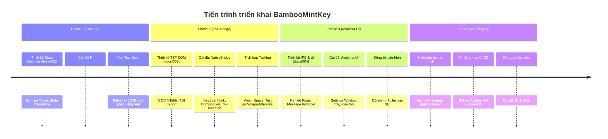

Dưới đây là thiết kế lộ trình phát triển (**Roadmap**) và quy trình thực hiện chuẩn hóa cho dự án **BambooMintKey**, chia theo 4 giai đoạn logic từ lõi Engine đến tích hợp hệ điều hành và hoàn thiện giao diện.

### 1. Nguyên tắc quy trình phát triển (Development Process)

Để dự án không bị phụ thuộc sớm vào môi trường hệ điều hành phức tạp (tránh việc phải debug COM Server trực tiếp ngay từ đầu), quy trình tuân thủ nguyên tắc **Inside-Out (Từ lõi ra ngoài)** và **Design-First / Test-Driven**:

1. **Thiết kế trước mã nguồn (Design-First):** Mỗi phase đều chốt tài liệu đặc tả cấu trúc dữ liệu và API trong thư mục `docs/` trước khi lập trình.
2. **Kiểm thử độc lập (Zero-dependency Unit Testing):** Hoàn thiện và kiểm thử 100% logic gõ tiếng Việt trên `BambooMintKey.Core` bằng F# thuần túy trước khi chạm vào C# hay Windows TSF.
3. **Cô lập rủi ro TSF (Isolation & Dev Harness):** Tạo một chương trình Console giả lập bắt phím để test tương tác trước khi đăng ký Native DLL vào Windows Registry.

### 2. Lộ trình phát triển tổng thể (BambooMintKey Roadmap)

```
Phase 1: Pure F# Core Engine & Telex State Machine (Tập trung logic)
   │
   ▼
Phase 2: Native Bridge & TSF Integration (Tập trung OS & NativeAOT)
   │
   ▼
Phase 3: IPC Protocol & Avalonia UI (Tập trung cấu hình & Trải nghiệm)
   │
   ▼
Phase 4: Packaging, Hardening & Polishing (Tập trung phát hành)
```

### Chi tiết từng Phase trong Roadmap

#### Phase 1: Core Engine & Telex Grammar Specification (Lõi F#)

*Mục tiêu:* Xây dựng một Engine biến đổi ký tự thuần túy (Pure Functional), chạy độc lập không phụ thuộc Windows API, đạt độ chính xác tuyệt đối qua Unit Test.

- **Tài liệu thiết kế:** `docs/002_telex_state_machine.md`
- **Công việc thực hiện:**
  - Thiết kế hệ thống kiểu dữ liệu Domain Types (`KeyInput`, `Vowel`, `Consonant`, `Tone`, `WordState`, `EngineAction`).
  - Xây dựng bảng tra cứu Unicode tĩnh (NFC Table, Character Classification).
  - Viết thuật toán phân rã cấu trúc âm tiết tiếng Việt (Initial + Nucleus + Final).
  - Cài đặt State Machine:
    - Ghép dấu mũ/móc/ngang (`aa`, `aw`, `ee`, `oo`, `ow`, `uw`, `dd`).
    - Thuật toán đặt dấu thanh động (chuẩn mới `hòa/hóa` vs chuẩn cũ `hoà/hoá`).
    - Cơ chế lặp phím khôi phục từ (Undo/Escape) và lui bước khi nhấn Backspace.
    - Cơ chế nhận diện và bỏ qua từ tiếng Anh / từ sai cấu trúc âm tiết.
- **Tiêu chuẩn hoàn thành (DoD):** Bộ test suite trong `BambooMintKey.Core.Tests` đạt 100% pass với hơn 200 test case ngữ pháp tiếng Việt.

#### Phase 2: C# NativeBridge & Windows TSF Integration (Tích hợp hệ điều hành)

*Mục tiêu:* Đóng gói `BambooMintKey.dll` qua NativeAOT, xuất hiện thành công trên thanh ngôn ngữ Windows (`Win + Space`) và gõ được tiếng Việt trong Notepad/Word.

- **Tài liệu thiết kế:** `docs/003_tsf_native_bridge.md`
- **Công việc thực hiện:**
  - Thiết kế lớp COM Export chuẩn Native C ABI (`DllGetClassObject`, `DllRegisterServer`, `DllUnregisterServer`).
  - Viết logic đăng ký Category TIP (`GUID_TFCAT_TIP_KEYBOARD`) và Profile ngôn ngữ tiếng Việt (`0x042A`).
  - Implement các interface TSF tối thiểu:
    - `ITfTextInputProcessorEx`: Quản lý lifecycle khi focus.
    - `ITfKeyEventSink`: Bắt phím nhấn, gọi vào F# Engine và nuốt phím.
    - `ITfCompositionSink` & `ITfContext`: Quản lý vùng gõ dở dang và ghi đè văn bản.
    - `ITfDisplayAttributeProvider`: Vẽ nét gạch chân mỏng dưới từ đang gõ.
  - Xây dựng script PowerShell hỗ trợ đăng ký/hủy đăng ký DLL nhanh phục vụ phát triển cục bộ.
- **Tiêu chuẩn hoàn thành (DoD):** Kích hoạt được BambooMintKey trên Taskbar Windows, gõ được từ tiếng Việt có dấu trong Notepad và trình duyệt.

#### Phase 3: Inter-Process Communication (IPC) & Avalonia UI (Giao diện & Cấu hình)

*Mục tiêu:* Xây dựng ứng dụng Out-of-Process quản lý cấu hình và biểu tượng System Tray bằng Avalonia UI.

- **Tài liệu thiết kế:** `docs/004_avalonia_ui_and_ipc.md`
- **Công việc thực hiện:**
  - Thiết kế giao thức IPC tốc độ cao (Named Pipes hoặc Memory-Mapped File) giữa Native DLL (In-Process) và App UI (Out-of-Process).
  - Định nghĩa cấu trúc Message: Đổi trạng thái gõ (E/V), đổi chuẩn dấu mới/cũ, bật/tắt phím tắt.
  - Xây dựng giao diện Avalonia bằng F#:
    - Cửa sổ Settings: Bật/tắt các tùy chọn Telex, chọn bảng mã Unicode, quản lý phím tắt chuyển chế độ.
    - System Tray Icon: Hiển thị icon `E` / `V` thời gian thực tại góc Taskbar.
  - Lưu trữ cấu hình người dùng xuống JSON/Registry.
- **Tiêu chuẩn hoàn thành (DoD):** Bấm phím tắt chuyển E/V làm thay đổi icon Taskbar và DLL nhận ngay cấu hình mới không cần khởi động lại app.

#### Phase 4: Hardening, Compatibility & Installer (Tối ưu & Đóng gói)

*Mục tiêu:* Đảm bảo tính ổn định trên các môi trường khó (Game, UWP, Chrome, Sandbox) và đóng gói bộ cài đặt.

- **Tài liệu thiết kế:** `docs/005_packaging_and_deployment.md`
- **Công việc thực hiện:**
  - Kiểm thử tương thích trên các ứng dụng đặc thù: Discord, Steam Game, Command Prompt/Windows Terminal, Office 365, Visual Studio.
  - Xử lý ngoại lệ crash và tối ưu hóa bộ nhớ khi DLL được nạp đồng thời vào nhiều tiến trình.
  - Thiết lập GitHub Actions tự động build NativeAOT x64 và xuất bản file cài đặt.
  - Tạo installer tự động (Inno Setup / WiX) để tự động copy DLL và đăng ký TSF cho người dùng cuối.
- **Tiêu chuẩn hoàn thành (DoD):** File installer cài đặt 1-click thành công trên máy Windows trắng, sử dụng ổn định không phát sinh crash.

```mermaid
flowchart TD
    classDef phase fill:#1e293b,stroke:#3b82f6,stroke-width:2px,color:#fff
    classDef doc fill:#0f172a,stroke:#10b981,stroke-width:1px,color:#6ee7b7
    classDef task fill:#1e1e2e,stroke:#64748b,stroke-width:1px,color:#cbd5e1
    classDef dod fill:#14532d,stroke:#22c55e,stroke-width:2px,color:#86efac

    subgraph P1 ["PHASE 1: Core Engine & Telex State Machine (Lõi F#)"]
        D1["📄 Thiết kế: docs/002_telex_state_machine.md"]:::doc
        T1["• Định nghĩa F# Domain Types<br/>• Bảng tra cứu Unicode & Phân loại ký tự<br/>• Thuật toán âm tiết & Đặt dấu thanh động<br/>• Logic hoàn tác Undo/Escape & Fallback tiếng Anh"]:::task
        G1["✅ DoD: 200+ Unit Tests đạt 100% Pass trong BambooMintKey.Core.Tests"]:::dod
        D1 --> T1 --> G1
    end
    class P1 phase

    subgraph P2 ["PHASE 2: C# NativeBridge & Windows TSF Integration (Tích hợp OS)"]
        D2["📄 Thiết kế: docs/003_tsf_native_bridge.md"]:::doc
        T2["• COM Server Export: DllRegisterServer, DllGetClassObject<br/>• Đăng ký Category TIP & Profile tiếng Việt 0x042A<br/>• Implement TSF Sinks: KeyEvent, Composition, DisplayAttr<br/>• Script PowerShell đăng ký/hủy nhanh cho Dev"]:::task
        G2["✅ DoD: Xuất hiện trên Language Bar (Win+Space), gõ Telex trực tiếp trên Notepad/Chrome"]:::dod
        D2 --> T2 --> G2
    end
    class P2 phase

    subgraph P3 ["PHASE 3: IPC Protocol & Avalonia UI (Giao diện & Cấu hình)"]
        D3["📄 Thiết kế: docs/004_avalonia_ui_and_ipc.md"]:::doc
        T3["• Thiết kế Named Pipe / Memory Mapped File IPC<br/>• Xây dựng Avalonia UI: Cửa sổ Cài đặt & System Tray<br/>• Đồng bộ cấu hình: Bỏ dấu mới/cũ, phím tắt E/V<br/>• Đọc/ghi cấu hình xuống JSON / Registry"]:::task
        G3["✅ DoD: Chuyển E/V trên Taskbar đổi trạng thái DLL thời gian thực không cần reload"]:::dod
        D3 --> T3 --> G3
    end
    class P3 phase

    subgraph P4 ["PHASE 4: Hardening, Compatibility & Installer (Tối ưu & Đóng gói)"]
        D4["📄 Thiết kế: docs/005_packaging_and_deployment.md"]:::doc
        T4["• Test tương thích: Game, Discord, UWP, Terminal, MS Office<br/>• Xử lý crash / Leak RAM khi nạp vào hàng trăm process<br/>• Thiết lập GitHub Actions CI/CD Build NativeAOT x64<br/>• Đóng gói Installer 1-Click (Inno Setup / WiX)"]:::task
        G4["✅ DoD: Cài đặt 1-Click thành công trên Windows sạch, hoạt động ổn định không crash"]:::dod
        D4 --> T4 --> G4
    end
    class P4 phase

    %% Luồng phát triển xuyên suốt
    G1 ==>|Tích hợp DLL| D2
    G2 ==>|Cung cấp IPC Endpoint| D3
    G3 ==>|Hoàn thiện hệ thống| D4
```







### 3. Bước tiếp theo

Theo đúng nguyên tắc Design-First của **Phase 1**, bước tiếp theo là lập tài liệu đặc tả **`docs/002_telex_state_machine.md`** để chốt toàn bộ các kiểu dữ liệu F# Domain Types và mô hình chuyển trạng thái Telex trước khi viết code.

Bạn có muốn bắt đầu phác thảo thiết kế chi tiết cho **`002_telex_state_machine.md`** không?