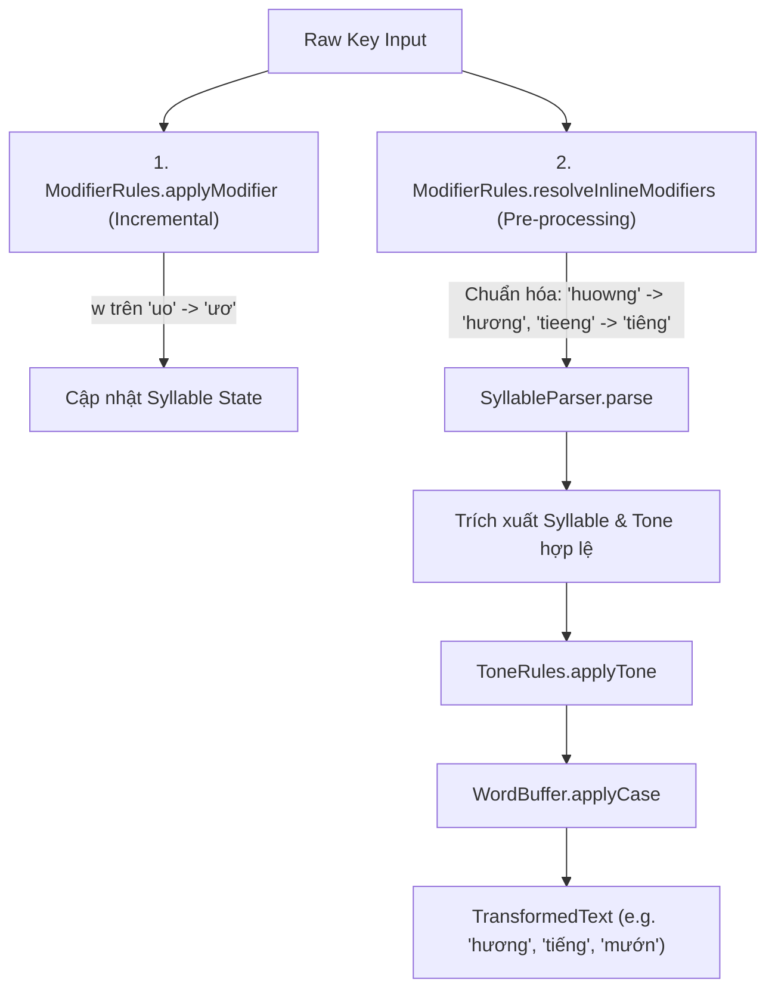

# Thiết Kế Chi Tiết: Xử Lý Tổ Hợp Nguyên Âm & Telex Inline (Inline Modifiers & Vowel Resolution)
**Mã tài liệu:** `001_07_01_InlineModifiers_VowelResolution`  
**Thuộc nhóm:** Bug Nhóm B (Tổ hợp phím biến âm Telex mở rộng & Cụm nguyên âm ghép)  
**Trạng thái:** Đã triển khai (Implemented)

---

## 1. Hiện Trạng & Danh Sách Lỗi (Problem Statement)

Dựa trên kết quả test và log hệ thống (`Core.log`), hiện tại Engine gặp lỗi khi người dùng gõ các tổ hợp nguyên âm ghép hoặc gõ nhanh theo phong cách Telex lồng (Inline Modifiers):

| Test Case Thất Bại | Chuỗi Phím (Input) | Kết Quả Mong Đợi (Expected) | Kết Quả Thực Tế (Actual) | Phân Loại Lỗi |
| :--- | :--- | :--- | :--- | :--- |
| `uow` | `uow` | `ươ` | `uơ` | Lỗi biến đổi cặp đôi `uo` + `w` |
| `uwow` | `uwow` | `ươ` | `uwow` | Lỗi parsing lặp phím `w` trong cụm `ươ` |
| `huowng` | `huowng` | `hương` | `huowng` | Fallback tiếng Anh do không parse được `uow` |
| `huwowng` | `huwowng` | `hương` | `huwowng` | Lỗi chuỗi modifier kép `uw` + `ow` |
| `tuwowr` | `tuwowr` | `tưở` | `tuwowr` | Lỗi tổ hợp `uwow` kèm phím thanh `r` |
| `tieengs` | `tieengs` | `tiếng` | `tieéng` | Gõ `ee` sau `i` bị gán dấu sai vào `e` thay vì `ê` |
| `bieens` | `bieens` | `biến` | `bieén` | Tương tự `tieengs` |
| `buoonf` | `buoonf` | `buồn` | `buoòn` | Gõ `oo` sau `u` bị gán dấu sai vào `o` thay vì `ô` |
| `muowns` / `muownj` | `muowns` | `mướn` / `mượn` | `muowns` | Fallback tiếng Anh do `uow` không hợp lệ trong SyllableParser |

---

## 2. Phân Tích Nguyên Nhân Kỹ Thuật (Root Cause Analysis)

### 2.1. Hạn Chế Của Cơ Chế Stateless Re-parse Từ `rawString`
Hiện tại, `TelexEngine.processKey` gộp toàn bộ phím thô trong `WordState.RawKeys` thành chuỗi `rawString` rồi chuyển sang `SyllableParser.parse(rawString)`:
1. **Lỗi cụm `iee` / `uoo`:** Khi gõ `t-i-e-e-n-g-s`, `rawString` là `"tieengs"`. Parser tách phụ âm đầu `t`, phụ âm cuối `ng`, còn lại cụm nguyên âm là `"iee"`. Do `iee` không phải nguyên âm chuẩn đơn lẻ, bước chuẩn hóa dấu không thể nhận diện trọng tâm âm tiết $\rightarrow$ Dấu sắc `s` bị gán vào ký tự `e` thứ hai $\rightarrow$ `tieéng`.
2. **Lỗi cụm `uow` / `uwow`:** Ký tự `w` trong tiếng Việt là phụ âm mượn hoặc phím tắt Telex, không nằm trong bảng nguyên âm chuẩn của `UnicodeTables.fs`. Khi `rawString` là `"muowns"` hay `"huowng"`, `SyllableParser` phát hiện ký tự `w` ở giữa từ mà không thuộc phụ âm đầu hay phụ âm cuối $\rightarrow$ Coi là từ tiếng Anh/từ không hợp lệ $\rightarrow$ Kích hoạt `EnglishWordFallback` và xuất thô `"muowns"`.
3. **Lỗi đơn âm trong `ModifierRules.applyModifier`:** Khi nhận phím `'w'` trên cụm `uo`, hàm chỉ biến đổi `'o'` thành `'ơ'` (ra `uơ`) thay vì biến đổi đồng thời cả hai nguyên âm thành `ươ`.

---

## 3. Kiến Trúc Giải Pháp Kỹ Thuật (Detailed Architecture)

Giải pháp gồm 2 trụ cột đồng bộ:



### 3.1. Bổ sung bộ tiền xử lý `resolveInlineModifiers` vào `ModifierRules.fs`
Hàm `resolveInlineModifiers` nhận chuỗi thô chứa các token Telex inline và chuyển đổi thành chuỗi nguyên âm tiếng Việt tương ứng:

```fsharp
let resolveInlineModifiers (raw: string) : string =
    raw
        .Replace("uwow", "ươ")
        .Replace("uow", "ươ")
        .Replace("uwo", "ươ")
        .Replace("ưo", "ươ")
        .Replace("uơ", "ươ")
        .Replace("uw", "ư")
        .Replace("ow", "ơ")
        .Replace("aw", "ă")
        .Replace("aa", "â")
        .Replace("ee", "ê")
        .Replace("oo", "ô")
        .Replace("dd", "đ")
```

### 3.2. Cập nhật `ModifierRules.applyModifier` cho phím `'w'` và các nguyên âm kép
- **Khi phím là `'w'`:**
  - Nếu `vowels` chứa `"uo"` hoặc `"uô"`: Chuyển đổi thành `"ươ"`.
  - Nếu `vowels` chứa `"ưo"`: Chuyển đổi thành `"ươ"`.
  - Nếu `vowels` chứa `"uơ"`: Chuyển đổi thành `"ươ"`.
  - Nếu `vowels` chứa `"u"` (và chưa có `"ư"`): Chuyển đổi thành `"ư"`.
  - Nếu `vowels` chứa `"o"` (và chưa có `"ơ"`, `"ô"`): Chuyển đổi thành `"ơ"`.
  - Nếu `vowels` chứa `"a"` (và chưa có `"ă"`, `"â"`): Chuyển đổi thành `"ă"`.

### 3.3. Tích hợp tiền xử lý vào `SyllableParser.fs` và `TelexEngine.fs`
- Trong `SyllableParser.parse`: Trước khi phân rã âm tiết, gọi `ModifierRules.resolveInlineModifiers` lên chuỗi `input` để đảm bảo parser luôn làm việc với chuỗi nguyên âm tiếng Việt chuẩn.
- Trong `TelexEngine.handleCharInput`: Tận dụng `resolveInlineModifiers` để phân tích chính xác `Tone` và `Syllable` ngay cả khi người dùng gõ phím dấu thanh liền sau modifier inline.

---

## 4. Chi Tiết Thay Đổi Code (Implementation Code)

### 4.1. File `src/BambooMintKey.Core/Engine/ModifierRules.fs`
Thêm hàm `resolveInlineModifiers` và hoàn thiện logic biến đổi cặp `uo` + `w` $\rightarrow$ `ươ`.

### 4.2. File `src/BambooMintKey.Core/Engine/SyllableParser.fs`
Áp dụng `ModifierRules.resolveInlineModifiers` ở đầu hàm `parse` trước khi quét phụ âm đầu và tách nguyên âm.

---

## 5. Tiêu Chuẩn Nghiệm Thu & Test Matrix (Acceptance Criteria)

Sau khi cài đặt thiết kế này, các test sau bắt buộc phải **PASS 100%**:
1. `SimpleTelexTests.2. Complex modifiers uow should format ươ naturally` (`uow`, `uwow`, `huowng`, `tuwowr`, `huwowng`).
2. `TonePlacementTests.3. Tone always placed before final consonant` (`tieengs` $\rightarrow$ `tiếng`, `buoonf` $\rightarrow$ `buồn`, `muowns` $\rightarrow$ `mướn`, `muownj` $\rightarrow$ `mượn`, `bieens` $\rightarrow$ `biến`).
3. Các test bảo tồn chữ hoa chữ thường (`VIETJ`, `Vieetj`) tiếp tục pass.
