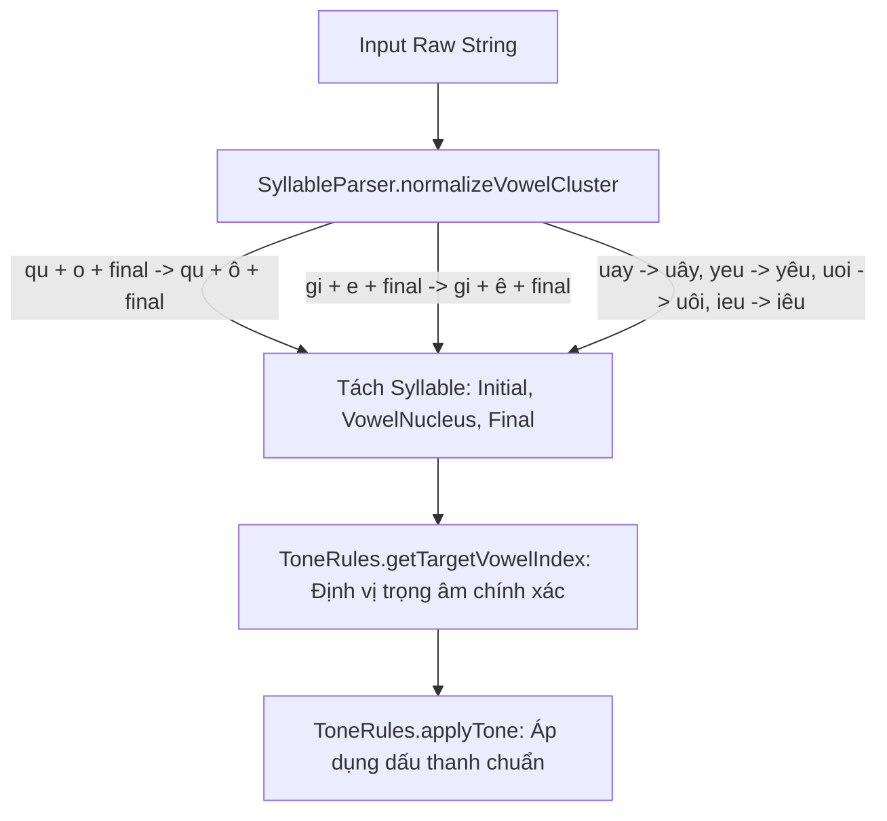

# Thiết Kế Chi Tiết: Đặt Dấu Thanh Cho Phụ Âm Đặc Biệt (qu-, gi-), Tam Nguyên Âm & Ghi Đè Dấu
**Mã tài liệu:** `001_07_02_TonePlacement_SpecialVowels_QuGi`  
**Thuộc nhóm:** Xử lý Quy tắc Dấu thanh (Tone Rules & Phonetics Parsing)  
**Trạng thái:** Đã triển khai (Implemented)

---

## 1. Hiện Trạng & Danh Sách Lỗi (Problem Statement)

Dựa trên kết quả kiểm thử `TonePlacementTests.fs` và log `Core.log`:

| Test Case Thất Bại | Chuỗi Phím | Mong Đợi (Expected) | Thực Tế (Actual) | Phân Loại & Hiện Tượng |
| :--- | :--- | :--- | :--- | :--- |
| `quocs` | `quocs` | `quốc` | `quóc` | `qu` lấy mất `u`, nguyên âm `o` trước `c` không được nâng cấp thành `ô` |
| `giets` | `giets` | `giết` | `giét` | `gi` lấy mất `i`, nguyên âm `e` trước `t` không được nâng cấp thành `ê` |
| `khuays` | `khuays` | `khuấy` | `khuáy` | `uay` không được chuẩn hóa thành `uây`, đặt dấu nhầm vào `a` |
| `yeus` | `yeus` | `yếu` | `yéu` | `yeu` không được chuẩn hóa thành `yêu`, đặt dấu nhầm vào `e` |
| `muoix` | `muoix` | `muỗi` | `muõi` | `uoi` không được chuẩn hóa thành `uôi`, đặt dấu nhầm vào `o` |
| `tieur` | `tieur` | `tiểu` | `tiẻu` | `ieu` không được chuẩn hóa thành `iêu`, đặt dấu nhầm vào `e` |
| `nguwaf` | `nguwaf` | `ngừa` | `nguwaf` | Bị fallback tiếng Anh do phím `w` xen kẽ |
| `muwas` | `muwas` | `mứa` | `muwas` | Bị fallback tiếng Anh do `m + u + w + a` |
| `thuyesft` | `thuyesft` | `thuyết` | `thuyesft` | Ghi đè dấu thanh trên hành trình gõ phím (`s` $\rightarrow$ `f`) |

---

## 2. Phân Tích Nguyên Nhân Kỹ Thuật (Root Cause Analysis)

### 2.1. Phụ Âm Đầu Đặc Biệt `qu-` và `gi-` Trong Ngữ Âm Tiếng Việt
- Khi bắt đầu bằng `qu-` (bán âm `u` ghép với `q`), nếu sau đó là `o` đi kèm phụ âm cuối (như `quoc` $\rightarrow$ `quốc`, `quon` $\rightarrow$ `quôn`): Âm chính thực thụ là `uô` nhưng chữ viết lược bỏ ký tự `u`. Do đó `o` trước phụ âm cuối bắt buộc phải chuyển thành `ô`.
- Khi bắt đầu bằng `gi-` (bán âm `i` ghép với `g`), nếu sau đó là `e` đi kèm phụ âm cuối (như `giet` $\rightarrow$ `giết`, `gien` $\rightarrow$ `giền`): Âm chính thực thụ là `iê` nhưng chữ viết lược bỏ ký tự `i`. Do đó `e` trước phụ âm cuối bắt buộc phải chuyển thành `ê`.

### 2.2. Chuẩn Hóa Cụm Tam Nguyên Âm Mở (`uay`, `yeu`, `uoi`, `ieu`)
- Trong tiếng Việt, các cụm tam nguyên âm khi phát âm chuẩn đều chứa nguyên âm có mũ:
  - `uay` $\rightarrow$ `uây` (khi áp dấu: `khuấy`, `khuẩy`, `quấy`)
  - `yeu` $\rightarrow$ `yêu` (khi áp dấu: `yếu`, `yểu`, `yểu`)
  - `uoi` $\rightarrow$ `uôi` (khi áp dấu: `muỗi`, `chuối`, `đuôi`)
  - `ieu` $\rightarrow$ `iêu` (khi áp dấu: `tiểu`, `chiếu`, `hiểu`)

### 2.3. Vấn Đề Ghi Đè Dấu Thanh Trên Đường Đi (Tone Override)
- Khi gõ chuỗi đổi dấu thanh liên tục (`thuyesft`): Phím `s` và `f` lưu lại trong `rawKeys` khiến cho `rawString` chứa cả `s` và `f`. Khi gõ tiếp `t`, `SyllableParser.parse` bị nghẽn vì chứa ký tự dấu thanh lạ ở giữa từ.

---

## 3. Kiến Trúc Giải Pháp Đề Xuất (Proposed Architecture)



### 3.1. Cập Nhật `normalizeVowelCluster` Trong `SyllableParser.fs`
```fsharp
let private normalizeVowelCluster (vowels: string) (initial: string) (final: string) : string =
    let vLower = vowels.ToLowerInvariant()
    let initLower = initial.ToLowerInvariant()
    let hasFinal = not (String.IsNullOrEmpty final)
    match vLower with
    | "ie" -> "iê"
    | "uye" -> "uyê"
    | "uay" -> "uây"
    | "yeu" -> "yêu"
    | "uoi" -> "uôi"
    | "ieu" -> "iêu"
    | "uo" when hasFinal -> "uô"
    | "ye" when hasFinal -> "yê"
    | "e" when initLower = "gi" && hasFinal -> "ê"
    | "o" when initLower = "qu" && hasFinal -> "ô"
    | _ -> vowels
```

### 3.2. Cập Nhật Ghi Đè Dấu Thanh Động Trong `TelexEngine.fs`
Khi người dùng gõ phím dấu thanh mới (`keyToTone c = Some newTone`) đè lên âm tiết đã có dấu:
- Cập nhật dấu thanh của `state.Syllable` thành `newTone`.
- Thay thế phím dấu thanh cũ trong `RawKeys` bằng phím dấu thanh mới để `rawKeys` luôn giữ dạng hợp thức.

---

## 4. Tiêu Chuẩn Nghiệm Thu & Test Matrix (Acceptance Criteria)

Các bài test sau trong `TonePlacementTests.fs` bắt buộc phải **PASS 100%**:
1. `4. Tone on middle vowel for open triphthongs` (`khuays` $\rightarrow$ `khuấy`, `yeus` $\rightarrow$ `yếu`, `muoix` $\rightarrow$ `muỗi`, `tieur` $\rightarrow$ `tiểu`, `ruowuj` $\rightarrow$ `rượu`).
2. `5. Tone on modified element for special vowel pairs` (`nguwaf` $\rightarrow$ `ngừa`, `muwas` $\rightarrow$ `mứa`).
3. `6. Tone appropriately escapes qu and gi initial consonants` (`quocs` $\rightarrow$ `quốc`, `giets` $\rightarrow$ `giết`).
4. `7. Tone switches cleanly when overriding tone keys` (`toansf` $\rightarrow$ `toàn`, `chuasf` $\rightarrow$ `chùa`, `thuyesft` $\rightarrow$ `thuyết`).
