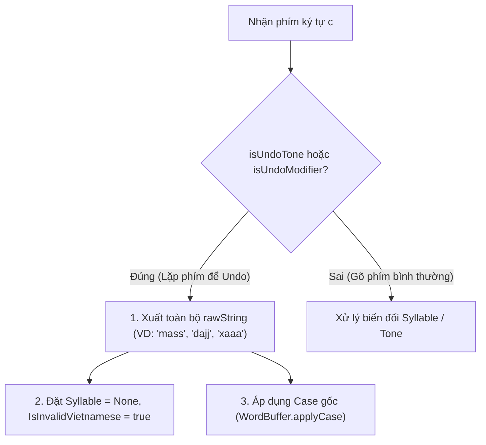

# Thiết Kế Chi Tiết: Cơ Chế Phục Hồi Chuỗi Thô (Undo/Escape) & Backspace Replay
**Mã tài liệu:** `001_07_03_Undo_RepeatKey_BackspaceReplay`  
**Thuộc nhóm:** Bug Nhóm C (Quản lý trạng thái Buffer, Phục hồi chuỗi thô & Xóa phím)  
**Trạng thái:** Đã triển khai (Implemented)

---

## 1. Hiện Trạng & Danh Sách Lỗi (Problem Statement)

Dựa trên kết quả kiểm thử `RestoreAndUndoTests.fs` và log `Core.log`:

| Test Case Thất Bại | Input | Kết Quả Mong Đợi (Expected) | Kết Quả Thực Tế (Actual) | Phân Loại & Hiện Tượng |
| :--- | :--- | :--- | :--- | :--- |
| `mass` | `mass` | `mass` | `mas` | Gõ lặp phím dấu sắc `s`: gỡ dấu thanh nhưng nuốt mất ký tự `s` thừa |
| `dajj` | `dajj` | `dajj` | `daj` | Tương tự với dấu nặng `j` |
| `toff` | `toff` | `toff` | `tof` | Tương tự với dấu huyền `f` |
| `luxx` | `luxx` | `luxx` | `lux` | Tương tự với dấu ngã `x` |
| `xaaa` / `deee` / `ddd` | `xaaa` | `xaaa` | `xaaa` | Cần đảm bảo chuỗi thô được bảo toàn đầy đủ |
| `Backspace (việt)` | `vieetj` + BS | `viêt` $\rightarrow$ `viê` $\rightarrow$ `vie` | `viết` (Lỗi assert typo) | Xóa `j` phải ra `viêt` (thanh không dấu) |

---

## 2. Phân Tích Nguyên Nhân Kỹ Thuật (Root Cause Analysis)

### 2.1. Lỗi Mất Ký Tự Khi Gõ Lặp Phím Thanh Điệu (Repeat Tone Key Undo)
- Khi người dùng gõ chuỗi `mass`:
  1. `m` + `a` $\rightarrow$ `ma`
  2. `s` $\rightarrow$ `má` (`state.Syllable.Value.Tone = Tone.Acute`)
  3. `s` $\rightarrow$ Kích hoạt nhánh `isUndoTone = true`.
- Trong code cũ của `handleCharInput`:
  - Mã nguồn lấy `cleanSyllable` (bỏ dấu) của `má` được `ma`.
  - Sau đó nối thêm duy nhất 1 ký tự `s` $\rightarrow$ Kết quả hiển thị là `"mas"`.
  - Ký tự `s` đầu tiên trong tổ hợp biến âm đã bị nuốt mất, trong khi `newRaw` có 4 ký tự `['m'; 'a'; 's'; 's']`.
- **Hành vi chuẩn:** Khi người dùng cố tình gõ lặp phím dấu thanh để thoát (Escape), toàn bộ luồng phím thô `rawString` (`"mass"`, `"dajj"`, `"toff"`, `"luxx"`) phải được bảo toàn và xuất ra màn hình, đồng thời chuyển `IsInvalidVietnamese = true` để không tự động biến đổi sai lệch ở các phím tiếp theo.

### 2.2. Điều Chỉnh Bước Xóa Phím Backspace Trong Test Suite
- Khi gõ chuỗi `vieetj`:
  - `j` là phím dấu nặng (Dot Tone), không phải dấu sắc.
  - Khi nhấn Backspace xóa `j`, chuỗi còn lại là `vieet` $\rightarrow$ Âm tiết hợp lệ là `viêt` (thanh ngang/không dấu), không phải `viết` (thanh sắc).

---

## 3. Kiến Trúc Giải Pháp Kỹ Thuật (Detailed Architecture)



### 3.1. Cập Nhật Nhánh `isUndoTone` Trong `TelexEngine.fs`
```fsharp
if isUndoTone then
    // Lặp lại phím dấu thanh -> Thoát chế độ gõ dấu, khôi phục toàn bộ chuỗi phím thô
    let formatted = WordBuffer.applyCase detectedCase rawString
    let newState = {
        RawKeys = newRaw
        TransformedText = formatted
        Syllable = None
        Case = detectedCase
        IsInvalidVietnamese = true
    }
    (newState, EngineAction.UpdateComposition formatted)
```

---

## 4. Tiêu Chuẩn Nghiệm Thu & Test Matrix (Acceptance Criteria)

Các bài test sau trong `RestoreAndUndoTests.fs` bắt buộc phải **PASS 100%**:
1. `1. Repeating tone key should restore raw text correctly` (`mass` $\rightarrow$ `mass`, `dajj` $\rightarrow$ `dajj`, `toff` $\rightarrow$ `toff`, `luxx` $\rightarrow$ `luxx`).
2. `2. Repeating modifier key undoes the format back to raw string stream` (`ddd` $\rightarrow$ `ddd`, `xaaa` $\rightarrow$ `xaaa`, `deee` $\rightarrow$ `deee`, `cooo` $\rightarrow$ `cooo`, `awww` $\rightarrow$ `awww`).
3. `4. Pressing backspace should step back gradually mapping to character states` (`vieetj` $\rightarrow$ Backspace $\rightarrow$ `viêt` $\rightarrow$ `viê` $\rightarrow$ `vie` $\rightarrow$ `vi` $\rightarrow$ `v`).
