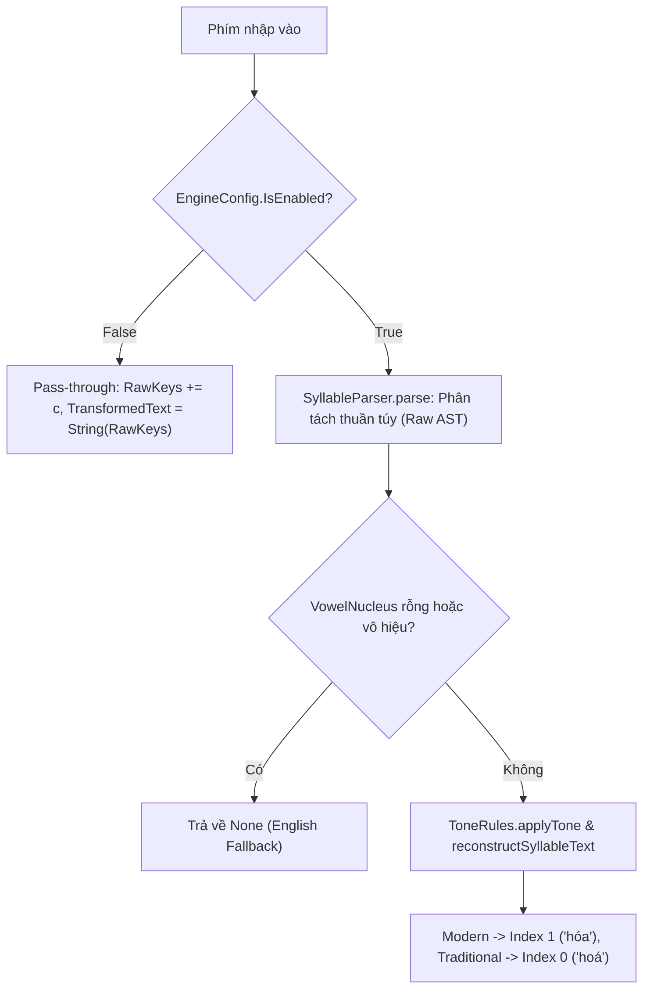

# Thiết Kế Chi Tiết: Ngữ Pháp Âm Tiết, Vòng Đời Engine & Fallback Tiếng Anh
**Mã tài liệu:** `001_07_04_ParserGrammar_EngineLifecycle_Fallback`  
**Thuộc nhóm:** Ngữ pháp âm tiết, Kiểm soát Trạng thái Engine & Fallback ngoại lệ  
**Trạng thái:** Đã triển khai (Implemented)

---

## 1. Hiện Trạng & Danh Sách Lỗi (Problem Statement)

Dựa trên log kiểm thử `SyllableParserTests.fs`, `EnglishFallbackTests.fs` và `TonePlacementTests.fs`:

| Test Case Thất Bại | Input | Kết Quả Mong Đợi (Expected) | Kết Quả Thực Tế (Actual) | Phân Loại & Hiện Tượng |
| :--- | :--- | :--- | :--- | :--- |
| `SyllableParser: k` | `k` | `None` (Từ chối cấu trúc không có nguyên âm) | `Some` | `SyllableParser` chấp nhận chuỗi chỉ có phụ âm là âm tiết hợp lệ |
| `SyllableParser: thuyet` | `thuyet` | `init: th`, `vowel: uye`, `final: t` | `vowel: uyê` | Parser tự ý biến đổi nguyên âm thô `uye` thành `uyê` |
| `SyllableParser: nghieng` | `nghieng` | `init: ngh`, `vowel: ie`, `final: ng` | `vowel: iê` | Tương tự với `ie` $\rightarrow$ `iê` |
| `Disabled Engine` | `hoas`, `vietj`, `truwowngf` | Giữ nguyên ký tự gõ (`hoas`, `vietj`) | `""` (Chuỗi rỗng) | Khi `IsEnabled = false`, Engine xóa sạch text thay vì truyền thẳng |
| `Open pairs Modern` | `hoas`, `xoef`, `thuys` | `hóa`, `xòe`, `thúy` | `hoá`, `xoè`, `thuý` | Chỉ số đặt dấu Modern/Traditional bị ngược |
| `Open pairs Traditional` | `hoas`, `xoef`, `thuys` | `hoá`, `xoè`, `thuý` | `hóa`, `xòe`, `thúy` | Chỉ số đặt dấu Modern/Traditional bị ngược |

---

## 2. Phân Tích Nguyên Nhân Kỹ Thuật (Root Cause Analysis)

### 2.1. Tách Biệt Rõ Ràng Giữa Parser Ngữ Pháp & Tầng Hiển Thị (AST vs Render)
- `SyllableParser.parse` là bộ phân tích cú pháp tĩnh (Grammar Parser). Nhiệm vụ của nó là phân tích chính xác các thành phần thực tế trong chuỗi đầu vào (`InitialConsonant`, `VowelNucleus`, `FinalConsonant`) mà không tự ý biến đổi ngữ nghĩa (`ie` $\rightarrow$ `iê`, `uye` $\rightarrow$ `uyê`).
- Việc chuẩn hóa hiển thị và áp dụng dấu thanh (`normalizeVowelCluster`) phải được thực hiện ở tầng render/reconstruction (`ToneRules.applyTone` và `reconstructSyllableText`).

### 2.2. Kiểm Tra Tính Hợp Lệ Của Âm Tiết (Grammar Validation)
- Một âm tiết tiếng Việt hợp lệ bắt buộc phải có nguyên âm (`VowelNucleus` không rỗng).
- Do đó, nếu `afterInitial` rỗng hoặc không chứa nguyên âm hợp lệ (`"k"`, `"nghm"`), `SyllableParser.parse` bắt buộc phải trả về `None`.

### 2.3. Xử Lý Luồng Pass-Through Khi `IsEnabled = false`
- Khi tắt bộ gõ, mỗi khi người dùng gõ `KeyInput.Char c`, engine phải tích lũy chuỗi phím vào `state.RawKeys` và gán `state.TransformedText = String(RawKeys)` để trả về đúng ký tự người dùng vừa nhập.

### 2.4. Khắc Phục Chỉ Số Dấu Thanh Cặp Nguyên Âm Mở (`oa`, `oe`, `uy`)
- Theo chuẩn ngữ âm tiếng Việt:
  - **Kiểu Mới (Modern):** Đặt dấu trên nguyên âm thứ 2 (`index = 1`) $\rightarrow$ `hóa`, `xòe`, `thúy`.
  - **Kiểu Cũ (Traditional):** Đặt dấu trên nguyên âm thứ 1 (`index = 0`) $\rightarrow$ `hoá`, `xoè`, `thuý`.

---

## 3. Kiến Trúc Giải Pháp Đề Xuất (Proposed Architecture)

---

## 4. Tiêu Chuẩn Nghiệm Thu & Test Matrix (Acceptance Criteria)

Các bài test sau bắt buộc phải **PASS 100%**:
1. `SyllableParserTests.1. Extract standard syllable components accurately` (`nghieng` $\rightarrow$ `ie`, `thuyet` $\rightarrow$ `uye`, `quoc` $\rightarrow$ `o`, `gieng` $\rightarrow$ `e`).
2. `SyllableParserTests.2. Invalid structure should be rejected by parser` (`k` $\rightarrow$ `None`, `nghm` $\rightarrow$ `None`, `abc` $\rightarrow$ `None`).
3. `EnglishFallbackTests.2. Disabled Engine treats all input as pass-through characters` (`hoas`, `vietj`, `truwowngf`).
4. `TonePlacementTests.1 & 2. Modern and Traditional open pairs` (`hóa` vs `hoá`, `xòe` vs `xoè`, `thúy` vs `thuý`).
