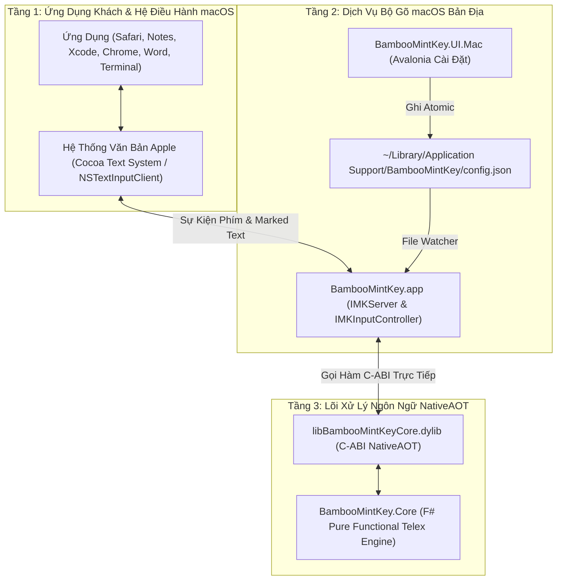
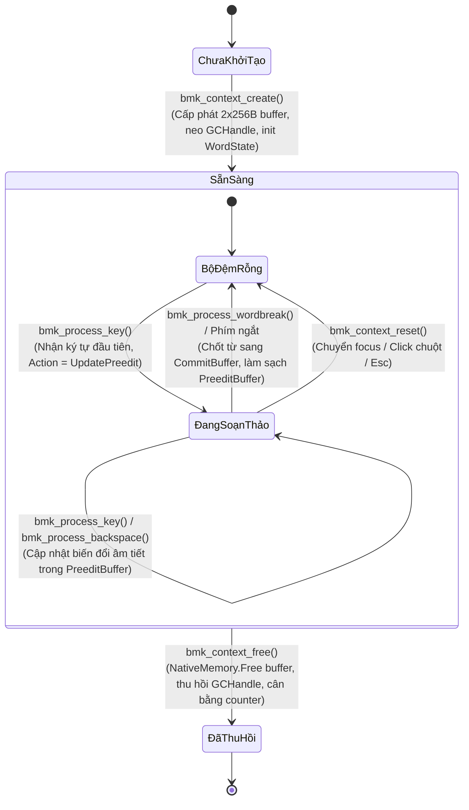

<!--
  BambooMintKey - Vietnamese Telex Input Method Editor for macOS
  Copyright (c) 2026 Dương Gia Long and LMO contributors
  SPDX-License-Identifier: MIT
-->

# 010_02_Architecture_and_CABI_Design — Thiết Kế Kiến Trúc Hệ Thống & Giao Diện C-ABI NativeAOT macOS

**Mã tài liệu:** `010_02_Architecture_and_CABI_Design`  
**Giai đoạn:** Phase 10 — Thiết kế kỹ thuật nền tảng macOS (InputMethodKit)  
**Thuộc module:** `BambooMintKey.Core.Native`, `BambooMintKey.Core`  
**Trạng thái:** 📋 Đã hoàn thiện thiết kế — Chờ phê duyệt  
**Tài liệu tham chiếu:**
- Khảo sát khả thi & Kế hoạch: [010_01_Investigation.md](file:///Users/lmo1720/Self-App/BambooMintKey/docs/2.Design/Phase10/010_01_Investigation.md)
- Theo dõi tiến độ: [007_MacOSProgressTracking.md](file:///Users/lmo1720/Self-App/BambooMintKey/docs/4.Progress/007_MacOSProgressTracking.md)

---

## 1. Mục Tiêu Thiết Kế & Ranh Giới Kiến Trúc

### 1.1. Mục tiêu kỹ thuật
1. **Thiết lập kiến trúc 3 tầng phân tách hoàn toàn trên macOS**: Tầng Lõi thuật ngữ pháp tiếng Việt (F# thuần túy), Tầng Cầu nối C-ABI NativeAOT (C# xuất thư viện Mach-O dylib), và Tầng Dịch vụ hệ điều hành macOS (IMK Service và Avalonia UI).
2. **Không có Managed Runtime trong đường dẫn xử lý phím (Zero Managed Runtime Overhead)**: Biên dịch NativeAOT tạo ra thư viện nhị phân thuần máy, gọi trực tiếp từ tầng hệ thống với độ trễ cực thấp (< 0.1 mili-giây).
3. **Quản lý đa Context độc lập tuyệt đối**: Cung cấp cơ chế định danh phiên làm việc (Context Handle) riêng biệt cho từng ô nhập liệu của ứng dụng, tránh lẫn lộn bộ đệm giữa các cửa sổ.
4. **Bảo toàn 100% mã nguồn Windows và Linux**: Dự án C# NativeAOT được cấu hình xuất thêm định dạng `.dylib` trên macOS mà không thay đổi bất kỳ dòng mã logic nào của Windows (`.dll`) và Linux (`.so`).

---

## 2. Sơ Đồ Kiến Trúc Phân Tầng

Hệ thống được tổ chức thành 3 tầng rõ rệt:

---

## 3. Đặc Tả Giao Diện C-ABI NativeAOT Cho macOS

Thư viện chia sẻ `libBambooMintKeyCore.dylib` cung cấp một tập hợp các hàm chuẩn theo quy ước gọi hàm chuẩn C (`cdecl`). Mọi giao tiếp dữ liệu đều sử dụng các kiểu nguyên thủy: số nguyên, con trỏ và mảng byte mã hóa UTF-8.

### 3.1. Cấu trúc Đối tượng Ngữ cảnh (`EngineContext`)

Mỗi phiên nhập liệu trong ứng dụng khách được đại diện bởi một đối tượng ngữ cảnh nằm trong bộ nhớ unmanaged của thư viện:
- **Trường lưu trữ trạng thái từ vựng (`WordState`)**: Lưu trữ cấu trúc âm tiết tiếng Việt đang được xử lý của F# (âm đầu, âm đệm, âm chính, âm cuối, dấu thanh hiện tại).
- **Trường lưu trữ cấu hình gõ (`EngineConfig`)**: Lưu trữ thiết lập đang áp dụng cho ngữ cảnh (bảng mã Unicode dựng sẵn, kiểu gõ Telex hoặc VNI, kiểu đặt dấu mới hoặc cũ, bật/tắt khôi phục từ tiếng Anh, bật/tắt lặp phím xóa dấu).
- **Bộ đệm văn bản Preedit (`PreeditBuffer`)**: Vùng nhớ byte cố định chứa chuỗi ký tự UTF-8 biểu diễn từ đang soạn thảo (dở dang).
- **Bộ đệm văn bản Commit (`CommitBuffer`)**: Vùng nhớ byte cố định chứa chuỗi ký tự UTF-8 đã được chốt hoàn tất để chèn vào ứng dụng.
- **Biến đếm độ dài chuỗi**: Ghi nhận chính xác số byte hiện thời của bộ đệm Preedit và Commit.

### 3.2. Danh mục Hàm Xuất Khẩu C-ABI

#### Nhóm 1: Quản lý Vòng Đời Ngữ Cảnh (Lifecycle Management & Resource Safety)

Nhóm hàm này đóng vai trò sống còn trong việc đảm bảo tính ổn định của hệ thống: cấp phát, duy trì, làm sạch và thu hồi tài nguyên của từng phiên gõ độc lập giữa các ứng dụng macOS.

##### 1. Hàm khởi tạo ngữ cảnh (`bmk_context_create`)
- **Tham số đầu vào:** Không có (`void`).
- **Giá trị trả về:** Con trỏ định danh ngữ cảnh kiểu số nguyên nền tảng (`IntPtr handle`). Trả về giá trị khác 0 nếu khởi tạo thành công; trả về giá trị 0 (`IntPtr.Zero`) nếu xảy ra lỗi cạn kiệt bộ nhớ hệ thống (Out-Of-Memory).
- **Bản chất của Handle:** Handle trả về cho phía macOS là một giá trị đại diện cho đối tượng `GCHandle` kiểu bình thường (`Normal`) được neo giữ trên bộ nhớ heap của .NET runtime. Cơ chế này ngăn chặn Garbage Collector tự ý di dời hoặc thu hồi đối tượng `EngineContext` khi đang trong phiên làm việc.
- **Trình tự thực thi nội bộ (Execution Steps):**
  - *Bước 1 (Cấp phát quản lý):* Khởi tạo một thể hiện mới của lớp `EngineContext` trên heap.
  - *Bước 2 (Khởi tạo trạng thái):* Gán trạng thái từ vựng ban đầu là rỗng (`WordState.Empty`), nạp cấu hình bộ gõ mặc định (`EngineConfig.Default`).
  - *Bước 3 (Cấp phát vùng đệm unmanaged):* Gọi hàm cấp phát bộ nhớ cấp thấp `NativeMemory.AllocZeroed` để xin cấp phát 2 vùng nhớ độc lập có kích thước cố định 256 bytes cho `PreeditBuffer` và `CommitBuffer`. Toàn bộ 256 bytes được điền sẵn giá trị 0, bảo đảm byte đầu tiên luôn là ký tự kết thúc chuỗi null (`\0`).
  - *Bước 4 (Khởi tạo biến đếm):* Đặt độ dài hiện thời `PreeditLength = 0` và `CommitLength = 0`.
  - *Bước 5 (Khởi tạo khóa đồng bộ):* Tạo đối tượng khóa đồng bộ luồng nhẹ (`_syncRoot`) riêng biệt cho ngữ cảnh này nhằm phục vụ an toàn đa luồng.
  - *Bước 6 (Neo giữ đối tượng):* Thực hiện gọi `GCHandle.Alloc` để tạo handle neo giữ đối tượng, chuyển đổi sang giá trị `IntPtr` trả về cho bên gọi.
  - *Bước 7 (Thống kê tài nguyên):* Tăng biến đếm nguyên tử `_contextCreated` qua cơ chế `Interlocked.Increment` để phục vụ giám sát rò rỉ bộ nhớ.
- **Xử lý phía ứng dụng khách (macOS Swift):** Phía `IMKInputController` tiếp nhận Handle và lưu vào biến thành viên. Trước khi thực hiện bất kỳ thao tác nào, phía macOS phải kiểm tra Handle khác 0; nếu bằng 0, nhường quyền hoàn toàn cho hệ thống.

##### 2. Hàm giải phóng ngữ cảnh (`bmk_context_free`)
- **Tham số đầu vào:** Con trỏ định danh ngữ cảnh (`IntPtr handle`).
- **Giá trị trả về:** Không có (`void`).
- **Điều kiện kích hoạt:** Được gọi khi ô nhập văn bản mất tiêu điểm vĩnh viễn, cửa sổ ứng dụng bị đóng, hoặc đối tượng `IMKInputController` bị giải phóng trong chu trình thu hồi của hệ điều hành.
- **Trình tự thực thi nội bộ (Execution Steps):**
  - *Bước 1 (Kiểm tra con trỏ rỗng):* Nếu `handle == IntPtr.Zero`, hàm lập tức thoát an toàn, không thực hiện bất kỳ hành động nào.
  - *Bước 2 (Trích xuất an toàn & Chống giải phóng hai lần - Double Free Protection):* Giải mã Handle để lấy lại đối tượng `EngineContext`. Nếu Handle không hợp lệ hoặc đã bị giải phóng trước đó, cơ chế phòng vệ tự động bắt giữ và thoát an toàn mà không làm crash tiến trình.
  - *Bước 3 (Giải phóng bộ nhớ unmanaged):* Gọi `NativeMemory.Free(PreeditBuffer)` và `NativeMemory.Free(CommitBuffer)` để trả lại vùng nhớ 512 bytes cho hệ điều hành.
  - *Bước 4 (Triệt tiêu con trỏ lơ lửng - Dangling Pointer Protection):* Gán `PreeditBuffer = null` và `CommitBuffer = null` ngay sau khi giải phóng, ngăn chặn tuyệt đối mọi hành vi truy cập vùng nhớ rác nếu có lời gọi ngoài ý muốn.
  - *Bước 5 (Thu hồi GCHandle):* Gọi `GCHandle.Free()` để mở khóa đối tượng, cho phép Garbage Collector tự do dọn dẹp thể hiện `EngineContext`.
  - *Bước 6 (Cân bằng thống kê):* Tăng biến đếm nguyên tử `_contextFreed` qua cơ chế `Interlocked.Increment`.
- **Ranh giới an toàn ngoại lệ:** Toàn bộ thân hàm được bọc trong cơ chế chặn ngoại lệ; tuyệt đối không để bất kỳ ngoại lệ managed nào văng qua ranh giới C-ABI làm sập dịch vụ bộ gõ của hệ điều hành.

##### 3. Hàm đặt lại trạng thái ngữ cảnh (`bmk_context_reset`)
- **Tham số đầu vào:** Con trỏ định danh ngữ cảnh (`IntPtr handle`).
- **Giá trị trả về:** Không có (`void`).
- **Khi nào cần gọi (Trigger Scenarios):**
  - Khi người dùng nhấp chuột di chuyển con trỏ văn bản sang vị trí khác trong cùng một trường nhập liệu (Mouse click / Caret reposition).
  - Khi ứng dụng khách gửi tín hiệu hủy đánh dấu (ví dụ ứng dụng gọi `setMarkedText` với chuỗi rỗng hoặc người dùng nhấn phím Esc để hủy gõ).
  - Khi chuyển đổi tab hoặc trường nhập liệu trong cùng một cửa sổ ứng dụng mà Controller được tái sử dụng.
- **Trình tự thực thi nội bộ (Execution Steps):**
  - *Bước 1 (Kiểm tra Handle):* Trích xuất `EngineContext` từ Handle; nếu Handle rỗng hoặc không hợp lệ, thoát ngay.
  - *Bước 2 (Khóa đồng bộ luồng):* Chiếm quyền khóa nhẹ `lock (context.SyncRoot)` để đảm bảo không bị xung đột với luồng xử lý phím khác.
  - *Bước 3 (Đặt lại trạng thái ngôn ngữ):* Gán trạng thái F# về trạng thái khởi thủy: `State = Types.WordState.Empty`.
  - *Bước 4 (Xóa rỗng PreeditBuffer):* Đặt byte đầu tiên `PreeditBuffer[0] = 0` (ký tự null kết thúc chuỗi) và đặt `PreeditLength = 0`.
  - *Bước 5 (Xóa rỗng CommitBuffer):* Đặt byte đầu tiên `CommitBuffer[0] = 0` và đặt `CommitLength = 0`.
  - *Bước 6 (Mở khóa luồng):* Rút khỏi khối khóa an toàn.
- **Ưu thế hiệu năng vượt trội (Zero-Allocation Invariant):**
  - Toàn bộ thao tác reset hoàn toàn không cấp phát hay giải phóng bất kỳ một byte bộ nhớ nào trên heap hay unmanaged memory.
  - Giữ nguyên hai bộ đệm 256 bytes đã cấp phát sẵn, giữ nguyên cấu hình gõ (`EngineConfig`) người dùng đã thiết lập.
  - Thời gian thực thi tức thời (< 1 micro-giây), bảo đảm độ trễ khi chuyển đổi ngữ cảnh bằng 0.

##### 4. Hàm chẩn đoán rò rỉ ngữ cảnh (`bmk_get_live_context_count`)
- **Tham số đầu vào:** Không có (`void`).
- **Giá trị trả về:** Số nguyên 32-bit (`int32_t`) biểu diễn số lượng ngữ cảnh hiện đang tồn tại trong bộ nhớ.
- **Công thức tính toán:** `SốContextĐangSống = ĐọcBộNhớKhảBiến(_contextCreated) - ĐọcBộNhớKhảBiến(_contextFreed)`.
- **Vai trò trong kiểm thử & đảm bảo chất lượng:**
  - Cho phép kịch bản kiểm thử E2E và Unit Test kiểm tra chính xác tính toàn vẹn bộ nhớ sau các phiên gõ cường độ cao.
  - Xác nhận rằng sau khi người dùng mở rồi đóng hàng trăm tab trình duyệt hoặc hàng loạt cửa sổ tài liệu, số ngữ cảnh đang sống luôn trở về đúng giá trị kỳ vọng, bảo đảm không có hiện tượng rò rỉ bộ nhớ dài hạn (Zero Memory Leak).

#### Nhóm 2: Xử lý phím bấm & Điều khiển ngữ pháp (Key Processing)
1. **Hàm xử lý ký tự (`bmk_process_key`)**:
   - *Tham số:* Con trỏ Handle của ngữ cảnh, mã Unicode của ký tự vừa nhấn.
   - *Giá trị trả về:* Mã số nguyên đại diện cho hành động tương ứng:
     - Giá trị 0 (Nhường phím): Ký tự không thuộc phạm vi xử lý của bộ gõ, trả quyền cho ứng dụng đích.
     - Giá trị 1 (Nuốt phím): Ký tự đã được xử lý nhưng không làm thay đổi văn bản hiển thị.
     - Giá trị 2 (Cập nhật Preedit): Ký tự làm thay đổi từ đang soạn thảo dở dang; ứng dụng cần cập nhật chuỗi Marked Text.
     - Giá trị 3 (Chốt chuỗi Commit): Từ đã hoàn thành hoặc gặp phím kết thúc; ứng dụng cần chốt chuỗi và xóa vùng đánh dấu.
   - *Hành vi:* Chuyển ký tự vào bộ máy trạng thái Telex của lõi F#, nhận diện biến đổi âm tiết và cập nhật các bộ đệm tương ứng.
2. **Hàm xử lý phím xóa lùi (`bmk_process_backspace`)**:
   - *Tham số:* Con trỏ Handle của ngữ cảnh.
   - *Giá trị trả về:* Mã số nguyên đại diện cho hành động (Cập nhật Preedit hoặc Nhường phím).
   - *Hành vi:* Nếu trong bộ đệm đang có âm tiết dở dang, lùi một bước biến đổi âm tiết (ví dụ: `thuyền` -> `thuyên` -> `thuê`). Nếu bộ đệm rỗng, nhường phím để ứng dụng tự xóa ký tự trước đó.
3. **Hàm xử lý phím ngắt từ (`bmk_process_wordbreak`)**:
   - *Tham số:* Con trỏ Handle của ngữ cảnh, mã Unicode của ký tự ngắt (dấu cách, dấu chấm, dấu phẩy, Enter).
   - *Giá trị trả về:* Mã số nguyên đại diện cho hành động chốt chuỗi (Commit).
   - *Hành vi:* Chốt toàn bộ từ đang soạn thảo kèm theo ký tự ngắt vào bộ đệm Commit, đặt lại trạng thái Preedit về rỗng.

#### Nhóm 3: Truy xuất dữ liệu văn bản UTF-8
1. **Hàm lấy chuỗi Preedit (`bmk_get_preedit_text`)**:
   - *Tham số:* Con trỏ Handle của ngữ cảnh.
   - *Giá trị trả về:* Con trỏ trỏ tới mảng byte UTF-8 kết thúc bằng ký tự null trong bộ đệm Preedit.
   - *Quy ước sở hữu bộ nhớ:* Vùng nhớ thuộc quyền quản lý của ngữ cảnh; bên gọi chỉ đọc dữ liệu và tuyệt đối không được giải phóng con trỏ này.
2. **Hàm lấy độ dài Preedit (`bmk_get_preedit_length`)**:
   - *Tham số:* Con trỏ Handle của ngữ cảnh.
   - *Giá trị trả về:* Số lượng byte của chuỗi Preedit hiện thời.
3. **Hàm lấy chuỗi Commit (`bmk_get_commit_text`)**:
   - *Tham số:* Con trỏ Handle của ngữ cảnh.
   - *Giá trị trả về:* Con trỏ trỏ tới mảng byte UTF-8 kết thúc bằng ký tự null trong bộ đệm Commit.
   - *Quy ước sở hữu bộ nhớ:* Tương tự như chuỗi Preedit, bên gọi chỉ đọc và không được giải phóng.

#### Nhóm 4: Cập nhật cấu hình động
1. **Hàm cập nhật cấu hình ngữ cảnh (`bmk_set_config`)**:
   - *Tham số:* Con trỏ Handle của ngữ cảnh, các cờ cấu hình (kiểu gõ Telex/VNI, kiểu đặt dấu mới/cũ, khôi phục từ tiếng Anh, lặp phím xóa dấu).
   - *Giá trị trả về:* Không có.
   - *Hành vi:* Cập nhật tức thời các tham số ngữ pháp vào đối tượng ngữ cảnh để áp dụng ngay cho các ký tự tiếp theo.

---

## 4. Hợp Đồng Sở Hữu Bộ Nhớ & An Toàn Luồng (Memory Contract & Thread Safety)

### 4.1. Nguyên tắc sở hữu bộ nhớ một chiều
- Toàn bộ chuỗi văn bản UTF-8 (`preedit` và `commit`) được lưu trữ tại bộ đệm nội bộ của từng đối tượng ngữ cảnh unmanaged.
- Bộ gõ phía macOS (Swift) khi nhận con trỏ byte từ C-ABI chỉ thực hiện sao chép sang chuỗi của ngôn ngữ cấp cao (`String` trong Swift) để gửi tới hệ thống văn bản của Apple.
- Phía macOS tuyệt đối không thực hiện giải phóng (`free`) các con trỏ nhận được từ C-ABI.
- Việc giải phóng bộ nhớ chỉ diễn ra tập trung khi phiên nhập liệu kết thúc và phía macOS chủ động gọi hàm giải phóng ngữ cảnh (`bmk_context_free`).

### 4.2. Cách ly đa tiến trình và an toàn luồng
- Mỗi cửa sổ hoặc ô nhập liệu của ứng dụng sở hữu một con trỏ Handle riêng biệt.
- Các lời gọi hàm C-ABI diễn ra tuần tự trên luồng giao diện của từng ô nhập liệu tương ứng.
- Không có dữ liệu trạng thái tĩnh (static mutable state) dùng chung giữa các Handle, đảm bảo tuyệt đối không xảy ra hiện tượng tranh chấp luồng (race condition) hoặc lẫn lộn văn bản giữa hai cửa sổ đang gõ đồng thời.

---

## 5. Độc Lập Hóa Cấu Hình Biên Dịch Dự Án C# NativeAOT

1. **Giữ nguyên trạng dự án hiện có**:
   - Dự án `BambooMintKey.Core.Native` tiếp tục phục vụ Linux (sinh ra `libBambooMintKeyCore.so`) và Windows.
   - Cấu hình biên dịch được bổ sung điều kiện hệ điều hành: khi thực thi trên môi trường macOS (`OSX`), đầu ra sẽ tự động mang định dạng thư viện động Mach-O (`libBambooMintKeyCore.dylib`).
2. **Hỗ trợ Universal Binary / Đa kiến trúc Apple**:
   - Cấu hình hỗ trợ biên dịch cho kiến trúc Apple Silicon (`osx-arm64`) dành cho chip Apple M1/M2/M3/M4.
   - Cấu hình hỗ trợ biên dịch cho kiến trúc Intel (`osx-x64`) dành cho các máy Mac thế hệ trước.
   - Cung cấp khả năng gộp hai file nhị phân thành một file Universal Binary duy nhất thông qua công cụ dòng lệnh tiêu chuẩn của macOS khi đóng gói phát hành.
