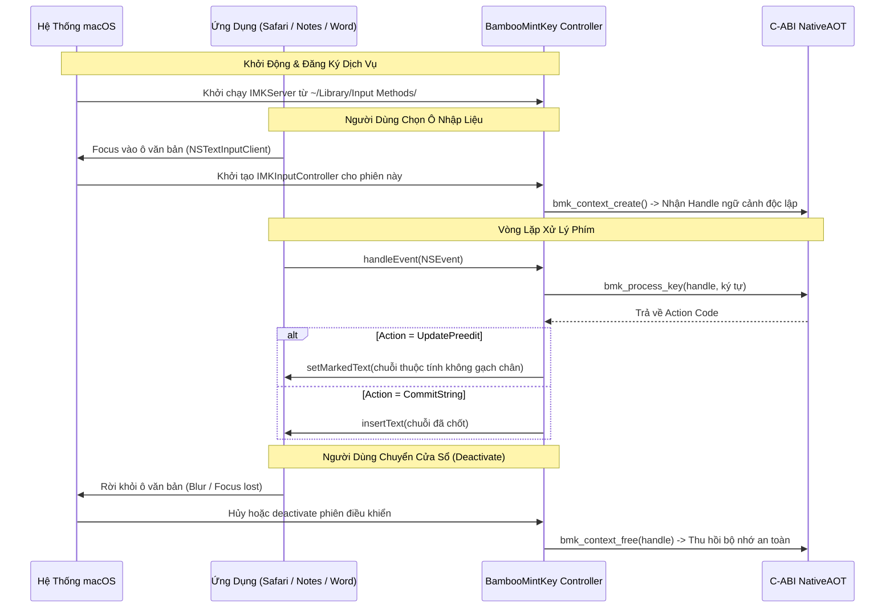

<!--
  BambooMintKey - Vietnamese Telex Input Method Editor for macOS
  Copyright (c) 2026 Dương Gia Long and LMO contributors
  SPDX-License-Identifier: MIT
-->

# 010_03_IMK_Engine_Design — Thiết Kế Chi Tiết Bộ Gõ Bản Địa macOS (InputMethodKit Engine Service)

**Mã tài liệu:** `010_03_IMK_Engine_Design`**Giai đoạn:** Phase 10 — Thiết kế kỹ thuật nền tảng macOS (InputMethodKit)**Thuộc module:** `BambooMintKey.Mac.IMK`**Trạng thái:** 📋 Đã hoàn thiện thiết kế — Chờ phê duyệt**Tài liệu tham chiếu:**

- Khảo sát khả thi & Kế hoạch: [010_01_Investigation.md](file:///Users/lmo1720/Self-App/BambooMintKey/docs/2.Design/Phase10/010_01_Investigation.md)
- Kiến trúc & C-ABI: [010_02_Architecture_and_CABI_Design.md](file:///Users/lmo1720/Self-App/BambooMintKey/docs/2.Design/Phase10/010_02_Architecture_and_CABI_Design.md)
- Theo dõi tiến độ: [007_MacOSProgressTracking.md](file:///Users/lmo1720/Self-App/BambooMintKey/docs/4.Progress/007_MacOSProgressTracking.md)

---

## 1. Mục Tiêu Kỹ Thuật & Tôn Chỉ Vận Hành

1. **Tuân thủ tiêu chuẩn InputMethodKit (IMK) chính thức của Apple**: Hoạt động như một Input Method Service bản địa, được hệ thống quản lý tập trung và phân phối sự kiện văn bản tự nhiên, không cần quyền Trợ năng (Accessibility) và không đánh chặn phím toàn cục.
2. **Quản lý vùng đệm qua Preedit (Marked Text)**: Vận hành cơ chế soạn thảo in-line tại chỗ; tuyệt đối nói không với cơ chế gửi phím Backspace giả lập.
3. **Thực thi chính sách tắt gạch chân tối đa**: Gán chỉ thị ẩn đường gạch chân (Stealth Mode) khi truyền chuỗi văn bản đánh dấu sang ứng dụng khách nhằm đem lại trải nghiệm chữ hiển thị mượt mà, sạch sẽ, không che khuất dấu nặng (`.`) của tiếng Việt.
4. **Ứng xử mềm dẻo với ứng dụng đặc thù**: Với các ứng dụng tự vẽ đường gạch chân mặc định (như một số terminal emulators), chấp nhận hiển thị mặc định của ứng dụng mà không can thiệp sâu.
5. **Ưu tiên số 1 tuyệt đối — Đảm bảo gõ đúng và ổn định**: Xử lý chính xác từng sự kiện phím, tương thích hoàn hảo với các tổ hợp phím tắt hệ thống, đảm bảo không làm mất chữ hay gián đoạn mạch gõ của người dùng.

---

## 2. Cấu Trúc Gói Ứng Dụng macOS Bundle (`BambooMintKey.app`)

Bộ gõ được đóng gói dưới dạng một Application Bundle theo đúng quy chuẩn ứng dụng Input Method của macOS, được đặt tại thư mục nguồn nhập liệu của người dùng (`~/Library/Input Methods/BambooMintKey.app`).

### 2.1. Phân cấp thư mục trong Bundle

- **Thư mục thực thi chính (`Contents/MacOS/`)**:
  - Chứa tệp thực thi nhị phân bản địa của bộ gõ (viết bằng Swift, quản lý vòng đời Server và Controller).
  - Chứa thư viện liên kết động C-ABI NativeAOT (`libBambooMintKeyCore.dylib`).
- **Thư mục tài nguyên giao diện (`Contents/Resources/`)**:
  - Tệp biểu tượng chính của ứng dụng bộ gõ (`AppIcon.icns`).
  - Tệp biểu tượng hiển thị chế độ tiếng Việt (`V`) và tiếng Anh (`E`) dạng vector chuẩn để đưa lên thanh tác vụ Menu Bar của hệ thống.
  - Các gói tài nguyên ngôn ngữ giao diện tiếng Việt và tiếng Anh.
- **Tệp thông tin định danh dịch vụ (`Contents/Info.plist`)**:
  - Khai báo các thuộc tính chuẩn để hệ điều hành macOS nhận diện ứng dụng là một Input Method Engine chính thức:
    - Định danh gói ứng dụng (Bundle Identifier duy nhất).
    - Tên hiển thị của bộ gõ trên danh sách bàn phím hệ thống.
    - Tên lớp điều khiển nhập liệu chính (Input Controller Class) và tên lớp máy chủ (Server Class).
    - Cờ khai báo chế độ chạy nền không hiển thị thanh Dock (Background Agent).
    - Ngôn ngữ hỗ trợ mặc định là tiếng Việt và kiểu kịch bản nhập liệu bàn phím.

---

## 3. Vòng Đời Của IMK Server & InputController

### 3.1. Vòng đời Máy chủ (`IMKServer`)

- Khi người dùng đăng nhập vào hệ thống hoặc chọn bộ gõ lần đầu, macOS tự động nạp tiến trình bộ gõ.
- `IMKServer` được khởi tạo, đăng ký tên kết nối dịch vụ với trung tâm quản lý phương thức nhập liệu của hệ điều hành và thiết lập lắng nghe các yêu cầu mở phiên gõ từ các ứng dụng.

### 3.2. Vòng đời Bộ điều khiển nhập liệu (`IMKInputController`)

- **Khởi tạo phiên gõ**: Khi người dùng nhấp chuột vào một ô nhập văn bản bất kỳ, hệ điều hành tạo ra một thể hiện mới của bộ điều khiển. Bộ điều khiển gọi ngay hàm `bmk_context_create()` để nhận một Handle ngữ cảnh tách biệt, gán cấu hình gõ hiện hành cho Handle này.
- **Duy trì phiên gõ**: Xuyên suốt quá trình soạn thảo trong ô văn bản đó, toàn bộ sự kiện gõ phím được gửi vào đúng Handle ngữ cảnh tương ứng.
- **Kết thúc phiên gõ**: Khi ô văn bản mất tiêu điểm (người dùng chuyển sang cửa sổ khác hoặc bấm chuột ra ngoài):
  - Nếu trong bộ đệm vẫn còn âm tiết tiếng Việt đang soạn dở, bộ điều khiển thực hiện chốt ngay âm tiết đó vào văn bản của ứng dụng để tránh mất ký tự.
  - Gọi hàm `bmk_context_free()` để giải phóng hoàn toàn bộ đệm unmanaged của Handle đó.

---

## 4. Thuật Toán Xử Lý Sự Kiện Phím (`handleEvent`)

Bộ điều khiển tiếp nhận mọi sự kiện bàn phím gửi từ ứng dụng khách thông qua hàm lắng nghe sự kiện của hệ thống. Quy trình phân loại và xử lý diễn ra như sau:

### 4.1. Lọc và phân loại sự kiện ban đầu

1. **Kiểm tra loại sự kiện**: Chỉ thụ lý các sự kiện nhấn phím xuống (`KeyDown`). Tất cả các sự kiện khác (nhả phím `KeyUp`, di chuyển chuột, cử chỉ cảm ứng) đều được nhường quyền ngay cho hệ thống bằng cách trả về giá trị false.
2. **Kiểm tra phím bổ trợ hệ thống (`Command`, `Control`)**:
   - Khi phát hiện phím `Command` hoặc `Control` đang được nhấn (người dùng đang thực hiện các phím tắt như `Cmd+C`, `Cmd+V`, `Cmd+A`, `Cmd+Z`, `Cmd+S`, `Cmd+Tab`...):
     - Nếu trong bộ đệm Preedit đang có từ tiếng Việt đang gõ dở, lập tức gửi lệnh chốt chuỗi hiện tại vào văn bản của ứng dụng (`insertText`).
     - Đặt lại bộ đệm Preedit về rỗng.
     - Trả về false để nhường quyền xử lý hoàn toàn cho hệ thống và ứng dụng đích.
   - Cơ chế này đảm bảo phím tắt hệ thống luôn hoạt động trơn tru 100%, không bị nuốt phím và không làm đảo lộn nội dung văn bản.

### 4.2. Xử lý các phím điều hướng và phím xóa

1. **Phím xóa lùi (Backspace)**:
   - Gọi hàm C-ABI `bmk_process_backspace` với Handle của phiên hiện tại.
   - Nếu mã trả về là Cập nhật Preedit: Cập nhật lại chuỗi Marked Text hiển thị từ đã lùi bước biến đổi (ví dụ: `thuyền` -> `thuyên`), con trỏ ở cuối từ, trả về true (nuốt phím).
   - Nếu mã trả về là Nhường phím (bộ đệm đang rỗng): Trả về false để ứng dụng tự thực hiện xóa lùi ký tự đứng trước trên văn bản.
2. **Phím điều hướng (Mũi tên trái/phải/lên/xuống, Home, End, PageUp/Down)**:
   - Nếu đang có từ gõ dở trong Preedit, chốt từ hiện tại vào văn bản và đặt lại bộ đệm.
   - Trả về false để con trỏ di chuyển tự nhiên theo ứng dụng.

### 4.3. Xử lý ký tự văn bản thông thường

1. Trích xuất mã ký tự Unicode từ sự kiện phím.
2. Gọi hàm C-ABI `bmk_process_key` truyền mã ký tự vào lõi F#.
3. Tiếp nhận mã hành động (Action Code) từ hàm C-ABI:
   - **Mã 0 (Nhường phím)**: Ký tự không cần biến đổi ngữ pháp, trả về false để ứng dụng tự nhận ký tự.
   - **Mã 1 (Nuốt phím)**: Ký tự đã được xử lý nội bộ, trả về true.
   - **Mã 2 (Cập nhật Preedit)**: Lấy chuỗi Preedit mới từ C-ABI, tiến hành đóng gói chuỗi thuộc tính hiển thị (xem chi tiết mục 5) và gửi sang ứng dụng qua hàm `setMarkedText`, trả về true.
   - **Mã 3 (Chốt chuỗi Commit)**: Lấy chuỗi Commit từ C-ABI, gọi hàm chèn văn bản `insertText` vào ứng dụng, trả về true.

---

## 5. Cơ Chế Hiển Thị Preedit & Chính Sách Tắt Gạch Chân Tối Đa

### 5.1. Cơ chế đóng gói chuỗi thuộc tính (Marked Text Styling)

Khi nhận mã hành động Cập nhật Preedit, bộ điều khiển thực hiện chuỗi thao tác:

1. Đọc mảng byte UTF-8 từ hàm `bmk_get_preedit_text` và chuyển đổi thành chuỗi cấp cao.
2. Tạo đối tượng chuỗi văn bản có thuộc tính (`NSAttributedString`).
3. Gán thuộc tính kiểu gạch chân bằng giá trị không có đường kẻ (`none` / giá trị số 0 tương ứng trong hệ thống Cocoa Text).
4. Xác định phạm vi lựa chọn của con trỏ: đặt điểm bắt đầu con trỏ ở vị trí cuối cùng của chuỗi văn bản, độ dài vùng bôi đen bằng 0 (con trỏ nhấp nháy tự nhiên ở cuối từ đang gõ).
5. Gọi hàm `setMarkedText` của đối tượng tiếp nhận văn bản phía ứng dụng khách, truyền chuỗi thuộc tính kèm phạm vi con trỏ và phạm vi thay thế.

### 5.2. Hiệu ứng hiển thị và chính sách đối với ứng dụng đặc thù

- **Trên các ứng dụng chuẩn Apple Cocoa (Safari, Notes, TextEdit, Mail, Pages...)**:
  - Ứng dụng tôn trọng thuộc tính văn bản, hiển thị các ký tự đang soạn thảo trực tiếp tại vị trí con trỏ văn bản một cách trơn tru, chữ sắc nét, hoàn toàn không có bất kỳ đường gạch chân nào bên dưới.
  - Trải nghiệm thị giác đạt độ sạch sẽ tối đa, đặc biệt loại bỏ hoàn toàn hiện tượng đường gạch chân đè lên hoặc gây nhầm lẫn với dấu nặng (`.`) nằm dưới chân chữ cái tiếng Việt.
- **Trên các ứng dụng có bộ dựng hình tự tạo (Terminal emulators, ứng dụng đặc thù)**:
  - Một số ứng dụng đầu cuối tự động vẽ đường gạch chân hoặc đổi màu nền riêng cho toàn bộ chuỗi được đánh dấu mà không phụ thuộc vào thuộc tính của hệ thống văn bản Cocoa.
  - **Chính sách:** Giữ nguyên hiển thị mặc định của ứng dụng đó. Tuyệt đối không cố gắng tiêm mã hay can thiệp vào tiến trình của ứng dụng để cưỡng ép xóa gạch chân.
  - Mục tiêu tối thượng luôn được bảo đảm: Các ký tự tiếng Việt được biến đổi chuẩn xác, con trỏ theo sát nhịp gõ, không phát sinh lỗi ký tự lạ.

---

## 6. Cơ Chế Chốt Chuỗi Hoàn Chỉnh (Commit String)

1. Khi người dùng nhấn phím ngắt (dấu cách, phím Enter, dấu chấm, dấu phẩy, v.v.), lõi F# phát hiện ranh giới kết thúc từ và trả về mã hành động Chốt chuỗi (CommitString).
2. Bộ điều khiển đọc mảng byte UTF-8 từ hàm `bmk_get_commit_text`.
3. Gọi hàm `insertText` của ứng dụng khách, truyền chuỗi đã hoàn thiện và phạm vi cần thay thế (chính là toàn bộ phạm vi chuỗi đánh dấu trước đó).
4. Ứng dụng khách tiếp nhận văn bản chính thức, xóa bỏ hoàn toàn trạng thái đánh dấu tạm thời, đưa con trỏ sang vị trí tiếp theo trên văn bản.
5. Bộ đệm Preedit được đặt lại về trạng thái rỗng, sẵn sàng đón nhận âm tiết tiếp theo.
