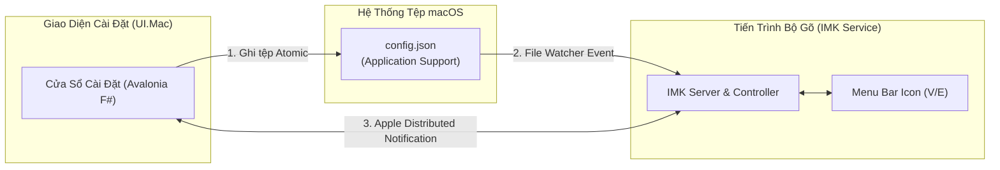

<!--
  BambooMintKey - Vietnamese Telex Input Method Editor for macOS
  Copyright (c) 2026 Dương Gia Long and LMO contributors
  SPDX-License-Identifier: MIT
-->

# 010_04_UIMac_Design — Thiết Kế Giao Diện Cài Đặt Bản Địa Avalonia Cho macOS (BambooMintKey.UI.Mac)

**Mã tài liệu:** `010_04_UIMac_Design`  
**Giai đoạn:** Phase 10 — Thiết kế kỹ thuật nền tảng macOS (InputMethodKit)  
**Thuộc module:** `BambooMintKey.UI.Mac`  
**Trạng thái:** 📋 Đã hoàn thiện thiết kế — Chờ phê duyệt  
**Tài liệu tham chiếu:**
- Khảo sát khả thi & Kế hoạch: [010_01_Investigation.md](file:///Users/lmo1720/Self-App/BambooMintKey/docs/2.Design/Phase10/010_01_Investigation.md)
- Kiến trúc & C-ABI: [010_02_Architecture_and_CABI_Design.md](file:///Users/lmo1720/Self-App/BambooMintKey/docs/2.Design/Phase10/010_02_Architecture_and_CABI_Design.md)
- Theo dõi tiến độ: [007_MacOSProgressTracking.md](file:///Users/lmo1720/Self-App/BambooMintKey/docs/4.Progress/007_MacOSProgressTracking.md)

---

## 1. Mục Tiêu Thiết Kế & Định Hướng Phân Tách

1. **Tái sử dụng tối đa và cô lập rủi ro**: Nhân bản giao diện Avalonia UI hiện đại từ phiên bản Linux sang dự án độc lập `BambooMintKey.UI.Mac`, giữ nguyên vẹn toàn bộ mã nguồn của Windows và Linux.
2. **Loại bỏ hoàn toàn phụ thuộc D-Bus của Linux**: Trên macOS không tồn tại daemon D-Bus mặc định; toàn bộ cơ chế giao tiếp và lưu trữ được chuyển đổi sang các giải pháp bản địa của hệ sinh thái Apple.
3. **Lưu trữ cấu hình chuẩn macOS**: Lưu trữ và quản lý cấu hình người dùng tại thư mục dữ liệu ứng dụng của macOS (`~/Library/Application Support/BambooMintKey/config.json`).
4. **Đồng bộ thời gian thực hai chiều (Zero D-Bus)**: Thiết lập kênh đồng bộ thông báo nhẹ giữa Menu Bar, Bộ gõ và Cửa sổ Cài đặt; kết hợp với cơ chế theo dõi sự kiện tệp để cập nhật cấu hình tức thì.
5. **Cơ chế chạy đơn phiên bản (Single Instance)**: Đảm bảo chỉ có một cửa sổ Cài đặt duy nhất được mở trong một phiên người dùng; tự động kích hoạt cửa sổ hiện có lên trước màn hình nếu người dùng mở lại từ Menu Bar.

---

## 2. Cấu Trúc Dự Án & Thành Phần Giao Diện

Dự án được đặt tại `src/BambooMintKey.UI.Mac/`, biên dịch độc lập bằng .NET 10 với ngôn ngữ F# và framework giao diện đa nền tảng Avalonia UI.

### 2.1. Phân cấp thành phần trong dự án
- **Tệp mô tả dự án (`BambooMintKey.UI.Mac.fsproj`)**:
  - Nhắm mục tiêu .NET 10 trên hệ điều hành macOS.
  - Tham chiếu Avalonia UI và các gói giao diện hiện đại.
  - Tham chiếu trực tiếp đến dự án lõi F# `BambooMintKey.Core.fsproj` để phục vụ tab gõ thử nghiệm.
- **Tầng giao diện (XAML Views)**:
  - Cửa sổ chính (`MainWindow.axaml`): Thiết kế cửa sổ bo tròn góc chuẩn macOS, tông màu tối/sáng hài hòa, điều hướng theo dạng tab bên trái.
  - Tab Cài đặt chung: Tùy chọn khởi động cùng hệ thống, chọn phím tắt chuyển đổi chế độ gõ (Ctrl+Shift hoặc Alt+Z), hiển thị icon Menu Bar.
  - Tab Tùy chọn gõ: Lựa chọn kiểu gõ (Telex / VNI), bảng mã (Unicode dựng sẵn), kiểu đặt dấu thanh (chuẩn mới `hòa/hóa` hoặc chuẩn cũ `hoà/hoá`), bật/tắt khôi phục từ tiếng Anh, bật/tắt lặp phím xóa dấu.
  - Tab Gõ thử nghiệm (Live Test Sandbox): Ô văn bản tích hợp trực tiếp lõi F# để người dùng thử nghiệm gõ phím ngay trong cửa sổ Cài đặt.
  - Tab Thông tin phiên bản: Hiển thị thông tin giấy phép mã nguồn mở, phiên bản phần mềm và tác giả.
- **Tầng điều khiển và logic (F# ViewModels & Services)**:
  - Quản lý cấu hình (`MacConfigManager`): Đọc và ghi tệp cấu hình JSON theo chuẩn macOS.
  - Đồng bộ thông báo (`MacIpcClient`): Gửi và nhận tín hiệu thông báo chuyển đổi chế độ gõ V/E với dịch vụ bộ gõ.
  - Điều phối đơn phiên bản (`SingleInstanceGuard`): Quản lý socket miền cục bộ để ngăn chặn trùng lặp cửa sổ.

---

## 3. Cơ Chế Lưu Trữ Cấu Hình Bền Vững Chuẩn macOS

### 3.1. Vị trí lưu trữ
Tệp cấu hình người dùng được lưu trữ tại:
`~/Library/Application Support/BambooMintKey/config.json`

Nếu thư mục cha `BambooMintKey` chưa tồn tại trong `Application Support`, ứng dụng Cài đặt sẽ tự động tạo thư mục với đầy đủ quyền hạn của người dùng hiện tại trước khi ghi tệp.

### 3.2. Cấu trúc dữ liệu cấu hình (JSON Schema)
Tệp JSON chứa các trường cấu hình tiêu chuẩn:
- **Kiểu gõ (`inputMethod`)**: Giá trị kiểu chuỗi biểu diễn Telex hoặc VNI.
- **Bảng mã (`charset`)**: Giá trị kiểu chuỗi chỉ định bảng mã Unicode dựng sẵn (NFC).
- **Kiểu đặt dấu thanh (`tonePlacement`)**: Giá trị chuỗi chỉ định chuẩn mới (đặt dấu trên âm chính sau) hoặc chuẩn cũ (đặt dấu trên âm chính đầu).
- **Khôi phục từ tiếng Anh (`englishAutoRestore`)**: Giá trị boolean (bật/tắt) cho phép bộ gõ tự động trả về từ tiếng Anh nguyên bản khi phát hiện từ không hợp lệ trong ngữ pháp tiếng Việt.
- **Lặp phím xóa dấu (`repeatKeyUndo`)**: Giá trị boolean (bật/tắt) cho phép gõ lại phím dấu để hủy bỏ dấu đã đặt.
- **Bỏ dấu tự do (`freeTonePlacement`)**: Giá trị boolean (bật/tắt) cho phép bỏ dấu thanh tại bất kỳ vị trí nào trong từ.
- **Phím tắt chuyển đổi (`shortcutSwitchKey`)**: Giá trị chuỗi biểu diễn tổ hợp phím tắt chuyển đổi nhanh giữa chế độ gõ tiếng Việt và tiếng Anh.

### 3.3. Quy trình ghi tệp nguyên tử (Atomic Write)
Để ngăn chặn tình trạng tiến trình bộ gõ đọc phải tệp cấu hình đang ghi dở dang dẫn đến lỗi phân tích cú pháp JSON:
1. Ứng dụng Cài đặt tuần tự hóa đối tượng cấu hình thành chuỗi JSON định dạng chuẩn.
2. Ghi chuỗi JSON vào một tệp tạm thời trong cùng thư mục (`config.json.tmp`).
3. Thực hiện lệnh đổi tên tệp nguyên tử từ tệp tạm sang tệp chính thức `config.json`.
4. Hệ điều hành macOS đảm bảo thao tác đổi tên là nguyên tử (Atomic); tiến trình bộ gõ luôn đọc được trạng thái tệp hoàn chỉnh 100%.

---

## 4. Cơ Chế Đồng Bộ Hai Chiều Real-Time (Zero D-Bus)

Không sử dụng daemon D-Bus của Linux, giải pháp trên macOS dựa hoàn toàn vào các cơ chế bản địa:

### 4.1. Chiều 1: Cập nhật cấu hình từ Giao diện sang Bộ gõ
1. Người dùng thay đổi các thiết lập trên giao diện Cài đặt và nhấn nút Lưu.
2. Ứng dụng ghi tệp `config.json` theo cơ chế nguyên tử.
3. Trong tiến trình bộ gõ `BambooMintKey.app`, một luồng theo dõi sự kiện tệp tin (`DispatchSource` / `FSEvents`) phát hiện tệp `config.json` vừa được cập nhật.
4. Bộ gõ tự động nạp lại tệp JSON và cập nhật ngay vào đối tượng ngữ cảnh của phiên gõ hiện tại mà không làm ngắt quãng phiên làm việc của người dùng.

### 4.2. Chiều 2: Đồng bộ trạng thái V/E giữa Menu Bar và Giao diện
1. Khi người dùng bấm phím tắt chuyển đổi chế độ hoặc nhấp vào Menu Bar icon để đổi giữa `V` và `E`:
   - Dịch vụ bộ gõ phát đi một thông báo nội bộ thông qua trung tâm thông báo phân tán của macOS (`NSDistributedNotificationCenter`).
   - Cửa sổ Cài đặt nếu đang mở sẽ lắng nghe thông báo này và tự động cập nhật trạng thái hiển thị của chế độ gõ tương ứng.
2. Ngược lại, nếu người dùng chuyển chế độ gõ trực tiếp trên cửa sổ Cài đặt:
   - Cửa sổ Cài đặt phát thông báo ra trung tâm thông báo phân tán.
   - Dịch vụ bộ gõ tiếp nhận thông báo, cập nhật cờ chế độ gõ trong lõi và đổi ngay biểu tượng `V` hoặc `E` trên thanh Menu Bar.

### 4.3. Đồng bộ đầy đủ mọi tùy chọn gõ (không chỉ V/E)

V/E chỉ là một trong nhiều tùy chọn. Toàn bộ tùy chọn gõ phải được đồng bộ nhất quán theo **một nguồn chân lý duy nhất là `config.json`**, và mọi thay đổi ở bất kỳ đầu vào nào cũng phản ánh tức thì tới các thành phần còn lại.

Các tùy chọn cần đồng bộ toàn diện:
- **`isVietnameseMode`** — chế độ V/E.
- **`toneStyle`** — kiểu đặt dấu mới/cũ (`hòa` / `hoà`).
- **`allowFreeTonePlacement`** — bỏ dấu tự do.
- **`enableEnglishBacktracking`** — khôi phục từ tiếng Anh.
- **`allowRepeatKeyUndo`** — lặp phím xóa dấu.
- **`allowLeadingWAsU`** — phím `w` đầu từ thành `ư`.

Quy tắc:
1. **Menu IMK là một đầu vào cấu hình hợp lệ**: khi người dùng toggle `toneStyle`/`freeTone`/`englishBacktracking` từ menu thả xuống của IMK, thay đổi phải được **ghi xuống `config.json`** (atomic) và **phát thông báo** để UI.Mac đang mở cập nhật, không chỉ đổi biến trong bộ nhớ.
2. **UI.Mac lắng nghe thay đổi bên ngoài**: cửa sổ Cài đặt phải lắng nghe `NSDistributedNotificationCenter` (hoặc theo dõi `config.json`) để tự cập nhật các control khi tùy chọn bị thay đổi từ menu IMK hoặc Menu Bar, thay vì chỉ nạp một lần lúc khởi động.
3. **IMK broadcast mọi thay đổi option**, không chỉ V/E: sau bất kỳ toggle nào từ menu IMK, phát thông báo chứa tên + giá trị tùy chọn để UI.Mac đồng bộ.

### 4.4. Khôi phục toàn bộ trạng thái khi khởi động (Persistent State)

Toàn bộ trạng thái của lần dùng trước phải được giữ nguyên sau khi khởi động lại (logout/login hoặc mở lại ứng dụng):

1. **IMK Service** khi khởi động: nạp toàn bộ `config.json` vào `InputSettings` (không chỉ `isVietnameseMode`) trước khi phục vụ phiên gõ đầu tiên.
2. **Menu Bar (StatusBar)** khi khởi động: đọc `config.json` để khôi phục đúng chữ `V`/`E` hiển thị.
3. **UI.Mac** khi khởi động: nạp toàn bộ `config.json` để hiển thị đúng các control.
4. **Mọi thay đổi đều được persist ngay**: không có tùy chọn nào chỉ tồn tại trong bộ nhớ; nếu không ghi `config.json`, trạng thái sẽ bị mất khi restart.

### 4.5. Chia sẻ kiểu gõ giữa các ứng dụng (Global Typing Style)

Kiểu gõ (chế độ V/E và toàn bộ tùy chọn) được **chia sẻ toàn cục giữa mọi ứng dụng**, nhất quán với hành vi mặc định trên Windows và Linux:

- **Ai quản lý?** Trạng thái gõ toàn cục do **IMK Service quản lý** (không phải từng ứng dụng). Vì trên macOS chỉ có một tiến trình `IMKServer` duy nhất phục vụ toàn hệ thống, biến `InputSettings` là trạng thái tĩnh dùng chung cho mọi `IMKInputController` của mọi ô nhập liệu trong mọi ứng dụng.
- **Hệ quả:** khi người dùng chuyển V→E (bằng phím `, menu IMK, Menu Bar hay UI.Mac), trạng thái mới áp dụng ngay cho tất cả ứng dụng — không tồn tại kiểu gõ riêng cho từng app.
- **Đối chiếu:** trên Linux (Fcitx5) và Windows (TSF), kiểu gõ cũng mặc định chia sẻ toàn cục giữa các app; macOS giữ nguyên hành vi này.
- **Lưu ý kỹ thuật:** `IMKServer` có thể tái sử dụng (reuse) thể hiện `IMKInputController` giữa các ô nhập liệu. Trạng thái gõ toàn cục (`InputSettings`) là static nên không bị ảnh hưởng; riêng trạng thái từ vựng dở dang (`WordState`) phải được reset khi controller được tái kích hoạt (`activateServer`) để không lẫn chữ giữa các app.

---

## 5. Cơ Chế Chạy Đơn Phiên Bản (Single Instance Guard)

Để ngăn người dùng vô tình mở nhiều cửa sổ Cài đặt gây lãng phí tài nguyên và xung đột cấu hình:
1. Khi khởi động, ứng dụng Cài đặt thiết lập lắng nghe trên một socket miền UNIX cục bộ tại thư mục tạm của hệ thống (`/tmp/bamboomintkey-ui.sock`).
2. Nếu socket đã tồn tại và đang hoạt động (chứng tỏ đã có một cửa sổ Cài đặt đang chạy):
   - Tiến trình mới kết nối vào socket và gửi một chuỗi lệnh yêu cầu kích hoạt cửa sổ.
   - Tiến trình đang chạy nhận tín hiệu, tự động đưa cửa sổ hiện có lên trước màn hình (Activate & Bring to Front).
   - Tiến trình mới lập tức kết thúc an toàn.
3. Nếu socket chưa tồn tại: Tiến trình mới chiếm quyền sở hữu socket, khởi tạo giao diện bình thường và dọn dẹp socket khi đóng cửa sổ.

---

## 6. Tab Gõ Thử Nghiệm Trực Tiếp (Live Test Sandbox)

- Tab Gõ thử nghiệm được tích hợp trực tiếp một phiên bản của lõi F# `BambooMintKey.Core`.
- Khi người dùng gõ vào ô văn bản thử nghiệm, các ký tự được chuyển trực tiếp vào bộ máy phân tích Telex của F# với đúng các tham số người dùng đang chọn trên màn hình.
- Người dùng có thể ngay lập tức kiểm chứng:
  - Tốc độ biến đổi dấu.
  - Kiểu đặt dấu mới hay cũ (`hòa` so với `hoà`).
  - Hành vi khôi phục từ tiếng Anh khi gõ các từ như `post`, `center`, `internet`.
  - Cơ chế lặp phím xóa dấu thanh.
- Giúp người dùng hoàn toàn yên tâm về các thiết lập của mình trước khi áp dụng vào các ứng dụng làm việc hàng ngày.
