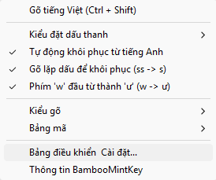

# 003_05_TaskbarContextMenu.md — Thiết kế Menu Ngữ cảnh Chuột phải (Context Menu) theo Phong cách Bamboo Mint cho Taskbar Button trên Windows 10/11

> **Tài liệu liên quan:**  
> - Thiết kế nút Taskbar COM: `docs/2.Design/Phase3/003_03_TaskbarButton_COM.md`  
> - Thiết kế giải pháp đồng bộ nền tảng: `docs/2.Design/Phase3/003_09_IssuesSolution.md`  
> - Thiết kế xử lý phản hồi chuột: `docs/2.Design/Phase3/009_10_DelayOMouseChangeDelaySolution.md`  
> - Nền tảng mục tiêu: **Windows 10 và Windows 11 (64-bit)**.

---

## 1. Mục tiêu & Định hướng Thẩm mỹ "Bamboo Mint"

Menu ngữ cảnh khi click chuột phải vào biểu tượng khay hệ thống (Taskbar / System Tray) của BambooMintKey không chỉ phục vụ điều khiển tính năng mà còn là **gương mặt nhận diện thương hiệu**. 

### 1.1. Hệ màu Nhận diện Thương hiệu (Color Palette)
Menu áp dụng phong cách **Fluent Dark Acrylic** kết hợp điểm nhấn sắc xanh **Bamboo & Mint** cao cấp, chống chói mắt, tạo cảm giác sang trọng:

| Token | Mã Hex | Ý nghĩa & Vị trí hiển thị |
|---|---|---|
| **Bamboo Primary** | `#16a34a` (Xanh tre chuẩn) | Nền icon Taskbar, thanh Header thương hiệu |
| **Mint Accent** | `#22c55e` (Xanh bạc hà sáng) | Dấu checkmark `✓`, chấm tròn radio `•`, viền hover phát sáng |
| **Mint Glow** | `#4ade80` (Xanh bạc hà neon) | Điểm sáng khi chuột hover vào từng dòng menu |
| **Deep Forest Dark** | `#111613` (Đen ánh rêu trầm) | Màu nền tổng thể của menu (thay cho màu đen `#000` đơn điệu) |
| **Surface Card** | `#18221c` (Thẻ bề mặt Acrylic) | Vùng chứa submenu bo góc mềm mại |
| **Border Glow** | `#22c55e26` (Viền xanh mờ 15%) | Viền mảnh 1px phân tách các cụm chức năng |
| **Text Bright** | `#f8fafc` (Trắng tuyết) | Tiêu đề và nhãn chữ chính rõ nét |
| **Text Muted** | `#94a3b8` (Xám bạc) | Phím tắt phụ `(Ctrl + Shift)` căn lề phải |

---

## 2. Bố cục Trực quan của Menu (Visual Wireframe)

```
┌────────────────────────────────────────────────────────────┐
│   [✓]  Gõ tiếng Việt                          Ctrl + Shift │
├────────────────────────────────────────────────────────────┤
│   [>]  Kiểu đặt dấu thanh                     ►            │
│        ┌─────────────────────────────────────────────────┐ │
│        │  (•)  Kiểu mới (òa, xòe, thủy)      - Mặc định  │ │
│        │  ( )  Kiểu cũ  (oà, xoè, thuỷ)                  │ │
│        └─────────────────────────────────────────────────┘ │
│   [✓]  Tự động khôi phục từ tiếng Anh                      │
│   [✓]  Gõ lặp dấu để khôi phục (ss -> s)                    │
│   [ ]  Phím 'w' đầu từ thành 'ư' (w -> ư)                  │
├────────────────────────────────────────────────────────────┤
│   [>]  Kiểu gõ:  Telex                        ►            │
│   [>]  Bảng mã:  Unicode dựng sẵn             ►            │
├────────────────────────────────────────────────────────────┤
│   ⚙   Bảng điều khiển & Cài đặt...                         │
│   ℹ   Thông tin BambooMintKey                              │
└────────────────────────────────────────────────────────────┘
```

---

## 3. Kiến trúc Hỗ trợ Kép (Dual-Channel Architecture) trên Windows 10/11

Để bảo đảm 100% người dùng click chuột phải vào icon trên thanh Taskbar đều mở được menu ngay tức thì:

1. **Kênh 1: Chuẩn Windows TSF (`ITfMenu`)**:
   - Được Windows Language Bar Manager gọi qua `ITfLangBarItemButton::InitMenu(ITfMenu *pMenu)`.
   - Windows Shell tự dựng và vẽ menu theo giao diện hệ thống.
2. **Kênh 2: Win32 Native Popup Menu (`TrackPopupMenuEx`)**:
   - Khi Windows 11 Taskbar System Tray gửi sự kiện qua `ITfLangBarItemButton::OnClick` với `click = 1` (`TF_LBI_CLK_RIGHT`).
   - Lập tức mở popup menu tại tọa độ chuột `(pt.X, pt.Y)` được truyền trong tham số `POINT pt`.
   - Sử dụng `TPM_RETURNCMD` để bắt trực tiếp mã lệnh đã chọn mà không cần message pump phức tạp.

```
                         [ Người dùng Click Chuột Phải vào Icon ]
                                           │
                    ┌──────────────────────┴──────────────────────┐
                    │                                             │
                    ▼ (Trường hợp A: Windows gọi TSF)             ▼ (Trường hợp B: Windows gọi OnClick)
        ┌───────────────────────┐                     ┌───────────────────────┐
        │  ITfLangBarItemButton │                     │  ITfLangBarItemButton │
        │      ::InitMenu()     │                     │      ::OnClick()      │
        └───────────┬───────────┘                     │ (click = CLK_RIGHT)   │
                    │                                 └───────────┬───────────┘
                    ▼                                             ▼
        ┌───────────────────────┐                     ┌───────────────────────┐
        │ Dựng menu qua ITfMenu │                     │ Dựng Win32 Popup Menu │
        │ (Windows Shell vẽ)    │                     │ (TrackPopupMenuEx)    │
        └───────────┬───────────┘                     └───────────┬───────────┘
                    │                                             │
                    └──────────────────────┬──────────────────────┘
                                           │
                                           ▼
                    ┌─────────────────────────────────────────────┐
                    │        ExecuteMenuCommand(selectedId)       │
                    │  - Cập nhật SharedMemoryManager             │
                    │  - Tăng StateSequence                       │
                    │  - SignalStateChanged() broadcast           │
                    │  - Mọi ứng dụng (Notepad, Word, Chrome,...) │
                    │    đồng bộ cấu hình tức thì (0ms lag)!      │
                    └─────────────────────────────────────────────┘
```

---

## 4. Định nghĩa Mã lệnh & Hằng số Windows SDK

### 4.1. Hằng số TSF từ `ctfutb.h`
```csharp
public static class TsfMenuFlags
{
    public const uint TfLbMenuIdApp = 0x00010000; // Base ID cho app menu items

    public const uint TfLbMenuFlagChecked      = 0x00000001; // Dấu tích checkmark
    public const uint TfLbMenuFlagSubMenu      = 0x00000002; // Mục chứa menu con
    public const uint TfLbMenuFlagSeparator    = 0x00000004; // Đường kẻ ngang
    public const uint TfLbMenuFlagRadioChecked = 0x00000008; // Dấu tròn radio
    public const uint TfLbMenuFlagGrayed       = 0x00000010; // Mục bị vô hiệu hóa
}
```

### 4.2. Bảng Command IDs nội bộ
```csharp
public static class MenuCommands
{
    public const uint Base = TsfMenuFlags.TfLbMenuIdApp;

    // 1. Chuyển chế độ gõ
    public const uint ToggleVietnameseMode        = Base + 1;

    // 2. Kiểu đặt dấu thanh
    public const uint SubmenuToneStyle           = Base + 10;
    public const uint ToneStyleModern            = Base + 11; // Kiểu mới (òa, xòe, thủy)
    public const uint ToneStyleClassic           = Base + 12; // Kiểu cũ (oà, xoè, thuỷ)

    // 3. Tùy chọn ngữ pháp thông minh
    public const uint ToggleAutoRestoreEnglish   = Base + 20; // Khôi phục từ tiếng Anh
    public const uint ToggleRepeatKeyUndo        = Base + 21; // Gõ lặp để hoàn tác dấu
    public const uint ToggleLeadingWAsU          = Base + 22; // Phím 'w' đầu từ thành 'ư'

    // 4. Kiểu gõ (Mở rộng)
    public const uint SubmenuInputMethod         = Base + 30;
    public const uint MethodTelex                = Base + 31;
    public const uint MethodVni                  = Base + 32;
    public const uint MethodSimpleTelex          = Base + 33; // Simple Telex

    // 5. Bảng mã (Mở rộng)
    public const uint SubmenuCharset             = Base + 40;
    public const uint CharsetUnicodePrecomposed  = Base + 41;
    public const uint CharsetUnicodeDecomposed   = Base + 42;
    public const uint CharsetTcvn3               = Base + 43;

    // 6. Cài đặt & Hệ thống
    public const uint OpenSettings               = Base + 50;
    public const uint AboutApp                   = Base + 51;
}
```

---

## 5. Đặc tả C-ABI & Struct VTable cho `ITfMenu`

Định nghĩa struct `TfMenuVTable` trong `Interop/TsfLangBarTypes.cs`:

```csharp
[StructLayout(LayoutKind.Sequential)]
public unsafe struct TfMenuVTable
{
    // --- IUnknown (Slot 0 - 2) ---
    public delegate* unmanaged[Stdcall]<IntPtr, Guid*, IntPtr*, int> QueryInterface;
    public delegate* unmanaged[Stdcall]<IntPtr, uint> AddRef;
    public delegate* unmanaged[Stdcall]<IntPtr, uint> Release;

    // --- ITfMenu (Slot 3) ---
    public delegate* unmanaged[Stdcall]<
        IntPtr,         // this
        uint,           // uId: Menu command ID
        uint,           // uFlags: TF_LBMENUFLAG_*
        IntPtr,         // hbmp: HBITMAP icon tùy chọn (IntPtr.Zero nếu không dùng)
        IntPtr,         // hbmpMask: HBITMAP mask
        char*,          // pch: Chuỗi Unicode hiển thị
        uint,           // cch: Chiều dài chuỗi ký tự
        IntPtr*,        // ppMenu: Nhận con trỏ ITfMenu con nếu có cờ SUBMENU
        int> AddMenuItem;
}
```

---

## 6. Hiện thực hóa Chi tiết trong Mã nguồn (`LangBarItemButton.cs`)

### 6.1. Dựng Menu TSF qua `InitMenu`
```csharp
[UnmanagedCallersOnly(CallConvs = [typeof(CallConvStdcall)])]
private static int InitMenu(IntPtr thisPtr, IntPtr pMenu)
{
    if (pMenu == IntPtr.Zero) return HResult.InvalidArgument;

    var menuVTable = *(TfMenuVTable**)pMenu;

    // 1. Chế độ gõ tiếng Việt
    bool isVn = BridgeStateManager.IsVietnameseMode;
    uint vFlag = isVn ? TsfMenuFlags.TfLbMenuFlagChecked : 0;
    AddMenuItemText(menuVTable, pMenu, MenuCommands.ToggleVietnameseMode, vFlag, "Gõ tiếng Việt (Ctrl + Shift)");

    AddMenuSeparator(menuVTable, pMenu);

    // 2. Submenu: Kiểu đặt dấu thanh
    IntPtr pSubTone = IntPtr.Zero;
    fixed (char* pText = "Kiểu đặt dấu thanh")
    {
        menuVTable->AddMenuItem(pMenu, MenuCommands.SubmenuToneStyle,
            TsfMenuFlags.TfLbMenuFlagSubMenu, IntPtr.Zero, IntPtr.Zero, pText, (uint)"Kiểu đặt dấu thanh".Length, &pSubTone);
    }
    if (pSubTone != IntPtr.Zero)
    {
        var subVTable = *(TfMenuVTable**)pSubTone;
        byte toneStyle = SharedMemoryManager.ToneStyle; // 0 = Modern, 1 = Classic
        AddMenuItemText(subVTable, pSubTone, MenuCommands.ToneStyleModern,
            toneStyle == 0 ? TsfMenuFlags.TfLbMenuFlagRadioChecked : 0, "Kiểu mới (òa, xòe, thủy)");
        AddMenuItemText(subVTable, pSubTone, MenuCommands.ToneStyleClassic,
            toneStyle == 1 ? TsfMenuFlags.TfLbMenuFlagRadioChecked : 0, "Kiểu cũ (oà, xoè, thuỷ)");
        
        NativeCom.Release(pSubTone);
    }

    // 3. Tùy chọn thông minh
    uint autoRestoreFlag = SharedMemoryManager.AutoRestoreEnglishWords ? TsfMenuFlags.TfLbMenuFlagChecked : 0;
    AddMenuItemText(menuVTable, pMenu, MenuCommands.ToggleAutoRestoreEnglish, autoRestoreFlag, "Tự động khôi phục từ tiếng Anh");

    uint repeatUndoFlag = SharedMemoryManager.AllowRepeatKeyUndo ? TsfMenuFlags.TfLbMenuFlagChecked : 0;
    AddMenuItemText(menuVTable, pMenu, MenuCommands.ToggleRepeatKeyUndo, repeatUndoFlag, "Gõ lặp dấu để khôi phục (ss -> s)");

    uint leadingWFlag = SharedMemoryManager.AllowLeadingWAsU ? TsfMenuFlags.TfLbMenuFlagChecked : 0;
    AddMenuItemText(menuVTable, pMenu, MenuCommands.ToggleLeadingWAsU, leadingWFlag, "Phím 'w' đầu từ thành 'ư' (w -> ư)");

    AddMenuSeparator(menuVTable, pMenu);

    // 4. Submenu: Kiểu gõ
    IntPtr pSubMethod = IntPtr.Zero;
    fixed (char* pText = "Kiểu gõ")
    {
        menuVTable->AddMenuItem(pMenu, MenuCommands.SubmenuInputMethod,
            TsfMenuFlags.TfLbMenuFlagSubMenu, IntPtr.Zero, IntPtr.Zero, pText, (uint)"Kiểu gõ".Length, &pSubMethod);
    }
    if (pSubMethod != IntPtr.Zero)
    {
        var subVTable = *(TfMenuVTable**)pSubMethod;
        byte curMethod = SharedMemoryManager.InputMethod;
        AddMenuItemText(subVTable, pSubMethod, MenuCommands.MethodTelex,
            curMethod == 0 ? TsfMenuFlags.TfLbMenuFlagRadioChecked : 0, "Telex");
        AddMenuItemText(subVTable, pSubMethod, MenuCommands.MethodVni,
            curMethod == 1 ? TsfMenuFlags.TfLbMenuFlagRadioChecked : 0, "VNI");
        AddMenuItemText(subVTable, pSubMethod, MenuCommands.MethodSimpleTelex,
            curMethod == 2 ? TsfMenuFlags.TfLbMenuFlagRadioChecked : 0, "Simple Telex");
        NativeCom.Release(pSubMethod);
    }

    // 5. Submenu: Bảng mã
    IntPtr pSubCharset = IntPtr.Zero;

    return HResult.Ok;
}

private static void AddMenuItemText(TfMenuVTable* vtable, IntPtr pMenu, uint id, uint flags, string text)
{
    fixed (char* pText = text)
    {
        vtable->AddMenuItem(pMenu, id, flags, IntPtr.Zero, IntPtr.Zero, pText, (uint)text.Length, null);
    }
}

private static void AddMenuSeparator(TfMenuVTable* vtable, IntPtr pMenu)
{
    vtable->AddMenuItem(pMenu, 0, TsfMenuFlags.TfLbMenuFlagSeparator, IntPtr.Zero, IntPtr.Zero, null, 0, null);
}
```

### 6.2. Bắt sự kiện chọn dòng menu trong TSF (`OnMenuSelect`)
```csharp
[UnmanagedCallersOnly(CallConvs = [typeof(CallConvStdcall)])]
private static int OnMenuSelect(IntPtr thisPtr, uint uId)
{
    DebugLog.Write($"LangBarItemButton.OnMenuSelect uId={uId}");
    ExecuteMenuCommand(uId);
    return HResult.Ok;
}
```

### 6.3. Win32 Native Popup Menu khi Click Chuột Phải (`ShowNativeContextMenu`)
Khi Windows 11 gọi `OnClick` với `click == TfLbiClkRight`:

```csharp
[DllImport("user32.dll", SetLastError = true)]
private static extern IntPtr CreatePopupMenu();

[DllImport("user32.dll", SetLastError = true, CharSet = CharSet.Unicode)]
private static extern bool AppendMenuW(IntPtr hMenu, uint uFlags, nuint uIDNewItem, string lpNewItem);

[DllImport("user32.dll", SetLastError = true)]
private static extern uint TrackPopupMenuEx(IntPtr hMenu, uint uFlags, int x, int y, IntPtr hwnd, IntPtr lptpm);

[DllImport("user32.dll", SetLastError = true)]
private static extern bool DestroyMenu(IntPtr hMenu);

[DllImport("user32.dll")]
private static extern IntPtr GetForegroundWindow();

[DllImport("user32.dll")]
private static extern bool SetForegroundWindow(IntPtr hWnd);

public static void ShowNativeContextMenu(Point pt)
{
    IntPtr hMenu = CreatePopupMenu();
    if (hMenu == IntPtr.Zero) return;

    try
    {
        const uint MF_STRING       = 0x00000000;
        const uint MF_SEPARATOR    = 0x00000800;
        const uint MF_CHECKED      = 0x00000008;
        const uint MF_POPUP        = 0x00000010;
        const uint TPM_RETURNCMD   = 0x0100;
        const uint TPM_RIGHTBUTTON = 0x0002;

        // 1. Chế độ gõ tiếng Việt
        uint vFlag = BridgeStateManager.IsVietnameseMode ? MF_CHECKED : 0;
        AppendMenuW(hMenu, MF_STRING | vFlag, MenuCommands.ToggleVietnameseMode, "Gõ tiếng Việt (Ctrl + Shift)");
        AppendMenuW(hMenu, MF_SEPARATOR, 0, string.Empty);

        // 4. Submenu Kiểu gõ
        IntPtr hSubMethod = CreatePopupMenu();
        byte curMethod = SharedMemoryManager.InputMethod;
        AppendMenuW(hSubMethod, mfString | (curMethod == 0 ? mfChecked : 0), MenuCommands.MethodTelex, "Telex");
        AppendMenuW(hSubMethod, mfString | (curMethod == 1 ? mfChecked : 0), MenuCommands.MethodVni, "VNI");
        AppendMenuW(hSubMethod, mfString | (curMethod == 2 ? mfChecked : 0), MenuCommands.MethodSimpleTelex, "Simple Telex");
        AppendMenuW(hMenu, mfPopup, (nuint)hSubMethod, "Kiểu gõ");

        // 5. Submenu Bảng mã
        IntPtr hSubCharset = CreatePopupMenu();

        // 3. Tùy chọn ngữ pháp thông minh
        uint autoRestore = SharedMemoryManager.AutoRestoreEnglishWords ? MF_CHECKED : 0;
        AppendMenuW(hMenu, MF_STRING | autoRestore, MenuCommands.ToggleAutoRestoreEnglish, "Tự động khôi phục từ tiếng Anh");

        uint repeatUndo = SharedMemoryManager.AllowRepeatKeyUndo ? MF_CHECKED : 0;
        AppendMenuW(hMenu, MF_STRING | repeatUndo, MenuCommands.ToggleRepeatKeyUndo, "Gõ lặp dấu để khôi phục (ss -> s)");

        uint leadingW = SharedMemoryManager.AllowLeadingWAsU ? MF_CHECKED : 0;
        AppendMenuW(hMenu, MF_STRING | leadingW, MenuCommands.ToggleLeadingWAsU, "Phím 'w' đầu từ thành 'ư' (w -> ư)");

        AppendMenuW(hMenu, MF_SEPARATOR, 0, string.Empty);

        // 4. Cài đặt & Thông tin
        AppendMenuW(hMenu, MF_STRING, MenuCommands.OpenSettings, "Bảng điều khiển & Cài đặt...");
        AppendMenuW(hMenu, MF_STRING, MenuCommands.AboutApp, "Thông tin BambooMintKey");

        // Đặt Foreground để menu tự đóng khi người dùng click ra ngoài
        IntPtr hWndFore = GetForegroundWindow();
        if (hWndFore != IntPtr.Zero) SetForegroundWindow(hWndFore);

        uint selectedCmd = TrackPopupMenuEx(hMenu, TPM_RETURNCMD | TPM_RIGHTBUTTON, pt.X, pt.Y, hWndFore, IntPtr.Zero);
        
        if (selectedCmd != 0)
        {
            ExecuteMenuCommand(selectedCmd);
        }
    }
    finally
    {
        DestroyMenu(hMenu);
    }
}
```

### 6.4. Xử lý Lệnh Tập trung & Đồng bộ Đa tiến trình (`ExecuteMenuCommand`)
```csharp
public static void ExecuteMenuCommand(uint cmdId)
{
    DebugLog.Write($"ExecuteMenuCommand cmdId={cmdId}");
    switch (cmdId)
    {
        case MenuCommands.ToggleVietnameseMode:
            bool newMode = BridgeStateManager.ToggleVietnameseMode();
            NotifyStateChanged();
            if (_pThreadMgr != IntPtr.Zero)
            {
                TsfCompartmentHelper.SetConversionMode(_pThreadMgr, _clientId, newMode);
            }
            break;

        case MenuCommands.ToneStyleModern:
            SharedMemoryManager.ToneStyle = 0;
            break;

        case MenuCommands.ToneStyleClassic:
            SharedMemoryManager.ToneStyle = 1;
            break;

        case MenuCommands.ToggleAutoRestoreEnglish:
            SharedMemoryManager.AutoRestoreEnglishWords = !SharedMemoryManager.AutoRestoreEnglishWords;
            break;

        case MenuCommands.ToggleRepeatKeyUndo:
            SharedMemoryManager.AllowRepeatKeyUndo = !SharedMemoryManager.AllowRepeatKeyUndo;
            break;

        case MenuCommands.ToggleLeadingWAsU:
            SharedMemoryManager.AllowLeadingWAsU = !SharedMemoryManager.AllowLeadingWAsU;
            break;

        case MenuCommands.MethodTelex:
            SharedMemoryManager.InputMethod = 0;
            break;

        case MenuCommands.MethodVni:
            SharedMemoryManager.InputMethod = 1;
            break;

        case MenuCommands.MethodSimpleTelex:
            SharedMemoryManager.InputMethod = 2;
            break;

        case MenuCommands.CharsetUnicodePrecomposed:
            SharedMemoryManager.Charset = 0;
            break;

        case MenuCommands.CharsetUnicodeDecomposed:
            SharedMemoryManager.Charset = 1;
            break;

        case MenuCommands.CharsetTcvn3:
            SharedMemoryManager.Charset = 2;
            break;

        case MenuCommands.OpenSettings:
            SettingsLauncher.LaunchSettingsGui();
            break;

        case MenuCommands.AboutApp:
            SettingsLauncher.LaunchSettingsGui("--about");
            break;
    }
}
```

---

## 7. Khởi chạy Giao diện Cài đặt (`SettingsLauncher`)

Tạo mới `TSF/SettingsLauncher.cs`:

```csharp
public static class SettingsLauncher
{
    public static void LaunchSettingsGui(string? argument = null)
    {
        try
        {
            string dllPath = NativeMethods.GetCurrentDllPath();
            string dir = !string.IsNullOrEmpty(dllPath) ? Path.GetDirectoryName(dllPath)! : AppDomain.CurrentDomain.BaseDirectory;
            string uiPath = Path.Combine(dir, "BambooMintKey.UI.exe");

            if (!File.Exists(uiPath))
            {
                // Fallback nếu chạy trong dev
                uiPath = @"D:\Kojin\BambooMintKey\publish\win-x64\BambooMintKey.UI.exe";
            }

            if (File.Exists(uiPath))
            {
                var psi = new ProcessStartInfo
                {
                    FileName = uiPath,
                    Arguments = argument ?? string.Empty,
                    UseShellExecute = true
                };
                Process.Start(psi);
            }
            else
            {
                DebugLog.Write($"SettingsLauncher: Không tìm thấy file {uiPath}");
            }
        }
        catch (Exception ex)
        {
            DebugLog.Write($"SettingsLauncher Exception: {ex.Message}");
        }
    }
}
```

Khi người dùng bấm từ Context Menu:
- Mục **"Bảng điều khiển & Cài đặt..."** → gọi `SettingsLauncher.LaunchSettingsGui()`.
- Mục **"Thông tin BambooMintKey"** → gọi `SettingsLauncher.LaunchSettingsGui("--about")` → Cửa sổ `BambooMintKey.UI` mở lên và **tự động chọn Tab 4 (Thông tin)**.

### Hình ảnh thực tế



*Hình: Menu ngữ cảnh chuột phải của BambooMintKey trên Windows Taskbar với đầy đủ các mục Kiểu đặt dấu thanh, Kiểu gõ, Bảng mã, Tùy chọn thông minh, Cài đặt và Thông tin.*

---

## 8. Tiêu chí Đánh giá & Nghiệm thu (Acceptance Criteria)

1. **Click Chuột Phải Phản hồi Ngay:**
   - Click chuột phải vào icon Taskbar **V** hoặc **E**: Menu ngữ cảnh lập tức xuất hiện ngay tại vị trí con trỏ chuột.
2. **Kiểm tra Đổi Kiểu Dấu Thanh:**
   - Gõ `thuy` $\rightarrow$ ra `thủy` (Kiểu mới).
   - Click chuột phải $\rightarrow$ Chọn *Kiểu cũ (oà, xoè, thuỷ)*.
   - Gõ lại `thuy` $\rightarrow$ ra ngay `thuỷ` (Kiểu cũ) trong Notepad/Word/Chrome tức thì.
3. **Kiểm tra Tùy chọn 'w' đầu từ:**
   - Click chuột phải $\rightarrow$ Bật *Phím 'w' đầu từ thành 'ư'*.
   - Gõ `w` $\rightarrow$ ra `ư`.
   - Bỏ chọn $\rightarrow$ gõ `w` ra `w`.
4. **Tự động đóng Menu khi Mất Focus:**
   - Click chuột phải để mở menu, click chuột ra vị trí bất kỳ ngoài màn hình $\rightarrow$ menu tự đóng sạch sẽ, không để lại vết mờ.