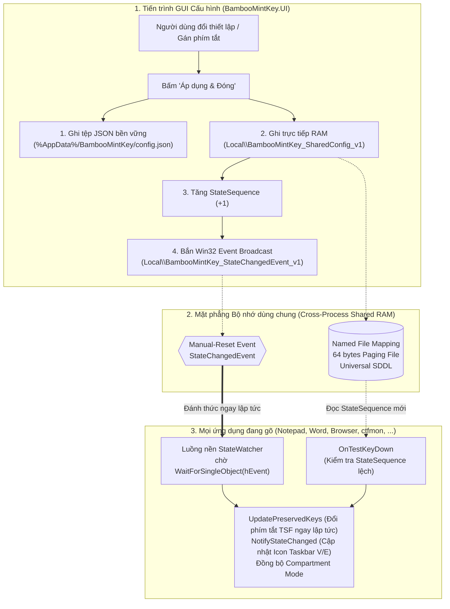
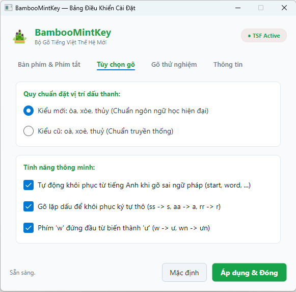
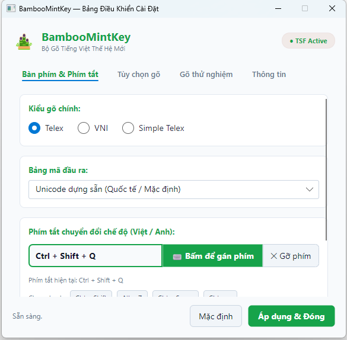

# 003_06_SharedConfiguration_Schema.md

> Tài liệu kỹ thuật đặc tả Schema cấu hình dùng chung (`config.json`), cơ chế đồng bộ lai (Hybrid Synchronization: Shared Memory + Event Broadcast + Persistent JSON File), xử lý phím tắt tự do (Custom Hotkey), và kiến trúc sẵn sàng đa nền tảng (Windows TSF / Linux Fcitx5).

---

## 1. Cơ sở Chuẩn hóa & Phân tích Kiến trúc

### 1.1. Nguyên tắc thiết kế hợp đồng cấu hình (Data Contract)

1. **Phi nền tảng (Platform-Agnostic):** Schema sử dụng chuẩn JSON thuần túy (UTF-8 không BOM), không phụ thuộc vào Windows Registry hay GSettings của Linux, cho phép tái sử dụng 100% khi mở rộng sang Linux (Fcitx5).
2. **Độc lập và an toàn NativeAOT (Zero Third-Party Dependency):** Việc phân tích cú pháp và lưu trữ cấu hình được thiết kế tối giản, không sử dụng reflection hay các thư viện JSON nặng nề của bên thứ ba, đảm bảo biên dịch NativeAOT an toàn và thời gian khởi động tức thì (micro-second).
3. **Bảo toàn dữ liệu & Chống Crash (Fault Tolerance):** Nếu tệp cấu hình bị hỏng cú pháp, thiếu trường dữ liệu hoặc bị người dùng chỉnh sửa tay sai quy cách, hệ thống tự động rơi về giá trị mặc định an toàn (`Fallback Safe Defaults`) mà không bao giờ làm dừng hoặc crash tiến trình gõ phím.
4. **Kiến trúc phân tầng sạch (Clean Architecture):** Tầng tính toán thuật toán lõi (`BambooMintKey.Core`) hoàn toàn thuần túy (Pure Functional Domain), không chứa code I/O hay đọc ghi file. Việc đọc, ghi tệp JSON và nạp vào bộ nhớ dùng chung được đảm nhiệm bởi tầng `BambooMintKey.NativeBridge` (Windows TSF) và `BambooMintKey.UI` (Avalonia).

### 1.2. Vị trí lưu trữ tệp trên từng hệ điều hành

| **Hệ điều hành** | **Đường dẫn lưu trữ tiêu chuẩn** |
| :--- | :--- |
| **Windows** | `%AppData%\BambooMintKey\config.json`<br>*(ví dụ: `C:\Users\<User>\AppData\Roaming\BambooMintKey\config.json`)* |
| **Linux (Fcitx5)** | `$XDG_CONFIG_HOME/bamboomintkey/config.json`<br>*(mặc định: `~/.config/bamboomintkey/config.json`)* |

---

## 2. Đặc tả JSON Schema Chuẩn hóa (`config.json` - Version 2)

Cấu trúc tệp cấu hình thực tế được phiên bản hóa qua trường `"version": 2` nhằm đảm bảo khả năng tương thích ngược và tự động di trú (migration):

```json
{
  "version": 2,
  "inputMethod": 0,
  "charset": 0,
  "toggleHotkey": 0,
  "hotkeyVKey": 16,
  "hotkeyModifiers": 514,
  "toneStyle": 0,
  "autoRestoreEnglishWords": true,
  "allowRepeatKeyUndo": true,
  "allowLeadingWAsU": false,
  "startWithWindows": true,
  "macroEnabled": false,
  "macros": {
    "vn": "Việt Nam",
    "bmk": "BambooMintKey",
    "f#": "F-Sharp"
  }
}
```

### Chi tiết ý nghĩa các trường dữ liệu:

| Tên trường | Kiểu dữ liệu | Giá trị mặc định | Diễn giải kỹ thuật & Ánh xạ bộ nhớ |
| :--- | :--- | :--- | :--- |
| `version` | `int` | `2` | Phiên bản của schema cấu hình. |
| `inputMethod` | `byte (int)` | `0` | **Kiểu gõ:**<br>• `0`: Telex (Mặc định)<br>• `1`: VNI<br>• `2`: Simple Telex |
| `charset` | `byte (int)` | `0` | **Bảng mã ký tự đầu ra:**<br>• `0`: Unicode dựng sẵn (NFC)<br>• `1`: Unicode tổ hợp (NFD)<br>• `2`: TCVN3 (ABC tiêu chuẩn cũ) |
| `toggleHotkey` | `byte (int)` | `0` | **Preset phím tắt nhanh:**<br>• `0`: `Ctrl + Shift`<br>• `1`: `Alt + Z`<br>• `2`: `Ctrl + Space`<br>• `3`: Không dùng<br>• `4`: Phím tùy biến tự do (Custom) |
| `hotkeyVKey` | `uint32` | `16` *(0x10)* | **Win32 Virtual Key code** của phím chính (ví dụ: `16` = Phím `Shift`, `81` = Phím `Q`, `90` = Phím `Z`, `32` = Phím `Space`). Ánh xạ Shared Memory offset 12. |
| `hotkeyModifiers` | `uint32` | `514` *(0x0202)* | **Mã cờ bổ trợ TSF (`TsfModFlags`):**<br>• `0x0001`: Alt<br>• `0x0002`: Control<br>• `0x0004`: Shift<br>• `0x0200`: OnKeyUp (dành cho tổ hợp thuần modifier như Ctrl+Shift)<br>*(Ví dụ: `514` = `0x0202` → `Control \| OnKeyUp` cho `Ctrl + Shift`)*. Ánh xạ Shared Memory offset 16. |
| `toneStyle` | `byte (int)` | `0` | **Quy tắc đặt dấu thanh tiếng Việt:**<br>• `0`: Chuẩn mới / Hiện đại (`òa, úy`)<br>• `1`: Chuẩn cũ / Truyền thống (`oà, uý`) |
| `autoRestoreEnglishWords` | `bool` | `true` | Tự động trả lại từ tiếng Anh nguyên bản khi phát hiện từ gõ sai quy tắc chính tả tiếng Việt. |
| `allowRepeatKeyUndo` | `bool` | `true` | Cho phép gõ lại chính phím dấu vừa gõ để hủy dấu (Undo) (ví dụ: `as` $\rightarrow$ `á`, `ass` $\rightarrow$ `as`). |
| `allowLeadingWAsU` | `bool` | `false` | Cho phép gõ ký tự `w` đơn độc ở đầu từ để sinh ra nguyên âm `ư` (`w` $\rightarrow$ `ư`). |
| `startWithWindows` | `bool` | `true` | Đăng ký chạy GUI cấu hình cùng Windows qua Registry `HKCU\Software\Microsoft\Windows\CurrentVersion\Run`. |
| `macroEnabled` | `bool` | `false` | Bật/tắt tính năng gõ tắt (Macro expansion) *(Dành cho Phase 4)*. |
| `macros` | `object (map)` | `{}` | Bảng tra cứu từ viết tắt và nội dung thay thế *(Dành cho Phase 4)*. |

### Bố cục 64 bytes Shared Memory

| Offset | Trường | Kiểu | Ý nghĩa |
| :--- | :--- | :--- | :--- |
| `[0]` | `IsVietnameseMode` | `byte` | `1` = Tiếng Việt (V), `0` = Tiếng Anh (E). |
| `[1]` | `ToneStyle` | `byte` | `0` = Kiểu mới, `1` = Kiểu cũ. |
| `[2]` | `AutoRestoreEnglishWords` | `byte` | `1` = Bật, `0` = Tắt. |
| `[3]` | `AllowRepeatKeyUndo` | `byte` | `1` = Bật, `0` = Tắt. |
| `[4]` | `AllowLeadingWAsU` | `byte` | `1` = Bật, `0` = Tắt. |
| `[5]` | `InputMethod` | `byte` | `0` = Telex, `1` = VNI, `2` = Simple Telex. |
| `[6]` | `Charset` | `byte` | `0` = Unicode, `1` = Tổ hợp, `2` = TCVN3. |
| `[7]` | `ToggleHotkey` | `byte` | `0` = Ctrl+Shift, `1` = Alt+Z, `2` = Ctrl+Space, `3` = None, `4` = Custom. |
| `[8-11]` | `StateSequence` | `uint32` | Bộ đếm phiên bản trạng thái, tăng khi cấu hình thay đổi. |
| `[12-15]` | `HotkeyVKey` | `uint32` | Win32 Virtual Key code của phím tắt toggle. |
| `[16-19]` | `HotkeyModifiers` | `uint32` | Cờ modifier TSF của phím tắt toggle. |

---

## 3. Cơ chế Đồng bộ Lai (Hybrid Synchronization Architecture)

Trong môi trường Windows, Text Input Processor (TSF TIP) là một **In-Process COM Server** (`BambooMintKey.dll`). Thư viện này được nạp đồng thời vào hàng chục tiến trình người dùng khác nhau (`ctfmon.exe`, `explorer.exe`, `Notepad.exe`, trình duyệt web, Office,...).

Do đó, việc đồng bộ cấu hình giữa **Giao diện Cài đặt (GUI độc lập)** và **Hàng chục tiến trình đang gõ** phải tuân thủ nghiêm ngặt mô hình đồng bộ lai 2 mặt phẳng:



### 3.1. Mặt phẳng Thời gian thực (Real-time In-Memory Plane - Độ trễ 0 microsecond)
- **Shared Memory:** Tạo qua Named File Mapping `Local\BambooMintKey_SharedConfig_v1` (kích thước 64 bytes) backed bởi Windows Paging File.
- **Quyền truy cập toàn cầu (Universal SDDL):** Sử dụng `D:(A;;GA;;;WD)(A;;GA;;;AC)S:(ML;;NW;;;LW)` cho phép tất cả các ứng dụng, bao gồm cả các ứng dụng chạy trong **AppContainer/UWP** (Edge, Chrome Sandbox) đọc/ghi an toàn mà không bị lỗi Access Denied.
- **Kênh kích hoạt tức thì (Dual-Trigger Mechanism):**
  1. **Luồng ngầm `StateWatcher`:** Lắng nghe Win32 Event `Local\BambooMintKey_StateChangedEvent_v1`. Khi GUI lưu cài đặt, event được bật (`SetEvent`), luồng thức giấc và gọi `KeyEventSinkHelper.UpdatePreservedKeys()` để đổi phím tắt trong TSF ngay lập tức.
  2. **Chốt chặn `StateSequence`:** Ngay tại đầu hàm `OnTestKeyDown`, mã nguồn kiểm tra số thứ tự `StateSequence`. Nếu có sự thay đổi, hệ thống đồng bộ cấu hình ngay trên phím bấm đầu tiên, loại bỏ hoàn toàn khả năng sót cập nhật.

### 3.2. Mặt phẳng Bền vững (Persistent Disk Plane)
- Tệp `config.json` lưu giữ trạng thái người dùng xuyên suốt các phiên làm việc và sau khi tắt/mở máy.
- **Tự động nạp khi khởi động:** Khi Windows hoặc `ctfmon` nạp DLL lần đầu, hàm `SharedMemoryManager.LoadInitialConfigFromDisk()` tự động đọc `%AppData%\BambooMintKey\config.json` để điền cấu hình người dùng vào RAM, đảm bảo phím tắt tùy chọn của người dùng có hiệu lực ngay từ giây đầu tiên.

---

## 4. Tại sao loại bỏ `FileSystemWatcher` trong thiết kế này?

Tài liệu thiết kế sơ khai trước đây từng đề xuất dùng `FileSystemWatcher` trên file `config.json`. Tuy nhiên trong triển khai thực tế trên Windows SDK, phương án này đã bị loại bỏ vì các lý do sống còn:
1. **Ô nhiễm tài nguyên hệ thống:** Khi người dùng mở 50 cửa sổ/ứng dụng, sẽ có 50 luồng `FileSystemWatcher` chạy ngầm để canh một file duy nhất, lãng phí IO Handle và ThreadPool.
2. **Xung đột Sandbox AppContainer:** Các ứng dụng sandbox bảo mật cao (như tab duyệt web Edge/Chrome) bị Windows cấm giám sát thư mục cá nhân `%AppData%`, gây sinh lỗi bảo mật hoặc treo tiến trình.
3. **Độ trễ I/O tệp tin:** Đọc ghi tệp tin mất từ 5ms đến 50ms (kèm rủi ro file đang bị tiến trình khác lock). Trong khi đó, Shared Memory đọc ghi trực tiếp trên RAM chỉ mất **0.001ms (0 microsecond)**, đáp ứng tiêu chuẩn xử lý bàn phím tức thời.

---

## 6. Đặc tả Mở rộng cho Phase 4 (Bảng Gõ Tắt / Macro Expansion)

Cấu trúc `macros` trong `config.json` được bảo toàn và định nghĩa sẵn sàng cho Phase 4:

```json
{
  "macroEnabled": true,
  "macros": {
    "vn": "Việt Nam",
    "bmk": "BambooMintKey",
    "f#": "F-Sharp",
    "dc": "được",
    "ko": "không"
  }
}
```

- **Quy tắc gõ tắt:** Khi `macroEnabled = true`, sau khi người dùng gõ từ khóa và bấm phím ngắt từ (`Space`, dấu câu), bộ gõ sẽ tra cứu trong bảng `macros`. Nếu khớp, từ viết tắt sẽ được tự động thay thế bằng chuỗi văn bản mở rộng tương ứng.
- **Giao diện quản lý:** Sẽ được tích hợp thêm một Tab "Bảng gõ tắt" trên Bảng điều khiển (`BambooMintKey.UI`) trong Phase 4 để người dùng thêm/xóa/sửa từ viết tắt trực quan.

---

## 7. Quy trình Kiểm thử & Nghiệm thu (Verification Checklist)

| STT | Kịch bản kiểm thử | Hành động thực hiện | Kết quả kỳ vọng đạt chuẩn |
| :--- | :--- | :--- | :--- |
| **1** | **Khởi tạo tệp cấu hình** | Xóa file `config.json`, bật bộ gõ hoặc mở GUI. | File `config.json` tự động được tái tạo với schema Version 2 hợp lệ. |
| **2** | **Đồng bộ phím tắt 3 - 4 phím** | Trên GUI, gán `Ctrl + Shift + Q`, bấm "Áp dụng & Đóng". | File `config.json` ghi `hotkeyVKey: 81`, `hotkeyModifiers: 6`. Shared Memory cập nhật tức thì. Bấm `Ctrl+Shift+Q` trên Notepad đổi chế độ V/E ngay. |
| **3** | **Chống bắt nhầm phím** | Khi đang cài `Ctrl + Shift + Q`, thử bấm riêng `Ctrl + Shift`. | Bộ gõ **không** được đổi chế độ. Chỉ đổi khi phím `Q` được nhấn cùng với `Ctrl` và `Shift`. |
| **4** | **Lưu bền vững sau Reboot** | Đổi thiết lập dấu thanh truyền thống, khởi động lại `ctfmon`. | Bộ gõ tự động nạp lại đúng chuẩn dấu truyền thống từ file `config.json` mà không bị reset về mặc định. |
| **5** | **Khả năng chịu lỗi (Fault-Tolerance)** | Sửa file `config.json` thành file rỗng hoặc gõ lỗi cú pháp JSON. | Bộ gõ tự động fallback về cấu hình an toàn mặc định (Telex, Unicode dựng sẵn), không phát sinh lỗi unhandled crash. |

---

## 8. Hình ảnh thực tế của GUI Cấu hình

Cấu hình trong `config.json` và Shared Memory được quản lý trực quan qua giao diện `BambooMintKey.UI.exe`:

| Ảnh | Mô tả |
| --- | --- |
|  | Giao diện **Bảng Điều Khiển Cài Đặt** với 4 tab, nơi người dùng thay đổi mọi thiết lập và khi bấm **Áp dụng & Đóng** sẽ ghi đồng thời vào `config.json` và Shared Memory. |
|  | Tab quản lý kiểu gõ, bảng mã và phím tắt tùy chọn, phản ánh trực tiếp các trường `inputMethod`, `charset`, `hotkeyVKey`, `hotkeyModifiers`. |