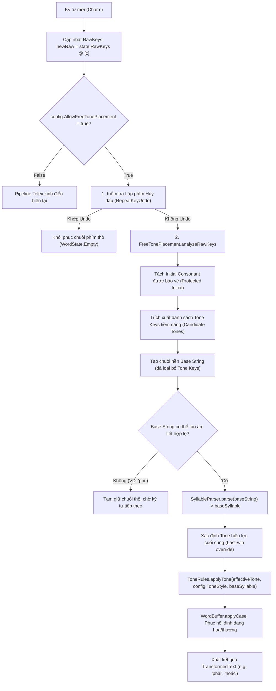

<!--
  BambooMintKey - Vietnamese Telex Input Method Editor for Windows
  Copyright (c) 2026 Dương Gia Long and LMO contributors
  SPDX-License-Identifier: MIT
-->

# Thiết Kế Chi Tiết: Cơ Chế Xử Lý Bỏ Dấu Tự Do (Free Tone Placement Pipeline & Algorithm)

**Mã tài liệu:** `005_00_01`
**Tài liệu cha:** `005_00_Free_Tone_Placement_Design.md`
**Giai đoạn:** Phase 5 - Cải Tiến Trải Nghiệm Gõ
**Trạng thái:** 📝 Đang thiết kế (Design Specification)
**Chế độ triển khai:** Chỉ thiết kế chi tiết thuật toán và kiến trúc, **chưa viết code sản phẩm**.

---

## 1. Hiện Trạng & Bài Toán Kỹ Thuật (Problem Statement & Scope)

### 1.1. Hiện trạng xử lý dấu thanh trong BambooMintKey

Hiện tại, pipeline xử lý phím trong `TelexEngine.fs` vận hành theo mô hình phân mảnh 2 luồng:

1. **Luồng gia tăng (Incremental State):** Khi ký tự mới `c` là phím dấu thanh (`s, f, r, x, j`), engine kiểm tra `state.Syllable`. Nếu đã có `Syllable` trước đó (ví dụ gõ `pha`), engine gọi `ToneRules.applyTone` trực tiếp để tạo ra `phả`.
2. **Luồng phân tích toàn chuỗi (Stateless Parse):** Nếu luồng gia tăng không khớp (hoặc khi gõ tiếp ký tự không phải modifier/phụ âm cuối hợp lệ), engine gộp `RawKeys` thành `rawString` và chuyển sang `SyllableParser.parse`.

### 1.2. Hạn chế cốt lõi gây lỗi gõ

Khi người dùng gõ phím dấu thanh ở các vị trí tự do (không tuân thủ thứ tự Telex kinh điển):

- **Gõ dấu ở cuối từ không có phụ âm cuối (`phari`):**
  - Phím `r` được gõ ngay sau `a` $\rightarrow$ sinh ra `phả`.
  - Phím `i` đến sau $\rightarrow$ `state.Syllable` hiện tại là `{ Initial="ph"; Vowel="ả"; Final="" }`.
  - Engine kiểm tra `i`: không phải phím dấu thanh, không phải modifier (`aweod`), và `i` không thuộc nhóm phụ âm cuối (`cmnpt`).
  - Do đó luồng 3 thất bại $\rightarrow$ chuyển sang luồng 4: `SyllableParser.parse("phari")`.
  - Trong `SyllableParser.parse`, `"phari"` có phụ âm đầu `ph`, phụ âm cuối không có, nguyên âm còn lại là `"ari"`. Ký tự `'r'` không phải là nguyên âm $\rightarrow$ `allVowelsValid = false` $\rightarrow$ Parser trả về `None` $\rightarrow$ Kích hoạt `EnglishWordFallback` $\rightarrow$ Xuất thô `"phari"`.
- **Gõ dấu ở cuối từ có phụ âm cuối (`hoacs` / `toans`):**
  - Người dùng gõ `h-o-a-c-s` hoặc `t-o-a-n-s`. Khi phím `s` đến sau phụ âm cuối `c` hay `n`:
  - `state.Syllable` đã có `FinalConsonant = "c"`. `ToneRules.applyTone` áp dụng dấu vào `hoac` thành `hoác`. Nhưng nếu người dùng gõ `toansf` (đổi dấu) hoặc xóa lùi, `rawString` chứa cả `s` lẫn `f` khiến parser vấp ngã.
- **Gõ dấu trước khi nguyên âm hoàn chỉnh (`phar` + `i`):**
  - Khi gõ `phar`, hệ thống đã gắn dấu hỏi vào `a` (`phả`). Khi nhấn tiếp `i`, engine không có cơ chế "mở lại" cụm nguyên âm để ghép `i` vào `a` thành `ai` rồi tính lại trọng tâm thanh điệu.

---

## 2. Kiến Trúc Pipeline Tổng Thể (Overall Architecture)

Bộ xử lý bỏ dấu tự do (`FreeTonePlacement`) được thiết kế như một **bộ tiền xử lý và chuẩn hóa chuỗi phím (Pre-processing & Normalization Engine)** hoạt động độc lập, không can thiệp thô bạo vào `SyllableParser` hay `ToneRules`.

### 2.1. Sơ đồ khối xử lý (Data Flow Diagram)



---

## 3. Thuật Toán Chi Tiết (Detailed Processing Algorithm)

Toàn bộ logic bỏ dấu tự do được chuẩn hóa qua 5 giai đoạn xử lý kế tiếp nhau:

### 3.1. Giai đoạn 1: Nhận diện & Bảo vệ Phụ âm đầu (Protected Initial Consonant)

Phím dấu thanh (`s, f, r, x, j`) trùng với nhiều phụ âm tiếng Việt (`s, r, x`) hoặc ký tự mượn (`f, j`). Do đó, **tuyệt đối không được coi một ký tự là phím dấu thanh nếu nó thuộc về phụ âm đầu**.

#### Quy tắc phân định:

1. Danh sách phụ âm đầu tiếng Việt hợp lệ được xếp theo thứ tự ưu tiên độ dài giảm dần:
   ```
   "ngh", "ng", "nh", "ch", "gh", "gi", "kh", "ph", "qu", "th", "tr",
   "b", "c", "d", "đ", "g", "h", "k", "l", "m", "n", "p", "r", "s", "t", "v", "x"
   ```
2. Quét chuỗi `rawString`:
   - Nếu chuỗi bắt đầu bằng một phụ âm đầu hợp lệ $C_{init}$ (ví dụ: `r` trong `rung`, `s` trong `sang`, `tr` trong `tro`, `x` trong `xuan`):
     - Vùng chỉ mục từ $0$ đến $|C_{init}| - 1$ được đánh dấu là **Vùng Bất Khả Xâm Phạm (Protected Range)**.
     - Ký tự trong vùng này **không bao giờ** bị coi là tone key.
   - Ngoại lệ đặc biệt:
     - Với `gi`: nếu theo sau là nguyên âm khác `i` (như `gio`, `gia`), `gi` là phụ âm đầu. Nếu theo sau là phụ âm hoặc hết chuỗi thì cần xem xét ngữ cảnh.
     - Với `qu`: `qu` luôn là phụ âm đầu ghép bán âm.

### 3.2. Giai đoạn 2: Bóc tách Tone Candidates & Tách Chuỗi Nền (Base String Isolation)

Sau khi đã cô lập vùng phụ âm đầu được bảo vệ:

1. Duyệt qua các ký tự còn lại từ vị trí $|C_{init}|$ đến cuối chuỗi:
   - Nếu ký tự $c \in \{'s', 'f', 'r', 'x', 'j', 'S', 'F', 'R', 'X', 'J'\}$:
     - Ghi nhận vào danh sách `candidateToneKeys` cùng với vị trí xuất hiện của nó: `(char, index)`.
   - Nếu không thuộc tập trên:
     - Đưa vào danh sách `baseChars`.
2. Tạo chuỗi nền: `baseString = String(baseChars)`.

#### Ví dụ minh họa:

| Chuỗi thô (`rawKeys`) | Phụ âm đầu bảo vệ     | Vùng duyệt còn lại  | Candidate Tone Keys      | Chuỗi nền (`baseString`) |
| :------------------------ | :-------------------------- | :---------------------- | :----------------------- | :--------------------------- |
| `phari`                 | `ph` (index 0..1)         | `ari` (index 2..4)    | `[('r', 3)]`           | `"phai"`                   |
| `hoacs`                 | `h` (index 0)             | `oacs` (index 1..4)   | `[('s', 4)]`           | `"hoac"`                   |
| `sang`                  | `s` (index 0 - bảo vệ!) | `ang` (index 1..3)    | `[]`                   | `"sang"`                   |
| `rung`                  | `r` (index 0 - bảo vệ!) | `ung` (index 1..3)    | `[]`                   | `"rung"`                   |
| `thuyesft`              | `th` (index 0..1)         | `uyesft` (index 2..7) | `[('s', 5); ('f', 6)]` | `"thuyet"`                 |
| `toanfs`                | `t` (index 0)             | `oanfs` (index 1..5)  | `[('f', 4); ('s', 5)]` | `"toan"`                   |

### 3.3. Giai đoạn 3: Phân giải Dấu Thanh & Cơ chế Ghi Đè / Hủy Dấu (Tone Resolution)

#### Quy tắc ưu tiên (Precedence Rules):

1. **Không có Candidate Tone:** Trả về `Tone.None`. Quá trình chuyển tiếp về bộ parse chuẩn.
2. **Có 1 Candidate Tone:**
   - Tra cứu qua bảng `ToneRules.keyToTone(key)`.
3. **Có nhiều Candidate Tone (Ghi đè dấu trên đường gõ):**
   - **Quy tắc Last-Win (Phím cuối cùng quyết định):** Ký tự tone key xuất hiện **muộn nhất** trong chuỗi phím sẽ là dấu thanh thực sự của âm tiết.
   - Ví dụ: `toanfs` $\rightarrow$ phím `s` đến sau `f` $\rightarrow$ Dấu sắc (`Acute`) thay thế dấu huyền (`Grave`) $\rightarrow$ Ra kết quả `toán`.
   - Ví dụ: `thuyesft` $\rightarrow$ phím `f` đến sau `s` $\rightarrow$ Dấu huyền (`Grave`) $\rightarrow$ Ra kết quả `thuỳệt` (hoặc `thuyết` nếu gõ tiếp).
4. **Cơ chế Lặp phím Hủy dấu (Repeat-Key Undo):**
   - Nếu `config.AllowRepeatKeyUndo = true`:
   - Nếu trong `candidateToneKeys` xuất hiện **2 ký tự giống nhau liên tiếp** (ví dụ: `mass`, `daff`, `pharii`, `hoacss`):
     - Đây là hành động người dùng muốn thoát gõ tiếng Việt để lấy từ tiếng Anh / ký tự thô.
     - Bỏ toàn bộ hiệu ứng dấu thanh, trả lại chuỗi phím thô `rawString` ban đầu.
     - Đặt cờ `IsInvalidVietnamese = true`.

### 3.4. Giai đoạn 4: Thẩm định Cấu trúc Âm tiết & Dự phòng Tiếng Anh (Phonotactics Validation & Fallback)

Trước khi gắn dấu vào chuỗi nền `baseString`, cần thẩm định ngữ âm tiếng Việt để tránh biến đổi sai từ tiếng Anh:

1. Đưa `baseString` qua `ModifierRules.resolveInlineModifiers` để giải quyết các modifier gõ nhanh (`uwow`, `uow`, `ee`, `oo`, `dd`, v.v.).
2. Gọi `SyllableParser.parse(baseString)`:
   - **Trường hợp A: Parse thành công thành `baseSyllable`:**
     - Kiểm tra tính hợp lệ của nguyên âm: `baseSyllable.VowelNucleus` phải chứa ít nhất một nguyên âm hợp lệ (`isVowel = true`).
     - Kiểm tra tính hợp lệ của phụ âm cuối: `baseSyllable.FinalConsonant` phải thuộc tập phụ âm cuối tiếng Việt (`c, ch, m, n, ng, nh, p, t` hoặc rỗng).
     - Áp dụng dấu thanh đã phân giải ở Giai đoạn 3 qua `ToneRules.applyTone(resolvedTone, config.ToneStyle, baseSyllable)`.
     - Chuyển `updatedSyllable` thành chuỗi văn bản hoàn chỉnh qua `reconstructSyllableText`.
   - **Trường hợp B: Parse thất bại (Ví dụ: `phr`, `str`, `first`, `sport`):**
     - Ký tự tone key chưa thể kết hợp (như `phr`: người dùng mới gõ phụ âm `ph` và dấu hỏi `r`, chưa gõ nguyên âm `i`).
     - Hoặc đây là từ tiếng Anh chứa các ký tự `s, f, r, x, j` (như `first` $\rightarrow$ base là `fist`? Không hợp lệ).
     - **Quyết định:** Giữ nguyên chuỗi thô `rawString`, hiển thị tạm thời ở dạng `PassThrough`/`Composition` thô, **không cố ép gán dấu**.

### 3.5. Giai đoạn 5: Tái tạo Định dạng Chữ Hoa / Chữ Thường (Case Preservation)

Sử dụng `WordBuffer.detectCase` và `WordBuffer.applyCase` trên chuỗi `newRaw`:

- `phari` $\rightarrow$ Lower $\rightarrow$ `phải`
- `Phari` $\rightarrow$ Title $\rightarrow$ `Phải`
- `PHARI` $\rightarrow$ Upper $\rightarrow$ `PHẢI`
- `pHari` $\rightarrow$ Mixed $\rightarrow$ Bảo tồn trạng thái hoa/thường theo từng vị trí ký tự.

---

## 4. Đặc Tả Thiết Kế Code F# (Detailed Code Specifications)

### 4.1. Mở rộng cấu hình: `EngineConfig.fs`

Bổ sung trường `AllowFreeTonePlacement` vào record `EngineConfig`:

```fsharp
type EngineConfig = {
    IsEnabled: bool
    AutoRestoreEnglishWords: bool
    AllowRepeatKeyUndo: bool
    AllowLeadingWAsU: bool
    ToneStyle: TonePlacementStyle
    /// Cho phép bỏ dấu tự do ở bất kỳ vị trí nào trong từ (Mặc định: true)
    AllowFreeTonePlacement: bool
}
with
    static member Default = {
        IsEnabled = true
        AutoRestoreEnglishWords = true
        AllowRepeatKeyUndo = true
        AllowLeadingWAsU = true
        ToneStyle = TonePlacementStyle.Modern
        AllowFreeTonePlacement = true
    }
```

---

### 4.2. Module mới: `src/BambooMintKey.Core/Engine/FreeTonePlacement.fs`

Module chuyên trách toàn bộ thuật toán bóc tách và tái cấu trúc âm tiết tự do:

```fsharp
// BambooMintKey - Vietnamese Telex Input Method Editor for Windows
// Copyright (c) 2026 Dương Gia Long and LMO contributors
// SPDX-License-Identifier: MIT
namespace BambooMintKey.Core.Engine

open System
open BambooMintKey.Core.Domain.Types
open BambooMintKey.Core.Domain.UnicodeTables

module FreeTonePlacement =

    /// Danh sách phụ âm đầu tiếng Việt xếp theo độ dài giảm dần
    let private validInitials = [
        "ngh"; "ng"; "nh"; "ch"; "gh"; "gi"; "kh"; "ph"; "qu"; "th"; "tr";
        "b"; "c"; "d"; "đ"; "g"; "h"; "k"; "l"; "m"; "n"; "p"; "r"; "s"; "t"; "v"; "x"
    ]

    /// Kiểm tra ký tự có phải là phím gõ dấu thanh Telex hay không
    let isToneKeyChar (c: char) : bool =
        match Char.ToLowerInvariant c with
        | 's' | 'f' | 'r' | 'x' | 'j' -> true
        | _ -> false

    /// Kết quả bóc tách chuỗi thô
    type ExtractionResult = {
        ProtectedInitial: string
        BaseString: string
        CandidateTones: (char * int) list // (ký tự dấu, vị trí index trong raw)
        HasRepeatedToneUndo: bool
    }

    /// Tách phụ âm đầu được bảo vệ và gom các phím dấu thanh tự do
    let extractTokens (rawKeys: char list) : ExtractionResult =
        let rawStr = String(Array.ofList rawKeys)
        let lowerStr = rawStr.ToLowerInvariant()

        // 1. Tìm phụ âm đầu bảo vệ
        let matchedInitial =
            validInitials
            |> List.tryFind (fun init -> lowerStr.StartsWith init)
            |> Option.defaultValue ""

        let initialLen = matchedInitial.Length
        let protectedInit = if initialLen > 0 then rawStr[0 .. initialLen - 1] else ""
        let remainder = rawKeys |> List.skip initialLen

        // 2. Phân loại các ký tự còn lại sau phụ âm đầu
        let mutable baseChars = []
        let mutable candidateTones = []
        let mutable lastToneChar = Option.None
        let mutable hasRepeatUndo = false

        for i, c in remainder |> List.indexed do
            let absIdx = initialLen + i
            let lowerC = Char.ToLowerInvariant c
            if isToneKeyChar lowerC then
                // Kiểm tra undo lặp phím dấu liên tiếp (e.g. ss, ff, rr)
                match lastToneChar with
                | Some prevChar when prevChar = lowerC ->
                    hasRepeatUndo <- true
                | _ -> ()

                lastToneChar <- Some lowerC
                candidateTones <- candidateTones @ [ (c, absIdx) ]
            else
                baseChars <- baseChars @ [ c ]

        let baseStr = protectedInit + String(Array.ofList baseChars)

        {
            ProtectedInitial = protectedInit
            BaseString = baseStr
            CandidateTones = candidateTones
            HasRepeatedToneUndo = hasRepeatUndo
        }

    /// Chuẩn hóa và áp dụng bỏ dấu tự do lên chuỗi phím thô
    let tryNormalizeFreeTone 
        (rawKeys: char list) 
        (toneStyle: TonePlacementStyle) 
        (allowRepeatUndo: bool) 
        : (Syllable * LetterCase) option =

        let extraction = extractTokens rawKeys
      
        // Nếu có lặp phím dấu và cho phép Undo -> Hủy dấu, báo thất bại để engine xuất chuỗi thô
        if allowRepeatUndo && extraction.HasRepeatedToneUndo then
            None
        elif extraction.CandidateTones.IsEmpty then
            // Không có phím dấu tự do nào -> Trả về None để luồng chuẩn xử lý
            None
        else
            // Thử parse chuỗi nền không chứa phím dấu
            match SyllableParser.parse extraction.BaseString with
            | None -> 
                // Chuỗi nền không phải âm tiết tiếng Việt hợp lệ (VD: 'phr' hoặc từ tiếng Anh)
                None
            | Some baseSyllable ->
                // Kiểm tra xem chuỗi nền có thực sự có nguyên âm không
                if String.IsNullOrEmpty baseSyllable.VowelNucleus then
                    None
                else
                    // Lấy phím dấu cuối cùng (Quy tắc Last-Win override)
                    let lastToneKeyChar, _ = extraction.CandidateTones |> List.last
                    let targetTone = ToneRules.keyToTone lastToneKeyChar |> Option.defaultValue Tone.None
                  
                    // Áp dụng dấu thanh lên âm tiết nền
                    let tonedSyllable = ToneRules.applyTone targetTone toneStyle baseSyllable
                    let detectedCase = WordBuffer.detectCase rawKeys
                    Some (tonedSyllable, detectedCase)
```

---

### 4.3. Tích hợp Pipeline vào `TelexEngine.fs`

Cập nhật `TelexEngine.handleCharInput` để ưu tiên bộ tiền xử lý `FreeTonePlacement` trước khi rơi vào Fallback tiếng Anh:

```fsharp
let private handleCharInput (c: char) (state: WordState) (config: EngineConfig) : WordState * EngineAction =
    let lowerChar = Char.ToLowerInvariant c
    let newRaw = state.RawKeys @ [ c ]
    let rawString = String(Array.ofList newRaw)
    let detectedCase = WordBuffer.detectCase newRaw

    let isToneKey = ToneRules.keyToTone c |> Option.isSome
    let isModifierKey = "aweod".Contains lowerChar

    // 1. Kiểm tra lặp phím dấu thanh chuẩn (Undo Tone)
    let isUndoTone =
        config.AllowRepeatKeyUndo && isToneKey && state.Syllable.IsSome &&
        state.Syllable.Value.Tone <> Tone.None &&
        ToneRules.keyToTone c = Some state.Syllable.Value.Tone

    // 2. Kiểm tra lặp phím modifier (Undo Modifier)
    let isUndoModifier =
        config.AllowRepeatKeyUndo && isModifierKey &&
        not (rawString.ToLowerInvariant().Contains "uwow") &&
        (
            (lowerChar = 'd' && state.TransformedText.ToLowerInvariant().Contains "đ") ||
            (lowerChar = 'a' && (state.TransformedText.ToLowerInvariant().Contains "â" || state.TransformedText.ToLowerInvariant().Contains "ă")) ||
            (lowerChar = 'e' && state.TransformedText.ToLowerInvariant().Contains "ê") ||
            (lowerChar = 'o' && (state.TransformedText.ToLowerInvariant().Contains "ô" || state.TransformedText.ToLowerInvariant().Contains "ơ")) ||
            (lowerChar = 'w' && not (state.TransformedText.ToLowerInvariant().Contains "o") && state.TransformedText.ToLowerInvariant().Contains "ư")
        )

    if isUndoTone || isUndoModifier then
        let formatted = WordBuffer.applyCase detectedCase rawString
        let newState = {
            RawKeys = newRaw
            TransformedText = formatted
            Syllable = None
            Case = detectedCase
            IsInvalidVietnamese = true
        }
        (newState, EngineAction.UpdateComposition formatted)

    else
        // 3. Cơ chế Bỏ dấu tự do (Free Tone Placement)
        let freeToneOpt =
            if config.AllowFreeTonePlacement then
                FreeTonePlacement.tryNormalizeFreeTone newRaw config.ToneStyle config.AllowRepeatKeyUndo
            else
                None

        match freeToneOpt with
        | Some (normalizedSyllable, wordCase) ->
            let reconstructed = reconstructSyllableText normalizedSyllable
            let formatted = WordBuffer.applyCase wordCase reconstructed
            let newState = {
                RawKeys = newRaw
                TransformedText = formatted
                Syllable = Some normalizedSyllable
                Case = wordCase
                IsInvalidVietnamese = false
            }
            (newState, EngineAction.UpdateComposition formatted)

        | None ->
            // 4. Luồng xử lý gia tăng truyền thống (Incremental State)
            let modifiedSyllableOpt =
                match state.Syllable with
                | Some currentSyl ->
                    match ToneRules.keyToTone c with
                    | Some tone -> Some (ToneRules.applyTone tone config.ToneStyle currentSyl)
                    | None ->
                        match ModifierRules.applyModifier c currentSyl with
                        | Some s -> Some s
                        | None ->
                            let f = currentSyl.FinalConsonant.ToLowerInvariant()
                            let candFinalOpt =
                                if String.IsNullOrEmpty f && "cmnpt".Contains(string lowerChar) then
                                    Some (string c)
                                elif f = "n" && lowerChar = 'g' then Some "ng"
                                elif f = "c" && lowerChar = 'h' then Some "ch"
                                elif f = "n" && lowerChar = 'h' then Some "nh"
                                else None
                            match candFinalOpt with
                            | Some newF ->
                                let newSyl = { currentSyl with FinalConsonant = newF }
                                Some (ToneRules.applyTone currentSyl.Tone config.ToneStyle newSyl)
                            | None -> None
                | None ->
                    if rawString.ToLowerInvariant() = "dd" then
                        Some {
                            InitialConsonant = if Char.IsUpper(newRaw[0]) then "Đ" else "đ"
                            VowelNucleus = ""
                            FinalConsonant = ""
                            Tone = Tone.None
                            Modifiers = [ ('d', Modifier.DBar) ]
                        }
                    else None

            match modifiedSyllableOpt with
            | Some updatedSyllable ->
                let reconstructed = reconstructSyllableText updatedSyllable
                let formatted = WordBuffer.applyCase detectedCase reconstructed
                let newState = {
                    RawKeys = newRaw
                    TransformedText = formatted
                    Syllable = Some updatedSyllable
                    Case = detectedCase
                    IsInvalidVietnamese = false
                }
                (newState, EngineAction.UpdateComposition formatted)

            | None ->
                // 5. Luồng parse toàn chuỗi (Stateless Parse)
                match SyllableParser.parse rawString with
                | Some parsedSyllable ->
                    let reconstructed = reconstructSyllableText parsedSyllable
                    let formatted = WordBuffer.applyCase detectedCase reconstructed
                    let newState = {
                        RawKeys = newRaw
                        TransformedText = formatted
                        Syllable = Some parsedSyllable
                        Case = detectedCase
                        IsInvalidVietnamese = false
                    }
                    (newState, EngineAction.UpdateComposition formatted)

                | None ->
                    // 6. Fallback tiếng Anh (English Word Fallback)
                    let fallbackText = WordBuffer.applyCase detectedCase rawString
                    let newState = {
                        RawKeys = newRaw
                        TransformedText = fallbackText
                        Syllable = None
                        Case = detectedCase
                        IsInvalidVietnamese = true
                    }
                    (newState, EngineAction.UpdateComposition fallbackText)
```

---

## 5. Xử Lý Các Trường Hợp Biên (Edge Cases & Collision Handling)

| Tình huống biên                                 | Chuỗi phím đầu vào              | Nguy cơ xung đột                                                           | Cách thức giải quyết theo thiết kế chi tiết                                                                                                                                                                                         | Kết quả mong đợi                             |
| :------------------------------------------------- | :----------------------------------- | :---------------------------------------------------------------------------- | :----------------------------------------------------------------------------------------------------------------------------------------------------------------------------------------------------------------------------------------- | :----------------------------------------------- |
| **Phụ âm đầu trùng phím dấu**         | `sang`, `rung`, `xuan`         | Nhầm`s`, `r`, `x` ở đầu từ thành phím dấu                       | Giai đoạn 1 nhận diện`s`, `r`, `x` thuộc `validInitials` $\rightarrow$ Đưa vào vùng bảo vệ $\rightarrow$ Không bóc tách thành Candidate Tone.                                                                   | `sang`, `rung`, `xuân`                    |
| **Phụ âm đầu ghép chứa `r`**         | `tro`, `tri`, `trung`          | Ký tự`'r'` trong `tr` bị bóc tách thành dấu hỏi                   | `tr` được nhận diện là phụ âm đầu 2 ký tự $\rightarrow$ Toàn bộ `tr` nằm trong vùng bảo vệ.                                                                                                                        | `tro`, `trí` (nếu gõ `tris`), `trung` |
| **Gõ dấu trước khi đủ nguyên âm**    | `phar` + `i`                     | Chuỗi`phar` có dấu hỏi trên `a` (`phả`), sau đó gõ thêm `i` | `FreeTonePlacement.extractTokens` lấy chuỗi nền là `phai`, candidate tone là `r`. `SyllableParser.parse("phai")` cho cụm nguyên âm `ai`, dấu hỏi đặt trên `a` (Modern).                                           | `phải`                                        |
| **Gõ nhiều dấu khác nhau (Ghi đè)**    | `toansf`, `pharis`               | Tồn tại đồng thời 2 phím dấu khác nhau trong chuỗi thô              | Quy tắc Last-Win:`toansf` lấy phím cuối là `f` (Huyền) $\rightarrow$ `toàn`. `pharis` lấy phím cuối là `s` (Sắc) $\rightarrow$ `phái`.                                                                        | `toàn`, `phái`                             |
| **Lặp phím hủy dấu khi bỏ dấu tự do** | `pharii`, `hoacss`               | Người dùng gõ lặp phím dấu ở vị trí tự do để hủy dấu           | `hasRepeatUndo = true` $\rightarrow$ `tryNormalizeFreeTone` trả về `None`, engine khôi phục chuỗi thô.                                                                                                                       | `pharii`, `hoacss`                           |
| **Từ tiếng Anh chứa phím dấu**          | `first`, `sport`, `format`     | Ký tự`r`, `s` trong tiếng Anh bị hiểu nhầm là dấu thanh           | `baseString` của `first` tách `r` và `s` thành `"fit"`, nhưng `first` có phụ âm cuối `st` không hợp lệ trong tiếng Việt $\rightarrow$ Parser từ chối $\rightarrow$ Fallback giữ nguyên từ tiếng Anh. | `first`, `sport`, `format`                 |
| **Tổ hợp Inline Modifier + Free Tone**     | `huowngr`, `tieengs`, `tuwowr` | Modifier inline (`uow`, `ee`, `uwow`) kết hợp với dấu ở cuối từ  | `ModifierRules.resolveInlineModifiers` chạy trên `baseString` trước khi parse $\rightarrow$ `huowng` $\rightarrow$ `hương`, sau đó đặt dấu hỏi `r` $\rightarrow$ `hưởng`.                                  | `hưởng`, `tiếng`, `tưở`               |
| **Bảo tồn chữ hoa/thường đa dạng**    | `PHARI`, `Phari`, `pHari`      | Lệch định dạng hoa/thường sau khi tái cấu trúc âm tiết             | `WordBuffer.applyCase detectedCase` giữ nguyên mặt chữ theo `newRaw`.                                                                                                                                                              | `PHẢI`, `Phải`, `pHải`                  |

---

## 6. Ma Trận Kiểm Thử & Kịch Bản Test (Test Matrix Specification)

Khi bước vào giai đoạn cài đặt, bộ test suite `FreeTonePlacementTests.fs` sẽ được bổ sung vào project kiểm thử `BambooMintKey.Core.Tests` với ma trận sau:

### 6.1. Nhóm 1: Bỏ dấu tự do cơ bản (Single Free Tone Key)

| Test ID    | Chuỗi phím (Input) | Kết quả mong đợi (Expected) | Diễn giải quy tắc                                               |
| :--------- | :------------------- | :------------------------------ | :----------------------------------------------------------------- |
| `FTP-01` | `phari`            | `phải`                       | Dấu hỏi`r` gõ ở cuối từ không có phụ âm cuối          |
| `FTP-02` | `phair`            | `phải`                       | Dấu hỏi`r` gõ chuẩn Telex                                    |
| `FTP-03` | `hoacs`            | `hoác`                       | Dấu sắc`s` gõ sau phụ âm cuối `c`                        |
| `FTP-04` | `hoacj`            | `hoặc`                       | Dấu nặng`j` gõ sau phụ âm cuối `c`                       |
| `FTP-05` | `toanfs`           | `toán`                       | Dấu sắc`s` đè lên dấu huyền `f` trước đó            |
| `FTP-06` | `thuyetjs`         | `thuyết`                     | Dấu sắc`s` đè lên dấu nặng `j` sau phụ âm cuối `t` |
| `FTP-07` | `nguoif`           | `người`                     | Dấu huyền`f` sau nguyên âm ghép `uoi`                     |

### 6.2. Nhóm 2: Dấu đến trước nguyên âm hoàn chỉnh (Premature Tone Key)

| Test ID    | Chuỗi phím (Input)                                  | Kết quả mong đợi (Expected) | Diễn giải quy tắc                                                              |
| :--------- | :---------------------------------------------------- | :------------------------------ | :-------------------------------------------------------------------------------- |
| `FTP-08` | `p` + `h` + `a` + `r` + `i`                 | `phải`                       | Sau khi gõ`phar` ra `phả`, gõ tiếp `i` tự hòa quyện thành `phải` |
| `FTP-09` | `t` + `o` + `a` + `s` + `n`                 | `toán`                       | Gõ dấu sắc trước khi gõ phụ âm cuối`n`                                 |
| `FTP-10` | `t` + `u` + `w` + `r` + `o` + `n` + `g` | `tưởng`                     | Dấu hỏi xen kẽ giữa các nguyên âm modifier                                 |

### 6.3. Nhóm 3: Bảo vệ phụ âm đầu & Tránh nhận nhầm từ tiếng Anh

| Test ID    | Chuỗi phím (Input) | Kết quả mong đợi (Expected) | Diễn giải quy tắc                                        |
| :--------- | :------------------- | :------------------------------ | :---------------------------------------------------------- |
| `FTP-11` | `sang`             | `sang`                        | Phụ âm đầu`s` được bảo vệ, không gán dấu sắc |
| `FTP-12` | `rung`             | `rung`                        | Phụ âm đầu`r` được bảo vệ, không gán dấu hỏi |
| `FTP-13` | `xuan`             | `xuân`                       | Phụ âm đầu`x` được bảo vệ, không gán dấu ngã |
| `FTP-14` | `trang`            | `trang`                       | Phụ âm đầu ghép`tr` chứa `r` được bảo vệ     |
| `FTP-15` | `mass`             | `mass`                        | Lặp phím`s` hủy dấu sắc                              |
| `FTP-16` | `first`            | `first`                       | Từ tiếng Anh giữ nguyên, không biến dạng             |

---

## 7. Tiêu Chuẩn Nghiệm Thu (Acceptance Criteria)

Tài liệu thiết kế chi tiết này được nghiệm thu khi thỏa mãn:

1. **Tính hoàn thiện logic:** Phân định rõ ràng ranh giới giữa phụ âm đầu bảo vệ, chuỗi nền, candidate tone keys và quy tắc ưu tiên last-win.
2. **Không phá vỡ kiến trúc cốt lõi:** Giữ nguyên vẹn tính độc lập của `SyllableParser.fs` và `ToneRules.fs`; tích hợp tinh gọn qua module trung gian `FreeTonePlacement.fs`.
3. **Bảo tồn trải nghiệm người dùng:** Hỗ trợ đầy đủ Undo lặp phím (`AllowRepeatKeyUndo`), xóa lùi Backspace Replay, và bảo tồn chữ hoa chữ thường.
4. **Sẵn sàng triển khai:** Khi chuyển sang giai đoạn Coding (Implementation Phase), kỹ sư có thể chuyển hóa 1:1 các hàm F# trong mục 4 mà không phát sinh xung đột kiến trúc.
