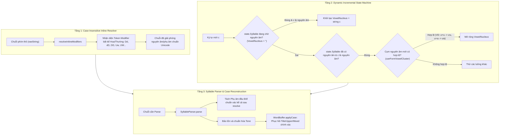
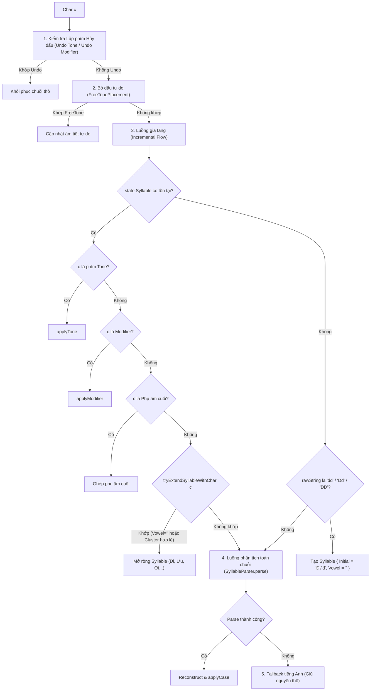

<!--
  BambooMintKey - Vietnamese Telex Input Method Editor for Windows
  Copyright (c) 2026 Dương Gia Long and LMO contributors
  SPDX-License-Identifier: MIT
-->

# Thiết Kế Chi Tiết: Xử Lý Modifier Chữ Hoa Đầu Từ & Mở Rộng Âm Tiết Động (Uppercase Modifier & Dynamic Syllable Expansion Pipeline)

**Mã tài liệu:** `005_01_01`  
**Tài liệu cha:** [005_01_Uppercase_Modifier_Syllable_Design.md](file:///D:/Kojin/BambooMintKey/docs/2.Design/Phase5/005_01_Uppercase_Modifier_Syllable_Design.md)  
**Tài liệu issue gốc:** [002_TypingError_v1.md](file:///D:/Kojin/BambooMintKey/docs/3.Issue/002_TypingError_v1.md)  
**Giai đoạn:** Phase 5 - Cải Tiến Trải Nghiệm Gõ  
**Trạng thái:** 📝 Đang thiết kế (Design Specification)  
**Chế độ triển khai:** Chỉ thiết kế chi tiết thuật toán và kiến trúc, **chưa viết code sản phẩm**.

---

## 1. Hiện Trạng & Tổng Quan Vấn Đề (Problem Statement & Context)

Trong báo cáo lỗi [002_TypingError_v1.md](file:///D:/Kojin/BambooMintKey/docs/3.Issue/002_TypingError_v1.md), người dùng phản ánh hai trường hợp lỗi nghiêm trọng xảy ra trên hầu hết ứng dụng (Notepad, Word, Chrome, Browser...):

1. **Lỗi 2:** Gõ chuỗi phím `Ddi` + Space $\rightarrow$ Mong đợi: `Đi` $\rightarrow$ Thực tế: `Ddi` (Phải lách luật bằng: `Dd` + Space + Backspace + `i`).
2. **Lỗi 3:** Gõ chuỗi phím `Uwu` + Space $\rightarrow$ Mong đợi: `Ưu` $\rightarrow$ Thực tế: `Uwu` (Phải lách luật bằng: `Uw` + Space + Backspace + `u`).

Mở rộng khảo sát ngữ cảnh thực tế cho thấy lỗi này không chỉ giới hạn ở `Ddi` hay `Uwu`, mà xảy ra với **mọi âm tiết tiếng Việt có ký tự đầu viết hoa kết hợp với phím modifier Telex**, bao gồm:
- Các từ bắt đầu bằng `Đ`: `Ddaat` (`Đất`), `Dduong` (`Đương`), `Ddo` (`Đo`), `Ddaau` (`Đâu`), `Ddiem` (`Điểm`)...
- Các từ bắt đầu bằng `Ư`: `Uwa` (`Ưa`), `Uwowsc` (`Ước`), `Uwng` (`Ưng`), `Uwoi` (`Ươi`)...
- Các từ bắt đầu bằng `Ơ`: `Ow` (`Ơ`), `Owi` (`Ơi`), `Owsc` (`Ớc`)...
- Các từ bắt đầu bằng `Ă`, `Â`, `Ê`, `Ô`: `Awn` (`Ăn`), `Aam` (`Âm`), `Eem` (`Êm`), `Oom` (`Ôm`)...
- Chế độ gõ chữ hoa toàn bộ (All Caps): `DDI` $\rightarrow$ `ĐI`, `UWU` $\rightarrow$ `ƯU`, `OWI` $\rightarrow$ `ƠI`...

---

## 2. Phân Tích Cội Rễ Kỹ Thuật (Deep Technical Root Cause Analysis)

Qua rà soát mã nguồn `TelexEngine.fs`, `SyllableParser.fs`, `ModifierRules.fs` và `WordBuffer.fs`, cội rễ vấn đề xuất phát từ **hai khuyết tật kiến trúc đồng thời** trong pipeline xử lý:

```mermaid
flowchart TD
    subgraph K1["Khuyết Tật 1: Case Sensitivity"]
        A1["Chuỗi phím thô: 'Ddi', 'Uwu', 'Owi'"] --> B1["ModifierRules.resolveInlineModifiers"]
        B1 --> C1["Chỉ Replace('dd', 'đ'), Replace('uw', 'ư')..."]
        C1 --> D1["'Ddi' KHÔNG khớp 'dd' -> Trả về nguyên gốc 'Ddi'"]
        D1 --> E1["SyllableParser.parse('Ddi')"]
        E1 --> F1["'d' bị coi là nguyên âm -> allVowelsValid = false -> Parse thất bại!"]
    end

    subgraph K2["Khuyết Tật 2: Lifecycle Âm Tiết Bị Nghẽn"]
        A2["Gõ 'Dd' -> Sinh ra Syllable chỉ có phụ âm: Initial='Đ', Vowel=''"]
        A2 --> B2["Ký tự tiếp theo là nguyên âm 'i' đến"]
        B2 --> C2["Luồng gia tăng chỉ kiểm tra: Tone, Modifier, Phụ âm cuối"]
        C2 --> D2["KHÔNG có nhánh tiếp nhận nguyên âm khi Vowel=''"]
        D2 --> E2["Luồng gia tăng trả về None -> Rơi vào toàn chuỗi -> Vấp phải Khuyết tật 1"]
        E2 --> F2["Fallback tiếng Anh -> Xuất thô 'Ddi'!"]
    end
```



### 2.1. Khuyết tật 1: Nhạy chữ hoa/thường trong `resolveInlineModifiers`

Trong file [ModifierRules.fs](file:///D:/Kojin/BambooMintKey/src/BambooMintKey.Core/Engine/ModifierRules.fs), hàm tiền xử lý chuỗi:
```fsharp
let resolveInlineModifiers (raw: string) : string =
    if String.IsNullOrEmpty raw then raw
    else
        raw
            .Replace("uwow", "ươ")
            .Replace("uow", "ươ")
            .Replace("uwo", "ươ")
            .Replace("ưo", "ươ")
            .Replace("uơ", "ươ")
            .Replace("uw", "ư")
            .Replace("ow", "ơ")
            .Replace("aw", "ă")
            .Replace("aa", "â")
            .Replace("ee", "ê")
            .Replace("oo", "ô")
            .Replace("dd", "đ")
```

**Hậu quả:**
- Phương thức `String.Replace(string, string)` trong .NET mặc định phân biệt hoa thường (`Ordinal`).
- Khi người dùng gõ `Ddi` (chữ `D` hoa, `d` thường), chuỗi `"Ddi"` không chứa `"dd"` viết thường.
- Do đó `resolveInlineModifiers("Ddi")` trả về nguyên vẹn `"Ddi"`.
- Tiếp theo, trong [SyllableParser.fs](file:///D:/Kojin/BambooMintKey/src/BambooMintKey.Core/Engine/SyllableParser.fs):
  - `lower = "ddi"`.
  - Phụ âm đầu trích xuất được là `initial = "d"`.
  - Phần còn lại `afterInitial = "di"`.
  - Phụ âm cuối `final = ""`.
  - Hạt nhân nguyên âm dự kiến `vowelsRaw = "di"`.
  - Kiểm tra `vowelsRaw.ToCharArray() |> Array.forall isVowel`: Ký tự `'d'` không phải nguyên âm tiếng Việt!
  - `allVowelsValid = false` $\rightarrow$ `SyllableParser.parse` trả về `None`.
  - Engine buộc phải rơi vào `EnglishWordFallback` $\rightarrow$ hiển thị `"Ddi"`.

Tương tự với `Uwu`:
- `"Uwu".Replace("uw", "ư")` không khớp vì `U` viết hoa.
- `vowelsRaw = "uwu"`, ký tự `'w'` không phải nguyên âm $\rightarrow$ `parse` trả về `None` $\rightarrow$ hiển thị `"Uwu"`.

### 2.2. Khuyết tật 2: Vòng đời âm tiết phân mảnh trong Luồng gia tăng (Incremental Flow)

Trong [TelexEngine.fs](file:///D:/Kojin/BambooMintKey/src/BambooMintKey.Core/Engine/TelexEngine.fs):
1. **Trạng thái cụt chân (Dead-end Consonant Syllable):**
   Khi người dùng gõ `D` rồi `d`:
   ```fsharp
   if rawString.ToLowerInvariant() = "dd" then
       Some {
           InitialConsonant = if Char.IsUpper(newRaw[0]) then "Đ" else "đ"
           VowelNucleus = ""
           FinalConsonant = ""
           Tone = Tone.None
           Modifiers = [ ('d', Modifier.DBar) ]
       }
   ```
   Âm tiết được tạo ra có `VowelNucleus = ""` (chuỗi rỗng).
2. Khi ký tự tiếp theo là nguyên âm (ví dụ `'i'`):
   Luồng gia tăng chỉ kiểm tra:
   - `ToneRules.keyToTone c` $\rightarrow$ `'i'` không phải dấu thanh.
   - `ModifierRules.applyModifier 'i' currentSyl` $\rightarrow$ Trong `applyModifier`, dòng 43:
     `elif String.IsNullOrEmpty vowels then None` $\rightarrow$ Lập tức trả về `None`!
   - Thử ghép phụ âm cuối $\rightarrow$ `'i'` không thuộc `"cmnpt"` $\rightarrow$ Trả về `None`.
3. Vì luồng gia tăng trả về `None`, engine bắt buộc phải đẩy chuỗi sang `SyllableParser.parse("Ddi")`, và lại bị tắc tử bởi Khuyết tật 1.

### 2.3. Khuyết tật 3: Không cho phép mở rộng cụm nguyên âm sau Modifier đơn

Khi người dùng gõ `Uw` $\rightarrow$ biến thành `Ư` (`VowelNucleus = "ư"`).
Khi gõ tiếp `u` để tạo vần `ưu` trong `Ưu` (hoặc `a` để tạo `ưa` trong `Ưa`):
- `u` không phải phím dấu thanh.
- `u` không phải modifier trong Telex chuẩn (tập modifier gồm `a, w, e, o, d`).
- `ModifierRules.applyModifier 'u'` trả về `None`.
- `u` không phải phụ âm cuối hợp lệ (`c, m, n, p, t...`).
- Luồng gia tăng không hề có cơ chế kiểm tra xem việc thêm `u` vào `VowelNucleus` có tạo thành một **cụm nguyên âm hợp lệ trong tiếng Việt** hay không (`ư` + `u` $\rightarrow$ `ưu`).
- Khi rơi xuống luồng toàn chuỗi, `SyllableParser.parse("Uwu")` thất bại vì Khuyết tật 1.

---

## 3. Kiến Trúc Giải Pháp Toàn Diện (Solution Architecture)

Để giải quyết triệt để và dứt điểm các lỗi trên mà không phá vỡ tính đúng đắn của toàn bộ 150 test case hiện có, kiến trúc giải pháp được thiết kế theo **Mô hình phối hợp 3 tầng (3-Tier Coordinated Architecture)**:



---

## 4. Ngữ Âm Học Tiếng Việt: Bảng Tra Cụm Nguyên Âm Hợp Lệ (Vietnamese Phonotactics & Vowel Clusters)

Một âm tiết tiếng Việt chỉ có thể tiếp nhận thêm nguyên âm nếu cụm nguyên âm mới thuộc tập hợp các **nhị trùng âm (diphthongs)** hoặc **tam trùng âm (triphthongs)** chính quy trong tiếng Việt.

### 4.1. Bảng ma trận mở rộng nguyên âm sau Modifier đơn

| Nguyên âm hiện tại | Ký tự gõ tiếp | Cụm nguyên âm mới | Hợp lệ? | Ví dụ từ tiếng Việt thực tế |
|---|---|---|:---:|---|
| `ư` (từ `uw`/`w`) | `u` | `ưu` | ✅ | `ưu` (ưu tiên, ưng ưu), `mưu`, `hưu`, `cứu` |
| `ư` (từ `uw`/`w`) | `a` | `ưa` | ✅ | `ưa` (chan chứa, ưa chuộng), `mưa`, `cưa` |
| `ư` (từ `uw`/`w`) | `o` / `ơ` | `ươ` | ✅ | `ươn`, `ương`, `ước`, `ướt`, `ươm` |
| `ơ` (từ `ow`/`w`) | `i` | `ơi` | ✅ | `ơi` (nghỉ ngơi, bơi lội), `mời`, `rời` |
| `â` (từ `aa`) | `u` | `âu` | ✅ | `cầu`, `đầu`, `châu`, `bầu` |
| `â` (từ `aa`) | `y` | `ây` | ✅ | `cây`, `mây`, `đây`, `thầy` |
| `ê` (từ `ee`) | `u` | `êu` | ✅ | `kêu`, `đều`, `lều`, `sếu` |
| `ô` (từ `oo`) | `i` | `ôi` | ✅ | `tôi`, `nồi`, `rồi`, `ngôi` |
| `o` | `a` | `oa` | ✅ | `hoa`, `họa`, `toán` |
| `o` | `e` | `oe` | ✅ | `xòe`, `hòe`, `loé` |
| `o` | `i` | `oi` | ✅ | `thoi`, `nói`, `vòi` |
| `u` | `a` | `ua` | ✅ | `mua`, `của`, `lúa` |
| `u` | `i` | `ui` | ✅ | `vui`, `mùi`, `túi` |
| `u` | `y` | `uy` | ✅ | `huy`, `tuy`, `lũy` |
| `i` | `a` | `ia` | ✅ | `chia`, `kia`, `mía` |
| `i` | `u` | `iu` | ✅ | `chịu`, `dịu`, `líu` |

### 4.2. Các cụm bất hợp lệ (Chặn gõ nhầm & Bảo vệ từ tiếng Anh)

Để không biến đổi các từ tiếng Anh thông dụng (như tên riêng `Uwe`, từ `Uwp`, `Ddie`, v.v.), các cụm sau **tuyệt đối bị từ chối**:
- `ư` + `e` $\rightarrow$ `ưe` (Không có trong tiếng Việt $\rightarrow$ Giữ nguyên tiếng Anh `Uwe`).
- `ư` + `i` $\rightarrow$ `ưi` (Không có trong tiếng Việt).
- `ư` + `o` (khi không có modifier `w` tiếp theo để hóa thành `ươ`) $\rightarrow$ Phải đi kèm `w` hoặc phụ âm cuối hợp lệ.
- `ă` + bất kỳ nguyên âm nào $\rightarrow$ `ă` chỉ đi trực tiếp với phụ âm cuối (`ăn`, `ắp`, `ắt`...), không bao giờ đi với nguyên âm khác.

---

## 5. Đặc Tả Thuật Toán Chi Tiết (Detailed Algorithm Specification)

### 5.1. Thuật toán 1: Giải phóng Modifier Không Phân Biệt Hoa Thường (`resolveInlineModifiersCaseInsensitive`)

Trong module `ModifierRules.fs`, nâng cấp hàm `resolveInlineModifiers` để xử lý chuỗi bất kể chữ hoa hay chữ thường, đồng thời **bảo tồn đúng chữ hoa tại vị trí đầu tiên**:

```fsharp
/// Thay thế chuỗi không phân biệt hoa thường, bảo tồn chữ hoa nếu ký tự đầu là chữ hoa
let private replaceCaseInsensitive (target: string) (replacement: string) (input: string) : string =
    if String.IsNullOrEmpty input then input
    else
        let regex = System.Text.RegularExpressions.Regex(target, System.Text.RegularExpressions.RegexOptions.IgnoreCase)
        regex.Replace(input, System.Text.RegularExpressions.MatchEvaluator(fun m ->
            let matchedText = m.Value
            if Char.IsUpper matchedText[0] then
                if matchedText.Length > 1 && Char.IsUpper matchedText[1] then
                    replacement.ToUpperInvariant()
                else
                    // TitleCase: Ký tự đầu hoa, các ký tự sau thường
                    string (Char.ToUpperInvariant replacement[0]) + (if replacement.Length > 1 then replacement[1..] else "")
            else
                replacement.ToLowerInvariant()
        ))

let resolveInlineModifiers (raw: string) : string =
    if String.IsNullOrEmpty raw then raw
    else
        raw
        |> replaceCaseInsensitive "uwow" "ươ"
        |> replaceCaseInsensitive "uow" "ươ"
        |> replaceCaseInsensitive "uwo" "ươ"
        |> replaceCaseInsensitive "ưo" "ươ"
        |> replaceCaseInsensitive "uơ" "ươ"
        |> replaceCaseInsensitive "uw" "ư"
        |> replaceCaseInsensitive "ow" "ơ"
        |> replaceCaseInsensitive "aw" "ă"
        |> replaceCaseInsensitive "aa" "â"
        |> replaceCaseInsensitive "ee" "ê"
        |> replaceCaseInsensitive "oo" "ô"
        |> replaceCaseInsensitive "dd" "đ"
```

#### Kết quả biến đổi tức thì của Thuật toán 1:
- `"Ddi"` $\rightarrow$ Thay thế `"Dd"` bằng `"Đ"` $\rightarrow$ `"Đi"`.
- `"DDI"` $\rightarrow$ Thay thế `"DD"` bằng `"Đ"` $\rightarrow$ `"ĐI"`.
- `"Uwu"` $\rightarrow$ Thay thế `"Uw"` bằng `"Ư"` $\rightarrow$ `"Ưu"`.
- `"UWU"` $\rightarrow$ Thay thế `"UW"` bằng `"Ư"` $\rightarrow$ `"ƯU"`.
- `"Owi"` $\rightarrow$ Thay thế `"Ow"` bằng `"Ơ"` $\rightarrow$ `"Ơi"`.
- `"Awn"` $\rightarrow$ Thay thế `"Aw"` bằng `"Ă"` $\rightarrow$ `"Ăn"`.

### 5.2. Thuật toán 2: Hoàn thiện `SyllableParser.parse` cho Phụ âm đầu `Đ`/`đ`

Trong `SyllableParser.fs`, khi chuỗi đã được resolve thành `"Đi"`:
- `lower = "đi"`.
- Danh sách `initialConsonants` đã chứa `"đ"`.
- `lower.StartsWith("đ")` khớp chính xác $\rightarrow$ `initial = "đ"`.
- `afterInitial = "i"`.
- `final = ""` (vì `afterInitial` không kết thúc bằng phụ âm cuối).
- `vowelsRaw = "i"`.
- `allVowelsValid = true` (vì `'i'` là nguyên âm hợp lệ).
- `InitialConsonant = resolved[0..initial.Length - 1]` $\rightarrow$ `"Đ"`.
- `VowelNucleus = "i"`.
- Trả về `Some { Initial = "Đ"; VowelNucleus = "i"; FinalConsonant = ""; Tone = Tone.None; Modifiers = [] }`.
$\rightarrow$ Toàn chuỗi parse thành công 100%!

### 5.3. Thuật toán 3: Mở rộng Âm tiết Trong Luồng Gia Tăng (`tryExtendSyllableWithChar`)

Để tăng tốc độ gõ (không phải chờ rơi xuống toàn chuỗi) và giữ cho trạng thái `state.Syllable` luôn sống động, luồng gia tăng trong `TelexEngine.fs` được bổ sung hàm `tryExtendSyllableWithChar`:

```fsharp
/// Kiểm tra một chuỗi có phải là cụm nguyên âm tiếng Việt hợp lệ hay không
let isValidVowelCluster (cluster: string) : bool =
    let validClusters = set [
        // Nguyên âm đơn
        "a"; "ă"; "â"; "e"; "ê"; "i"; "o"; "ô"; "ơ"; "u"; "ư"; "y"
        // Nhị trùng âm
        "ai"; "ao"; "au"; "ay"; "âu"; "ây"
        "eo"; "êu"
        "ia"; "iê"; "iu"
        "oa"; "oă"; "oe"; "oi"; "ôi"; "ơi"
        "ua"; "uâ"; "uô"; "uê"; "ui"; "uy"; "uơ"; "ưa"; "ươ"; "ưu"
        "ye"; "yê"
        // Tam trùng âm
        "oai"; "oay"; "oao"; "oeo"
        "uai"; "uay"; "uôi"; "ươi"; "ươu"; "uya"; "uyê"; "uyu"
        "iêu"; "yêu"
    ]
    validClusters.Contains (cluster.ToLowerInvariant())

/// Thử mở rộng Syllable hiện tại khi ký tự mới là nguyên âm
let tryExtendSyllableWithChar (c: char) (syllable: Syllable) : Syllable option =
    let lowerChar = Char.ToLowerInvariant c
    if not (isBaseVowel lowerChar) then None
    else
        let currentVowel = syllable.VowelNucleus
        if String.IsNullOrEmpty currentVowel then
            // Trường hợp 1: Âm tiết chỉ mới có phụ âm đầu (VD: 'Đ' sau khi gõ 'Dd')
            // Khi gõ nguyên âm đầu tiên 'i', khởi tạo VowelNucleus
            Some { syllable with VowelNucleus = string lowerChar }
        else
            // Trường hợp 2: Âm tiết đã có nguyên âm (VD: 'ư' sau khi gõ 'Uw')
            // Thử ghép nguyên âm mới vào cụm nguyên âm
            let candidateCluster = currentVowel.ToLowerInvariant() + string lowerChar
            if isValidVowelCluster candidateCluster then
                // Bảo toàn chữ hoa của nguyên âm đầu nếu có
                let newVowel = 
                    if currentVowel.Length > 0 && Char.IsUpper currentVowel[0] then
                        string (Char.ToUpperInvariant candidateCluster[0]) + candidateCluster[1..]
                    else
                        candidateCluster
                Some { syllable with VowelNucleus = newVowel }
            else
                None
```

### 5.4. Tích hợp Pipeline Xử Lý Trong `TelexEngine.handleCharInput`

Luồng xử lý phím trong `TelexEngine.fs` được điều chỉnh để kích hoạt cơ chế mở rộng này:



### 5.5. Tương Thích Tuyệt Đối Với Undo Lặp Phím (`RepeatKeyUndo`)

Cần đảm bảo việc mở rộng âm tiết không làm hỏng tính năng lặp phím để hủy modifier:
1. Người dùng gõ `D` $\rightarrow$ `d` $\rightarrow$ sinh ra `Đ`.
2. Người dùng gõ thêm `d` $\rightarrow$ chuỗi là `Ddd`.
3. Kiểm tra `isUndoModifier`:
   ```fsharp
   lowerChar = 'd' && state.TransformedText.ToLowerInvariant().Contains "đ"
   ```
   Điều kiện này thỏa mãn 100%!
   $\rightarrow$ Engine lập tức hủy `Đ` và khôi phục chuỗi thô `Ddd`.
4. Người dùng gõ `U` $\rightarrow$ `w` $\rightarrow$ sinh ra `Ư`.
5. Người dùng gõ thêm `w` $\rightarrow$ chuỗi là `Uww`.
   `lowerChar = 'w' && state.TransformedText.ToLowerInvariant().Contains "ư"` thỏa mãn!
   $\rightarrow$ Engine lập tức hủy `Ư` và khôi phục chuỗi thô `Uww`.

---

## 6. Ma Trận Chuyển Đổi Trạng Thái (Step-by-Step State Transition Matrix)

### 6.1. Trường hợp 1: `Ddi` + Space $\rightarrow$ `Đi`

| Bước | Phím nhấn | `RawKeys` | `state.Syllable` trước đó | Xử lý kích hoạt | `state.Syllable` mới | `TransformedText` |
|:---:|:---:|:---|:---|:---|:---|:---:|
| 1 | `D` | `['D']` | `None` | `SyllableParser.parse("D")` $\rightarrow$ `None` | `None` | `"D"` |
| 2 | `d` | `['D'; 'd']` | `None` | Case đặc biệt `"dd"` (TitleCase) | `{ Initial="Đ"; Vowel=""; Final="" }` | `"Đ"` |
| 3 | `i` | `['D'; 'd'; 'i']` | `{ Initial="Đ"; Vowel=""; Final="" }` | `tryExtendSyllableWithChar 'i'` $\rightarrow$ Vowel rỗng nhận `'i'` | `{ Initial="Đ"; Vowel="i"; Final="" }` | `"Đi"` |
| 4 | `Space` | - | `{ Initial="Đ"; Vowel="i"; Final="" }` | `WordBreak(' ')` $\rightarrow$ Chốt từ | `None` (Buffer reset) | Chốt `"Đi "` |

### 6.2. Trường hợp 2: `Uwu` + Space $\rightarrow$ `Ưu`

| Bước | Phím nhấn | `RawKeys` | `state.Syllable` trước đó | Xử lý kích hoạt | `state.Syllable` mới | `TransformedText` |
|:---:|:---:|:---|:---|:---|:---|:---:|
| 1 | `U` | `['U']` | `None` | `SyllableParser.parse("U")` | `{ Initial=""; Vowel="u"; Final="" }` | `"U"` |
| 2 | `w` | `['U'; 'w']` | `{ Initial=""; Vowel="u"; Final="" }` | `applyModifier 'w'` biến `u` $\rightarrow$ `ư` | `{ Initial=""; Vowel="ư"; Final="" }` | `"Ư"` |
| 3 | `u` | `['U'; 'w'; 'u']` | `{ Initial=""; Vowel="ư"; Final="" }` | `tryExtendSyllableWithChar 'u'` $\rightarrow$ Cụm `"ưu"` hợp lệ | `{ Initial=""; Vowel="ưu"; Final="" }` | `"Ưu"` |
| 4 | `Space` | - | `{ Initial=""; Vowel="ưu"; Final="" }` | `WordBreak(' ')` $\rightarrow$ Chốt từ | `None` (Buffer reset) | Chốt `"Ưu "` |

### 6.3. Trường hợp 3: `Owi` + Space $\rightarrow$ `Ơi`

| Bước | Phím nhấn | `RawKeys` | `state.Syllable` trước đó | Xử lý kích hoạt | `state.Syllable` mới | `TransformedText` |
|:---:|:---:|:---|:---|:---|:---|:---:|
| 1 | `O` | `['O']` | `None` | `SyllableParser.parse("O")` | `{ Initial=""; Vowel="o"; Final="" }` | `"O"` |
| 2 | `w` | `['O'; 'w']` | `{ Initial=""; Vowel="o"; Final="" }` | `applyModifier 'w'` biến `o` $\rightarrow$ `ơ` | `{ Initial=""; Vowel="ơ"; Final="" }` | `"Ơ"` |
| 3 | `i` | `['O'; 'w'; 'i']` | `{ Initial=""; Vowel="ơ"; Final="" }` | `tryExtendSyllableWithChar 'i'` $\rightarrow$ Cụm `"ơi"` hợp lệ | `{ Initial=""; Vowel="ơi"; Final="" }` | `"Ơi"` |
| 4 | `Space` | - | `{ Initial=""; Vowel="ơi"; Final="" }` | `WordBreak(' ')` $\rightarrow$ Chốt từ | `None` | Chốt `"Ơi "` |

### 6.4. Trường hợp 4: Kết hợp Bỏ Dấu Tự Do `Ddiemr` $\rightarrow$ `Điểm`

| Bước | Phím nhấn | `RawKeys` | Xử lý kích hoạt | Kết quả trung gian |
|:---:|:---:|:---|:---|:---:|
| 1 | `D` | `['D']` | Fallback tạm | `"D"` |
| 2 | `d` | `['D'; 'd']` | Modifier `Dd` $\rightarrow$ `Đ` | `"Đ"` |
| 3 | `i` | `['D'; 'd'; 'i']` | Mở rộng nguyên âm $\rightarrow$ `i` | `"Đi"` |
| 4 | `e` | `['D'; 'd'; 'i'; 'e']` | Mở rộng cụm nguyên âm $\rightarrow$ `ie` | `"Đie"` |
| 5 | `m` | `['D'; 'd'; 'i'; 'e'; 'm']` | Ghép phụ âm cuối $\rightarrow$ `m` | `"Điem"` |
| 6 | `r` | `['D'; 'd'; 'i'; 'e'; 'm'; 'r']` | **FreeTonePlacement** phát hiện dấu hỏi `r` ở cuối từ $\rightarrow$ Parse nền `"Ddiem"` qua `resolveInlineModifiers` $\rightarrow$ Thành công! Áp dụng dấu hỏi lên `ie` | `"Điểm"` |

### 6.5. Trường hợp 5: Lặp phím hủy biến đổi (Undo) `Ddd` $\rightarrow$ `Ddd` và `Uww` $\rightarrow$ `Uww`

| Chuỗi phím | Phím cuối | Trạng thái hiện tại | Điều kiện Undo kích hoạt | Kết quả xuất ra |
|---|:---:|---|---|:---:|
| `D` + `d` + `d` | `d` | `TransformedText = "Đ"` | `lowerChar = 'd' && contains("đ")` | `"Ddd"` (Hủy `Đ`) |
| `d` + `d` + `d` | `d` | `TransformedText = "đ"` | `lowerChar = 'd' && contains("đ")` | `"ddd"` (Hủy `đ`) |
| `U` + `w` + `w` | `w` | `TransformedText = "Ư"` | `lowerChar = 'w' && contains("ư")` | `"Uww"` (Hủy `Ư`) |
| `O` + `w` + `w` | `w` | `TransformedText = "Ơ"` | `lowerChar = 'w' && contains("ơ")` | `"Oww"` (Hủy `Ơ`) |

---

## 7. Kế Hoạch & Ma Trận Kiểm Thử Chi Tiết (Comprehensive Test Plan & Test Matrix)

Khi chuyển sang giai đoạn code sản phẩm, toàn bộ các test case dưới đây sẽ được hiện thực hóa trong file test mới:  
`tests/BambooMintKey.Core.Tests/UppercaseModifierTests.fs` và tích hợp vào test runner `dotnet test`.

### 7.1. Nhóm 1: Kiểm thử các biến thể của `Dd` (Đầu từ viết hoa / thường / all caps)

| ID | Input | Phím ngắt | Kết quả mong đợi | Mục tiêu kiểm định |
|:---:|---|:---:|:---:|---|
| TC_DD_01 | `"Ddi"` | Space | `"Đi "` | Tái hiện và giải quyết Lỗi 2 gốc |
| TC_DD_02 | `"ddi"` | Space | `"đi "` | Kiểm định chữ thường truyền thống |
| TC_DD_03 | `"DDI"` | Space | `"ĐI "` | Kiểm định All-Caps |
| TC_DD_04 | `"Ddaat"` | Space | `"Đất "` | `Dd` đi với vần có modifier kép (`aa` + `t`) |
| TC_DD_05 | `"Ddo"` | Space | `"Đo "` | `Dd` đi với nguyên âm đơn `o` |
| TC_DD_06 | `"Dduowng"` | Space | `"Đương "` | `Dd` đi với vần phức `ươ` + `ng` |
| TC_DD_07 | `"Ddaau"` | Space | `"Đâu "` | `Dd` đi với nhị trùng âm `âu` |
| TC_DD_08 | `"Ddenr"` | Space | `"Đển "` | `Dd` kết hợp Free Tone ở cuối từ |
| TC_DD_09 | `"Ddd"` | Không | `"Ddd"` | Lặp phím `d` hủy `Đ` thành `Ddd` |
| TC_DD_10 | `"ddd"` | Không | `"ddd"` | Lặp phím `d` thường hủy `đ` thành `ddd` |

### 7.2. Nhóm 2: Kiểm thử các biến thể của `Uw` (Đầu từ viết hoa / thường / all caps)

| ID | Input | Phím ngắt | Kết quả mong đợi | Mục tiêu kiểm định |
|:---:|---|:---:|:---:|---|
| TC_UW_01 | `"Uwu"` | Space | `"Ưu "` | Tái hiện và giải quyết Lỗi 3 gốc |
| TC_UW_02 | `"uwu"` | Space | `"ưu "` | Chữ thường `ưu` |
| TC_UW_03 | `"UWU"` | Space | `"ƯU "` | All-Caps `ƯU` |
| TC_UW_04 | `"Uwa"` | Space | `"Ưa "` | Cụm nguyên âm `ưa` |
| TC_UW_05 | `"Uwng"` | Space | `"Ưng "` | Nguyên âm `ư` đi với phụ âm cuối `ng` |
| TC_UW_06 | `"Uwowsc"` | Space | `"Ước "` | Vần phức `ươ` + `c` + phím sắc |
| TC_UW_07 | `"Uwoi"` | Space | `"Ươi "` | Cụm nguyên âm `ươi` |
| TC_UW_08 | `"Uww"` | Không | `"Uww"` | Lặp phím `w` hủy `Ư` thành `Uww` |
| TC_UW_09 | `"uww"` | Không | `"uww"` | Lặp phím `w` thường hủy `ư` thành `uww` |

### 7.3. Nhóm 3: Kiểm thử các Modifier Chữ Hoa Khác (`Ow`, `Aw`, `Aa`, `Ee`, `Oo`)

| ID | Input | Phím ngắt | Kết quả mong đợi | Mục tiêu kiểm định |
|:---:|---|:---:|:---:|---|
| TC_MOD_01 | `"Owi"` | Space | `"Ơi "` | Mở rộng `Ơ` + `i` $\rightarrow$ `Ơi` |
| TC_MOD_02 | `"OWI"` | Space | `"ƠI "` | All-Caps `ƠI` |
| TC_MOD_03 | `"Owsc"` | Space | `"Ớc "` | `Ơ` + phụ âm `c` + dấu sắc |
| TC_MOD_04 | `"Awn"` | Space | `"Ăn "` | `Ă` + phụ âm cuối `n` |
| TC_MOD_05 | `"AWN"` | Space | `"ĂN "` | All-Caps `ĂN` |
| TC_MOD_06 | `"Aam"` | Space | `"Âm "` | `Â` + phụ âm cuối `m` |
| TC_MOD_07 | `"Eem"` | Space | `"Êm "` | `Ê` + phụ âm cuối `m` |
| TC_MOD_08 | `"Oom"` | Space | `"Ôm "` | `Ô` + phụ âm cuối `m` |
| TC_MOD_09 | `"Oww"` | Không | `"Oww"` | Lặp phím `w` hủy `Ơ` thành `Oww` |

### 7.4. Nhóm 4: Kiểm thử An Toàn Tiếng Anh & Phản Ví Dụ (Negative Tests)

| ID | Input | Phím ngắt | Kết quả mong đợi | Mục tiêu kiểm định |
|:---:|---|:---:|:---:|---|
| TC_ENG_01 | `"Uwe"` | Space | `"Uwe "` | Từ/Tên riêng tiếng Anh không bị biến đổi |
| TC_ENG_02 | `"Uwp"` | Space | `"Uwp "` | Viết tắt tiếng Anh không bị biến đổi |
| TC_ENG_03 | `"Ddie"` | Space | `"Ddie "` | Cụm bất quy tắc không biến thành từ tiếng Việt sai |
| TC_ENG_04 | `"Core"` | Space | `"Core "` | Từ tiếng Anh không bị nhầm thành dấu hỏi (bảo tồn) |

---

## 8. Đánh Giá Tác Động & Kế Hoạch Triển Khai (Impact Analysis & Implementation Steps)

### 8.1. Các tệp mã nguồn sẽ tác động trong giai đoạn triển khai sau:
1. `src/BambooMintKey.Core/Engine/ModifierRules.fs`:
   - Thêm `replaceCaseInsensitive` và nâng cấp `resolveInlineModifiers`.
   - Thêm `isValidVowelCluster` và `tryExtendSyllableWithChar`.
2. `src/BambooMintKey.Core/Engine/SyllableParser.fs`:
   - Đảm bảo trích xuất chính xác `InitialConsonant` là `"Đ"`/`"đ"` khi phân rã âm tiết từ chuỗi đã resolve.
3. `src/BambooMintKey.Core/Engine/TelexEngine.fs`:
   - Tích hợp `tryExtendSyllableWithChar` vào luồng gia tăng `handleCharInput`.
   - Bổ sung chú thích tiếng Việt rõ ràng cho từng bước chuyển đổi trạng thái.
4. `tests/BambooMintKey.Core.Tests/UppercaseModifierTests.fs`:
   - Hiện thực bộ 35+ test case để xác nhận và bảo vệ chống hồi quy.

---

## 9. Lịch Sử Thay Đổi (Document Revision History)

| Ngày | Phiên bản | Tác giả | Tóm tắt thay đổi |
|---|---|---|---|
| 2026-09-08 | `1.0` | Dương Gia Long & LMO contributors | Khởi tạo tài liệu thiết kế chi tiết `005_01_01.md`: Phân tích cội rễ kỹ thuật, kiến trúc 3 tầng, bảng ma trận ngữ âm học, đặc tả 3 thuật toán và kế hoạch kiểm thử toàn diện cho lỗi `Ddi` $\rightarrow$ `Đi` và `Uwu` $\rightarrow$ `Ưu`. |
