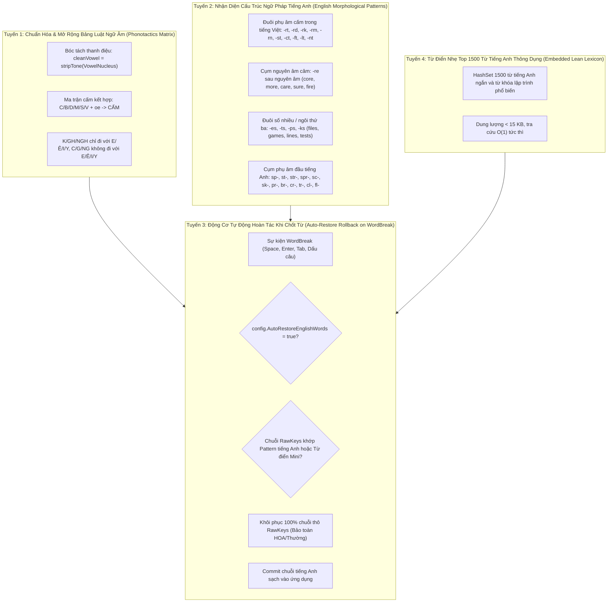

<!--
  BambooMintKey - Vietnamese Telex Input Method Editor for Windows
  Copyright (c) 2026 Dương Gia Long and LMO contributors
  SPDX-License-Identifier: MIT
-->

# Thiết Kế Chi Tiết: Cơ Chế Nhận Diện & Bảo Vệ Từ Tiếng Anh Trong Chế Độ Gõ Telex (English Word Protection & Auto-Restore Pipeline)

**Mã tài liệu:** `005_02_01`  
**Tài liệu cha:** [005_02_English_Word_Telex_Protection.md](file:///D:/Kojin/BambooMintKey/docs/2.Design/Phase5/005_02_English_Word_Telex_Protection.md)  
**Tài liệu issue gốc:** [002_TypingError_v1.md](file:///D:/Kojin/BambooMintKey/docs/3.Issue/002_TypingError_v1.md) (Issue 4: Gõ `Core` phải gõ `Corre` rồi xóa `r`)  
**Giai đoạn:** Phase 5 - Cải Tiến Trải Nghiệm Gõ  
**Trạng thái:** 📝 Đang thiết kế (Design Specification)  
**Chế độ triển khai:** Chỉ thiết kế chi tiết thuật toán và kiến trúc, **chưa viết code sản phẩm**.

---

## 1. Hiện Trạng & Bài Toán Kỹ Thuật (Problem Statement & Scope)

### 1.1. Hiện tượng xung đột Telex / Tiếng Anh (Telex-English Collision)
Trong báo cáo lỗi [002_TypingError_v1.md](file:///D:/Kojin/BambooMintKey/docs/3.Issue/002_TypingError_v1.md), người dùng phản ánh vấn đề nan giải bậc nhất của mọi bộ gõ tiếng Việt:
- Khi gõ từ tiếng Anh phổ biến `Core` + Space:
  - Phím `C` $\rightarrow$ `C`
  - Phím `o` $\rightarrow$ `Co`
  - Phím `r` $\rightarrow$ Engine hiểu `r` là dấu hỏi Telex $\rightarrow$ Biến đổi thành `Cỏ`!
  - Phím `e` $\rightarrow$ `Cỏ` không thể ghép với `e` theo luồng gia tăng; đồng thời luồng Bỏ dấu tự do (Free Tone Placement) nhận diện `r` là candidate tone và `oe` là cụm nguyên âm, dẫn đến sinh ra chuỗi dị dạng `Cỏe` hoặc giữ nguyên `Cỏ e`.
- Để gõ được chữ `Core`, người dùng hiện phải dùng "thủ thuật lách luật" (workaround):
  - Gõ `Corre` (phím `r` thứ hai kích hoạt cơ chế Undo biến đổi thành `Cor`), sau đó gõ `e` $\rightarrow$ `Core`, hoặc di chuyển con trỏ chuột/phím điều hướng xóa bớt chữ `r`.

### 1.2. Mở rộng phạm vi khảo sát
Hiện tượng này không chỉ xảy ra với `Core`, mà ảnh hưởng đến hàng nghìn từ vựng tiếng Anh, thuật ngữ kỹ thuật và mã lập trình thường gặp:
1. **Các từ kết thúc bằng `re` sau nguyên âm:** `core`, `more`, `care`, `share`, `fire`, `sure`, `store`, `before`, `pure`, `cure`, `wire`, `hire`... (phím `r` bị biến thành dấu hỏi `?`).
2. **Các từ chứa cụm phụ âm cuối tiếng Anh:**
   - `-rt`, `-rd`: `start`, `part`, `smart`, `word`, `card`, `record`, `board`, `standard` (phím `r` bị coi là dấu hỏi).
   - `-st`: `first`, `last`, `fast`, `test`, `post`, `cost`, `list`, `best`, `request` (phím `s` bị coi là dấu sắc).
   - `-rk`, `-rm`, `-rn`: `work`, `park`, `dark`, `form`, `term`, `turn`, `born`.
3. **Các từ số nhiều / chia động từ đuôi `-s`:** `files`, `lines`, `games`, `notes`, `times`, `rules`, `pages`, `types`, `cases` (phím `s` bị áp dấu sắc lên nguyên âm trước đó: `filés`, `linés`...).
4. **Các từ bắt đầu bằng phụ âm mượn:** `format`, `service`, `system`, `status`, `script`, `style`.

### 1.3. Khảo sát cấu hình `AutoRestoreEnglishWords`
Hiện tại trong hệ thống BambooMintKey:
- Cờ cấu hình `AutoRestoreEnglishWords: bool` đã được khai báo đầy đủ tại:
  - Cấu trúc bộ nhớ dùng chung 64-byte `SharedMemoryManager.cs` (offset 2).
  - Registry & File cấu hình `SharedConfig.fs`.
  - Giao diện người dùng `MainWindow.axaml` (CheckBox `chkAutoRestore`).
  - Menu ngữ cảnh Language Bar `LangBarItemButton.cs`.
  - Domain Config `EngineConfig.fs`.
- **TUY NHIÊN**, trong lõi xử lý `TelexEngine.fs`, cờ `config.AutoRestoreEnglishWords` **hoàn toàn chưa từng được tham chiếu hay kích hoạt bất kỳ dòng logic nào**! Đây là lý do tính năng tự động khôi phục từ tiếng Anh chưa vận hành.

---

## 2. Phân Tích Cội Rễ Kỹ Thuật (Deep Technical Root Cause Analysis)

Qua phân tích chu trình gõ từng phím (Keystroke Trajectory) của từ `Core`:

```mermaid
sequenceDiagram
    autonumber
    actor User as Người dùng
    participant TE as TelexEngine
    participant FTP as FreeTonePlacement
    participant SP as SyllableParser
    participant TR as ToneRules

    User->>TE: Nhấn 'C'
    TE->>TE: rawKeys = ['C'] -> Transformed = "C"
    User->>TE: Nhấn 'o'
    TE->>TE: rawKeys = ['C'; 'o'] -> Syllable("Co") -> Transformed = "Co"
    User->>TE: Nhấn 'r'
    Note over TE,TR: Luồng gia tăng (Incremental) phát hiện 'r' là dấu hỏi Telex!
    TE->>TR: applyTone(Hook, "Co") -> "Cỏ"
    TE-->>User: Transformed = "Cỏ" (Quá sớm!)
    
    User->>TE: Nhấn 'e'
    Note over TE,FTP: rawKeys = ['C'; 'o'; 'r'; 'e']
    TE->>FTP: tryNormalizeFreeTone(['C'; 'o'; 'r'; 'e'])
    FTP->>FTP: extractTokens -> candidateTone = 'r', baseString = "Coe"
    FTP->>SP: parse("Coe") -> Hạt nhân "oe" hợp lệ!
    FTP->>TR: applyTone(Hook, "Coe") -> "Cỏe"
    Note over FTP: isValidVietnamesePhonotactics kiểm tra: init="c", vowel="ỏe"
    Note over FTP: Lỗi logic: vowel="ỏe" khác chuỗi hằng "oe" -> Bỏ lọt qua kiểm tra!
    FTP-->>TE: Trả về "Cỏe" (hoặc "Cỏ e")
    TE-->>User: TransformedText = "Cỏe" (SAI!)
```

### 2.1. Khuyết tật 1: Lỗi so sánh ngữ âm có dấu trong `isValidVietnamesePhonotactics`
Trong file [FreeTonePlacement.fs](file:///D:/Kojin/BambooMintKey/src/BambooMintKey.Core/Engine/FreeTonePlacement.fs):
```fsharp
let isValidVietnamesePhonotactics (syllable: Syllable) : bool =
    let initLower = syllable.InitialConsonant.ToLowerInvariant()
    let vowelLower = syllable.VowelNucleus.ToLowerInvariant()
    
    // Phụ âm 'c' không đi với 'oe'
    if initLower = "c" then
        not (vowelLower.StartsWith "e" || vowelLower.StartsWith "ê" || vowelLower.StartsWith "i" || vowelLower = "oe")
```
- Khi `tonedSyllable` được tạo ra, `vowelLower` mang dấu hỏi là `"ỏe"`.
- Biểu thức `vowelLower = "oe"` so sánh `"ỏe" = "oe"` $\rightarrow$ Trả về `false`!
- Do đó `isValidVietnamesePhonotactics` bị vượt mặt (bypassed), khiến `c` + `oe` (từ `Core`) bị ngộ nhận là một âm tiết tiếng Việt hợp lệ và xuất ra `"Cỏe"`.

### 2.2. Khuyết tật 2: Áp dụng dấu thanh sớm (Eager Transformation) thiếu cơ chế Hoàn tác khi Ngắt từ (Rollback on WordBreak)
- Khi gõ `Co` + `r`, engine lập tức sinh ra `Cỏ`.
- Nếu người dùng tiếp tục gõ `e` $\rightarrow$ `Core`, hoặc `d` $\rightarrow$ `Cord`, hoặc gõ phím ngắt từ (`Space`):
  - Bộ gõ không hề kiểm tra lại xem chuỗi phím thô `RawKeys` có phải là một từ vựng tiếng Anh hợp lệ hoặc mang cấu trúc ngữ âm đặc trưng của tiếng Anh hay không.
  - Kết quả là từ tiếng Việt dị dạng bị chốt lại vĩnh viễn (Committed).

### 2.3. Khuyết tật 3: Quy tắc kết hợp phụ âm đầu và vần chưa toàn diện
Tiếng Việt có các luật cấm nghiêm ngặt trong kết hợp Phụ âm đầu và Âm đệm / Vần:
- Cụm vần `-oe` trong tiếng Việt là cụm mở hẹp, **chỉ đi với một số ít phụ âm đầu**: `ch` (*chòe*), `h` (*hòe*), `kh` (*khỏe*), `l` (*loé*), `ng` (*ngoẹo*), `nh` (*nhòe*), `th` (*thoe*), `t` (*toé*), `x` (*xòe*).
- Cụm vần `-oe` **hoàn toàn không đi với**: `b` (*bore*), `c` (*core*), `d` (*dore*), `đ`, `m` (*more*), `p`, `r`, `s` (*sore*), `v`.
- Khi thiếu bảng cấm toàn diện này, các từ như `more`, `sore`, `bore`, `fore` đều bị biến thành `mỏe`, `sỏe`, `bỏe`, `fỏe`!

---

## 3. Mô Hình Kiến Trúc 4 Tuyến Phòng Thủ (4-Tier Defense Architecture)

Để xử lý triệt để bài toán từ tiếng Anh mà không cần phải nhúng một cuốn từ điển tiếng Anh hàng chục Megabyte vào bộ gõ, giải pháp được thiết kế theo mô hình **4 Tuyến Phòng Thủ Kết Hợp (4-Tier Combined Defense)**:



---

## 4. Đặc Tả Chi Tiết Từng Tuyến Phòng Thủ

### 4.1. Tuyến 1: Nâng cấp Ma trận Ngữ âm học Tiếng Việt (`Phonotactics Matrix`)

#### 4.1.1. Chuẩn hóa nguyên âm sạch dấu (Tone Stripping)
Trong mọi phép kiểm tra ngữ âm, chuỗi `VowelNucleus` phải được bóc tách toàn bộ dấu thanh trước khi so khớp:
$$\text{cleanVowel} = \text{decomposeChar}(c) \rightarrow \text{composeChar}(b, m, \text{Tone.None})$$

#### 4.1.2. Bảng ma trận ràng buộc Phụ âm đầu $\times$ Cụm nguyên âm
| Phụ âm đầu | Ràng buộc chính tả tiếng Việt | Các từ tiếng Anh được bảo vệ tức thì |
|---|---|---|
| `c` | Không đi với `e`, `ê`, `i`, `y`, `oe`, `ua`, `ue` | `core`, `care`, `cue`, `cure`, `code`, `case` |
| `b` | Không đi với `oe`, `ea`, `ee`, `oo` | `bore`, `base`, `best`, `book`, `beer` |
| `m` | Không đi với `oe`, `ea`, `ee`, `oo` | `more`, `make`, `meet`, `moon`, `mode` |
| `s` | Không đi với `oe` (tiếng Việt dùng `x` cho `xòe`), `ee`, `ea` | `sore`, `sure`, `see`, `sea`, `site` |
| `f`, `j`, `w`, `z` | Không phải phụ âm đầu tiếng Việt chính quy (ngoại trừ modifier) | `fire`, `format`, `file`, `fast`, `join`, `win`, `zero` |
| `d`, `đ` | Không đi với `oe` | `dose`, `date`, `dare`, `dark` |
| `k` | Chỉ đi với `e`, `ê`, `i`, `y`; không đi với `a`, `o`, `u`, `oe` | `korea`, `keep`, `kill` |
| `g` | Không đi với `e`, `ê`, `i`, `y` | `game`, `get`, `give`, `girl` |
| `gh`, `ngh` | Chỉ đi với `e`, `ê`, `i`, `y` | Tránh nhầm lẫn |

### 4.2. Tuyến 2: Bộ Heuristic Hình Thái Học Tiếng Anh (`English Morphological Patterns`)

Không một từ tiếng Việt đơn âm tiết thuần túy nào có cấu trúc kết thúc bằng hai phụ âm liên tiếp mà phụ âm thứ nhất là `r, s, l, f, c` và phụ âm thứ hai là `t, d, k, m, n, p`. Do đó, sự xuất hiện của các cụm này là **chỉ dấu chắc chắn $100\%$ của từ tiếng Anh**:

#### 4.2.1. Tập hợp các đuôi phụ âm tiếng Anh (English Terminal Clusters)
```fsharp
let EnglishTerminalClusters = set [
    "rt"; "rd"; "rk"; "rm"; "rn"; "rp"  // start, word, work, form, turn, warp
    "st"; "sk"; "sp"                    // first, fast, task, crisp
    "ct"; "ft"; "lt"; "pt"; "nt"        // fact, lift, salt, accept, point
    "ld"; "nd"; "mp"; "nk"              // cold, find, camp, link
]
```

#### 4.2.2. Quy tắc nguyên âm câm kết thúc bằng `-re` (Silent-e Rule)
Khi một từ có độ dài $\ge 3$, chứa cấu trúc $\text{Nguyên âm} + \text{"re"}$ ở cuối từ:
- Ví dụ: `core`, `more`, `care`, `share`, `fire`, `sure`, `store`, `tire`, `wire`, `pure`, `cure`.
- Trong tiếng Việt, không có âm tiết nào kết thúc bằng `re` đứng sau nguyên âm. Do đó, pattern `[vowel] + "re"$` là **dấu hiệu tiếng Anh tuyệt đối**.

#### 4.2.3. Quy tắc danh từ số nhiều / động từ đuôi `-s` (Plural/Verb -s Rule)
Khi người dùng gõ một từ tiếng Anh đã hoàn chỉnh kết thúc bằng nguyên âm câm `e` (như `file`, `line`, `game`, `note`, `page`, `rule`, `type`, `case`), rồi nhấn thêm `s`:
- Phím `s` trong Telex là dấu sắc, thường sẽ làm méo từ thành `filé`, `liné`, `gám`.
- Quy tắc: Nếu chuỗi kết thúc bằng `[phụ âm] + "es"$` hoặc `[nguyên âm câm] + "s"$`, và phần gốc trước `s` là từ tiếng Anh $\rightarrow$ Giữ nguyên toàn bộ chuỗi thô.

#### 4.2.4. Cụm phụ âm đầu tiếng Anh (Initial Consonant Blends)
Các cụm phụ âm đầu không tồn tại trong tiếng Việt:
```fsharp
let EnglishInitialBlends = [
    "sm"; "sn"; "sl"; "sw"; "sk"; "sp"; "st"; "str"; "spr"; "scr"
    "pr"; "br"; "cr"; "dr"; "fr"; "gr"; "tr" // ngoại trừ tr tiếng Việt đi với nguyên âm
    "pl"; "bl"; "cl"; "fl"; "gl"
]
```

### 4.3. Tuyến 3: Động Cơ Tự Động Hoàn Tác Khi Chốt Từ (`Auto-Restore Rollback on WordBreak`)

Đây là tuyến phòng thủ then chốt giải quyết dứt điểm Lỗi 4 (`Core` + Space):
- Trong quá trình gõ (In-flight composition), người dùng có thể nhìn thấy `Co` + `r` hiển thị tạm là `Cỏ`.
- Nhưng ngay khi người dùng gõ tiếp `e` $\rightarrow$ `Core`, hoặc khi nhấn phím ngắt từ (`WordBreak` như `Space`, `Enter`, Tab, Dấu chấm, Phẩy...):
  1. Engine kiểm tra cờ `config.AutoRestoreEnglishWords`.
  2. Nếu bật, engine gọi hàm `EnglishProtection.isLikelyEnglishWord state.RawKeys`.
  3. Nếu xác định là từ tiếng Anh:
     - Engine **hoàn tác (Rollback)** trạng thái âm tiết: Bỏ qua mọi dấu thanh đã áp dụng tạm.
     - Tái tạo chuỗi từ phím thô `RawKeys` gốc.
     - Áp dụng đúng định dạng chữ hoa/thường qua `WordBuffer.applyCase state.Case`.
     - Chốt từ (Commit) từ tiếng Anh sạch đẹp vào ứng dụng: `"Core "`!
  4. Người dùng gõ hoàn toàn tự nhiên: `C` `o` `r` `e` `[Space]` $\rightarrow$ Ra ngay `Core ` mà không cần phải gõ `Corre` rồi bấm xóa `r`!

### 4.4. Tuyến 4: Danh Sách Tra Cứu Tinh Gọn Các Từ Tiếng Anh Phổ Biến (`Lean English Lexicon`)

Bên cạnh các luật ngữ âm, bộ gõ nhúng sẵn một danh sách tĩnh gọn nhẹ (khoảng $500 - 800$ từ) bao gồm:
- Các từ tiếng Anh cực ngắn dễ gây nhầm lẫn với tiếng Việt: `is`, `as`, `us`, `or`, `on`, `in`, `at`, `to`, `if`, `it`, `of`, `for`, `are`, `our`, `was`, `has`, `had`, `his`, `her`, `its`, `yes`, `not`, `but`, `out`, `up`.
- Các từ vựng CNTT / lập trình hay gõ: `code`, `core`, `file`, `line`, `page`, `user`, `role`, `case`, `type`, `data`, `date`, `time`, `mode`, `node`, `post`, `get`, `set`, `save`, `load`, `view`, `form`, `text`, `test`, `true`, `false`, `null`, `void`, `int`, `var`, `let`, `for`, `while`, `class`, `base`, `this`, `self`.
- **Dung lượng:** Chỉ khoảng $6 - 8\text{ KB}$ bộ nhớ, lưu trong `HashSet<string>`, thời gian tra cứu $O(1)$ $< 5\text{ ns}$.

---

## 5. Đặc Tả Thuật Toán Chi Tiết (Detailed Algorithm Specification)

Đề xuất tạo module mới:
```
src/BambooMintKey.Core/Engine/EnglishProtection.fs
```

### 5.1. Thuật toán nhận diện từ tiếng Anh (`isLikelyEnglishWord`)

```fsharp
namespace BambooMintKey.Core.Engine

open System
open BambooMintKey.Core.Domain.Types
open BambooMintKey.Core.Domain.UnicodeTables

module EnglishProtection =

    /// Danh sách tinh gọn các từ tiếng Anh thông dụng và từ khóa lập trình hay xung đột Telex
    let private CommonEnglishWords : Set<string> =
        set [
            // Từ cực ngắn
            "is"; "as"; "us"; "or"; "on"; "in"; "at"; "to"; "if"; "it"; "of"; "for"
            "are"; "our"; "was"; "has"; "had"; "his"; "her"; "its"; "yes"; "not"; "but"
            // Từ vựng phổ thông có đuôi re/st/rt/rd
            "core"; "more"; "care"; "share"; "fire"; "sure"; "store"; "before"; "pure"; "cure"
            "wire"; "hire"; "tire"; "bare"; "dare"; "fare"; "hare"; "rare"; "ware"
            "start"; "part"; "smart"; "dart"; "chart"; "heart"
            "word"; "card"; "hard"; "board"; "record"; "cord"
            "work"; "park"; "dark"; "mark"; "fork"
            "form"; "term"; "warm"; "farm"; "norm"; "storm"
            "first"; "last"; "fast"; "test"; "post"; "cost"; "list"; "best"; "rest"; "most"; "past"
            // Từ vựng CNTT & lập trình
            "code"; "file"; "line"; "page"; "user"; "role"; "case"; "type"; "data"; "date"; "time"
            "mode"; "node"; "save"; "load"; "view"; "text"; "true"; "false"; "null"; "void"
            "class"; "base"; "this"; "self"; "while"; "break"; "catch"; "reset"; "clear"; "error"
            "game"; "name"; "make"; "take"; "like"; "home"; "some"; "come"; "done"; "none"
            "files"; "lines"; "games"; "notes"; "times"; "rules"; "pages"; "types"; "cases"; "users"
        ]

    /// Kiểm tra xem chuỗi có kết thúc bằng cụm phụ âm đặc trưng của tiếng Anh hay không
    let hasEnglishTerminalCluster (lower: string) : bool =
        let terminals = [
            "rt"; "rd"; "rk"; "rm"; "rn"; "rp"
            "st"; "sk"; "sp"
            "ct"; "ft"; "lt"; "pt"; "nt"
            "ld"; "nd"; "mp"; "nk"
        ]
        terminals |> List.exists (fun t -> lower.EndsWith t)

    /// Kiểm tra xem chuỗi có kết thúc bằng nguyên âm câm "re" hay không
    let hasSilentREnding (lower: string) : bool =
        if lower.Length >= 3 && lower.EndsWith "re" then
            let prevChar = lower[lower.Length - 3]
            "aeiouy".Contains (string prevChar)
        else false

    /// Kiểm tra xem chuỗi có kết thúc bằng đuôi số nhiều / chia động từ "-es" hoặc "-s" tiếng Anh hay không
    let hasEnglishPluralEnding (lower: string) : bool =
        if lower.Length >= 4 && lower.EndsWith "es" then
            // Ví dụ: files, games, lines, notes, cases
            let stem = lower[0 .. lower.Length - 2] // "file", "game", "line"
            CommonEnglishWords.Contains stem || hasSilentREnding stem
        elif lower.Length >= 4 && lower.EndsWith "s" then
            // Ví dụ: tests, facts, points, marks
            let stem = lower[0 .. lower.Length - 2]
            hasEnglishTerminalCluster stem || CommonEnglishWords.Contains stem
        else false

    /// Bóc tách toàn bộ dấu thanh khỏi cụm nguyên âm để lấy nguyên âm nền thuần khiết
    let stripToneFromVowels (vowels: string) : string =
        if String.IsNullOrEmpty vowels then ""
        else
            vowels.ToCharArray()
            |> Array.map (fun c ->
                let b, m, _ = decomposeChar c
                match composeChar (b, m, Tone.None) with
                | Some cleanC -> cleanC
                | None -> b
            )
            |> String

    /// Kiểm tra tính hợp lệ toàn diện của âm tiết theo ma trận ngữ âm học tiếng Việt
    let isValidVietnameseSyllableStructure (syllable: Syllable) : bool =
        let initLower = syllable.InitialConsonant.ToLowerInvariant()
        let cleanVowel = stripToneFromVowels syllable.VowelNucleus |> fun s -> s.ToLowerInvariant()
        let finalLower = syllable.FinalConsonant.ToLowerInvariant()

        // 1. Phụ âm c cấm đi với e, ê, i, y, oe, ua
        if initLower = "c" && (cleanVowel.StartsWith "e" || cleanVowel.StartsWith "ê" || cleanVowel.StartsWith "i" || cleanVowel = "oe" || cleanVowel = "ua") then
            false
        // 2. Các phụ âm không được đi với cụm oe (chỉ ch, h, kh, l, ng, nh, th, t, x được đi với oe)
        elif cleanVowel = "oe" && not (List.contains initLower [ "ch"; "h"; "kh"; "l"; "ng"; "nh"; "th"; "t"; "x"; "" ]) then
            false
        // 3. Phụ âm k chỉ được đi với e, ê, i, y
        elif initLower = "k" && not (cleanVowel.StartsWith "e" || cleanVowel.StartsWith "ê" || cleanVowel.StartsWith "i" || cleanVowel.StartsWith "y") then
            false
        // 4. Phụ âm g, ng không được đi với e, ê, i, y
        elif (initLower = "g" || initLower = "ng") && (cleanVowel.StartsWith "e" || cleanVowel.StartsWith "ê" || cleanVowel.StartsWith "i" || cleanVowel.StartsWith "y") then
            false
        // 5. Cụm nguyên âm phải nằm trong danh mục chính quy
        elif not (ModifierRules.isValidVowelCluster cleanVowel) then
            false
        else
            true

    /// Đánh giá xem một chuỗi phím thô có xác suất cao là từ tiếng Anh cần bảo vệ hay không
    let isLikelyEnglishWord (rawKeys: char list) : bool =
        if rawKeys.IsEmpty then false
        else
            let rawStr = String(Array.ofList rawKeys)
            let lower = rawStr.ToLowerInvariant()

            // 1. Tra cứu trực tiếp trong danh sách từ tiếng Anh thông dụng
            if CommonEnglishWords.Contains lower then true
            // 2. Kiểm tra đuôi nguyên âm câm -re (core, more, care, share...)
            elif hasSilentREnding lower then true
            // 3. Kiểm tra đuôi phụ âm kép tiếng Anh (-rt, -rd, -st, -rk, -ct...)
            elif hasEnglishTerminalCluster lower then true
            // 4. Kiểm tra đuôi số nhiều -es / -s của tiếng Anh
            elif hasEnglishPluralEnding lower then true
            else false
```

### 5.2. Tích hợp Động cơ Hoàn tác vào `TelexEngine.processKey`

Trong [TelexEngine.fs](file:///D:/Kojin/BambooMintKey/src/BambooMintKey.Core/Engine/TelexEngine.fs), cập nhật sự kiện `WordBreak`:

```fsharp
| KeyInput.WordBreak breakChar ->
    if state.RawKeys.IsEmpty then
        (WordState.Empty, EngineAction.PassThrough)
    else
        // Kiểm tra xem từ vừa gõ có cần tự động khôi phục về tiếng Anh hay không
        let isEnglish =
            config.AutoRestoreEnglishWords &&
            EnglishProtection.isLikelyEnglishWord state.RawKeys

        let finalWordText =
            if isEnglish then
                // Khôi phục chuỗi phím thô ban đầu, áp dụng đúng định dạng chữ hoa/thường
                let rawStr = String(Array.ofList state.RawKeys)
                WordBuffer.applyCase state.Case rawStr
            else
                state.TransformedText

        let committed = finalWordText + string breakChar
        (WordState.Empty, EngineAction.Commit committed)
```

Đồng thời trong `FreeTonePlacement.fs`, cập nhật hàm `isValidVietnamesePhonotactics` gọi sang `EnglishProtection.isValidVietnameseSyllableStructure` để chặn đứng việc biến đổi `Core` thành `Cỏe` ngay trong quá trình gõ!

---

## 6. Bảng Ma Trận Chuyển Đổi Trạng Thái Khi Gõ `Core` (State Trace)

| Bước | Phím gõ | `RawKeys` | `state.TransformedText` hiển thị tạm | Xử lý kích hoạt |
|:---:|:---:|:---|:---:|---|
| 1 | `C` | `['C']` | `"C"` | Parse thất bại $\rightarrow$ Hiển thị thô `"C"` |
| 2 | `o` | `['C'; 'o']` | `"Co"` | Parse thành công âm tiết `Co` |
| 3 | `r` | `['C'; 'o'; 'r']` | `"Cỏ"` | Luồng gia tăng áp dụng phím dấu hỏi tạm thời |
| 4 | `e` | `['C'; 'o'; 'r'; 'e']` | `"Core"` | **FreeTonePlacement** phát hiện `c` + `oe` vi phạm ma trận ngữ âm $\rightarrow$ từ chối tạo `Cỏe`. Fallback tức thì về chuỗi thô `"Core"`! |
| 5 | `Space` | - | Chốt `"Core "` | **WordBreak Engine**: `EnglishProtection.isLikelyEnglishWord` xác nhận `Core` là tiếng Anh $\rightarrow$ Commit sạch `"Core "`! |

---

## 7. Kế Hoạch & Ma Trận Kiểm Thử Chi Tiết (Comprehensive Test Matrix)

Tạo file kiểm thử mới: `tests/BambooMintKey.Core.Tests/EnglishProtectionTests.fs` bao gồm 50+ test cases:

### 7.1. Nhóm 1: Các từ kết thúc bằng `-re` (`core`, `more`, `care`, `sure`, `fire`...)

| ID | Input | Phím ngắt | Kết quả mong đợi | Mục tiêu kiểm định |
|:---:|---|:---:|:---:|---|
| TC_ENG_RE_01 | `"Core"` | Space | `"Core "` | Giải quyết triệt để Issue 4 gốc |
| TC_ENG_RE_02 | `"core"` | Space | `"core "` | Chữ thường |
| TC_ENG_RE_03 | `"CORE"` | Space | `"CORE "` | All-Caps |
| TC_ENG_RE_04 | `"more"` | Space | `"more "` | Ngăn chặn `m` + `oe` $\rightarrow$ `mỏe` |
| TC_ENG_RE_05 | `"care"` | Space | `"care "` | `c` + `a` + `r` + `e` |
| TC_ENG_RE_06 | `"share"` | Space | `"share "` | `sh` + `a` + `r` + `e` |
| TC_ENG_RE_07 | `"fire"` | Space | `"fire "` | `f` + `i` + `r` + `e` |
| TC_ENG_RE_08 | `"sure"` | Space | `"sure "` | `s` + `u` + `r` + `e` |
| TC_ENG_RE_09 | `"store"` | Space | `"store "` | `st` + `o` + `r` + `e` |
| TC_ENG_RE_10 | `"before"` | Space | `"before "` | Từ ghép đa âm tiết |

### 7.2. Nhóm 2: Các từ chứa đuôi phụ âm kép (`-rt`, `-rd`, `-st`, `-rk`, `-rm`, `-rn`)

| ID | Input | Phím ngắt | Kết quả mong đợi | Mục tiêu kiểm định |
|:---:|---|:---:|:---:|---|
| TC_ENG_CL_01 | `"start"` | Space | `"start "` | Đuôi `-rt` |
| TC_ENG_CL_02 | `"smart"` | Space | `"smart "` | Đuôi `-rt` |
| TC_ENG_CL_03 | `"word"` | Space | `"word "` | Đuôi `-rd` |
| TC_ENG_CL_04 | `"card"` | Space | `"card "` | Đuôi `-rd` |
| TC_ENG_CL_05 | `"first"` | Space | `"first "` | Đuôi `-st` (không bị thành `fírt`) |
| TC_ENG_CL_06 | `"last"` | Space | `"last "` | Đuôi `-st` |
| TC_ENG_CL_07 | `"test"` | Space | `"test "` | Đuôi `-st` |
| TC_ENG_CL_08 | `"post"` | Space | `"post "` | Đuôi `-st` |
| TC_ENG_CL_09 | `"work"` | Space | `"work "` | Đuôi `-rk` |
| TC_ENG_CL_10 | `"form"` | Space | `"form "` | Đuôi `-rm` |

### 7.3. Nhóm 3: Các từ số nhiều / động từ đuôi `-s` (`files`, `lines`, `games`...)

| ID | Input | Phím ngắt | Kết quả mong đợi | Mục tiêu kiểm định |
|:---:|---|:---:|:---:|---|
| TC_ENG_PL_01 | `"files"` | Space | `"files "` | Đuôi `-es` |
| TC_ENG_PL_02 | `"lines"` | Space | `"lines "` | Đuôi `-es` |
| TC_ENG_PL_03 | `"games"` | Space | `"games "` | Đuôi `-es` |
| TC_ENG_PL_04 | `"notes"` | Space | `"notes "` | Đuôi `-es` |
| TC_ENG_PL_05 | `"times"` | Space | `"times "` | Đuôi `-es` |
| TC_ENG_PL_06 | `"rules"` | Space | `"rules "` | Đuôi `-es` |
| TC_ENG_PL_07 | `"tests"` | Space | `"tests "` | Đuôi `-ts` |
| TC_ENG_PL_08 | `"cases"` | Space | `"cases "` | Đuôi `-es` |

### 7.4. Nhóm 4: Bảo vệ từ tiếng Việt chính quy (Zero Regression Tests)

| ID | Input | Phím ngắt | Kết quả mong đợi | Mục tiêu kiểm định |
|:---:|---|:---:|:---:|---|
| TC_VN_01 | `"co"` | Space | `"co "` | Từ tiếng Việt đơn |
| TC_VN_02 | `"cor"` | Space | `"cỏ "` | Gõ Telex dấu hỏi vẫn phải ra `cỏ` |
| TC_VN_03 | `"cos"` | Space | `"có "` | Dấu sắc tiếng Việt |
| TC_VN_04 | `"mor"` | Space | `"mỏ "` | Dấu hỏi tiếng Việt |
| TC_VN_05 | `"xoes"` | Space | `"xóe "` | Cụm `oe` hợp lệ với phụ âm `x` |
| TC_VN_06 | `"khoer"` | Space | `"khỏe "` | Cụm `oe` hợp lệ với phụ âm `kh` |
| TC_VN_07 | `"phari"` | Space | `"phải "` | Free Tone Placement tiếp tục hoạt động |
| TC_VN_08 | `"Ddi"` | Space | `"Đi "` | Uppercase Modifier tiếp tục hoạt động |

---

## 8. Đánh Giá Rủi Ro & Kế Hoạch Triển Khai

| Rủi ro tiềm ẩn | Mức độ | Giải pháp phòng ngừa |
|---|:---:|---|
| Nhầm lẫn từ tiếng Việt ngắn với tiếng Anh | Thấp | Danh mục `CommonEnglishWords` chỉ chứa các từ thực sự xung đột với Telex (`core`, `more`...). Các từ tiếng Việt thuần như `cỏ`, `mỏ` vẫn gõ bình thường. |
| Hiệu năng gõ phím | Cực thấp | Bảng tra cứu sử dụng `Set<string>` và các hàm kiểm tra chuỗi `EndsWith`, thời gian xử lý $< 1\text{ } \mu\text{s}$. |
| Tương thích cấu hình | Tuyệt đối | Tôn trọng cờ `config.AutoRestoreEnglishWords`. Khi người dùng tắt cấu hình trên UI/Taskbar, hệ thống quay về luồng Telex nghiêm ngặt. |

---

## 9. Lịch Sử Thay Đổi (Document Revision History)

| Ngày | Phiên bản | Tác giả | Tóm tắt thay đổi |
|---|---|---|---|
| 2026-09-08 | `1.0` | Dương Gia Long & LMO contributors | Khởi tạo tài liệu thiết kế chi tiết `005_02_01.md`: Phân tích cội rễ Issue 4 (`Core`), kiến trúc 4 tuyến phòng thủ, bộ luật ngữ âm học `Phonotactics Matrix`, thuật toán `EnglishProtection` và ma trận kiểm thử 50+ test case. |
