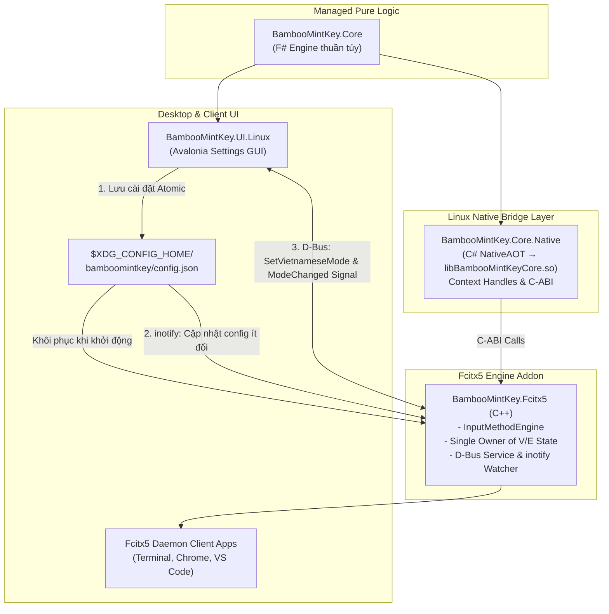

<!--
  BambooMintKey - Vietnamese Telex Input Method Editor
  Copyright (c) 2026 Dương Gia Long and LMO contributors
  SPDX-License-Identifier: MIT
-->

# 007_002 — Lộ Trình Triển Khai Nền Tảng Linux & Fcitx5 (Roadmap)

**Mã tài liệu:** `007_002_Roadmap`  
**Giai đoạn:** Phase 7 — Chuẩn bị và Triển khai nền tảng Linux / Fcitx5  
**Thuộc module:** Toàn bộ solution `BambooMintKey`  
**Trạng thái:** 📋 Đã phê duyệt kế hoạch  
**Tài liệu tham chiếu:** [007_01_InvestigationForLinux.md](file:///home/lmo1720/Fcitx-Bamboo-Mint/BambooMintKey/docs/2.Design/Phase7/007_01_InvestigationForLinux.md)

---

## 1. Mục Tiêu Cốt Lõi của Phase 7

1. **Đưa trải nghiệm BambooMintKey lên Linux**: Mang bộ gõ tiếng Việt Telex sử dụng lõi chức năng F# sang môi trường Linux, tích hợp sâu vào framework nhập liệu phổ biến và mạnh mẽ nhất hiện nay là **Fcitx5**.
2. **Nguyên tắc bất biến — Bảo toàn 100% bản Windows**: Toàn bộ source code phục vụ bản Windows (`BambooMintKey.Core`, `BambooMintKey.NativeBridge`, `BambooMintKey.UI`, `BambooMintKey.DevHarness`) được **giữ nguyên vẹn, không chỉnh sửa**. Tất cả các thành phần dành cho Linux đều được **tạo mới** thành các project độc lập.
3. **Hiệu năng Native tối đa**: Tận dụng công nghệ **.NET 10 NativeAOT** để biên dịch lõi bộ gõ thành thư viện C-ABI chia sẻ (`libBambooMintKeyCore.so`) siêu nhẹ, không cần nạp toàn bộ .NET runtime cồng kềnh, độ trễ xử lý phím cực thấp.
4. **Kiến trúc Context Đa Tiến Trình Chuẩn Xác**: Thiết kế C-ABI theo mô hình **Context Handle** riêng biệt cho từng `InputContext` của Fcitx5, ngăn chặn triệt để hiện tượng lẫn lộn bộ đệm gõ giữa các cửa sổ ứng dụng (Terminal, Browser, IDE...).
5. **Cơ Chế Đồng Bộ 3 Kênh Chuyên Biệt (Tránh Lệch Pha V/E)**:
   - **D-Bus**: Điều khiển real-time hai chiều cho trạng thái gõ **V/E** (Fcitx5 Addon là single-owner, phát tín hiệu `ModeChanged` signal; UI lắng nghe cập nhật ngay lập tức).
   - **File Watcher (`inotify`)**: Đồng bộ các thiết lập ít thay đổi (kiểu đặt dấu, bảng mã, cờ khôi phục tiếng Anh...).
   - **JSON (`config.json`)**: Đảm bảo tính lưu trữ bền vững (Persistence) theo chuẩn FreeDesktop XDG.
6. **Thiết Kế Chi Tiết & Kiểm Thử Nghiêm Ngặt**: Mọi module phải có tài liệu thiết kế kỹ thuật (Design Spec) và ma trận kiểm thử (Test Matrix) rõ ràng trước khi viết code.

---

## 2. Kiến Trúc Phân Tách & Cấu Trúc Thư Mục Mới

```
BambooMintKey/
├── src/
│   ├── BambooMintKey.Core/                 # [F#] Engine Telex thuần — GIỮ NGUYÊN
│   ├── BambooMintKey.Shared/               # [F#] Thư viện dự phòng — GIỮ NGUYÊN
│   ├── BambooMintKey.NativeBridge/         # [C#] Windows TSF NativeAOT — GIỮ NGUYÊN
│   ├── BambooMintKey.UI/                   # [Avalonia/F#] Settings Windows — GIỮ NGUYÊN
│   ├── BambooMintKey.DevHarness/           # [C#] Windows Test Harness — GIỮ NGUYÊN
│   │
│   ├── BambooMintKey.Core.Native/          # [C#] NativeAOT C-ABI Wrapper (.so)   ← [MỚI - M1]
│   ├── BambooMintKey.Fcitx5/               # [C++] Fcitx5 Engine Addon (CMake)    ← [MỚI - M2]
│   └── BambooMintKey.UI.Linux/             # [Avalonia/F#] Settings GUI cho Linux  ← [MỚI - M3]
├── docs/
│   └── 2.Design/Phase7/                    # Tài liệu kỹ thuật Phase 7
│       ├── 007_01_InvestigationForLinux.md # Điều tra khả thi
│       ├── 007_002_Roadmap.md              # Lộ trình tổng thể
│       ├── 007_03_CoreNative_CABI_Design.md# Thiết kế C-ABI & Context Handles
│       ├── 007_04_Fcitx5_Addon_Design.md   # Thiết kế Fcitx5 Addon & D-Bus V/E
│       ├── 007_05_UILinux_Design.md        # Thiết kế UI Avalonia Linux & XDG
│       └── 007_06_E2E_TestPlan_and_Delivery.md # Kế hoạch test E2E & cài đặt
└── scripts/
    └── install_linux.sh                    # Script build & cài đặt cho Linux     ← [MỚI - M4]
```

### Sơ đồ phụ thuộc & luồng đồng bộ 3 kênh:



---

## 3. Lộ Trình Triển Khai Chi Tiết (Milestones)

| Milestone | Tên Hạng Mục | Mục Tiêu Kỹ Thuật Chính | Output Dự Kiến | Trạng Thái |
|:---:|---|---|---|:---:|
| **M0** | **Tài Liệu Thiết Kế & Test Matrix** | Soạn thảo 4 tài liệu thiết kế kỹ thuật chi tiết (`007_03` đến `007_06`) | 4 file Design Specs + Test Matrix | 🛠️ Đang thực hiện |
| **M1** | **`BambooMintKey.Core.Native`** | Cầu nối C# NativeAOT C-ABI, xuất thư viện `.so` quản lý Context Handles | `libBambooMintKeyCore.so` + Test C C-ABI | ⏳ Sẵn sàng thực hiện |
| **M2** | **`BambooMintKey.Fcitx5` Addon** | C++ Fcitx5 Addon triển khai `InputMethodEngine`, D-Bus service và file watcher | `bamboomintkey-fcitx5.so` + metadata addon | ⏳ Kế hoạch |
| **M3** | **`BambooMintKey.UI.Linux`** | Giao diện cài đặt Avalonia Linux native, D-Bus client, đọc/ghi XDG `config.json` | Binary `BambooMintKey.UI.Linux` + `.desktop` | ⏳ Kế hoạch |
| **M4** | **Kiểm Thử E2E & Đóng Gói** | Kiểm thử gõ thực tế trên Wayland/X11, script cài đặt tự động | `install_linux.sh`, gói cài đặt `.deb`/tarball | ⏳ Kế hoạch |

---

## 4. Kế Hoạch Thực Hiện Từng Milestone

### 🔹 Milestone 0: Hoàn Thiện Các Tài Liệu Thiết Kế Kỹ Thuật & Test Matrix

Trước khi code bất kỳ dòng nào, hoàn thiện 4 tài liệu đặc tả kỹ thuật:
1. **`007_03_CoreNative_CABI_Design.md`**: Thiết kế C-ABI functions, cấu trúc `EngineContext`, memory ownership, ma trận kiểm thử unit test C-ABI (`TC-CABI-01` đến `TC-CABI-07`).
2. **`007_04_Fcitx5_Addon_Design.md`**: Thiết kế addon C++, pipeline phím `keyEvent`, Preedit UI, D-Bus Service (`org.fcitx.Fcitx5.BambooMintKey`), File Watcher (`inotify`), ma trận kiểm thử (`TC-FCITX-01` đến `TC-FCITX-06`).
3. **`007_05_UILinux_Design.md`**: Thiết kế Avalonia UI Linux, XDG atomic write, D-Bus client bắt signal `ModeChanged`, Single Instance qua Unix Domain Socket / `flock`, ma trận test GUI (`TC-UI-01` đến `TC-UI-05`).
4. **`007_06_E2E_TestPlan_and_Delivery.md`**: Ma trận kiểm thử tương thích Wayland vs X11, test gõ trên các ứng dụng GTK/Qt/Chromium, kịch bản script `install_linux.sh` và `uninstall_linux.sh`.

---

### 🔹 Milestone 1: Xây Dựng `BambooMintKey.Core.Native` (C# NativeAOT C-ABI)

* **Mục đích:** Đóng gói engine F# vào một thư viện chia sẻ Linux ELF C gốc (`libBambooMintKeyCore.so`) với giao diện lập trình C-ABI chuẩn mực, an toàn bộ nhớ.
* **Tại sao chọn C# làm lớp vỏ AOT:** 
  - F# compiler hiện tại đưa ra cảnh báo `warning FS0202: This attribute is currently unsupported by the F# compiler` khi áp dụng `[<UnmanagedCallersOnly>]` trên module `let`.
  - C# NativeAOT hỗ trợ chuẩn 100% `[UnmanagedCallersOnly]`, dễ dàng kiểm soát con trỏ (`byte*`, `IntPtr`), mã hóa chuỗi UTF-8, calling convention `cdecl`.

#### Các công việc chi tiết:
1. **Khởi tạo Project**:
   - Tạo `src/BambooMintKey.Core.Native/BambooMintKey.Core.Native.csproj`.
   - Cấu hình Target `net10.0`, `PublishAot=true`, `NativeLib=Shared`, `AllowUnsafeBlocks=true`, AssemblyName `BambooMintKeyCore`.
   - Tham chiếu `BambooMintKey.Core.fsproj`.
2. **Thiết kế Đối tượng Context (`EngineContext`)**:
   - Lưu trữ `WordState` của F# riêng cho từng context.
   - Lưu trữ `EngineConfig` cấu hình gõ.
   - Khởi tạo bộ đệm byte UTF-8 nội bộ (`PreeditBuffer`, `CommitBuffer`) để cấp phát chuỗi an toàn, không bị giải phóng ngoài ý muốn.
3. **Cài đặt các API Export `[UnmanagedCallersOnly]`**:
   - `IntPtr bmk_context_create()`: Khởi tạo và cấp phát context, trả về handle con trỏ.
   - `void bmk_context_free(IntPtr handle)`: Giải phóng context khi cửa sổ/input đóng.
   - `void bmk_context_reset(IntPtr handle)`: Reset `WordState` về rỗng (khi mất focus hoặc huỷ composition).
   - `int bmk_process_key(IntPtr handle, uint keyval, uint state, char unicodeChar)`: Xử lý ký tự.
   - `int bmk_process_backspace(IntPtr handle)`: Xử lý phím xóa lùi.
   - `int bmk_process_wordbreak(IntPtr handle, char breakChar)`: Xử lý phím cách, enter, dấu câu.
   - `byte* bmk_get_preedit_text(IntPtr handle)`: Trả về con trỏ chuỗi UTF-8 preedit (caller không cần `free`).
   - `byte* bmk_get_commit_text(IntPtr handle)`: Trả về con trỏ chuỗi UTF-8 commit.
   - `void bmk_set_config(IntPtr handle, ...)`: Cập nhật cờ cấu hình cho context.
4. **Kiểm thử độc lập C-ABI**:
   - Viết test runner độc lập kiểm chứng `libBambooMintKeyCore.so` gõ chuẩn các từ (`tiếng`, `việt`, `đường`, `hoà`, `hòa`, từ tiếng Anh, xóa lùi) và kiểm tra memory leak qua 10.000 lượt tạo/hủy context.

---

### 🔹 Milestone 2: Phát Triển `BambooMintKey.Fcitx5` Addon (C++/CMake)

* **Mục đích:** Tạo plugin engine cho Fcitx5 đón nhận sự kiện bàn phím từ hệ điều hành, giao tiếp với `libBambooMintKeyCore.so`, xuất D-Bus service và lắng nghe file cấu hình.
* **Kế thừa kinh nghiệm:** Tận dụng tối đa cấu trúc plugin đã được kiểm chứng từ dự án `fcitx5-bamboo`.

#### Các công việc chi tiết:
1. **Thiết lập Dự án CMake & Metadata**:
   - Tạo thư mục `src/BambooMintKey.Fcitx5/` kèm `CMakeLists.txt`.
   - Tìm kiếm các gói thư viện Fcitx5: `Fcitx5Core`, `Fcitx5Config`, `Fcitx5Utils`.
   - Tạo `bamboomintkey-addon.conf.in` và `bamboomintkey.conf.in`.
2. **Triển khai `BambooMintKeyState : fcitx::InputContextProperty`**:
   - Gắn một `handle` của `bmk_context_create()` vào mỗi instance `InputContextProperty`.
   - Gọi `bmk_context_free(handle)` trong destructor để dọn dẹp sạch sẽ bộ nhớ context.
3. **Xử lý Sự kiện Phím (`keyEvent`)**:
   - Bỏ qua sự kiện nhả phím (`keyEvent.isRelease()`).
   - Bỏ qua các tổ hợp phím điều khiển hệ thống (`Ctrl`, `Alt`, `Super`) để cho phép phím tắt (`PassThrough`).
   - Điều phối phím sang `bmk_process_backspace`, `bmk_process_wordbreak` hoặc `bmk_process_key`.
   - Cập nhật giao diện: `filterAndAccept()`, `setPreedit()` (gạch chân), `commitString()`.
4. **Triển Khai D-Bus Service (Real-time V/E State)**:
   - Đăng ký D-Bus service name: `org.fcitx.Fcitx5.BambooMintKey`.
   - Xuất method `SetVietnameseMode(bool enabled)`: UI gọi method này để toggle V/E.
   - Xuất method `GetVietnameseMode() -> bool`.
   - Phát signal `ModeChanged(bool isVietnamese)`: Mỗi khi chế độ V/E thay đổi (do phím tắt hoặc do UI), Addon phát signal này cho toàn hệ thống.
5. **Đồng Bộ Cấu Hình qua File Watcher (`inotify`)**:
   - Theo dõi thư mục `$XDG_CONFIG_HOME/bamboomintkey/`.
   - Bắt sự kiện `IN_CLOSE_WRITE` trên `config.json` để reload các tùy chọn (toneStyle, charset, autoRestoreEnglishWords...) tức thì.

---

### 🔹 Milestone 3: Xây Dựng `BambooMintKey.UI.Linux` (Avalonia Settings GUI)

* **Mục đích:** Cung cấp ứng dụng giao diện cài đặt hiện đại, trực quan trên Linux, thay thế cho GUI Windows mà không làm ảnh hưởng đến mã nguồn cũ.

#### Các công việc chi tiết:
1. **Khởi tạo Project**:
   - Tạo `src/BambooMintKey.UI.Linux/BambooMintKey.UI.Linux.fsproj` (Avalonia UI `net10.0`).
   - Tham chiếu `BambooMintKey.Core.fsproj` (để cấp engine cho tab Gõ thử nghiệm).
2. **Quản trị Cấu hình Chuẩn XDG (`SharedConfig.fs`)**:
   - Đọc và ghi file atomic tại `$XDG_CONFIG_HOME/bamboomintkey/config.json`.
3. **Cơ chế Single Instance chuẩn POSIX**:
   - Sử dụng Unix Domain Socket (`$XDG_RUNTIME_DIR/bamboomintkey-ui.sock`) hoặc file lock (`flock`).
   - Đưa cửa sổ đã mở lên trước màn hình khi người dùng gọi lại ứng dụng.
4. **Tích Hợp D-Bus Client (Đồng Bộ V/E)**:
   - Kết nối tới `org.fcitx.Fcitx5.BambooMintKey`.
   - Khi người dùng click toggle V/E trên UI: gọi D-Bus method `SetVietnameseMode`.
   - Subscribe D-Bus signal `ModeChanged`: khi phím tắt chuyển V/E được bấm, UI tự cập nhật icon và checkbox tức thì mà không cần polling loop.
5. **Hoàn Thiện Giao Diện & Desktop Integration**:
   - Thiết kế các tab cài đặt và tab Gõ thử nghiệm.
   - Tạo file `bamboomintkey-settings.desktop` và icon SVG/PNG.

---

### 🔹 Milestone 4: Tích Hợp Hệ Thống, Kiểm Thử E2E & Đóng Gói (Delivery)

* **Mục đích:** Hoàn thiện kiểm thử thực tế và tạo quy trình cài đặt một lệnh cho người dùng cuối trên các bản phân phối Linux phổ biến.

#### Các công việc chi tiết:
1. **Kiểm thử E2E trên các ứng dụng thực tế**:
   - Kiểm thử trên cả **Wayland** và **X11**.
   - Kiểm thử gõ trên Firefox, Chrome, VS Code, LibreOffice, Alacritty, GNOME Terminal.
   - Kiểm tra hiện tượng lệch pha icon/trạng thái gõ (đã được triệt tiêu qua D-Bus).
2. **Xây dựng Script Tự Động Hóa (`scripts/install_linux.sh`)**:
   - Biên dịch tự động NativeAOT, CMake Fcitx5 addon, UI Linux.
   - Cài đặt vào `~/.local/lib/fcitx5/`, `~/.local/share/fcitx5/`, `~/.local/bin/`.
   - Khởi động lại Fcitx5 (`fcitx5 -r -d`).
3. **Script Gỡ Cài Đặt (`scripts/uninstall_linux.sh`) & Đóng Gói Phân Phối**:
   - Script gỡ sạch sẽ.
   - Đóng gói file `.tar.gz` portable hoặc `.deb`.

---

## 5. Ma Trận Quản Trị Rủi Ro & Giải Pháp Kỹ Thuật

| STT | Rủi Ro Kỹ Thuật Tiềm Ẩn | Mức Độ | Biện Pháp Phòng Ngừa / Khắc Phục |
|:---:|---|:---:|---|
| 1 | Lệch pha giữa Icon trạng thái V/E và thực tế gõ | **Rất Cao** | Áp dụng nguyên tắc **Single-Owner**: Fcitx5 Addon sở hữu duy nhất trạng thái V/E, điều khiển qua **D-Bus** method và push **D-Bus signal `ModeChanged`** tức thì. |
| 2 | Xung đột bộ đệm giữa nhiều cửa sổ gõ khác nhau | **Cao** | Dùng cơ chế **Context Handle** (`bmk_context_create`), mỗi `InputContext` của Fcitx5 sở hữu một state độc lập, không dùng static global state. |
| 3 | Rò rỉ bộ nhớ (Memory Leak) giữa C# và C++ | **Trung bình** | Chuỗi UTF-8 trả về được lưu trong buffer nội bộ của `EngineContext`. Bên C++ chỉ đọc dữ liệu (`const char*`) mà không cần gọi `free()`. |
| 4 | Race condition khi ghi/đọc `config.json` | **Trung bình** | UI sử dụng cơ chế **Atomic Write** (ghi file `.tmp` rồi đổi tên `rename`), File watcher theo dõi thư mục thay vì theo dõi file tĩnh. |
| 5 | Lỗi biên dịch NativeAOT trên các distro Linux cũ | **Thấp** | Chỉ định glibc tương thích hoặc build trong container Linux tiêu chuẩn (Ubuntu 22.04 LTS). |

---

## 6. Kế Hoạch Bàn Giao & Bước Tiếp Theo

1. Hoàn thiện tài liệu thiết kế **`007_03_CoreNative_CABI_Design.md`** kèm ma trận test.
2. Hoàn thiện tài liệu thiết kế **`007_04_Fcitx5_Addon_Design.md`** (bao gồm D-Bus service).
3. Hoàn thiện tài liệu thiết kế **`007_05_UILinux_Design.md`** (bao gồm D-Bus client & XDG).
4. Hoàn thiện tài liệu **`007_06_E2E_TestPlan_and_Delivery.md`**.
5. Bắt đầu code Milestone 1 (`BambooMintKey.Core.Native`).
