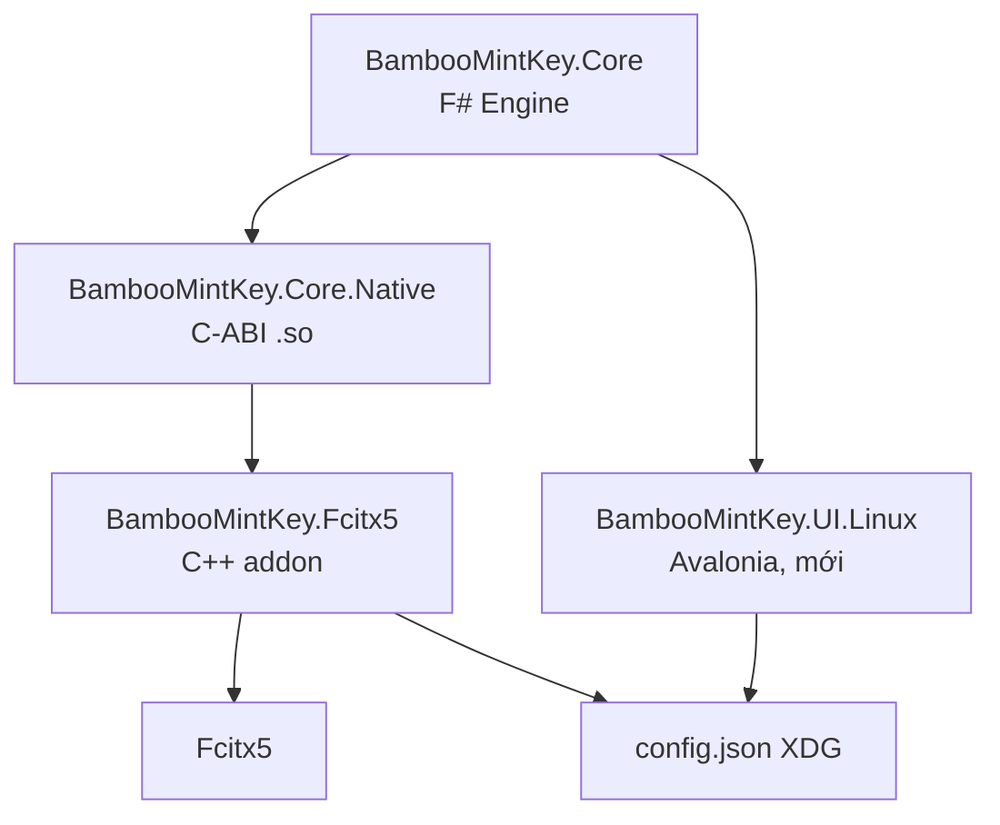
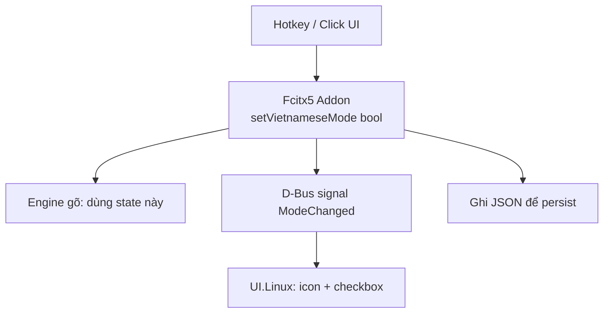

<!--
  BambooMintKey - Vietnamese Telex Input Method Editor
  Copyright (c) 2026 Dương Gia Long and LMO contributors
  SPDX-License-Identifier: MIT
-->

# 007_01 — Điều Tra Khả Năng Tái Sử Dụng Core & UI trên Linux với Fcitx5

**Mã tài liệu:** `007_01_InvestigationForLinux`

**Giai đoạn:** Phase 7 — Chuẩn bị nền tảng Linux / Fcitx5

**Thuộc module:** Toàn bộ solution `BambooMintKey`

**Trạng thái:** ✅ Hoàn thành

> **Môi trường điều tra:** Linux, .NET SDK 10.0.112. Các kết luận về khả năng build được xác minh bằng lệnh `dotnet build` trực tiếp trên source code.

---

## 1. Mục tiêu

Đánh giá với source code hiện tại, để sử dụng phần **core** và phần **UI** trên Linux kết hợp với **Fcitx5**, chúng ta có thể tái sử dụng được những gì và cần viết mới những gì. Từ đó xác định cấu trúc project mới cần tạo cho nền tảng Linux.

---

## 2. Tổng quan kiến trúc hiện tại

| Project | Nền tảng hiện tại | Vai trò | Có thể dùng lại trên Linux? |
|---|---|---|---|
| `BambooMintKey.Core` | .NET 10 (`net10.0`), F# thuần | Engine Telex, parser âm tiết, luật dấu thanh, Unicode tables | ✅ Có thể dùng gần như nguyên vẹn |
| `BambooMintKey.Shared` | .NET 10 (`net10.0`), F# | Thư viện dùng chung (hiện tại rỗng) | ⚠️ Hiện tại chưa có code, chỉ dự phòng |
| `BambooMintKey.NativeBridge` | .NET 10 Windows (`net10.0-windows`), C# NativeAOT COM/TSF | Cầu nối Windows TSF, xử lý phím hệ thống, composition manager | ❌ Không dùng được — phải viết lại thành Fcitx5 Addon |
| `BambooMintKey.UI` | .NET 10 (`net10.0`), Avalonia | Cửa sổ Settings, gõ thử, cấu hình | ⚠️ Không sửa — vẫn phục vụ bản Windows, phải tạo mới `UI.Linux` |
| `BambooMintKey.DevHarness` | .NET 10 Windows, C# | Console test harness cho COM/TSF | ❌ Không dùng được |

---

## 3. Phần Core — có thể dùng trên Linux

### 3.1. Cấu trúc Core

Thư mục `src/BambooMintKey.Core/` chứa engine Telex hoàn toàn thuần chức năng, **không gọi bất kỳ API Windows nào**:

| File | Nội dung |
|---|---|
| `Domain/Types.fs` | Định nghĩa `Tone`, `Modifier`, `Syllable`, `WordState`, `EngineAction` (`UpdateComposition` / `Commit` / `PassThrough`) |
| `Domain/EngineConfig.fs` | Cấu hình engine: `IsEnabled`, `ToneStyle`, `AllowFreeTonePlacement`, v.v. |
| `Domain/UnicodeTables.fs` | Bảng Unicode NFC cho nguyên âm và dấu thanh |
| `Engine/TelexEngine.fs` | Hàm chính `processKey : WordState -> KeyInput -> EngineConfig -> WordState * EngineAction` |
| `Engine/SyllableParser.fs` | Phân tích cấu trúc âm tiết tiếng Việt |
| `Engine/ToneRules.fs` | Luật đặt dấu thanh (kiểu mới / kiểu cũ) |
| `Engine/ModifierRules.fs` | Biến đổi mũ, móc, trăng, gạch ngang |
| `Engine/WordBuffer.fs` | Quản lý buffer, phát hiện và áp dụng viết hoa/thường |
| `Engine/FreeTonePlacement.fs` | Cơ chế bỏ dấu tự do |
| `Engine/EnglishProtection.fs` | Bảo vệ từ tiếng Anh, khôi phục ký tự thô |
| `Interop/NativeApi.fs` | Hiện tại **trống** — dành cho C-ABI exports |

### 3.2. Xác minh build trên Linux

Lệnh kiểm tra:

```bash
dotnet build src/BambooMintKey.Core/BambooMintKey.Core.fsproj -c Release
```

Kết quả: ✅ **Build thành công**, sinh ra:

```
src/BambooMintKey.Core/bin/Release/net10.0/BambooMintKey.Core.dll
```

Điều này khẳng định `BambooMintKey.Core` không phụ thuộc Windows API và có thể chạy trên Linux.

---

## 4. Phần NativeBridge — phải thay thế hoàn toàn

`src/BambooMintKey.NativeBridge/` là lớp tích hợp Windows TSF (Text Services Framework), không thể dùng trên Linux:

| File / Module | Vai trò trên Windows | Vấn đề trên Linux |
|---|---|---|
| `Exports.cs` | COM entry points: `DllGetClassObject`, `DllCanUnloadNow`, `DllRegisterServer`, `DllUnregisterServer` | COM không tồn tại trên Linux |
| `Interop/KeyInputTranslator.cs` | Dùng `user32.dll` (`GetKeyboardState`, `ToUnicode`, `GetKeyState`) | Win32 API không khả dụng |
| `TSF/KeyEventSinkImpl.cs` | Triển khai `ITfKeyEventSink` (`OnTestKeyDown`, `OnKeyDown`, ...) | TSF là Windows-only |
| `TSF/CompositionManager.cs` | Quản lý `ITfComposition`, `ITfRange`, gạch chân | Phải thay bằng preedit/commit của Fcitx5 |
| `TSF/BridgeStateManager.cs` | Cầu nối in-memory sang F# Core | Logic có thể tái sử dụng, nhưng phải tách khỏi TSF |
| `Common/SharedMemoryManager.cs`, `GlobalVEState.cs` | Shared memory + Event broadcast + Registry | Phải thay bằng cơ chế Linux tương đương |

### 4.1. Thay thế bằng Fcitx5 Addon

Trên Linux, cần viết một **Fcitx5 Addon** mới, sử dụng:

- `fcitx::AddonInstance`
- `fcitx::InputMethodEngine`
- `fcitx::KeyEvent`
- `fcitx::InputContext`
- `fcitx::SurroundingText`
- `fcitx::Preedit`

Addon này sẽ nhận sự kiện phím, chuyển đổi sang kiểu dữ liệu của F# Core, gọi `TelexEngine.processKey`, sau đó đẩy kết quả về Fcitx5 qua `commitString()` và `preedit()`.

---

## 5. Phần UI — không sửa code cũ, tạo mới `UI.Linux`

`src/BambooMintKey.UI/` sử dụng **Avalonia**, lý thuyết là cross-platform. Tuy nhiên, **theo quyết định của dự án, không được sửa đổi `BambooMintKey.UI` hiện tại** vì nó vẫn phục vụ cập nhật cho bản Windows.

Do đó, toàn bộ UI cho Linux phải **tạo mới** thành project riêng `BambooMintKey.UI.Linux`, không đụng vào code Windows.

Hai vấn đề Windows-only khiến `BambooMintKey.UI` không thể chạy trực tiếp trên Linux:

| File | Vấn đề trên Linux |
|---|---|
| `Program.fs` | Gọi `user32.dll` (`ShowWindow`, `SetForegroundWindow`, `FindWindowW`) để active instance cũ |
| `SharedConfig.fs` | Dùng `kernel32.dll` (file mapping, events) và `Microsoft.Win32.Registry` |

Project mới `BambooMintKey.UI.Linux` sẽ tự triển khai các phần này theo cách Linux-native (xem Mục 8.3), đồng thời tái sử dụng khái niệm XAML từ bản Windows theo kiểu **sao chép** (không sửa file gốc).

---

## 6. Cấu hình — đã thiết kế sẵn cho Linux

Tài liệu `docs/2.Design/Phase3/003_06_SharedConfiguration_Schema.md` đã định nghĩa đường dẫn lưu trữ tiêu chuẩn:

| Hệ điều hành | Đường dẫn `config.json` |
|---|---|
| Windows | `%AppData%\BambooMintKey\config.json` |
| Linux (Fcitx5) | `$XDG_CONFIG_HOME/bamboomintkey/config.json` (mặc định `~/.config/bamboomintkey/config.json`) |

Schema JSON hiện tại là platform-agnostic, nên phần này có thể tái sử dụng giữa Windows và Linux.

---

## 7. Những gì có thể dùng ngay cho Fcitx5

Tóm lại, với source code hiện tại:

| Thành phần | Mức độ sẵn sàng |
|---|---|
| Engine gõ Telex, parser âm tiết, luật dấu thanh | ✅ Sẵn sàng |
| Kiểu dữ liệu `WordState`, `EngineAction`, `EngineConfig` | ✅ Sẵn sàng |
| Logic bảo vệ tiếng Anh, bỏ dấu tự do, viết hoa | ✅ Sẵn sàng |
| Bảng Unicode NFC cho tiếng Việt | ✅ Sẵn sàng |
| Unit tests cho engine | ✅ Sẵn sàng (`tests/BambooMintKey.Core.Tests/`) |
| Schema cấu hình `config.json` | ✅ Sẵn sàng (theo thiết kế Phase 3) |
| C-ABI exports để Fcitx5 gọi | ❌ Chưa có (`Interop/NativeApi.fs` đang trống) |
| Fcitx5 Addon (C/C++) | ❌ Chưa có |
| Quản lý preedit / surrounding text cho Fcitx5 | ❌ Chưa có |
| UI chạy trên Linux | ❌ Chưa có — phải tạo mới `BambooMintKey.UI.Linux` |

---

## 8. Kế hoạch triển khai — 3 project mới

Việc đưa BambooMintKey lên Linux/Fcitx5 cần tạo **3 mảnh project mới**, không sửa đổi bất kỳ code hiện có nào (Core, Shared, NativeBridge, UI, DevHarness đều giữ nguyên để phục vụ bản Windows).

> **Ràng buộc quan trọng:** Không sửa code hiện tại, đặc biệt là `BambooMintKey.UI` — vì nó vẫn dùng cho cập nhật Windows. Mọi thứ cho Linux đều tạo mới.

### 8.0. Cấu trúc thư mục sau khi bổ sung

```
BambooMintKey/
├── src/
│   ├── BambooMintKey.Core/                 # [F#] Engine — giữ nguyên
│   ├── BambooMintKey.Shared/               # [F#] — giữ nguyên (đang rỗng)
│   ├── BambooMintKey.Core.Native/          # [C#/F#] C-ABI → .so          ← MỚI
│   ├── BambooMintKey.Fcitx5/               # [C++] Fcitx5 addon           ← MỚI
│   ├── BambooMintKey.UI/                   # [Avalonia] Windows — KHÔNG ĐỤNG
│   ├── BambooMintKey.UI.Linux/             # [Avalonia] UI cho Linux       ← MỚI
│   ├── BambooMintKey.NativeBridge/         # [C#] Windows TSF — giữ nguyên
│   └── BambooMintKey.DevHarness/           # [C#] Windows — giữ nguyên
```

Cây phụ thuộc tổng thể:



### 8.1. Project 1 — `BambooMintKey.Core.Native` (lớp C-ABI → `.so`)

Đây là **lớp keo dán** giữa engine F# (managed) và Fcitx5 addon (C++). Lý do cần thiết: Fcitx5 addon bắt buộc viết bằng C++, không thể gọi trực tiếp F# managed code.

- Dùng `[UnmanagedCallersOnly]` xuất các hàm C-ABI:
  - `bmk_process_key`
  - `bmk_process_backspace`
  - `bmk_process_word_break`
  - `bmk_reset`
  - `bmk_set_config`
- Tham chiếu `BambooMintKey.Core` và **liên kết tĩnh** engine F# (đúng mô hình `BambooMintKey.NativeBridge` đã chứng minh trên Windows: C# NativeAOT liên kết tĩnh F# Core).
- Publish ra `libBambooMintKeyCore.so`:

```bash
dotnet publish src/BambooMintKey.Core.Native -c Release -r linux-x64 \
  -p:PublishAot=true -p:NativeLib=Shared -o publish/linux-x64
```

> **Lựa chọn kiến trúc:** Tạo project riêng `Core.Native` (thay vì thêm export trực tiếp vào `Core`) vì:
> - Giữ `Core` là managed library thuần (unit test chạy bình thường).
> - `Core.Native` gánh toàn bộ AOT compilation, quản lý state, marshalling buffer.

Ví dụ hàm export:

```fsharp
let mutable state = WordState.Empty
let mutable config = EngineConfig.Default

[<UnmanagedCallersOnly(EntryPoint = "bmk_process_key")>]
let ProcessKey (c: char) : int =
    // Gọi TelexEngine.processKey, trả về action code cho Fcitx5
    ...
```

Các action code cần định nghĩa:

| Giá trị | Ý nghĩa |
|---|---|
| `0` | `PassThrough` — Fcitx5 xử lý phím bình thường |
| `1` | `Consume` — Bộ gõ đã xử lý, không gửi phím gốc |
| `2` | `UpdatePreedit` — Cập nhật preedit với chuỗi mới |
| `3` | `CommitString` — Commit chuỗi đã hoàn thành |

### 8.2. Project 2 — `BambooMintKey.Fcitx5` (Fcitx5 addon, C++/CMake)

Tạo addon triển khai `fcitx::InputMethodEngine`:

1. Nhận `KeyEvent` từ Fcitx5.
2. Chuyển đổi mã phím / modifier sang kiểu dữ liệu của Core.
3. `dlopen("libBambooMintKeyCore.so")` và gọi hàm export qua C-ABI.
4. Dựa vào kết quả trả về:
   - `Consume`: gọi `keyEvent.filterAndAccept()`.
   - `UpdatePreedit`: gọi `inputContext->inputPanel().setPreedit(...)`.
   - `CommitString`: gọi `inputContext->commitString(...)` và reset preedit.
5. Đọc cấu hình từ `~/.config/bamboomintkey/config.json`.

### 8.3. Project 3 — `BambooMintKey.UI.Linux` (UI cho Linux)

- **Tech:** Avalonia + F# (giữ đồng bộ look-and-feel với bản Windows).
- **Tham chiếu:** `BambooMintKey.Core` (dùng engine cho tab "Gõ thử") và `BambooMintKey.Shared` — **chỉ tham chiếu, không sửa**.
- **Tự viết riêng (không dùng code `BambooMintKey.UI`):**
  - `SharedConfig.fs` riêng: XDG path `~/.config/bamboomintkey/config.json`, không registry, không `kernel32.dll`.
  - `Program.fs` riêng: single-instance bằng Unix domain socket / lock file, không `user32.dll`.
  - XAML + code-behind riêng cho các tab cài đặt.

#### Đồng bộ cấu hình giữa UI.Linux và Fcitx5 addon

Việc đồng bộ chia làm **2 nhóm dữ liệu** với **2 cơ chế khác nhau**:

| Nhóm dữ liệu | Cơ chế đồng bộ | Lý do |
|---|---|---|
| Cấu hình ít thay đổi (tone style, bảng mã, charset, cờ engine...) | **`config.json` + file watcher** | Đổi thưa, chấp nhận trễ nhỏ |
| Trạng thái V/E (chuyển đổi bộ gõ) | **D-Bus (bắt buộc)** | Cần tức thì, có ack, push 2 chiều |

> **Quyết định chốt:** Duy nhất việc chuyển đổi kiểu gõ **E↔V bắt buộc phải dùng D-Bus**, dù khó cũng phải làm — vì đây chính là nguồn lệch pha giữa icon hiển thị và thực tế gõ đã gặp trên Windows. Các cấu hình ít thay đổi thì để trong JSON.

##### Dữ liệu cần đồng bộ

Từ `SharedConfig.fs` và `EngineConfig.fs`, chia 2 nhóm:

**Nhóm A — Addon cần để thay đổi hành vi gõ (bắt buộc đồng bộ):**

| Trường | Ảnh hưởng | Hướng đồng bộ |
|---|---|---|
| `IsVietnameseMode` (V/E) | Bật/tắt gõ tiếng Việt | **Hai chiều, qua D-Bus** |
| `ToneStyle` | Dấu kiểu mới (`hòa`) / cũ (`hoà`) | UI → addon (file watcher) |
| `AutoRestoreEnglishWords` | Tự phục hồi từ tiếng Anh | UI → addon |
| `AllowRepeatKeyUndo` | Gõ lặp phím để undo | UI → addon |
| `AllowLeadingWAsU` | `w` đầu từ thành `ư` | UI → addon |
| `AllowFreeTonePlacement` | Bỏ dấu tự do | UI → addon |
| `InputMethod` | Telex / VNI / Simple Telex | UI → addon |
| `Charset` | Unicode dựng sẵn / tổ hợp / TCVN3 | UI → addon |
| `EnablePreedit` | Hiển thị preedit gạch chân | UI → addon |
| `HotkeyVKey` / `HotkeyModifiers` | Phím tắt chuyển V/E | UI → addon (để addon đăng ký phím tắt) |

**Nhóm B — Chỉ UI quan tâm, không cần đồng bộ sang addon:**

| Trường | Lý do |
|---|---|
| `Version` | Metadata, không ảnh hưởng gõ |
| `StartWithWindows` | Windows-only (Linux thay bằng XDG autostart) |
| `MacroEnabled` / `Macros` | Gõ tắt; hiện chưa có engine xử lý |
| `ToggleHotkey` (preset) | Enum UI; addon cần VKey/Modifiers cụ thể |

##### So sánh 3 cơ chế đồng bộ

| Khía cạnh | File watcher | Unix socket | D-Bus |
|---|---|---|---|
| Setup ban đầu | Gần như zero | Phải tự định nghĩa protocol | Nhiều boilerplate |
| Thư viện phụ thuộc | Không | Không | Tmds.DBus (.NET) + thư viện C++ |
| Push real-time | ⚠️ Chỉ báo "file đổi" | ✅ | ✅ Signal có sẵn |
| Ack / phản hồi | ❌ | Tự thiết kế | ✅ |
| Liveness (biết process kia sống/chết) | ❌ | Tự lo | ✅ |
| Nhiều client | ✅ | ⚠️ Tự lo | ✅ |
| Dễ debug | ✅ Nhất | Trung bình | Khó nhất |

##### Nhược điểm của file watcher

1. **Chỉ báo "có đổi", không báo "đổi gì"** → phải reload + diff toàn bộ JSON.
2. **Race condition**: đọc dở file, lost update; atomic-rename còn phá hỏng inotify watch (phải watch thư mục thay vì file).
3. **Không có ack / liveness** → không biết addon có áp dụng hay còn sống không.
4. **Re-parse JSON mỗi lần + debounce** → không đạt real-time cho V/E.

#### Ghi chú về `BambooMintKey.Shared`

Không thêm gì vào `Shared` (đang trống) để tránh ảnh hưởng build Windows. Mọi kiểu dữ liệu/config riêng cho Linux đặt trong `UI.Linux` và `Core.Native`. Nếu sau này cần chia sẻ thực sự giữa hai nền tảng, sẽ bàn riêng.

### 8.4. Thiết kế trạng thái V/E — tránh lệch pha icon ↔ thực tế gõ

#### Nguyên nhân lệch pha trên Windows (TSF)

Qua `GlobalVEState.cs`, `BambooMintKeyTextService.cs` và `SharedMemoryManager.cs`, hiện tượng lệch giữa icon và thực tế gõ bắt nguồn từ 3 nguyên nhân:

| # | Nguyên nhân | Chi tiết |
|---|---|---|
| 1 | **Hai chủ cùng nắm state** | TSF Compartment (`GUID_COMPARTMENT_KEYBOARD_OPENCLOSE` + `CONVERSION`) do Windows/process khác điều khiển + Shared memory (byte 0) do ta quản lý, phải "bắt chước" nhau qua `Synchronize()` |
| 2 | **Nhiều đường ghi cạnh tranh** | `SetVietnameseMode`/`ToggleVietnameseMode` bị gọi từ `OnKeyDown`, `OnPreservedKey` và compartment event sink → race / double-toggle (đã ghi nhận tại Issue `005`) |
| 3 | **Trộn event + polling** | Icon cập nhật qua `LangBarItemButton.NotifyStateChanged()`, còn UI Settings polling `getStateSequence()` mỗi 150ms → trễ |

#### Nguyên tắc thiết kế Linux (single-owner)

Trên Linux không có TSF compartment cạnh tranh, nên áp 4 nguyên tắc:

1. **Một chủ duy nhất**: Fcitx5 addon là owner duy nhất của trạng thái V/E (nó là thứ duy nhất cần dùng state đồng bộ với từng phím gõ).
2. **Một đường ghi duy nhất**: phím tắt lẫn click UI đều qua cùng một hàm `setVietnameseMode(bool)`, không còn 2 đường toggle song song.
3. **Push thay vì polling**: mỗi lần mode đổi, addon phát D-Bus signal `ModeChanged(bool)`, UI subscribe và cập nhật ngay.
4. **Fcitx5 quản lý phím tắt gốc**: đăng ký hotkey qua cơ chế của Fcitx5, không tự hook bàn phím → triệt tiêu bug double-toggle.



#### Vai trò của từng kênh

| Thành phần | Vai trò |
|---|---|
| **JSON** | Persistence — lưu bền vững mọi thứ (kể cả V/E) để khôi phục sau restart |
| **D-Bus** | Điều khiển real-time cho V/E: command từ UI + push signal cho UI |
| **File watcher** | Đồng bộ nhẹ cho cấu hình ít thay đổi (nhóm A còn lại) |

> **Tóm tắt:** JSON = persistence, D-Bus = điều khiển real-time cho V/E, file watcher = đồng bộ nhẹ cho cấu hình ít đổi — ba thứ bổ trợ, không trùng lặp.

---

## 9. Thứ tự triển khai khuyến nghị

1. **`BambooMintKey.Core.Native`** trước — chứng minh luồng C-ABI chạy trên Linux (ít rủi ro nhất).
2. Sau đó **`BambooMintKey.Fcitx5`** (C++ addon).
3. Cuối cùng **`BambooMintKey.UI.Linux`**.

---

## 10. Kết luận

Phần **core** và **kiến trúc cấu hình** của BambooMintKey đã sẵn sàng để mang sang Linux/Fcitx5. Điểm mạnh lớn nhất là engine Telex được viết hoàn toàn bằng F# thuần chức năng, không dính Windows API, và đã được xác minh build thành công trên Linux.

Phần cần đầu tư thực sự — toàn bộ tạo mới, không sửa code Windows:

1. **`BambooMintKey.Core.Native`** — xuất C-ABI từ Core thành `.so` để Fcitx5 gọi.
2. **`BambooMintKey.Fcitx5`** — addon C++ thay thế lớp Windows TSF.
3. **`BambooMintKey.UI.Linux`** — UI Avalonia cho Linux, dùng XDG paths và cơ chế đồng bộ đa nền tảng.

---

## 11. Tham khảo

- `src/BambooMintKey.Core/BambooMintKey.Core.fsproj`
- `src/BambooMintKey.Core/Interop/NativeApi.fs`
- `src/BambooMintKey.NativeBridge/BambooMintKey.NativeBridge.csproj`
- `src/BambooMintKey.UI/BambooMintKey.UI.fsproj`
- `src/BambooMintKey.UI/Program.fs`
- `src/BambooMintKey.UI/SharedConfig.fs`
- `docs/2.Design/Phase3/003_06_SharedConfiguration_Schema.md`
- `docs/1.Investigation/003_FSharpCoreEngineTheory.md`
