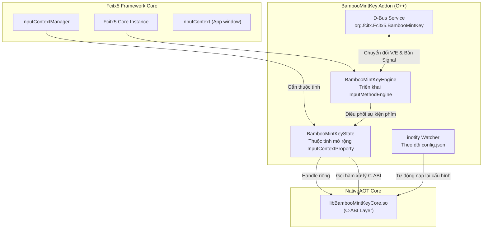

<!--
  BambooMintKey - Vietnamese Telex Input Method Editor
  Copyright (c) 2026 Dương Gia Long and LMO contributors
  SPDX-License-Identifier: MIT
-->

# 007_04 — Thiết Kế Chi Tiết Fcitx5 Engine Addon & D-Bus Service (`BambooMintKey.Fcitx5`)

**Mã tài liệu:** `007_04_Fcitx5_Addon_Design`  
**Giai đoạn:** Phase 7 — Chuẩn bị và Triển khai nền tảng Linux / Fcitx5  
**Thuộc module:** `src/BambooMintKey.Fcitx5`  
**Trạng thái:** ✅ Đã phê duyệt thiết kế  
**Tài liệu tham chiếu:** [007_01_InvestigationForLinux.md](file:///home/lmo1720/Fcitx-Bamboo-Mint/BambooMintKey/docs/2.Design/Phase7/007_01_InvestigationForLinux.md), [007_002_Roadmap.md](file:///home/lmo1720/Fcitx-Bamboo-Mint/BambooMintKey/docs/2.Design/Phase7/007_002_Roadmap.md), [007_03_CoreNative_CABI_Design.md](file:///home/lmo1720/Fcitx-Bamboo-Mint/BambooMintKey/docs/2.Design/Phase7/007_03_CoreNative_CABI_Design.md)

---

## 1. Mục Tiêu Kỹ Thuật

1. **Plugin Fcitx5 Native**: Xây dựng Addon Fcitx5 chuẩn mực triển khai giao diện bộ gõ (`InputMethodEngine`) và thể hiện module (`AddonInstance`), liên kết trực tiếp với thư viện C-ABI `libBambooMintKeyCore.so`.
2. **Gắn Kết State Theo Context**: Mỗi phiên nhập liệu (`InputContext`) của Fcitx5 được cấp một thuộc tính mở rộng (`BambooMintKeyState`), lưu giữ con trỏ nhận diện độc lập để đảm bảo không lẫn lộn bộ đệm giữa các cửa sổ.
3. **Hiển Thị Preedit Tự Nhiên & Chốt Chuỗi Chuẩn Xác**: Hỗ trợ Inline Preedit với định dạng gạch chân, hiển thị mượt mà trên cả GTK, Qt và các ứng dụng dòng lệnh.
4. **Triển Khai D-Bus Service Chuyên Biệt Cho V/E (Single-Owner)**: Đóng vai trò là nguồn sự thật duy nhất (Single Source of Truth) quản lý trạng thái gõ V/E toàn hệ thống, cung cấp giao tiếp D-Bus điều khiển và phát tín hiệu thay đổi tức thì cho UI.
5. **Đồng Bộ Cấu Hình Ít Đổi qua `inotify`**: Theo dõi file cấu hình XDG `config.json` thời gian thực mà không làm nghẽn tiến trình gõ.

---

## 2. Kiến Trúc Addon & Sơ Đồ Khối



---

## 3. Quản Lý Trạng Thái Context (`BambooMintKeyState`)

Lớp `BambooMintKeyState` đại diện cho vòng đời trạng thái của từng cửa sổ hoặc ô nhập liệu.

### Đặc tả bằng mã giả:

```
LỚP BambooMintKeyState KẾ THỪA TỪ InputContextProperty:
    Thuộc tính EngineInstance : Tham chiếu tới engine chính (BambooMintKeyEngine)
    Thuộc tính InputContextRef : Tham chiếu tới đối tượng ngữ cảnh nhập liệu (InputContext)
    Thuộc tính NativeHandle   : Con trỏ định danh context từ Core.Native (mặc định = 0)

    HÀM KHỞI TẠO(Engine, InputContext):
        EngineInstance = Engine
        InputContextRef = InputContext
        // Khởi tạo một context độc lập từ thư viện C-ABI
        NativeHandle = Gọi_Hàm_CABI(bmk_context_create)
    HẾT HÀM

    HÀM HỦY():
        // Thu hồi an toàn tài nguyên khi cửa sổ hoặc tab ứng dụng bị đóng
        NẾU NativeHandle != 0 THÌ:
            Gọi_Hàm_CABI(bmk_context_free, NativeHandle)
            NativeHandle = 0
    HẾT HÀM

    HÀM Reset():
        NẾU NativeHandle != 0 THÌ:
            Gọi_Hàm_CABI(bmk_context_reset, NativeHandle)
        Xóa rỗng bảng nhập liệu của InputContextRef
        Cập nhật lại giao diện preedit
    HẾT HÀM
HẾT LỚP
```

---

## 4. Pipeline Xử Lý Sự Kiện Bàn Phím (`keyEvent`)

Mọi sự kiện phím nhấn từ hệ điều hành đi qua phương thức điều phối bàn phím của Engine.

### Thuật toán điều phối bằng mã giả:

```
THUẬT TOÁN XửLýSựKiệnPhím(InputMethodEntry, KeyEvent):
    // 1. Bỏ qua sự kiện nhả phím
    NẾU KeyEvent là sự kiện nhả phím THÌ KẾT THÚC

    // 2. Kiểm tra chế độ gõ toàn cục
    NẾU ChếĐộGõHiệnTại == TiếngAnh (E) THÌ:
        KẾT THÚC (Để ứng dụng tự nhận phím gốc)

    // 3. Bỏ qua các phím tắt hệ thống để tránh nuốt phím ứng dụng
    NẾU KeyEvent có chứa phím bổ trợ (Ctrl HOẶC Alt HOẶC Super) THÌ:
        KẾT THÚC (PassThrough phím tắt)

    Context = LấyNgữCảnhTừKeyEvent(KeyEvent)
    State = Context.LấyThuộcTính(BambooMintKeyState)
    Handle = State.NativeHandle

    // 4. Xử lý phím Backspace
    NẾU KeyEvent là phím Backspace THÌ:
        MãHànhĐộng = Gọi_Hàm_CABI(bmk_process_backspace, Handle)
        NẾU MãHànhĐộng == CậpNhậtPreedit (2) THÌ:
            CậpNhậtGiaoDiệnPreedit(Context, Handle)
            KeyEvent.ĐánhDấuĐãNuốtPhím()
            KẾT THÚC
        NGƯỢC LẠI NẾU MãHànhĐộng == BỏQua (0) THÌ:
            Context.XóaBảngPreedit()
            KẾT THÚC

    // 5. Xử lý phím ngắt từ (Space, Enter, Tab)
    NẾU KeyEvent là phím ngắt từ THÌ:
        KýTựNgắt = LấyKýTựTừPhím(KeyEvent)
        MãHànhĐộng = Gọi_Hàm_CABI(bmk_process_wordbreak, Handle, KýTựNgắt)
        NẾU MãHànhĐộng == ChốtChuỗi (3) THÌ:
            ChuỗiChốt = Gọi_Hàm_CABI(bmk_get_commit_text, Handle)
            Context.XóaBảngPreedit()
            Context.ChốtChuỗiVàoỨngDụng(ChuỗiChốt)
            KeyEvent.ĐánhDấuĐãNuốtPhím()
            KẾT THÚC
        NGƯỢC LẠI:
            KẾT THÚC

    // 6. Xử lý ký tự gõ thông thường
    KýTựUnicode = ChuyểnĐổiKeySymSangUnicode(KeyEvent)
    NẾU KýTựUnicode nằm trong bảng mã in được (ASCII 32..126) THÌ:
        MãHànhĐộng = Gọi_Hàm_CABI(bmk_process_key, Handle, KýTựUnicode)
        CHỌN TRƯỜNG HỢP CỦA MãHànhĐộng:
            TRƯỜNG HỢP CậpNhậtPreedit (2):
                CậpNhậtGiaoDiệnPreedit(Context, Handle)
                KeyEvent.ĐánhDấuĐãNuốtPhím()
                KẾT THÚC
            TRƯỜNG HỢP ChốtChuỗi (3):
                ChuỗiChốt = Gọi_Hàm_CABI(bmk_get_commit_text, Handle)
                Context.XóaBảngPreedit()
                Context.ChốtChuỗiVàoỨngDụng(ChuỗiChốt)
                KeyEvent.ĐánhDấuĐãNuốtPhím()
                KẾT THÚC
            TRƯỜNG HỢP NuốtPhím (1):
                KeyEvent.ĐánhDấuĐãNuốtPhím()
                KẾT THÚC
HẾT THUẬT TOÁN
```

### Thuật toán Cập Nhật Giao Diện Preedit (Mã giả):

```
THUẬT TOÁN CậpNhậtGiaoDiệnPreedit(Context, Handle):
    ChuỗiPreedit = Gọi_Hàm_CABI(bmk_get_preedit_text, Handle)
    NẾU ChuỗiPreedit rỗng THÌ:
        Context.XóaBảngPreedit()
        KẾT THÚC

    Tạo đối tượng Text văn bản hiển thị
    Thêm ChuỗiPreedit vào Text kèm thuộc tính gạch chân (Underline format)
    Đặt vị trí con trỏ chuột ở cuối chuỗi văn bản

    NẾU Ứng dụng hỗ trợ Inline Preedit THÌ:
        Gửi Text vào bộ đệm Client Preedit của ứng dụng
    NGƯỢC LẠI:
        Hiển thị Text trên Input Panel nổi của Fcitx5

    Yêu cầu Fcitx5 làm mới giao diện
HẾT THUẬT TOÁN
```

---

## 5. Thiết Kế D-Bus Service Điều Khiển V/E (Single-Owner)

Để giải quyết triệt để lỗi **lệch pha giữa icon trạng thái và thực tế gõ**, Fcitx5 Addon đóng vai trò là chủ sở hữu duy nhất (Single Owner) biến cờ trạng thái `isVietnameseMode`.

### 5.1. Thông Số Giao Diện D-Bus

* **Loại Bus:** D-Bus Session Bus (Không gian người dùng).
* **Service Name:** `org.fcitx.Fcitx5.BambooMintKey`
* **Object Path:** `/org/fcitx/Fcitx5/BambooMintKey`
* **Interface Name:** `org.fcitx.Fcitx5.BambooMintKey1`

### 5.2. Danh Mục Các Phương Thức & Tín Hiệu

| Loại Thành Phần | Tên | Tham Số Đầu Vào | Kết Quả Đầu Ra | Mô Tả Chức Năng |
|---|---|---|---|---|
| **Method** | `GetVietnameseMode` | Không | `Boolean` | Trả về `True` nếu đang ở chế độ gõ tiếng Việt (V), `False` nếu tiếng Anh (E). |
| **Method** | `SetVietnameseMode` | `Boolean enable` | Không | Thiết lập trực tiếp trạng thái gõ từ UI hoặc script. |
| **Method** | `ToggleVietnameseMode`| Không | `Boolean` | Đảo trạng thái hiện tại (V <-> E) và trả về trạng thái mới. |
| **Signal** | `ModeChanged` | Không | `Boolean isVietnamese` | Tín hiệu phát đi toàn hệ thống mỗi khi chế độ gõ thay đổi (do phím tắt hoặc do UI bấm). |

### 5.3. Thuật toán Đổi Trạng Thái Gõ Tập Trung (Mã giả):

```
THUẬT TOÁN ThiếtLậpChếĐộGõ(TrạngTháiMới):
    NẾU ChếĐộHiệnTại == TrạngTháiMới THÌ KẾT THÚC
    ChếĐộHiệnTại = TrạngTháiMới

    // 1. Cập nhật biểu tượng hiển thị (V/E) trên thanh trạng thái Fcitx5
    CậpNhậtThanhTrạngTháiFcitx5(ChếĐộHiệnTại)

    // 2. Phát tín hiệu D-Bus Signal cho Settings GUI cập nhật
    Phát_DBus_Signal("ModeChanged", ChếĐộHiệnTại)

    // 3. Ghi cập nhật vào file config.json để lưu trạng thái bền vững
    LưuTrạngTháiVàoJson(ChếĐộHiệnTại)
HẾT THUẬT TOÁN
```

---

## 6. Cơ Chế File Watcher (`inotify`) Cho Cấu Hình Ít Đổi

Các cấu hình như kiểu đặt dấu, bảng mã, khôi phục từ tiếng Anh được lưu trong `~/.config/bamboomintkey/config.json`.
Fcitx5 Addon sử dụng cơ chế lắng nghe sự kiện hệ thống tệp:

1. **Khởi tạo giám sát**: Đặt bộ theo dõi sự kiện trên thư mục `$XDG_CONFIG_HOME/bamboomintkey/`.
2. **Bắt sự kiện ghi xong (`IN_CLOSE_WRITE`)**: Khi nhận được tín hiệu hoàn tất ghi trên file `config.json`:
   - Đọc nội dung tệp JSON.
   - Nạp lại cấu hình mới qua hàm C-ABI `bmk_set_options` hoặc `bmk_load_config_json`.
   - Áp dụng ngay lập tức cho các phiên gõ tiếp theo mà không cần khởi động lại tiến trình Fcitx5.

---

## 7. Ma Trận Kiểm Thử Kỹ Thuật (Test Matrix & Test Cases)

| Test ID | Tên Hạng Mục | Các Bước Thực Hiện (Input) | Kết Quả Mong Đợi (Expected Output) | Tiêu Chí Đánh Giá (Pass/Fail) |
|:---:|---|---|---|---|
| **`TC-FCITX-01`** | Nạp Plugin Addon | 1. Cài đặt tệp plugin vào thư mục Fcitx5<br>2. Chạy lệnh nạp lại `fcitx5 -r -d`<br>3. Kiểm tra log khởi động | Plugin nạp thành công, không phát sinh lỗi thoát đột ngột (crash/segfault) | ✅ PASS nếu xuất hiện trong danh sách bộ gõ. |
| **`TC-FCITX-02`** | Bỏ qua phím tắt hệ thống | Nhấn các tổ hợp: `Ctrl+C`, `Ctrl+V`, `Alt+F4`, `Ctrl+Shift+T` | Bộ gõ bỏ qua hoàn toàn, ứng dụng nhận trọn vẹn phím tắt | ✅ PASS nếu không nuốt nhầm bất kỳ phím tắt nào. |
| **`TC-FCITX-03`** | Hiển thị Inline Preedit | Mở trình soạn thảo văn bản, gõ chuỗi `d-u-w-o-w-n-g-f` | Hiển thị chuỗi `"đường"` có đường gạch chân mờ dưới chân chữ, con trỏ ở cuối từ | ✅ PASS nếu preedit hiển thị chuẩn xác, không chớp nháy. |
| **`TC-FCITX-04`** | Chốt từ vào văn bản | Sau khi hoàn thành từ `"đường"`, nhấn phím Space | Vùng gạch chân preedit biến mất, chuỗi `"đường "` được chốt chính xác vào văn bản | ✅ PASS nếu chốt từ mượt mà không thừa thiếu ký tự. |
| **`TC-FCITX-05`** | Biệt lập khi chuyển cửa sổ | Đang gõ dở từ ở cửa sổ thứ nhất, click chuột sang cửa sổ thứ hai gõ tiếp | Cửa sổ thứ nhất tự động chốt hoặc xóa preedit; cửa sổ thứ hai bắt đầu từ mới sạch sẽ | ✅ PASS nếu không dính chữ giữa các cửa sổ. |
| **`TC-FCITX-06`** | Đồng bộ D-Bus hai chiều | 1. Dùng lệnh dòng lệnh gọi phương thức `SetVietnameseMode false`<br>2. Quan sát biểu tượng khay hệ thống<br>3. Lắng nghe tín hiệu `ModeChanged` | Khay hệ thống chuyển sang ký hiệu `"E"`, tín hiệu phát ra giá trị `false` | ✅ PASS nếu D-Bus điều khiển trạng thái đồng bộ 100%. |
| **`TC-FCITX-07`** | Nạp lại cấu hình tự động | Đang gõ kiểu mới (`hòa`), sửa file `config.json` sang kiểu cũ (`hoà`) | Từ gõ tiếp theo tự động biến đổi thành kiểu cũ mà không cần restart Fcitx5 | ✅ PASS nếu nạp cấu hình mới dưới 50 mili-giây. |
