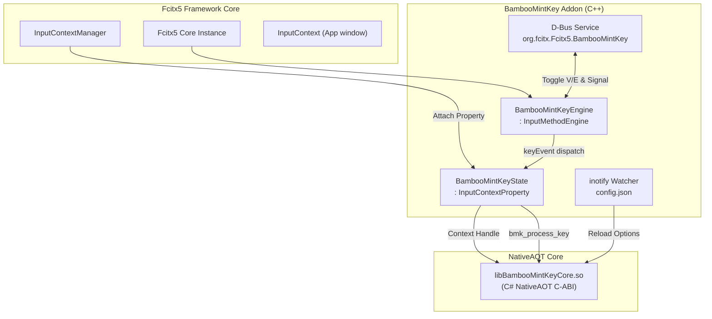

<!--
  BambooMintKey - Vietnamese Telex Input Method Editor
  Copyright (c) 2026 Dương Gia Long and LMO contributors
  SPDX-License-Identifier: MIT
-->

# 007_04 — Thiết Kế Chi Tiết Fcitx5 Engine Addon & D-Bus Service (`BambooMintKey.Fcitx5`)

**Mã tài liệu:** `007_04_Fcitx5_Addon_Design`  
**Giai đoạn:** Phase 7 — Chuẩn bị và Triển khai nền tảng Linux / Fcitx5  
**Thuộc module:** `src/BambooMintKey.Fcitx5`  
**Trạng thái:** ✅ Đã phê duyệt thiết kế  
**Tài liệu tham chiếu:** [007_01_InvestigationForLinux.md](file:///home/lmo1720/Fcitx-Bamboo-Mint/BambooMintKey/docs/2.Design/Phase7/007_01_InvestigationForLinux.md), [007_002_Roadmap.md](file:///home/lmo1720/Fcitx-Bamboo-Mint/BambooMintKey/docs/2.Design/Phase7/007_002_Roadmap.md), [007_03_CoreNative_CABI_Design.md](file:///home/lmo1720/Fcitx-Bamboo-Mint/BambooMintKey/docs/2.Design/Phase7/007_03_CoreNative_CABI_Design.md)

---

## 1. Mục Tiêu Kỹ Thuật

1. **Plugin Fcitx5 Native (C++)**: Xây dựng Addon Fcitx5 chuẩn mực triển khai `fcitx::InputMethodEngine` và `fcitx::AddonInstance`, liên kết trực tiếp với `libBambooMintKeyCore.so`.
2. **Gắn Kết State Theo Context**: Mỗi `InputContext` của Fcitx5 được cấp một instance `BambooMintKeyState` (kế thừa `fcitx::InputContextProperty`), lưu giữ handle context từ C-ABI của `Core.Native`.
3. **Hiển Thị Preedit Tự Nhiên & Chốt Chuỗi Chuẩn Xác**: Hỗ trợ Inline Preedit với định dạng gạch chân (`TextFormatFlag::Underline`), hiển thị mượt mà trên cả GTK, Qt và các ứng dụng terminal.
4. **Triển Khai D-Bus Service Chuyên Biệt Cho V/E (Single-Owner)**: Đóng vai trò là nguồn sự thật duy nhất (Single Source of Truth) quản lý trạng thái gõ V/E toàn hệ thống, cung cấp D-Bus API điều khiển và phát tín hiệu `ModeChanged` signal tức thì cho UI.
5. **Đồng Bộ Cấu Hình Ít Đổi qua `inotify`**: Theo dõi file cấu hình XDG `config.json` thời gian thực mà không làm nghẽn tiến trình gõ.

---

## 2. Kiến Trúc Addon & Sơ Đồ Khối



---

## 3. Quản Lý Trạng Thái Context (`BambooMintKeyState`)

Lớp `BambooMintKeyState` kế thừa `fcitx::InputContextProperty` để tự động sống và chết theo vòng đời của từng cửa sổ / trường nhập liệu:

```cpp
namespace fcitx {

class BambooMintKeyEngine;

class BambooMintKeyState final : public InputContextProperty {
public:
    BambooMintKeyState(BambooMintKeyEngine *engine, InputContext *ic)
        : engine_(engine), ic_(ic) {
        // 1. Cấp phát context handle độc lập từ C-ABI
        handle_ = bmk_context_create();
    }

    ~BambooMintKeyState() override {
        // 2. Tự động thu hồi tài nguyên khi cửa sổ đóng
        if (handle_) {
            bmk_context_free(handle_);
            handle_ = 0;
        }
    }

    void reset() {
        if (handle_) {
            bmk_context_reset(handle_);
        }
        ic_->inputPanel().reset();
        ic_->updatePreedit();
        ic_->updateUserInterface(UserInterfaceComponent::InputPanel);
    }

    intptr_t handle() const { return handle_; }
    InputContext* inputContext() const { return ic_; }

private:
    BambooMintKeyEngine *engine_;
    InputContext *ic_;
    intptr_t handle_ = 0;
};

} // namespace fcitx
```

---

## 4. Pipeline Xử Lý Sự Kiện Bàn Phím (`keyEvent`)

Mọi sự kiện phím nhấn từ hệ điều hành đi qua phương thức `BambooMintKeyEngine::keyEvent`:

```cpp
void BambooMintKeyEngine::keyEvent(const InputMethodEntry &entry, KeyEvent &keyEvent) {
    // 1. Bỏ qua sự kiện nhả phím
    if (keyEvent.isRelease()) {
        return;
    }

    // 2. Kiểm tra chế độ V/E toàn cục
    if (!isVietnameseMode_) {
        return; // Đang ở chế độ E -> PassThrough toàn bộ
    }

    // 3. Bỏ qua các phím điều khiển hệ thống (Ctrl, Alt, Super) để tránh nuốt phím tắt
    auto state = keyEvent.rawKey().states();
    if (state.test(KeyState::Ctrl) || state.test(KeyState::Alt) || state.test(KeyState::Super)) {
        return;
    }

    auto *ic = keyEvent.inputContext();
    auto *stateProp = ic->propertyFor(&stateFactory_);
    intptr_t handle = stateProp->handle();

    auto key = keyEvent.key();

    // 4. Xử lý phím Backspace
    if (key.check(FcitxKey_BackSpace)) {
        int action = bmk_process_backspace(handle);
        if (action == 2) { // UpdatePreedit
            updatePreeditUI(ic, handle);
            keyEvent.filterAndAccept();
            return;
        } else if (action == 0) { // PassThrough
            ic->inputPanel().reset();
            ic->updatePreedit();
            return;
        }
    }

    // 5. Xử lý phím WordBreak (Space, Enter, dấu câu)
    if (key.check(FcitxKey_space) || key.check(FcitxKey_Return) || key.check(FcitxKey_KP_Enter)) {
        char breakChar = key.check(FcitxKey_space) ? ' ' : '\n';
        int action = bmk_process_wordbreak(handle, breakChar);
        if (action == 3) { // CommitString
            const char *commitText = bmk_get_commit_text(handle);
            ic->inputPanel().reset();
            ic->updatePreedit();
            ic->commitString(commitText);
            keyEvent.filterAndAccept();
            return;
        }
        return;
    }

    // 6. Xử lý ký tự Unicode thông thường
    uint32_t unicodeChar = keyutils::keySymToUnicode(key.sym());
    if (unicodeChar >= 32 && unicodeChar <= 126) {
        int action = bmk_process_key(handle, unicodeChar);
        if (action == 2) { // UpdatePreedit
            updatePreeditUI(ic, handle);
            keyEvent.filterAndAccept();
            return;
        } else if (action == 3) { // CommitString
            const char *commitText = bmk_get_commit_text(handle);
            ic->inputPanel().reset();
            ic->updatePreedit();
            ic->commitString(commitText);
            keyEvent.filterAndAccept();
            return;
        } else if (action == 1) { // Consume
            keyEvent.filterAndAccept();
            return;
        }
    }
}
```

### Định dạng Preedit UI:
```cpp
void BambooMintKeyEngine::updatePreeditUI(InputContext *ic, intptr_t handle) {
    const char *text = bmk_get_preedit_text(handle);
    if (!text || !text[0]) {
        ic->inputPanel().reset();
        ic->updatePreedit();
        return;
    }

    Text preedit;
    // Thêm định dạng gạch chân cho toàn bộ khối composition
    preedit.append(std::string(text), TextFormatFlag::Underline);
    preedit.setCursor(preedit.textLength());

    if (ic->capabilityFlags().test(CapabilityFlag::Preedit)) {
        ic->inputPanel().setClientPreedit(preedit);
    } else {
        ic->inputPanel().setPreedit(preedit);
    }
    ic->updatePreedit();
    ic->updateUserInterface(UserInterfaceComponent::InputPanel);
}
```

---

## 5. Thiết Kế D-Bus Service Điều Khiển V/E (Single-Owner)

Để giải quyết triệt để lỗi **lệch pha giữa icon trạng thái và thực tế gõ**, Fcitx5 Addon nắm giữ duy nhất biến `isVietnameseMode_`. Mọi giao tiếp với UI cài đặt và các tiện ích bên ngoài đều qua D-Bus Session Bus.

### 5.1. Thông số Service D-Bus

| Thuộc tính | Giá trị |
|---|---|
| **Bus Type** | D-Bus Session Bus |
| **Service Name** | `org.fcitx.Fcitx5.BambooMintKey` |
| **Object Path** | `/org/fcitx/Fcitx5/BambooMintKey` |
| **Interface Name** | `org.fcitx.Fcitx5.BambooMintKey1` |

### 5.2. Các Phương Thức & Tín Hiệu (Methods & Signals)

```xml
<!DOCTYPE node PUBLIC "-//freedesktop//DTD D-BUS Object Introspection 1.0//EN"
"http://www.freedesktop.org/standards/dbus/1.0/introspect.dtd">
<node>
  <interface name="org.fcitx.Fcitx5.BambooMintKey1">
    <!-- Lấy trạng thái hiện tại (true = V, false = E) -->
    <method name="GetVietnameseMode">
      <arg direction="out" type="b" name="isVietnamese"/>
    </method>

    <!-- Đặt trạng thái từ UI hoặc script bên ngoài -->
    <method name="SetVietnameseMode">
      <arg direction="in" type="b" name="enable"/>
    </method>

    <!-- Đảo trạng thái V/E và trả về trạng thái mới -->
    <method name="ToggleVietnameseMode">
      <arg direction="out" type="b" name="newMode"/>
    </method>

    <!-- Signal phát ra toàn hệ thống khi mode thay đổi -->
    <signal name="ModeChanged">
      <arg type="b" name="isVietnamese"/>
    </signal>
  </interface>
</node>
```

### 5.3. Luồng xử lý Toggle Mode:
1. Khi người dùng nhấn phím tắt chuyển mode (`Ctrl+Shift` hoặc `Alt+Z`) hoặc click toggle trên Settings GUI:
2. Addon gọi hàm nội bộ:
   ```cpp
   void BambooMintKeyEngine::setVietnameseMode(bool enable) {
       if (isVietnameseMode_ == enable) return;
       isVietnameseMode_ = enable;
       // 1. Cập nhật icon / subMode trên Fcitx5 status bar
       updateStatusArea();
       // 2. Phát D-Bus signal cho Settings UI và Desktop Indicator
       dbusEmitter_->emitModeChanged(isVietnameseMode_);
       // 3. Cập nhật persistence vào config.json
       saveStateToJson();
   }
   ```
3. UI nhận được signal và cập nhật checkbox/icon tức thì mà không cần bất kỳ vòng lặp polling nào.

---

## 6. Cơ Chế File Watcher (`inotify`) Cho Cấu Hình Ít Đổi

Các cấu hình như kiểu đặt dấu, bảng mã, khôi phục từ tiếng Anh được lưu trong `~/.config/bamboomintkey/config.json`.
Fcitx5 Addon sử dụng `inotify` hoặc `fcitx::EventLoop` để theo dõi thư mục cấu hình:

1. Watch descriptor đặt trên thư mục `~/.config/bamboomintkey/`.
2. Khi nhận sự kiện `IN_CLOSE_WRITE` trên tệp `config.json`:
   - Đọc và parse JSON.
   - Gọi `bmk_set_options(...)` hoặc `bmk_load_config_json(...)` trên context hiện tại.
   - Áp dụng cấu hình mới cho tất cả các phiên gõ tiếp theo mà không cần khởi động lại Fcitx5 daemon.

---

## 7. Ma Trận Kiểm Thử Kỹ Thuật (Test Matrix & Test Cases)

| Test ID | Tên Hạng Mục | Các Bước Thực Hiện (Input) | Kết Quả Mong Đợi (Expected Output) | Tiêu Chí Đánh Giá (Pass/Fail) |
|:---:|---|---|---|---|
| **`TC-FCITX-01`** | Addon Lifecycle | 1. Cài đặt addon vào `~/.local/lib/fcitx5/`<br>2. Chạy `fcitx5 -r -d`<br>3. Kiểm tra log `fcitx5` | Addon `bamboomintkey` nạp thành công, không văng lỗi segmentation fault | ✅ PASS nếu addon xuất hiện trong danh sách Input Method. |
| **`TC-FCITX-02`** | PassThrough Shortcuts | Nhấn các tổ hợp: `Ctrl+C`, `Ctrl+V`, `Alt+F4`, `Ctrl+Shift+T` | Bộ gõ không can thiệp, phím tắt được chuyển nguyên vẹn đến ứng dụng | ✅ PASS nếu không nuốt nhầm phím tắt. |
| **`TC-FCITX-03`** | Inline Preedit Rendering | Mở text editor (Gedit hoặc VS Code), gõ `d-u-w-o-w-n-g-f` | Hiển thị chữ `"đường"` có đường gạch chân mờ dưới chân chữ, con trỏ ở cuối từ | ✅ PASS nếu preedit hiển thị chuẩn xác không bị đè chữ. |
| **`TC-FCITX-04`** | Word Commit Execution | Sau khi gõ xong `"đường"`, nhấn phím Space | 1. Preedit gạch chân biến mất<br>2. Ký tự `"đường "` được commit vào tài liệu | ✅ PASS nếu từ được chốt mượt mà vào văn bản. |
| **`TC-FCITX-05`** | Focus Switching Isolation | Đang gõ dở `"tiế"` ở cửa sổ Chrome, click chuột sang Terminal gõ `"ls"` | Preedit ở Chrome bị hủy hoặc commit, Terminal nhận `"ls"` sạch sẽ, không bị dính chữ `"tiế"` | ✅ PASS nếu chuyển focus cách ly hoàn hảo giữa các cửa sổ. |
| **`TC-FCITX-06`** | D-Bus Mode Toggle & Signal | 1. Dùng lệnh terminal: `gdbus call ... SetVietnameseMode false`<br>2. Kiểm tra subMode trên khay hệ thống<br>3. Bắt signal `ModeChanged` | SubMode chuyển thành `"E"`, signal phát ra `false`, gõ chữ không còn dấu tiếng Việt | ✅ PASS nếu D-Bus điều khiển trạng thái đồng bộ 100%. |
| **`TC-FCITX-07`** | Inotify Config Reload | Đang gõ kiểu mới (`hòa`), mở terminal sửa `config.json` thành `toneStyle: 1` | Từ gõ tiếp theo `h-o-a-f` tự động biến đổi thành kiểu cũ (`hoà`) mà không restart Fcitx5 | ✅ PASS nếu nạp cấu hình mới dưới 50ms. |
