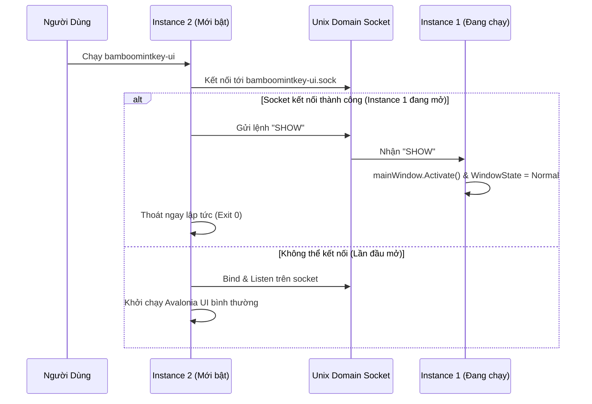

<!--
  BambooMintKey - Vietnamese Telex Input Method Editor
  Copyright (c) 2026 Dương Gia Long and LMO contributors
  SPDX-License-Identifier: MIT
-->

# 007_05 — Thiết Kế Chi Tiết Giao Diện Cài Đặt Avalonia Linux (`BambooMintKey.UI.Linux`)

**Mã tài liệu:** `007_05_UILinux_Design`  
**Giai đoạn:** Phase 7 — Chuẩn bị và Triển khai nền tảng Linux / Fcitx5  
**Thuộc module:** `src/BambooMintKey.UI.Linux`  
**Trạng thái:** ✅ Đã phê duyệt thiết kế  
**Tài liệu tham chiếu:** [007_01_InvestigationForLinux.md](file:///home/lmo1720/Fcitx-Bamboo-Mint/BambooMintKey/docs/2.Design/Phase7/007_01_InvestigationForLinux.md), [007_002_Roadmap.md](file:///home/lmo1720/Fcitx-Bamboo-Mint/BambooMintKey/docs/2.Design/Phase7/007_002_Roadmap.md), [007_04_Fcitx5_Addon_Design.md](file:///home/lmo1720/Fcitx-Bamboo-Mint/BambooMintKey/docs/2.Design/Phase7/007_04_Fcitx5_Addon_Design.md)

---

## 1. Mục Tiêu Kỹ Thuật

1. **Hoàn Toàn Độc Lập Với Mã Nguồn Windows**: Tạo mới project `src/BambooMintKey.UI.Linux` bằng Avalonia UI + F# (.NET 10). Không can thiệp hay sửa đổi bất kỳ tệp nào trong `BambooMintKey.UI` để giữ nguyên trạng thái ổn định cho bản cập nhật Windows.
2. **Loại Bỏ 100% Win32 P/Invoke**: Tuyệt đối không dùng `user32.dll` (`FindWindowW`, `ShowWindow`), `kernel32.dll` (Shared Memory, Named Events) hay Windows Registry.
3. **Cấu Hình Chuẩn FreeDesktop XDG & Atomic Save**: Lưu trữ cấu hình tại `$XDG_CONFIG_HOME/bamboomintkey/config.json`. Cơ chế ghi tệp nguyên tử (Atomic Write) tránh xung đột đọc/ghi với Fcitx5 daemon.
4. **Single Instance Chuẩn POSIX**: Ngăn chặn mở trùng lặp nhiều cửa sổ cài đặt bằng Unix Domain Socket, tự động đưa cửa sổ hiện có lên trước màn hình (`BringToFront`).
5. **Đồng Bộ Trạng Thái V/E Qua D-Bus Client**: Kết nối trực tiếp với Fcitx5 Addon qua D-Bus Session Bus để điều khiển và phản hồi thay đổi chế độ gõ thời gian thực.
6. **Tích Hợp Khung Gõ Thử Nghiệm**: Tái sử dụng trực tiếp thư viện logic `BambooMintKey.Core` để người dùng có thể gõ thử nghiệm các thiết lập ngay trên giao diện cài đặt.

---

## 2. Quản Trị Cấu Hình XDG & Atomic Write (`SharedConfig.fs`)

### 2.1. Đường Dẫn Lưu Trữ

Theo chuẩn XDG Base Directory:
* Thư mục cấu hình: `$XDG_CONFIG_HOME/bamboomintkey/` (mặc định nếu không đặt biến: `~/.config/bamboomintkey/`).
* Đường dẫn tệp cấu hình: `~/.config/bamboomintkey/config.json`.

### 2.2. Cơ Chế Ghi Nguyên Tử (Atomic Write)

Nếu ghi trực tiếp vào file `config.json`, File Watcher (`inotify`) bên Fcitx5 có thể bắt sự kiện khi file mới ghi được một nửa (gây lỗi parse JSON rỗng).
Giải pháp: **Ghi file tạm rồi đổi tên (Rename)**:

```fsharp
namespace BambooMintKey.UI.Linux

open System
open System.IO
open System.Text.Json

module SharedConfig =

    let getConfigDir () =
        let xdgConfig = Environment.GetEnvironmentVariable("XDG_CONFIG_HOME")
        let baseDir = 
            if String.IsNullOrWhiteSpace(xdgConfig) then
                Path.Combine(Environment.GetFolderPath(Environment.SpecialFolder.UserProfile), ".config")
            else
                xdgConfig
        let dir = Path.Combine(baseDir, "bamboomintkey")
        if not (Directory.Exists(dir)) then
            Directory.CreateDirectory(dir) |> ignore
        dir

    let getConfigPath () =
        Path.Combine(getConfigDir(), "config.json")

    /// Lưu cấu hình theo cơ chế Atomic Rename an toàn cho inotify
    let saveConfigAtomic (config: ConfigModel) =
        let configPath = getConfigPath ()
        let tempPath = configPath + ".tmp." + Guid.NewGuid().ToString("N")
        let options = JsonSerializerOptions(WriteIndented = true)
        let jsonString = JsonSerializer.Serialize(config, options)
        
        File.WriteAllText(tempPath, jsonString)
        // File.Move với overwrite = true là atomic operation trong hệ thống tệp POSIX
        File.Move(tempPath, configPath, true)
```

---

## 3. Cơ Chế Single Instance Bằng Unix Domain Socket

Thay thế `FindWindowW` của Windows bằng socket server chạy trên `$XDG_RUNTIME_DIR`:



### Triển khai trong `Program.fs`:
* Đường dẫn socket: `Path.Combine(runtimeDir, "bamboomintkey-ui.sock")`.
* Nếu file socket cũ còn sót lại sau khi crash: kiểm tra kết nối thử, nếu `ConnectionRefused` thì xóa file socket cũ và bind lại.

---

## 4. Tích Hợp D-Bus Client (Đồng Bộ V/E Hai Chiều)

### 4.1. Kiến Trúc Kết Nối

UI Linux giao tiếp với Fcitx5 Addon qua giao diện D-Bus đã được định nghĩa tại `007_04`:
* Service: `org.fcitx.Fcitx5.BambooMintKey`
* Path: `/org/fcitx/Fcitx5/BambooMintKey`
* Interface: `org.fcitx.Fcitx5.BambooMintKey1`

```fsharp
namespace BambooMintKey.UI.Linux.Services

open System
open System.Threading.Tasks
open Tmds.DBus

[<DBusInterface("org.fcitx.Fcitx5.BambooMintKey1")>]
type IBambooMintKeyService =
    inherit IDBusObject
    abstract member GetVietnameseModeAsync : unit -> Task<bool>
    abstract member SetVietnameseModeAsync : bool -> Task<unit>
    abstract member ToggleVietnameseModeAsync : unit -> Task<bool>
    abstract member WatchModeChangedAsync : Action<bool> -> Task<IDisposable>
```

### 4.2. Luồng Hoạt Động Trên Giao Diện

1. **Khi người dùng bấm toggle trên UI**:
   - Checkbox hoặc Toggle Switch gọi `service.SetVietnameseModeAsync(isChecked)`.
   - Fcitx5 Addon nhận lệnh -> đổi state -> phát signal `ModeChanged`.
2. **Khi người dùng nhấn phím tắt chuyển mode bên ngoài ứng dụng khác**:
   - Fcitx5 Addon phát signal `ModeChanged(bool)`.
   - UI đang mở lắng nghe signal qua `WatchModeChangedAsync` -> điều động `Dispatcher.UIThread.Post(...)` để cập nhật trạng thái icon và checkbox tức thì.

---

## 5. Thiết Kế Giao Diện Đa Tab & Khung Gõ Thử Nghiệm

Giao diện người dùng kế thừa bố cục tiện ích từ bản Windows nhưng được tối ưu hóa cho phong cách desktop Linux (GNOME Adwaita / KDE Breeze):

```
┌─────────────────────────────────────────────────────────────┐
│  BambooMintKey Settings                             [─] [✕] │
├──────────────┬──────────────────────────────────────────────┤
│ ⚙️ Cơ bản    │  Kiểu gõ:        [ Telex                ▼ ] │
│ 🎛️ Nâng cao  │  Bảng mã:        [ Unicode Dựng Sẵn     ▼ ] │
│ ⌨️ Phím tắt  │  Chế độ ban đầu: [✔] Bật tiếng Việt (V)     │
│ 📝 Gõ tắt    │                                              │
│ 🧪 Gõ thử    │  [✔] Khôi phục từ tiếng Anh khi gõ sai       │
│ ℹ️ Thông tin │  [✔] Tự động xóa dấu khi gõ lặp phím         │
│              │  [ ] Cho phép 'w' đầu từ thành 'ư'           │
│              │                                              │
│              │  ──────────────────────────────────────────  │
│              │  Khung gõ thử nghiệm:                        │
│              │  ┌────────────────────────────────────────┐  │
│              │  │ Gõ thử nghiệm tiếng Việt tại đây...   │  │
│              │  └────────────────────────────────────────┘  │
│              │                                              │
│              │               [ Mặc định ]  [ Lưu & Đóng ]   │
└──────────────┴──────────────────────────────────────────────┘
```

### Tích hợp Engine Gõ Thử (`LiveTestEngine.fs`):
* Không gọi qua Fcitx5 (để có thể test độc lập ngay cả khi Fcitx5 chưa bật).
* Khởi tạo trực tiếp một instance `Types.WordState.Empty` và `EngineConfig`.
* Bắt sự kiện bàn phím của TextBox thử nghiệm -> truyền qua `TelexEngine.processKey` -> hiển thị kết quả trực quan ngay lập tức.

---

## 6. Tích Hợp Hệ Thống Desktop Linux

### 6.1. File Desktop Entry (`bamboomintkey-settings.desktop`)
Được đặt tại `~/.local/share/applications/`:
```ini
[Desktop Entry]
Name=BambooMintKey Settings
Name[vi]=Cài đặt Bộ gõ BambooMintKey
Comment=Vietnamese Telex Input Method Configuration
Comment[vi]=Cấu hình bộ gõ tiếng Việt Telex BambooMintKey
Exec=bamboomintkey-ui
Icon=bamboomintkey
Terminal=false
Type=Application
Categories=Settings;Utility;
Keywords=vietnamese;input;telex;fcitx;bamboo;bamboomintkey;
StartupWMClass=BambooMintKey.UI.Linux
```

### 6.2. Icon Hệ Thống
Icon chuẩn SVG thương hiệu (Lá tre Bamboo xanh mint) được cài đặt tại:
`~/.local/share/icons/hicolor/scalable/apps/bamboomintkey.svg`

---

## 7. Ma Trận Kiểm Thử Kỹ Thuật (Test Matrix & Test Cases)

| Test ID | Tên Hạng Mục | Các Bước Thực Hiện (Input) | Kết Quả Mong Đợi (Expected Output) | Tiêu Chí Đánh Giá (Pass/Fail) |
|:---:|---|---|---|---|
| **`TC-UI-01`** | XDG Path Integrity | Khởi động UI trên hệ thống sạch chưa có thư mục cấu hình | 1. Tự tạo `~/.config/bamboomintkey/`<br>2. Tạo file `config.json` mặc định đúng schema | ✅ PASS nếu không crash và file json hợp lệ. |
| **`TC-UI-02`** | Atomic Save Safety | Chỉnh sửa một số tùy chọn và bấm "Lưu & Đóng" | File `config.json` cập nhật đúng, không sinh lỗi file rỗng, inotify bắt sự kiện `IN_CLOSE_WRITE` bình thường | ✅ PASS nếu nội dung JSON toàn vẹn 100%. |
| **`TC-UI-03`** | Single Instance Activation | 1. Mở UI từ terminal: `bamboomintkey-ui &`<br>2. Mở tiếp lần 2: `bamboomintkey-ui` | Instance thứ 2 in thông báo "App already running" và tự thoát ngay; cửa sổ thứ nhất nổi lên trên cùng màn hình | ✅ PASS nếu chỉ có duy nhất 1 cửa sổ UI tồn tại. |
| **`TC-UI-04`** | Live Typing Tab | Chuyển sang tab Gõ thử nghiệm, gõ các từ `t-i-e-e-n-g-s` | Khung text hiển thị chữ `"tiếng"`, phản ánh đúng các tùy chọn đã thiết lập trên giao diện | ✅ PASS nếu gõ thử nghiệm hoạt động không cần Fcitx5. |
| **`TC-UI-05`** | D-Bus Signal Sync | 1. Mở cửa sổ Cài đặt<br>2. Mở terminal gõ: `gdbus call ... ToggleVietnameseMode`<br>3. Quan sát giao diện UI | Checkbox/Icon trên UI tự động lật trạng thái tức thì mà không cần bấm chuột hay tải lại trang | ✅ PASS nếu UI phản hồi signal dưới 50ms. |
| **`TC-UI-06`** | Desktop Launcher Launch | Tìm kiếm "BambooMintKey" trong menu ứng dụng hệ thống (GNOME App Grid / KDE Kickoff) và click mở | Cửa sổ cài đặt mở lên thành công với đúng icon thương hiệu | ✅ PASS nếu ứng dụng tích hợp chuẩn FreeDesktop. |
