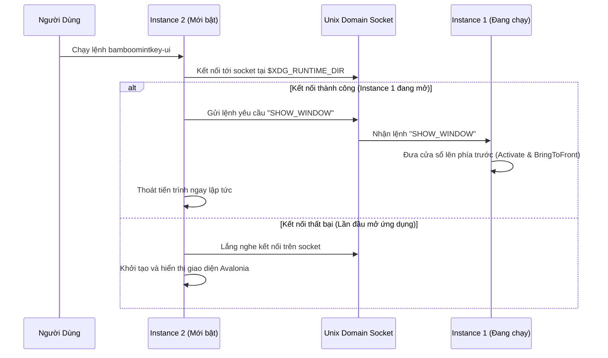

<!--
  BambooMintKey - Vietnamese Telex Input Method Editor
  Copyright (c) 2026 Dương Gia Long and LMO contributors
  SPDX-License-Identifier: MIT
-->

# 007_05 — Thiết Kế Chi Tiết Giao Diện Cài Đặt Avalonia Linux (`BambooMintKey.UI.Linux`)

**Mã tài liệu:** `007_05_UILinux_Design`  
**Giai đoạn:** Phase 7 — Chuẩn bị và Triển khai nền tảng Linux / Fcitx5  
**Thuộc module:** `src/BambooMintKey.UI.Linux`  
**Trạng thái:** ✅ Đã phê duyệt thiết kế  
**Tài liệu tham chiếu:** [007_01_InvestigationForLinux.md](file:///home/lmo1720/Fcitx-Bamboo-Mint/BambooMintKey/docs/2.Design/Phase7/007_01_InvestigationForLinux.md), [007_002_Roadmap.md](file:///home/lmo1720/Fcitx-Bamboo-Mint/BambooMintKey/docs/2.Design/Phase7/007_002_Roadmap.md), [007_04_Fcitx5_Addon_Design.md](file:///home/lmo1720/Fcitx-Bamboo-Mint/BambooMintKey/docs/2.Design/Phase7/007_04_Fcitx5_Addon_Design.md)

---

## 1. Mục Tiêu Kỹ Thuật

1. **Hoàn Toàn Độc Lập Với Mã Nguồn Windows**: Tạo mới project `src/BambooMintKey.UI.Linux` bằng Avalonia UI + F# (.NET 10). Không can thiệp hay sửa đổi bất kỳ tệp nào trong `BambooMintKey.UI` để giữ nguyên trạng thái ổn định cho bản cập nhật Windows.
2. **Loại Bỏ 100% Win32 P/Invoke**: Tuyệt đối không dùng các hàm API Windows (`FindWindowW`, `ShowWindow`), Shared Memory Win32 hay Windows Registry.
3. **Cấu Hình Chuẩn FreeDesktop XDG & Ghi Nguyên Tử (Atomic Save)**: Lưu trữ cấu hình tại thư mục chuẩn XDG. Cơ chế ghi tệp nguyên tử tránh xung đột đọc/ghi với Fcitx5 daemon.
4. **Single Instance Chuẩn POSIX**: Ngăn chặn mở trùng lặp nhiều cửa sổ cài đặt bằng Unix Domain Socket, tự động đưa cửa sổ hiện có lên trước màn hình khi người dùng gọi lại ứng dụng.
5. **Đồng Bộ Trạng Thái V/E Qua D-Bus Client**: Kết nối trực tiếp với Fcitx5 Addon qua D-Bus Session Bus để điều khiển và phản hồi thay đổi chế độ gõ thời gian thực.
6. **Tích Hợp Khung Gõ Thử Nghiệm**: Tái sử dụng trực tiếp thư viện logic `BambooMintKey.Core` để người dùng có thể gõ thử nghiệm các thiết lập ngay trên giao diện cài đặt.

---

## 2. Quản Trị Cấu Hình XDG & Ghi Nguyên Tử

### 2.1. Quy Ước Đường Dẫn Lưu Trữ

Theo chuẩn FreeDesktop XDG Base Directory:
* **Thư mục cơ sở**: Lấy giá trị từ biến môi trường `$XDG_CONFIG_HOME`. Nếu biến chưa được định nghĩa, sử dụng đường dẫn mặc định `~/.config/`.
* **Thư mục ứng dụng**: `bamboomintkey/` nằm trong thư mục cơ sở.
* **Tệp cấu hình**: `config.json` nằm trong thư mục ứng dụng.

### 2.2. Thuật Toán Ghi Tệp Nguyên Tử (Mã giả)

Để ngăn chặn việc trình theo dõi file của Fcitx5 đọc phải tệp JSON đang ghi dở (gây lỗi phân tích cú pháp), quy trình lưu file phải được thực hiện theo 2 bước: ghi vào file tạm rồi đổi tên đè.

```
THUẬT TOÁN LưuCấuHìnhNguyênTử(DữLiệuCấuHình):
    ĐườngDẫnMụcTiêu = XácĐịnhĐườngDẫn("~/.config/bamboomintkey/config.json")
    TạoThưMụcNếuChưaCó(ThưMụcCha(ĐườngDẫnMụcTiêu))

    ĐườngDẫnTạm = ĐườngDẫnMụcTiêu + ".tmp." + SinhMãNgẫuNhiên()
    ChuỗiJson = ChuyểnĐổiThànhJson(DữLiệuCấuHình)

    // Bước 1: Ghi hoàn tất toàn bộ chuỗi JSON vào tệp tạm thời
    GhiNộiDungVàoFile(ĐườngDẫnTạm, ChuỗiJson)

    // Bước 2: Đổi tên file tạm đè lên file mục tiêu
    // Thao tác đổi tên trong cùng hệ thống tệp POSIX là nguyên tử (Atomic Rename)
    ĐổiTênFile(Nguồn = ĐườngDẫnTạm, Đích = ĐườngDẫnMụcTiêu, ChoPhépGhiĐè = Đúng)
HẾT THUẬT TOÁN
```

---

## 3. Cơ Chế Khởi Chạy Duy Nhất (Single Instance) Chuẩn POSIX

Thay thế việc dò tìm cửa sổ Win32 bằng cơ chế IPC qua Unix Domain Socket trong không gian người dùng.



### Thuật toán điều phối Single Instance (Mã giả):

```
THUẬT TOÁN QuảnLýSingleInstance():
    ĐườngDẫnSocket = KếtHợpĐườngDẫn($XDG_RUNTIME_DIR, "bamboomintkey-ui.sock")

    THỬ:
        ClientSocket = KếtNốiSocket(ĐườngDẫnSocket)
        NẾU KếtNốiThànhCông THÌ:
            GửiThôngĐiệp(ClientSocket, "SHOW_WINDOW")
            ĐóngSocket(ClientSocket)
            ThoátTiếnTrình(MãLỗi = 0)
    BẮT LỖI KếtNốiThấtBại:
        // Chưa có instance nào chạy, hoặc socket cũ còn sót lại sau sự cố tắt máy
        XóaFileNếuTồnTại(ĐườngDẫnSocket)
        ServerSocket = TạoVàLắngNgheSocket(ĐườngDẫnSocket)
        BắtĐầuLuồngNgầmLắngNghe(ServerSocket, KhiNhậnYêuCầuShow)

    KhởiChạyGiaoDiệnAvalonia()
HẾT THUẬT TOÁN
```

---

## 4. Tích Hợp D-Bus Client (Đồng Bộ V/E Thời Gian Thực)

### 4.1. Đặc Tả Giao Diện Giao Tiếp D-Bus

Giao diện cài đặt kết nối với Fcitx5 Addon thông qua các định danh chuẩn:
* **Tên Dịch Vụ:** `org.fcitx.Fcitx5.BambooMintKey`
* **Đường Dẫn Đối Tượng:** `/org/fcitx/Fcitx5/BambooMintKey`
* **Giao Diện:** `org.fcitx.Fcitx5.BambooMintKey1`

| Tên Lệnh / Tín Hiệu | Hướng Giao Tiếp | Dữ Liệu Trao Đổi | Mục Đích |
|---|---|---|---|
| `GetVietnameseMode` | UI -> Addon | Trả về `Boolean` | Truy vấn trạng thái ban đầu khi vừa mở cửa sổ cài đặt. |
| `SetVietnameseMode` | UI -> Addon | Tham số `Boolean` | Chuyển chế độ gõ khi người dùng click công tắc trên giao diện. |
| `ModeChanged` | Addon -> UI | Tham số `Boolean` | Bắt tín hiệu khi chế độ gõ bị đổi từ bên ngoài (ví dụ: người dùng bấm phím tắt trong ứng dụng khác). |

### 4.2. Thuật toán Đồng Bộ Hai Chiều (Mã giả):

```
// Luồng 1: Người dùng tương tác trên giao diện
KHI NgườiDùngBấmNútChuyểnChếĐộ(TrạngTháiMới):
    GửiLệnhDbus("SetVietnameseMode", TrạngTháiMới)

// Luồng 2: Nhận tín hiệu từ hệ thống bên ngoài
KHI NhậnĐượcTínHiệuDbus("ModeChanged", TrạngTháiMới):
    ChuyểnVàoLuồngGiaoDiệnChính(UI_Thread):
        CậpNhậtCôngTắcTrênGiaoDiện(TrạngTháiMới)
        CậpNhậtBiểuTượngTrạngThái(TrạngTháiMới)
```

---

## 5. Thiết Kế Giao Diện Đa Tab & Khung Gõ Thử Nghiệm

Giao diện bao gồm 6 tab chức năng trực quan:

1. **Tab Cơ Bản**: Lựa chọn kiểu gõ (Telex), bảng mã hiển thị (Unicode dựng sẵn, tổ hợp, TCVN3), công tắc bật/tắt gõ tiếng Việt.
2. **Tab Nâng Cao**: Cấu hình quy tắc đặt dấu (Mới/Cũ), cơ chế tự động khôi phục từ tiếng Anh, cơ chế bỏ dấu tự do, cho phép ký tự `w` đầu từ thành `ư`.
3. **Tab Phím Tắt**: Danh mục các tổ hợp phím tắt nhanh để lật chế độ V/E (`Ctrl+Shift`, `Alt+Z`).
4. **Tab Bảng Gõ Tắt (Macro)**: Danh sách bảng từ viết tắt tùy biến của người dùng.
5. **Tab Gõ Thử Nghiệm**: Khung nhập liệu độc lập kết nối trực tiếp với F# Core, cho phép thử nghiệm ngay các thay đổi cấu hình mà không phụ thuộc vào trạng thái chạy của Fcitx5.
6. **Tab Thông Tin**: Phiên bản phần mềm, giấy phép nguồn mở, liên kết tài liệu dự án.

### Thuật toán Khung Gõ Thử Nghiệm (Mã giả):

```
KHỞI TẠO KhungGõThửNghiệm:
    LocalState = WordState.Empty
    LocalConfig = LấyCấuHìnhHiệnTạiTừGiaoDiện()

KHI CóSựKiệnNhấnPhímTrongKhungThử(KeyEvent):
    KýTự = LấyKýTựUnicode(KeyEvent)
    Input = TạoKeyInput(KýTự)

    (NewState, Action) = TelexEngine.processKey(LocalState, Input, LocalConfig)
    LocalState = NewState

    CậpNhậtVănBảnHiểnThị(KhungThử, LocalState.TransformedText)
    NgănChặnSựKiệnMặcĐịnhCủaHệThống()
```

---

## 6. Tích Hợp Môi Trường Desktop Linux

### 6.1. Đặc Tả Tệp Desktop Entry (`bamboomintkey-settings.desktop`)

Tệp được đặt tại `~/.local/share/applications/` với các thuộc tính định danh:
* **Tên hiển thị:** `BambooMintKey Settings` (Hỗ trợ đa ngôn ngữ: Tiếng Việt, Tiếng Anh).
* **Lệnh khởi chạy:** `bamboomintkey-ui`.
* **Biểu tượng (Icon):** `bamboomintkey`.
* **Phân loại ứng dụng:** Tiện ích hệ thống, Cài đặt (`Settings;Utility;`).
* **Định danh cửa sổ (StartupWMClass):** `BambooMintKey.UI.Linux`.

### 6.2. Biểu Tượng Hệ Thống (Icon)

Cung cấp tệp vector SVG thương hiệu (lá tre xanh Bamboo viền mint) đặt tại thư mục chuẩn:
`~/.local/share/icons/hicolor/scalable/apps/bamboomintkey.svg`.

---

## 7. Ma Trận Kiểm Thử Kỹ Thuật (Test Matrix & Test Cases)

| Test ID | Tên Hạng Mục | Các Bước Thực Hiện (Input) | Kết Quả Mong Đợi (Expected Output) | Tiêu Chí Đánh Giá (Pass/Fail) |
|:---:|---|---|---|---|
| **`TC-UI-01`** | Toàn vẹn thư mục cấu hình | Khởi động ứng dụng trên máy mới chưa có cấu hình | Tự tạo thư mục `~/.config/bamboomintkey/` và sinh file `config.json` mặc định chuẩn cú pháp | ✅ PASS nếu không phát sinh lỗi khởi tạo. |
| **`TC-UI-02`** | An toàn khi lưu cấu hình | Thay đổi một số tùy chọn và bấm nút "Lưu" | Tệp `config.json` được cập nhật chính xác, không bao giờ bị rỗng hoặc lỗi cú pháp giữa chừng | ✅ PASS nếu nội dung JSON toàn vẹn 100%. |
| **`TC-UI-03`** | Cơ chế Single Instance | Mở ứng dụng lần thứ nhất, sau đó mở tiếp lần thứ hai từ terminal | Lần mở thứ hai lập tức thoát; cửa sổ thứ nhất tự động kích hoạt và nổi lên trước màn hình | ✅ PASS nếu chỉ có duy nhất 1 instance chạy. |
| **`TC-UI-04`** | Tab gõ thử nghiệm | Chuyển sang tab Gõ thử nghiệm, gõ chuỗi phím `t-i-e-e-n-g-s` | Khung văn bản hiển thị từ `"tiếng"` chính xác theo đúng cấu hình đang chọn trên giao diện | ✅ PASS nếu gõ thử nghiệm hoạt động độc lập tốt. |
| **`TC-UI-05`** | Bắt tín hiệu D-Bus tự động | Đang mở cửa sổ Cài đặt, dùng lệnh terminal đảo trạng thái gõ của Fcitx5 Addon | Nút công tắc và biểu tượng trên giao diện tự động lật trạng thái tức thì mà không cần thao tác lại | ✅ PASS nếu phản hồi tín hiệu dưới 50 mili-giây. |
| **`TC-UI-06`** | Khởi chạy từ Menu Desktop | Tìm kiếm "BambooMintKey" trong Menu ứng dụng hệ thống và nhấp chuột mở | Cửa sổ cài đặt xuất hiện đúng biểu tượng thương hiệu và tên tiếng Việt chuẩn | ✅ PASS nếu tích hợp hoàn hảo vào môi trường desktop. |
