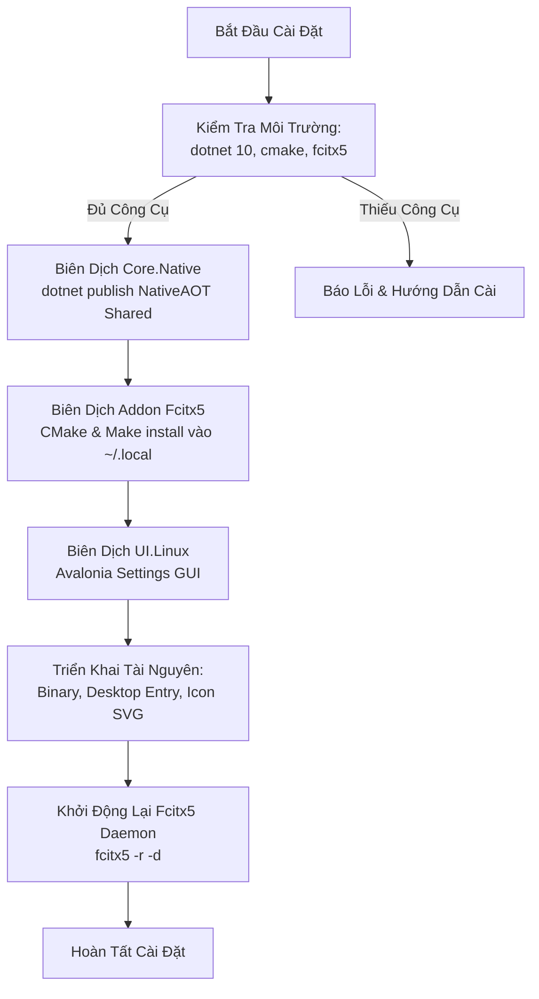

<!--
  BambooMintKey - Vietnamese Telex Input Method Editor
  Copyright (c) 2026 Dương Gia Long and LMO contributors
  SPDX-License-Identifier: MIT
-->

# 007_06 — Kế Hoạch Kiểm Thử E2E & Kịch Bản Đóng Gói Phân Phối (`Delivery & Testing`)

**Mã tài liệu:** `007_06_E2E_TestPlan_and_Delivery`  
**Giai đoạn:** Phase 7 — Chuẩn bị và Triển khai nền tảng Linux / Fcitx5  
**Thuộc module:** Toàn bộ giải pháp `BambooMintKey` trên Linux  
**Trạng thái:** ✅ Đã phê duyệt thiết kế  
**Tài liệu tham chiếu:** [007_01_InvestigationForLinux.md](file:///home/lmo1720/Fcitx-Bamboo-Mint/BambooMintKey/docs/2.Design/Phase7/007_01_InvestigationForLinux.md), [007_002_Roadmap.md](file:///home/lmo1720/Fcitx-Bamboo-Mint/BambooMintKey/docs/2.Design/Phase7/007_002_Roadmap.md), [007_04_Fcitx5_Addon_Design.md](file:///home/lmo1720/Fcitx-Bamboo-Mint/BambooMintKey/docs/2.Design/Phase7/007_04_Fcitx5_Addon_Design.md)

---

## 1. Mục Tiêu Kế Hoạch

1. **Xác Minh Chất Lượng Toàn Diện (End-to-End)**: Đảm bảo bộ gõ BambooMintKey hoạt động mượt mà, chính xác, không giật lag trên các môi trường hiển thị Linux phổ biến (**Wayland** và **X11**) và các toolkit giao diện khác nhau (GTK, Qt, Chromium/Electron, Terminal).
2. **Kiểm Chứng Ngữ Pháp Tiếng Việt**: Đảm bảo toàn bộ các tính năng gõ Telex, dấu thanh, âm đệm, từ vay mượn tiếng Anh hoạt động đồng nhất với bản Windows.
3. **Quy Trình Cài Đặt "Một Lệnh" (One-Command Deployment)**: Cung cấp kịch bản tự động biên dịch và cài đặt hoàn chỉnh vào không gian người dùng (`~/.local/`), không đòi hỏi quyền `root` hay can thiệp vào tệp hệ thống `/usr/`.
4. **Cơ Chế Gỡ Cài Đặt Sạch Sẽ (Clean Uninstallation)**: Xóa sạch toàn bộ các thư viện và cấu hình khi người dùng muốn gỡ cài đặt.

---

## 2. Ma Trận Tương Thích Môi Trường (Compatibility Matrix)

| Nhóm Nền Tảng | Thành Phần / Ứng Dụng Đại Diện | Giao Thức Nhập Liệu | Trọng Tâm Kiểm Thử |
|---|---|---|---|
| **Display Server** | **GNOME Wayland** (Ubuntu, Fedora)<br>**KDE Plasma Wayland**<br>**X11 (Xorg)** (XFCE, Mint Cinnamon) | `text-input-v3`<br>`zwp_input_method_v2`<br>`XIM` | - Inline Preedit không bị nhấp nháy.<br>- Con trỏ chuột bám sát vị trí gõ văn bản.<br>- Không bị mất phím khi gõ tốc độ cao (> 80 WPM). |
| **GTK Apps** | Mozilla Firefox, GNOME Text Editor, Gedit, Inkscape | `im-module=fcitx5` (GTK3 / GTK4) | - Chốt từ mượt mà khi ấn Space / Enter.<br>- Hỗ trợ định dạng gạch chân Preedit styling. |
| **Qt Apps** | Telegram Desktop, KDE Dolphin, VLC, OBS Studio | `im-module=fcitx5` (Qt5 / Qt6) | - Không bị nuốt phím Space / Backspace.<br>- Phản hồi tức thì khi chuyển tab cửa sổ. |
| **Chromium / Electron** | Google Chrome, Microsoft Edge, VS Code, Discord, Slack | Wayland IME / Ozone platform | - Không bị duplicate ký tự (lặp chữ).<br>- Tương thích tính năng tự động gợi ý (Autocomplete) của IDE. |
| **Terminal Emulators** | GNOME Terminal, Alacritty, Kitty, Konsole | Native Terminal Input | - Xử lý đúng chế độ commit không bị vỡ giao diện dòng lệnh.<br>- Lệnh shell nhận đúng chuỗi UTF-8 tiếng Việt. |

---

## 3. Kịch Bản Kiểm Thử Ngữ Pháp & Hành Vi Tiếng Việt (Linguistic Scenarios)

| Mã Kịch Bản | Tên Kịch Bản | Chuỗi Phím Gõ (Keystrokes) | Kết Quả Mong Đợi (NFC UTF-8) |
|:---:|---|---|---|
| **`LNG-01`** | Telex Cơ Bản & Dấu Mũ | `v-i-e-e-t-j`, `t-o-o-i`, `a-a-n` | `việt`, `tôi`, `ân` |
| **`LNG-02`** | Nguyên Âm Kép Móc & Trăng | `d-u-w-o-w-n-g-f`, `a-w-n-s` | `đường`, `ắn` |
| **`LNG-03`** | Đặt Dấu Tự Do (Free Tone) | `t-o-a-n-s` -> `toán`, `h-o-a-f` -> `hòa` / `hoà` | Đặt đúng nguyên âm chính theo quy chuẩn mới hoặc cũ |
| **`LNG-04`** | Khôi Phục Từ Tiếng Anh | `i-n-t-e-r-n-e-t`, `c-e-n-t-e-r`, `f-o-r-m` | `internet`, `center`, `form` (không biến thành `intơnét`, `cêntơ`) |
| **`LNG-05`** | Lặp Phím Thoát Dấu (Undo) | `a-s-s` -> `as`, `d-d-d` -> `dd`, `o-o-o` -> `oo` | Khôi phục lại ký tự thô ban đầu |
| **`LNG-06`** | Ký Tự `w` Đầu Từ | `w-a-n-g` -> `ương` hoặc `wang` | Theo thiết lập `AllowLeadingWAsU` trong cấu hình |
| **`LNG-07`** | Xóa Lùi Nhanh (Backspace Rollback) | Gõ `t-h-u-y-e-e-n-f` (`thuyền`), bấm Backspace 4 lần | Rút lùi lần lượt: `thuyền` -> `thuyên` -> `thuê` -> `thu` -> `th` |
| **`LNG-08`** | Giữ Nguyên Chữ Hoa / Thường | `V-i-e-e-t-j` -> `Việt`, `V-I-E-E-T-J` -> `VIỆT` | Bảo toàn chữ hoa đầu từ (TitleCase) và viết hoa toàn bộ (UpperCase) |

---

## 4. Đặc Tả Kịch Bản Cài Đặt Tự Động (`scripts/install_linux.sh`)

Script cài đặt được thiết kế để chạy hoàn toàn trong không gian người dùng thông thường (`non-root`), ghi dữ liệu vào thư mục tiêu chuẩn `~/.local`.



### Thuật toán Kịch bản Cài đặt (Mã giả):

```
THUẬT TOÁN KịchBảnCàiĐặt():
    Xác định ThưMụcGốc của kho mã nguồn

    // Bước 1: Kiểm tra công cụ biên dịch bắt buộc
    NẾU KHÔNG CÓ (dotnet VÀ cmake VÀ fcitx5) THÌ:
        InThôngBáo("Lỗi: Thiếu công cụ build! Yêu cầu .NET 10 SDK, CMake và Fcitx5")
        DừngTiếnTrình(MãLỗi = 1)

    // Bước 2: Biên dịch Core.Native thành tệp chia sẻ .so
    InThôngBáo("[1/3] Đang biên dịch Core.Native (C# NativeAOT)...")
    ChạyLệnh(dotnet publish, ĐườngDẫn="src/BambooMintKey.Core.Native", CấuHình=Release, NativeAOT=True)

    // Bước 3: Biên dịch plugin C++ Fcitx5 Addon
    InThôngBáo("[2/3] Đang biên dịch Fcitx5 Addon (C++/CMake)...")
    CấuHìnhCMake(ĐườngDẫn="src/BambooMintKey.Fcitx5", TiềnTốCàiĐặt="~/.local")
    ThựcThiBiênDịchVàCàiĐặt(make install)

    // Bước 4: Biên dịch ứng dụng Cài đặt Avalonia
    InThôngBáo("[3/3] Đang biên dịch ứng dụng Cài đặt (Avalonia UI)...")
    ChạyLệnh(dotnet publish, ĐườngDẫn="src/BambooMintKey.UI.Linux", CấuHình=Release)

    // Bước 5: Sao chép tệp thực thi và tích hợp desktop
    SaoChépTệp(TệpThựcThiUI -> "~/.local/bin/bamboomintkey-ui")
    SaoChépTệp(TệpDesktopEntry -> "~/.local/share/applications/")
    SaoChépTệp(BiểuTượngSVG -> "~/.local/share/icons/hicolor/scalable/apps/")

    // Bước 6: Khởi động lại daemon Fcitx5 để nạp bộ gõ mới
    KhởiĐộngLạiDaemon("fcitx5 -r -d")
    InThôngBáo("Cài đặt thành công! BambooMintKey đã sẵn sàng sử dụng.")
HẾT THUẬT TOÁN
```

---

## 5. Đặc Tả Kịch Bản Gỡ Cài Đặt Sạch Sẽ (`scripts/uninstall_linux.sh`)

Kịch bản gỡ bỏ thu hồi triệt để mọi tệp tin đã tạo ra trên hệ thống mà không làm ảnh hưởng đến các cấu hình khác của Fcitx5.

### Danh mục các tệp tin được thu hồi:
1. Thư viện lõi: `~/.local/lib/libBambooMintKeyCore.so`.
2. Plugin Fcitx5: `~/.local/lib/fcitx5/bamboomintkey-fcitx5.so`.
3. Tệp định nghĩa bộ gõ: `~/.local/share/fcitx5/inputmethod/bamboomintkey.conf`.
4. Tệp metadata addon: `~/.local/share/fcitx5/addon/bamboomintkey-addon.conf`.
5. Tệp thực thi giao diện: `~/.local/bin/bamboomintkey-ui`.
6. Lối tắt ứng dụng: `~/.local/share/applications/bamboomintkey-settings.desktop`.
7. Biểu tượng SVG: `~/.local/share/icons/hicolor/scalable/apps/bamboomintkey.svg`.

### Thuật toán Kịch bản Gỡ cài đặt (Mã giả):

```
THUẬT TOÁN KịchBảnGỡCàiĐặt():
    InThôngBáo("Đang tiến hành dọn dẹp các tệp tin BambooMintKey...")

    CHO MỖI Tệp TRONG DanhMụcTệpĐượcThuHồi:
        XóaTệpNếuTồnTại(Tệp)

    InThôngBáo("Đang khởi động lại Fcitx5...")
    KhởiĐộngLạiDaemon("fcitx5 -r -d")

    InThôngBáo("Hoàn tất! Toàn bộ BambooMintKey đã được gỡ bỏ sạch sẽ khỏi hệ thống.")
HẾT THUẬT TOÁN
```

---

## 6. Ma Trận Kiểm Thử E2E Toàn Diện (End-to-End Test Matrix)

| Test ID | Tên Hạng Mục | Các Bước Kiểm Thử | Kết Quả Mong Đợi | Tiêu Chí Pass/Fail |
|:---:|---|---|---|:---:|
| **`TC-E2E-01`** | Kiểm thử Cài đặt sạch | Chạy script cài đặt tự động trên máy mới nạp Fcitx5 | Script hoàn tất 0 lỗi; Fcitx5 nhận diện bộ gõ `BambooMintKey`; gõ tiếng Việt được ngay lập tức | ✅ PASS |
| **`TC-E2E-02`** | Gõ trên phiên Wayland | Mở Firefox và Text Editor trên Wayland, gõ các từ kịch bản `LNG-01` đến `LNG-08` | Ký tự hiển thị chuẩn xác, không lệch con trỏ, không rơi rớt phím khi gõ nhanh | ✅ PASS |
| **`TC-E2E-03`** | Gõ trên phiên X11 | Chuyển sang phiên X11, mở VS Code và Terminal gõ thử nghiệm | Chữ hiển thị mượt mà, phím tắt `Ctrl+Shift+P` trong VS Code không bị nuốt | ✅ PASS |
| **`TC-E2E-04`** | Đồng bộ D-Bus thời gian thực | Mở đồng thời Settings GUI và Text Editor; bấm phím tắt chuyển mode V/E trên bàn phím | Biểu tượng khay hệ thống và công tắc trên Settings GUI tự động đổi trạng thái tức thì | ✅ PASS |
| **`TC-E2E-05`** | Nạp lại tùy chọn động | Trong Settings GUI, đổi kiểu dấu từ Mới sang Cũ và bấm Lưu; quay lại Text Editor gõ `hoa` | Addon tự động nạp cấu hình mới qua `inotify` mà không cần restart Fcitx5 | ✅ PASS |
| **`TC-E2E-06`** | Cách ly khi chuyển cửa sổ | Mở 4 cửa sổ song song (Chrome, VS Code, Terminal, Telegram); gõ dở dang và chuyển focus liên tục | Không có cửa sổ nào bị dính chữ của cửa sổ khác; các context hoàn toàn biệt lập | ✅ PASS |
| **`TC-E2E-07`** | Kiểm thử Gỡ cài đặt | Chạy script gỡ bỏ tự động | Toàn bộ tệp cài đặt bị xóa sạch sẽ, hệ thống trở về trạng thái nguyên bản trước khi cài | ✅ PASS |
