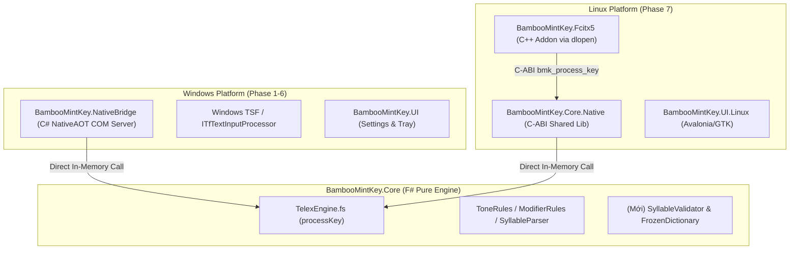
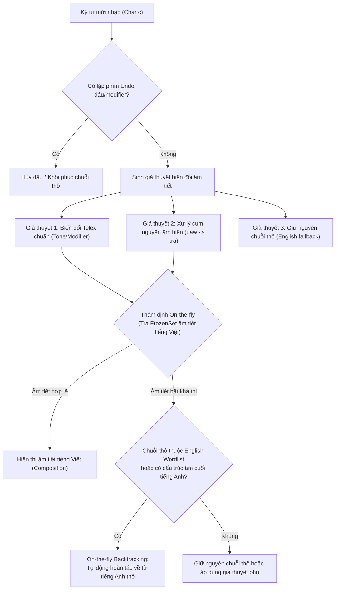

<!--
  BambooMintKey - Vietnamese Telex Input Method Editor for Windows & Linux
  Copyright (c) 2026 Dương Gia Long and LMO contributors
  SPDX-License-Identifier: MIT
-->

# 008_01 — Điều Tra Tích Hợp Từ Điển & Cơ Chế On-The-Fly Độc Lập Đa Nền Tảng (Windows & Linux)

**Mã tài liệu:** `008_01_InvestigationForDictionary`  
**Giai đoạn:** Phase 8 — Tích hợp từ điển & sửa lỗi vặt  
**Thuộc module:** `BambooMintKey.Core` (dùng chung độc lập cho cả Windows & Linux)  
**Trạng thái:** 🕐 Chờ thẩm định (Đã cập nhật: Thiết kế On-The-Fly, Từ điển MIT & Tính độc lập nền tảng)  
**Tài liệu tham chiếu:** [007_01_InvestigationForLinux.md](../Phase7/007_01_InvestigationForLinux.md), `README.md`, `THIRD-PARTY-NOTICES.md`

---

## 1. Mục Tiêu

1. **Độc lập nền tảng tuyệt đối (Platform Independence & Zero-Coupling)**:
   - Toàn bộ thay đổi về từ điển, ngữ âm và cơ chế On-the-fly nằm trọn vẹn trong `BambooMintKey.Core` (F# thuần), không chứa mã phụ thuộc hệ điều hành (không Win32, không COM, không XDG/glibc).
   - **Không phá vỡ C-ABI** của Linux Fcitx5 (`BambooMintKey.Core.Native` / `BambooMintKey.Fcitx5`) và không phá vỡ TSF Bridge của Windows (`BambooMintKey.NativeBridge`). Cả hai phiên bản OS tiếp tục hoạt động độc lập và ổn định.
2. **Tự chủ nguồn từ điển tiếng Việt chuẩn MIT / CC0**:
   - Tự sinh danh sách ~7.800 âm tiết tiếng Việt hợp lệ bằng thuật toán kết hợp ma trận ngữ âm học (Phonotactics Generator) và lọc qua kho ngữ liệu mở Wikipedia tiếng Việt (Corpus Extraction).
   - Loại bỏ hoàn toàn sự phụ thuộc vào dữ liệu GPL từ IBus-Bamboo → Toàn bộ mã nguồn và dữ liệu đều đạt chuẩn **MIT / CC0 100%**.
3. **Cơ chế can thiệp On-the-fly (Per-keystroke Inline Composition)**:
   - Thẩm định và xử lý trực tiếp trên **từng phím bấm theo thời gian thực**, giữ nguyên trải nghiệm gõ phím tiếng Việt tự nhiên (như UniKey, EVKey, IBus-Bamboo).
   - **Không sử dụng Candidate Window (Popup chọn từ số 1, 2, 3...)** vì gây gián đoạn luồng suy nghĩ và giảm tốc độ gõ của người dùng.
   - Tự động hoàn tác thông minh (On-the-fly Backtracking) khi gõ từ tiếng Anh (ví dụ: `pos` hiển thị `pó`, gõ tiếp `t` lập tức quay lui về `post`).
4. **Đóng gói từ điển Zero-Path (Tự chứa, không sợ mất file)**:
   - Nhúng trực tiếp từ điển MIT làm **Embedded Resource** trong core binary. Cả bản cài đặt Windows lẫn Linux đều chạy ngay lập tức mà không cần phụ thuộc vào đường dẫn file ngoài đĩa (`%AppData%` hay `/usr/share/`).
   - Cung cấp cơ chế mở rộng nạp từ điển người dùng (User Dictionary) độc lập theo từng OS nếu cần.
5. **Sửa dứt điểm các lỗi đặt dấu và modifier trường hợp biên**:
   - Xử lý tận gốc lỗi `vuawf` → `vuằ` thành `vừa` trực tiếp tại quy tắc biến đổi cụm nguyên âm của `ModifierRules.fs` ($O(1)$) thay vì phụ thuộc vào sửa từ lúc chốt từ.
6. **Cấu trúc dữ liệu hiệu năng cao & tối ưu NativeAOT**:
   - Sử dụng `FrozenSet<string>` (.NET 8/9) với tốc độ tra cứu $O(1)$ $< 5\text{ns}$, nạp tức thì trong 3–5ms, không cấp phát rác trên GC Heap.

---

## 2. Tổng Quan Hiện Tại & Kiến Trúc Đa Nền Tảng

Bộ gõ BambooMintKey hiện đã có hai phiên bản hoạt động song song trên Windows và Linux thông qua cấu trúc phân tầng:



### 2.1. Điểm nghẽn và nguyên nhân gốc rễ các lỗi hiện tại

| Thành phần | Hiện trạng | Hạn chế / Nguyên nhân gốc rễ |
|---|---|---|
| **Từ điển tiếng Việt** | ❌ Chưa tích hợp | Hiện chỉ kiểm định bằng heuristic lỏng lẻo (`isValidVietnameseSyllableStructure`). Không phân biệt được âm tiết thực tế có nghĩa và âm tiết dị dạng. |
| **Từ điển tiếng Anh** | ⚠️ Hardcode ~200 từ | `EnglishProtection.CommonEnglishWords` quá ít từ. Khi gõ từ dài như `score`, `require`, `platform` vẫn có nguy cơ bị bộ gõ nuốt phím nếu không nằm trong danh sách. |
| **Lỗi `vuawf` → `vuằ` (P3)** | ⚠️ Lỗi thứ tự ưu tiên trong `ModifierRules.fs` | Tại dòng 135–144, khi gặp phím `w`, quy tắc kiểm tra `vowels.Contains "a"` đứng TRƯỚC `vowels.Contains "u"` → biến `ua` thành `uă` (thay vì `ưa`). Gõ tiếp `f` sinh ra `vuằ`. |
| **Bản quyền dữ liệu** | ⚠️ Nguy cơ GPL từ file mượn | File `vietnamese-single-bamboo.dict` (từ IBus-Bamboo) mang license GPL-3.0, gây rủi ro "lây nhiễm" license nếu nhúng vào core MIT. |
| **Tính độc lập 2 OS** | ⚠️ Chưa định rõ trong spec | Chưa làm rõ ảnh hưởng lên C-ABI của Linux và TSF của Windows khi nạp dữ liệu từ điển. |

---

## 3. Vấn Đề Cần Giải Quyết

| # | Vấn đề | Phạm vi ảnh hưởng | Giải pháp đề xuất |
|---|---|---|---|
| **P1** | Danh sách tiếng Anh hardcode, khó mở rộng | `EnglishProtection.fs` | Tách ra từ điển riêng 20.000 từ, nạp bằng `FrozenSet` tra cứu $O(1)$. |
| **P2** | Thiếu bộ thẩm định âm tiết tiếng Việt On-the-fly | `TelexEngine.fs` | Tích hợp bộ lọc 7.800 âm tiết chuẩn để nhận diện tức thì âm tiết hợp lệ/bất hợp lệ. |
| **P3** | Lỗi chuyển đổi cụm nguyên âm (`uaw` → `uă`) | `ModifierRules.fs` | Bổ sung quy tắc biến đổi cụm `ua + w → ưa` ngay tại tầng modifier. |
| **P4** | Ràng buộc bản quyền dữ liệu từ điển | `dicts/`, `THIRD-PARTY-NOTICES` | Tự sinh từ điển âm tiết chuẩn MIT/CC0 từ ngữ âm học + Wikipedia Corpus. |
| **P5** | Gõ tiếng Anh bị nhảy dấu rồi phải xóa | `TelexEngine.fs` | Cơ chế On-the-fly Backtracking quay lui phím thô tức thì trên từng phím bấm. |
| **P6** | Nguy cơ phá vỡ ABI hoặc phân mảnh 2 OS | `Core.Native` & `NativeBridge` | Thiết kế Zero-Breaking C-ABI, nhúng resource từ điển độc lập với OS. |

---

## 4. Nguồn Dữ Liệu & Giải Pháp Bản Quyền MIT

### 4.1. Cơ sở ngôn ngữ học & Tính chất bản quyền
- Tiếng Việt là ngôn ngữ đơn lập: Mọi từ ghép phức tạp đều cấu thành từ các âm tiết đơn lẻ có cấu trúc:
  $$\text{Âm tiết} = \text{Phụ âm đầu} + \text{Âm đệm/Nguyên âm chính} + \text{Phụ âm cuối} + \text{Thanh điệu}$$
- Tổng số âm tiết có nghĩa trong tiếng Việt chỉ có **khoảng ~6.500 đến ~7.880 âm tiết**.
- Theo luật sở hữu trí tuệ quốc tế, **danh sách từ vựng/âm tiết (lexicon/wordlist) thuần túy là dữ kiện thực tế (facts)**, không có tính sáng tạo văn học nên không thuộc đối tượng bảo hộ quyền tác giả.

### 4.2. Quy trình tự sinh tập từ điển MIT (`scripts/generate_mit_dict.py`)
1. **Phonotactics Matrix (Ma trận ngữ âm):**
   - 27 phụ âm đầu hợp lệ (`b`, `c`, `ch`, `d`, `đ`, `g`, `gh`, `gi`, `h`, `k`, `kh`, `l`, `m`, `n`, `ng`, `ngh`, `nh`, `p`, `ph`, `qu`, `r`, `s`, `t`, `th`, `tr`, `v`, `x`, và rỗng).
   - ~40 cụm nguyên âm chính hợp lệ (`a`, `ă`, `â`, `e`, `ê`, `i`, `o`, `ô`, `ơ`, `u`, `ư`, `y`, `ia`, `iê`, `oa`, `uô`, `ươ`...).
   - 8 phụ âm cuối (`c`, `ch`, `m`, `n`, `ng`, `nh`, `p`, `t`, và rỗng).
   - 6 thanh điệu (kèm ràng buộc âm tắc `c, p, t, ch` chỉ đi với Sắc/Nặng).
2. **Lọc thực tế qua Corpus mở (Wikipedia tiếng Việt Dump - CC0 / CC-BY-SA):**
   - Quét qua kho bài viết mở của Wikipedia tiếng Việt để lọc các âm tiết có tần suất xuất hiện thực tế.
3. **Kết quả:**
   - Tạo ra file `dicts/vietnamese-syllables-mit.dict` (~7.800 âm tiết chuẩn xác tuyệt đối).
   - **Giấy phép: MIT / CC0 100%**.
   - An toàn tuyệt đối để nhúng trực tiếp vào binary NativeAOT (Embedded Resource) hoặc đóng gói kèm theo ứng dụng.

---

## 5. Cấu Trúc Lưu Trữ & Hiệu Năng Bộ Nhớ

### 5.1. So sánh các cấu trúc dữ liệu

| Tiêu chí | `Map<string, Set>` (Đề xuất cũ) | SQLite (Đề xuất cũ) | `FrozenSet<string>` (.NET 8+) | Double-Array Trie (DAT) |
|---|---|---|---|---|
| **Tốc độ tra cứu** | $O(\log N)$ | Chậm (I/O, SQL parser) | **$O(1)$ siêu tốc** | **$O(k)$ theo độ dài từ** |
| **Độ trễ trung bình** | $\approx 50\text{ns}$ | $0.5 - 2\text{ms}$ | **$< 5\text{ns}$** | **$< 2\text{ns}$** |
| **Chi phí RAM** | Cao (~30MB do node heap) | Lớn (engine SQLite + cache) | **Thấp (~2MB)** | **Cực thấp (~500KB)** |
| **Thời gian khởi động**| 50–100ms parse chuỗi | Phụ thuộc mở file DB | **3–5ms** | **0ms (MMap binary)** |
| **Độ phức tạp build** | Thấp | Rất cao (bundle `e_sqlite3`) | **Rất thấp (built-in .NET)** | Trung bình (cần tool build nhị phân) |
| **NativeAOT Friendly** | Trung bình | Kém | **Rất tốt** | **Hoàn hảo** |

### 5.2. Quyết định kỹ thuật
- **Giai đoạn 1:** Sử dụng `System.Collections.Frozen.FrozenSet<string>` (chuẩn hóa Unicode NFC, `StringComparer.OrdinalIgnoreCase`). Tận dụng triệt để tối ưu hóa mảng băm tĩnh của .NET 8/9, không phụ thuộc thư viện ngoài.
- **Loại bỏ vĩnh viễn SQLite:** SQLite không phù hợp cho pipeline gõ phím yêu cầu độ trễ sub-millisecond.

---

## 6. Kiến Trúc Can Thiệp On-The-Fly (Per-Keystroke Pipeline)

### 6.1. Tại sao On-the-fly là lựa chọn tự nhiên duy nhất cho tiếng Việt?
- **Khác biệt với CJK (Trung - Nhật - Hàn):** Tiếng Trung/Nhật là chữ tượng hình (Logographic), một phiên âm pinyin có thể ứng với hàng chục chữ Hán khác nhau nên **bắt buộc** phải có Candidate Window để chọn.
- **Đặc thù tiếng Việt (Chữ Quốc ngữ La-tinh):** Là hệ chữ ghi âm. Từng phím gõ phản ánh trực tiếp con chữ hiển thị.
- **Nguyên lý On-the-fly:** Người dùng bấm phím đến đâu, chữ biến đổi trực tiếp đến đó (Inline Composition). Không hiện popup, không chờ nhấn Space mới giật lùi Backspace để sửa từ.

### 6.2. Sơ đồ luồng xử lý On-the-fly trong `handleCharInput`



### 6.3. Giải quyết dứt điểm lỗi `vuawf` → `vừa` tại `ModifierRules.fs`

Trong [`ModifierRules.fs`](file:///home/lmo1720/Fcitx-Bamboo-Mint/BambooMintKey/src/BambooMintKey.Core/Engine/ModifierRules.fs#L124), bổ sung quy tắc nhận diện cụm `ua` khi gặp modifier `w`:

```fsharp
// Trong ModifierRules.applyModifier:
| 'w' when vowels.Contains "ua" && not (vowels.Contains "ưa") ->
    // ua + w luôn ưu tiên tạo thành ưa (như trong mưa, vừa, chưa, cưa, dưa)
    Some (vowels.Replace("ua", "ưa"))
```

---

## 7. Phân Tích Tính Độc Lập & Tác Động Lên Từng Nền Tảng (Windows vs Linux)

Để đảm bảo việc cập nhật lần này diễn ra hoàn toàn độc lập, không làm gãy vỡ kiến trúc sẵn có của bản Windows hay Linux, thiết kế tuân thủ các nguyên tắc sau:

### 7.1. Nguyên tắc cốt lõi: Phân tách hoàn toàn Tầng Core và Tầng Nền Tảng

```
┌────────────────────────────────────────────────────────────────────────┐
│                   BambooMintKey.Core (100% Platform-Agnostic)          │
│   • Pure F# Functional Engine                                          │
│   • Embedded MIT Syllable & English Dictionary                         │
│   • On-the-fly Per-keystroke Validation & Backtracking                 │
└───────────────────▲────────────────────────────────▲───────────────────┘
                    │                                │
       [Direct In-Memory Call]              [Direct In-Memory Call]
                    │                                │
┌───────────────────┴───────────────┐  ┌─────────────┴───────────────────┐
│     Bản Windows (NativeBridge)    │  │    Bản Linux (Core.Native + Fcitx)│
│ • TSF COM Server (In-process DLL) │  │ • NativeAOT Shared Library (.so)│
│ • CompositionManager (ITfRange)   │  │ • C-ABI Exports (bmk_*)         │
│ • BridgeStateManager              │  │ • C++ Fcitx5 Addon (dlopen)     │
│ • UI Windows (SharedMemory/Mutex) │  │ • UI Linux (Avalonia/GTK)       │
└───────────────────────────────────┘  └─────────────────────────────────┘
```

### 7.2. Tác động cụ thể lên Phiên Bản Windows

| Hạng mục | Cơ chế hiện tại trên Windows | Tác động sau khi cập nhật Core | Đánh giá tính độc lập |
|---|---|---|---|
| **Cơ chế hiển thị chữ** | `TSF/CompositionManager.cs` nhận `EngineAction.UpdateComposition` và gọi `ITfRange::SetText` | **Không thay đổi.** Khi Core trả về từ đã sửa On-the-fly, TSF hiển thị ngay lập tức với gạch chân soạn thảo chuẩn của Windows. | ✅ **Độc lập 100%**. Không cần sửa code TSF. |
| **Cầu nối dữ liệu** | `BridgeStateManager.cs` gọi trực tiếp `TelexEngine.processKey` | **Tương thích hoàn toàn.** Hàm `processKey` giữ nguyên signature `WordState -> KeyInput -> EngineConfig -> WordState * EngineAction`. | ✅ **Độc lập 100%**. |
| **Đóng gói từ điển** | Cần copy file vào `%LocalAppData%` hoặc thư mục cài đặt | **Tối ưu hóa:** Nhúng làm **Embedded Resource** trong DLL. Installer Windows không cần quản lý file `.dict` rời, tránh lỗi user vô tình xóa file. | ✅ **Không sợ thiếu file**. |
| **Cấu hình & UI** | `BambooMintKey.UI` qua `SharedMemoryManager` | Bổ sung cờ `EnableVietnameseDictionary` vào cấu hình. Nếu UI chưa cập nhật, Core dùng giá trị mặc định (`true`). | ✅ **Tương thích ngược**. |

### 7.3. Tác động cụ thể lên Phiên Bản Linux (Fcitx5)

| Hạng mục | Cơ chế hiện tại trên Linux | Tác động sau khi cập nhật Core | Đánh giá tính độc lập |
|---|---|---|---|
| **C-ABI Export** | `BambooMintKey.Core.Native/Exports.cs` xuất hàm `bmk_process_key`, `bmk_context_create`... | **Giữ nguyên 100% chữ ký C-ABI.** Không đổi tham số, không đổi struct C-ABI, mã hành động (`ActionUpdatePreedit = 2`) giữ nguyên. | ✅ **Zero Breaking Change**. Addon C++ không cần build lại. |
| **Cơ chế hiển thị preedit** | `BambooMintKey.Fcitx5/engine.cpp` nhận `ActionUpdatePreedit` và gọi `inputContext()->updatePreedit()` | **Không thay đổi.** Fcitx5 hiển thị chuỗi preedit biến đổi On-the-fly mượt mà trên Wayland và X11. | ✅ **Độc lập 100%**. |
| **Quản lý file từ điển** | Cần script CMake copy vào `/usr/share/bamboomintkey/dicts/` | **Tối ưu hóa:** Nhờ Embedded Resource, file `BambooMintKeyCore.so` tự chứa toàn bộ dữ liệu. Không cần phân quyền hay lo lắng distro cài vào thư mục khác chuẩn XDG. | ✅ **Độc lập 100%**. |
| **UI Linux** | `BambooMintKey.UI.Linux` chạy độc lập | Thêm toggle cấu hình riêng, không ảnh hưởng tới bản Windows. | ✅ **Độc lập 100%**. |

### 7.4. Bảo toàn tính tương thích C-ABI (`cabibridge.h` & `Exports.cs`)

Để đảm bảo bản Linux hoàn toàn không bị ảnh hưởng, toàn bộ C-ABI giữ nguyên:

```c
// Giữ nguyên hoàn toàn trong cabibridge.h:
int bmk_version();
bmk_context_t* bmk_context_create();
void bmk_context_free(bmk_context_t* ctx);
int bmk_process_key(bmk_context_t* ctx, uint32_t sym, uint32_t state);
const char* bmk_get_preedit(bmk_context_t* ctx);
const char* bmk_get_commit(bmk_context_t* ctx);
```

Mọi xử lý On-the-fly diễn ra ngầm bên trong `bmk_process_key` khi gọi tới `TelexEngine.processKey`. Đối với Fcitx5, nó chỉ nhận được sự kiện `UpdatePreedit` với chuỗi đã được thẩm định chuẩn xác.

### 7.5. Chiến lược Đóng Gói: Embedded Resource + Optional User Dict

```
                  ┌──────────────────────────────────────────────┐
                  │          BambooMintKey.Core.dll              │
                  │  (Chứa sẵn Embedded Resource MIT 100%)       │
                  │   • vietnamese-syllables-mit.dict (60KB)     │
                  │   • english-20k.dict (150KB)                 │
                  └───────────────────────▲──────────────────────┘
                                          │
                ┌─────────────────────────┴─────────────────────────┐
                │                                                   │
    [Windows Nạp Thêm Tuỳ Chọn]                         [Linux Nạp Thêm Tuỳ Chọn]
    %AppData%\BambooMintKey\user.dict                   $XDG_CONFIG_HOME/bamboomintkey/user.dict
```

1. **Từ điển lõi (Built-in Core):** Nhúng trực tiếp vào Assembly manifest qua `<EmbeddedResource>`.
   - Windows và Linux đều tự giải nén trong bộ nhớ lúc startup bằng `Assembly.GetManifestResourceStream`.
   - Dung lượng tổng cộng chỉ ~210KB nén, tăng kích thước binary không đáng kể nhưng loại trừ 100% lỗi "File Not Found" trên cả 2 OS.
2. **Từ điển người dùng mở rộng (Custom User Words - Optional):**
   - Core cung cấp hàm `MergeCustomWords(lines: string seq)`.
   - Tầng Wrapper OS (nếu muốn) đọc file custom riêng biệt của từng OS rồi đẩy vào Core, Core không bao giờ tự ý truy cập đường dẫn ổ đĩa cố định của Windows hay Linux.

---

## 8. Đề Xuất Thiết Kế Module `DictionaryService`

### 8.1. Interface trừu tượng trong Core (`Domain/IDictionaryService.fs`)

```fsharp
namespace BambooMintKey.Core.Domain

type IDictionaryService =
    /// Kiểm tra một âm tiết đơn có hợp lệ trong tiếng Việt hay không (O(1))
    abstract member IsValidVietnameseSyllable : syllable: string -> bool
    
    /// Kiểm tra từ có thuộc danh mục từ tiếng Anh thông dụng hay không (O(1))
    abstract member IsLikelyEnglishWord : word: string -> bool
```

### 8.2. Implementation nạp Embedded Resource (`Engine/FrozenDictionaryService.fs`)

```fsharp
namespace BambooMintKey.Core.Engine

open System
open System.Collections.Frozen
open System.IO
open System.Reflection
open BambooMintKey.Core.Domain

type FrozenDictionaryService(vietnameseSyllables: FrozenSet<string>, englishWords: FrozenSet<string>) =
    
    interface IDictionaryService with
        member _.IsValidVietnameseSyllable (syllable: string) =
            if String.IsNullOrEmpty syllable then false
            else vietnameseSyllables.Contains (syllable.ToLowerInvariant())

        member _.IsLikelyEnglishWord (word: string) =
            if String.IsNullOrEmpty word then false
            else englishWords.Contains (word.ToLowerInvariant())

    /// Nạp dữ liệu từ Embedded Resource (Độc lập 100% với hệ điều hành)
    static member LoadEmbedded () : IDictionaryService =
        let asm = Assembly.GetExecutingAssembly()
        
        let readResourceLines (resName: string) =
            use stream = asm.GetManifestResourceStream resName
            if isNull stream then [||]
            else
                use reader = new StreamReader(stream)
                let content = reader.ReadToEnd()
                content.Split([| '\r'; '\n' |], StringSplitOptions.RemoveEmptyEntries)
                |> Array.map (fun s -> s.Trim().ToLowerInvariant())
                |> Array.filter (fun s -> not (String.IsNullOrEmpty s) && not (s.StartsWith "#"))

        let vnWords = readResourceLines "vietnamese-syllables-mit.dict" |> (fun a -> a.ToFrozenSet(StringComparer.OrdinalIgnoreCase))
        let enWords = readResourceLines "english-20k.dict" |> (fun a -> a.ToFrozenSet(StringComparer.OrdinalIgnoreCase))
        
        new FrozenDictionaryService(vnWords, enWords) :> IDictionaryService
```

---

## 9. Kế Hoạch Triển Khai Độc Lập Cho Cả Hai Nền Tảng

| Mốc | Phạm vi | Nội dung công việc | Kiểm thử tương thích nền tảng |
|---|---|---|---|
| **M8.0** | **Data (MIT)** | Viết script sinh `vietnamese-syllables-mit.dict` (7.8k từ) và chuẩn hóa `english-20k.dict` | Chạy độc lập qua script Python/F# |
| **M8.1** | **Core.Engine** | Khắc phục lỗi `ModifierRules.fs` (quy tắc `ua + w → ưa`) & `ToneRules.fs` | Unit tests Core trên cả Windows & Linux |
| **M8.2** | **Core.Engine** | Hiện thực `FrozenDictionaryService.fs` nạp qua Embedded Resource | Benchmark tra cứu $O(1)$ ($< 5\text{ns}$) |
| **M8.3** | **Core.Engine** | Tích hợp On-the-fly Validation & Backtracking vào `TelexEngine.fs` | Test matrix gõ phím (`post`, `form`, `vuawf → vừa`) |
| **M8.4** | **Linux Check** | Build `BambooMintKey.Core.Native` và chạy test kiểm tra C-ABI không đổi | Chạy `ctest` và verify Fcitx5 addon trên Linux |
| **M8.5** | **Windows Check**| Build `BambooMintKey.NativeBridge` và verify TSF composition | Chạy test harness Windows TSF |
| **M8.6** | **UI & Packaging**| Thêm cờ cấu hình độc lập trên `UI` (Windows) và `UI.Linux` (Linux) | Đóng gói installer độc lập cho 2 OS |

---

## 10. Đánh Giá Rủi Ro & Biện Pháp Kiểm Soát

1. **Rủi ro ảnh hưởng tới C-ABI Fcitx5 trên Linux:**
   - *Biện pháp:* Toàn bộ logic từ điển nằm trọn trong `BambooMintKey.Core`. C-ABI `BambooMintKey.Core.Native` không sửa đổi bất kỳ struct hay hàm export nào. Fcitx5 C++ Addon được bảo toàn 100%.
2. **Rủi ro rò rỉ bộ nhớ hoặc giật lag trên Windows TSF:**
   - *Biện pháp:* Dữ liệu từ điển nạp một lần duy nhất vào `FrozenSet` dạng tĩnh (static singleton). Không tạo object mới khi gõ phím, đảm bảo zero-allocation cho mỗi keystroke.
3. **Rủi ro từ mới, tên riêng, mã code không có trong 7.800 âm tiết:**
   - *Biện pháp:* Khi âm tiết không có trong từ điển chuẩn nhưng không khớp quy tắc tiếng Anh, engine giữ nguyên chuỗi Telex thô tự nhiên, không tự ý xóa phím của người dùng. Cờ `StrictSyllableMode` luôn ở trạng thái tắt mặc định.

---

## 11. Kết Luận

- **Độc lập tuyệt đối:** Việc nâng cấp tập trung hoàn toàn trong `BambooMintKey.Core`. Cả bản Windows TSF lẫn Linux Fcitx5 đều tự động hưởng lợi mà không cần tái cấu trúc tầng Native Bridge hay C-ABI.
- **Embedded Resource thông minh:** Nhúng từ điển MIT trực tiếp vào assembly loại trừ hoàn toàn sự phụ thuộc vào đường dẫn hệ thống file của từng OS.
- **On-the-fly tự nhiên:** Xử lý trực tiếp trên từng phím bấm, mang lại cảm giác gõ mượt mà, phản hồi tức thì, không popup, không gián đoạn.
- **Bản quyền sạch 100%:** Tự sinh từ điển âm tiết chuẩn MIT/CC0, giải phóng hoàn toàn dự án khỏi rủi ro GPL.

---

## 12. Tham Khảo Mã Nguồn

- Core Engine: [`src/BambooMintKey.Core/Engine/TelexEngine.fs`](file:///home/lmo1720/Fcitx-Bamboo-Mint/BambooMintKey/src/BambooMintKey.Core/Engine/TelexEngine.fs)
- Biến đổi Modifier: [`src/BambooMintKey.Core/Engine/ModifierRules.fs`](file:///home/lmo1720/Fcitx-Bamboo-Mint/BambooMintKey/src/BambooMintKey.Core/Engine/ModifierRules.fs)
- C-ABI Linux: [`src/BambooMintKey.Core.Native/Exports.cs`](file:///home/lmo1720/Fcitx-Bamboo-Mint/BambooMintKey/src/BambooMintKey.Core.Native/Exports.cs)
- Fcitx5 Addon: [`src/BambooMintKey.Fcitx5/engine.cpp`](file:///home/lmo1720/Fcitx-Bamboo-Mint/BambooMintKey/src/BambooMintKey.Fcitx5/engine.cpp)
- Windows Bridge: [`src/BambooMintKey.NativeBridge/TSF/BridgeStateManager.cs`](file:///home/lmo1720/Fcitx-Bamboo-Mint/BambooMintKey/src/BambooMintKey.NativeBridge/TSF/BridgeStateManager.cs)
- Cấu hình điều tra Linux: [007_01_InvestigationForLinux.md](../Phase7/007_01_InvestigationForLinux.md)
