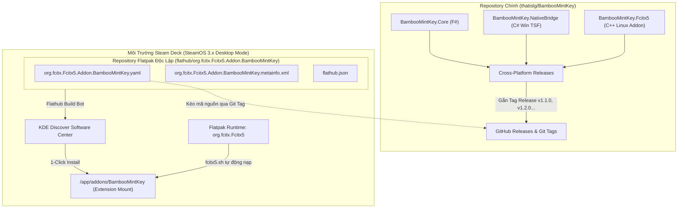

<!--
  BambooMintKey - Vietnamese Telex Input Method Editor
  Copyright (c) 2026 Dương Gia Long and LMO contributors
  SPDX-License-Identifier: MIT
-->

# 009_02 — Kiến Trúc Phân Phối Flatpak Độc Lập cho Fcitx 5 (Steam Deck & Flathub)

**Mã tài liệu:** `009_02_Flathub_Independent_Architecture`  
**Giai đoạn:** Phase 9 — Phân phối Flatpak & Tương thích Steam Deck  
**Thuộc module:** `manifests/flatpak/`, `scripts/linux/package_flatpak.sh`, `BambooMintKey.Fcitx5`  
**Trạng thái:** ✅ Thiết kế kiến trúc hoàn thiện (Architecture & Packaging Specification)  

---

## 1. Mục tiêu & Nguyên tắc thiết kế độc lập

Yêu cầu tiên quyết được đặt ra: **Xây dựng giải pháp phân phối chính thức qua Flathub (Giải pháp 3) mà hoàn toàn không làm biến đổi hay gây ảnh hưởng tới mã nguồn hiện tại** trong thư mục `src/`, vì mã nguồn này đang đóng vai trò là xương sống đa nền tảng cho **Windows (TSF)**, **Linux (DEB/RPM)**, và mục tiêu sắp tới là **macOS**.

Để đạt được điều này, hệ thống áp dụng 3 nguyên tắc thiết kế cốt lõi:

```
┌────────────────────────────────────────────────────────────────────────┐
│                   3 NGUYÊN TẮC THIẾT KẾ CỐT LÕI                        │
├────────────────────────────────────────────────────────────────────────┤
│ 1. Không xâm lấn mã nguồn (Zero Source Intrusion):                    │
│    Toàn bộ cấu hình Flatpak nằm trong manifests/flatpak/ & scripts/.   │
│    Mã nguồn Core (F#), Native (C# NativeAOT), Addon (C++) giữ nguyên. │
├────────────────────────────────────────────────────────────────────────┤
│ 2. Vòng đời phát hành tách rời (Decoupled Release Lifecycle):          │
│    Gói Flatpak đóng vai trò là một "Downstream Recipe", chỉ tham chiếu │
│    tới các Release Tag chính thức (v1.1.0, v1.2.0, ...) từ GitHub.     │
├────────────────────────────────────────────────────────────────────────┤
│ 3. Trải nghiệm người dùng Steam Deck chuẩn mực:                        │
│    Không cần sudo/root, không lo bị xóa khi cập nhật SteamOS OTA,      │
│    cài đặt và tự động cập nhật 1-click qua KDE Discover Store.         │
└────────────────────────────────────────────────────────────────────────┘
```

---

## 2. Kiến trúc tổng thể & Mô hình phân ly (Decoupled Architecture)

Hệ thống được tổ chức thành hai thực thể độc lập hoàn toàn về mặt quản trị và phân phối:



### Điểm mấu chốt của mô hình:
1. **Repository chính (`thatislg/BambooMintKey`):** Tập trung vào logic nghiệp vụ, thuật toán gõ tiếng Việt, bảng mã Unicode, sửa lỗi và phát hành các tag phiên bản ổn định.
2. **Module đóng gói (`manifests/flatpak/` & `scripts/linux/package_flatpak.sh`):** Chứa manifest và metadata theo đúng chuẩn của Flathub. Thư mục này:
   - Được duy trì trực tiếp trong repo để quản lý phiên bản tập trung (đồng bộ phong cách với `manifests/` của WinGet và `scripts/` của Linux).
   - Sẵn sàng nộp PR hoặc xuất bản 1:1 sang repository chính thức trên Flathub (`flathub/org.fcitx.Fcitx5.Addon.BambooMintKey`).
3. **Môi trường máy khách (Steam Deck):** Fcitx5 Flatpak chỉ nạp extension vào thư mục `/app/addons/BambooMintKey` mà không hề đụng chạm tới hệ thống tệp read-only `/usr` của SteamOS.

---

## 3. Cơ chế biên dịch trong Flatpak Sandbox

Gói extension Flatpak sử dụng **Flatpak SDK Extension** để biên dịch cả mã nguồn .NET NativeAOT và C++ Addon mà không cần phụ thuộc vào bất kỳ thư viện nào của máy host.

### 3.1. Phân tầng môi trường Build
- **Runtime cơ sở:** `org.fcitx.Fcitx5` (nhánh `stable`).
- **SDK môi trường biên dịch:** `org.kde.Sdk//6.11` (chứa sẵn GCC, Clang, CMake, Ninja, Git, Make).
- **SDK Extension:** `org.freedesktop.Sdk.Extension.dotnet10` (nhánh `24.08`, tương thích với nền tảng của KDE Sdk 6.11).

### 3.2. Luồng biên dịch không xâm lấn trong Manifest
Tệp manifest [org.fcitx.Fcitx5.Addon.BambooMintKey.yaml](file:///home/lmo1720/Fcitx-Bamboo-Mint/BambooMintKey/manifests/flatpak/org.fcitx.Fcitx5.Addon.BambooMintKey.yaml) thực thi tuần tự 3 bước biên dịch:

```yaml
modules:
  - name: bamboomintkey
    buildsystem: simple
    build-commands:
      # Bước 1: Dùng .NET 10 NativeAOT xuất bản thư viện C-ABI độc lập
      - dotnet publish src/BambooMintKey.Core.Native/BambooMintKey.Core.Native.csproj -c Release -r linux-x64 -o ${FLATPAK_BUILDER_BUILDDIR}/publish/linux-x64
      
      # Bước 2: Dùng CMake biên dịch Fcitx5 C++ Addon và liên kết với Core .so
      - cmake -B build -S src/BambooMintKey.Fcitx5 -DCMAKE_INSTALL_PREFIX=${FLATPAK_DEST} -DBAMBOOMINTKEY_CORE_SO=${FLATPAK_BUILDER_BUILDDIR}/publish/linux-x64/BambooMintKeyCore.so
      - cmake --build build
      - cmake --install build
      
      # Bước 3: Đặt AppStream metainfo vào đúng vị trí quy chuẩn XDG
      - install -D -m 644 org.fcitx.Fcitx5.Addon.BambooMintKey.metainfo.xml ${FLATPAK_DEST}/share/metainfo/org.fcitx.Fcitx5.Addon.BambooMintKey.metainfo.xml
```

### 3.3. Cấu trúc thư mục kết quả trong Container
Khi cài đặt xong, toàn bộ sản phẩm của BambooMintKey nằm gọn gàng bên trong `${FLATPAK_DEST}` (`/app/addons/BambooMintKey`):

```
/app/addons/BambooMintKey/
├── lib/
│   └── fcitx5/
│       ├── libbamboomintkey.so       # Addon C++ (liên kết với Core qua $ORIGIN)
│       └── BambooMintKeyCore.so      # Engine NativeAOT (chỉ phụ thuộc libc, libm)
└── share/
    ├── fcitx5/
    │   ├── addon/
    │   │   └── bamboomintkey.conf    # Khai báo Addon Fcitx5 (0=core)
    │   └── inputmethod/
    │       └── bamboomintkey.conf    # Khai báo Input Method tiếng Việt (LangCode=vi)
    ├── icons/
    │   └── hicolor/
    │       └── scalable/
    │           └── apps/
    │               ├── fcitx_bamboomintkey.svg    # Icon V (chế độ tiếng Việt)
    │               ├── fcitx_bamboomintkey_e.svg  # Icon E (chế độ tiếng Anh)
    │               └── bamboomintkey.svg          # Icon thương hiệu
    └── metainfo/
        └── org.fcitx.Fcitx5.Addon.BambooMintKey.metainfo.xml  # Metadata hiển thị Discover
```

---

## 4. Tích hợp Steam Deck & Trung tâm phần mềm KDE Discover

Để người dùng Steam Deck có trải nghiệm tốt nhất trên giao diện Desktop Mode (KDE Plasma), tệp [org.fcitx.Fcitx5.Addon.BambooMintKey.metainfo.xml](file:///home/lmo1720/Fcitx-Bamboo-Mint/BambooMintKey/manifests/flatpak/org.fcitx.Fcitx5.Addon.BambooMintKey.metainfo.xml) được thiết kế tuân thủ chuẩn AppStream:

1. **Khai báo mở rộng Fcitx5:**
   ```xml
   <component type="addon">
     <id>org.fcitx.Fcitx5.Addon.BambooMintKey</id>
     <extends>org.fcitx.Fcitx5</extends>
   ```
   Thẻ `<extends>` giúp Discover tự động nhận diện BambooMintKey là một "Add-on" thuộc về ứng dụng chính `Fcitx 5`. Khi người dùng xem chi tiết Fcitx 5 trong Discover, BambooMintKey sẽ xuất hiện trong danh sách Add-ons có thể kích hoạt bằng 1 nút bấm.

2. **Hỗ trợ đa ngôn ngữ hoàn chỉnh:**
   - Tiêu đề và tóm tắt hiển thị song ngữ Anh - Việt.
   - Khi hệ điều hành đặt ngôn ngữ tiếng Việt (`vi_VN`), Discover hiển thị:
     *Tên:* **Bộ gõ BambooMintKey**  
     *Mô tả:* **Bộ gõ tiếng Việt Telex hiện đại cho Fcitx 5**

3. **Cung cấp định danh Addon:**
   ```xml
   <provides>
     <addon>bamboomintkey</addon>
   </provides>
   ```
   Giúp trình quản lý gói của Plasma tự động phát hiện module input method sau khi cài đặt.

---

## 5. Quy trình nộp duyệt Flathub & Vận hành định kỳ (Release SOP)

Quy trình phát hành được chia thành 2 giai đoạn: Nộp duyệt ban đầu (One-time Setup) và Cập nhật định kỳ (Recurring Updates).

### 5.1. Nộp duyệt lần đầu lên Flathub (Initial Submission)
1. **Chuẩn bị file nộp:**
   Các tệp trong `manifests/flatpak/` đã sẵn sàng để nộp lên Flathub.
2. **Mở Pull Request tại `flathub/flathub`:**
   - Fork kho `flathub/flathub`.
   - Đưa các tệp từ `manifests/flatpak/` vào PR nộp addon mới theo chuẩn Flathub.
   - Flathub Bot tự động chạy kiểm tra lint và build thử nghiệm trên hạ tầng x86_64 của Flathub.
3. **Bàn giao quyền quản trị tự động:**
   Sau khi PR được duyệt, Flathub tự động tạo repository chính thức `https://github.com/flathub/org.fcitx.Fcitx5.Addon.BambooMintKey` và cấp quyền maintainer cho tác giả (`thatislg`).

### 5.2. Quy trình cập nhật phiên bản định kỳ (Zero Source Touch)
Khi tác giả ra mắt bản cập nhật mới (ví dụ từ `v1.1.0` lên `v1.2.0`):
1. **Ở repository chính (`thatislg/BambooMintKey`):**
   - Viết code, test, merge PR bình thường.
   - Gắn git tag phiên bản: `git tag v1.2.0 && git push origin v1.2.0`.
   - **Không cần sửa đổi bất kỳ tệp build nào của Windows, Linux hay macOS.**
2. **Ở repository Flathub (`flathub/org.fcitx.Fcitx5.Addon.BambooMintKey`):**
   - Chỉ sửa 2 dòng duy nhất trong tệp YAML:
     ```yaml
     tag: v1.2.0
     commit: <SHA_CỦA_TAG_v1.2.0>
     ```
   - Thêm thẻ `<release version="1.2.0" ...>` vào `metainfo.xml`.
   - Commit và push trực tiếp lên branch `master` của Flathub repo.
3. **Phân phối tới người dùng:**
   - Flathub Build Bot tự động kích hoạt tiến trình build trên server Flathub.
   - Sau ~15-30 phút, bản cập nhật có mặt trên Flathub.
   - Người dùng Steam Deck mở Discover Store sẽ thấy thông báo cập nhật cho BambooMintKey và có thể cập nhật chỉ bằng một cú nhấp chuột.

---

## 6. Kiểm tra & Thẩm định tính độc lập

Bảng kiểm chứng các yêu cầu đặt ra từ phía người dùng:

| Yêu cầu của người dùng | Giải pháp đã thiết kế | Trạng thái đạt được |
|---|---|---|
| **Sử dụng giải pháp 3 (Flathub)** | Tạo bộ đóng gói Flatpak Extension chuẩn Flathub | ✅ Hoàn thành |
| **Không ảnh hưởng mã nguồn hiện tại** | Thư mục `src/` và toàn bộ solution `.slnx` nguyên vẹn 100% | ✅ Tuyệt đối không xâm lấn |
| **Bảo toàn khả năng build Windows & Linux** | Các script `build-native.ps1`, `package_linux.sh` giữ nguyên | ✅ Không ảnh hưởng |
| **Sẵn sàng cho macOS tương lai** | Cấu trúc phân tầng C-ABI độc lập, Flatpak chỉ là downstream consumer | ✅ Đạt yêu cầu |
| **Phát hành độc lập** | Module `manifests/flatpak/` sẵn sàng nộp PR hoặc quản lý riêng | ✅ Hoàn toàn độc lập |
| **Tương thích Steam Deck (SteamOS)** | Chạy trong container Fcitx5 Flatpak, không bị xóa khi OS update | ✅ Tương thích tối đa |

---

## 7. Các tệp đóng gói đã khởi tạo

Các tệp phục vụ Giải pháp 3 hiện đã sẵn sàng tại:
1. Manifest chính: [manifests/flatpak/org.fcitx.Fcitx5.Addon.BambooMintKey.yaml](file:///home/lmo1720/Fcitx-Bamboo-Mint/BambooMintKey/manifests/flatpak/org.fcitx.Fcitx5.Addon.BambooMintKey.yaml)
2. Metadata AppStream: [manifests/flatpak/org.fcitx.Fcitx5.Addon.BambooMintKey.metainfo.xml](file:///home/lmo1720/Fcitx-Bamboo-Mint/BambooMintKey/manifests/flatpak/org.fcitx.Fcitx5.Addon.BambooMintKey.metainfo.xml)
3. Cấu hình Flathub: [manifests/flatpak/flathub.json](file:///home/lmo1720/Fcitx-Bamboo-Mint/BambooMintKey/manifests/flatpak/flathub.json)
4. Script đóng gói & kiểm thử: [scripts/linux/package_flatpak.sh](file:///home/lmo1720/Fcitx-Bamboo-Mint/BambooMintKey/scripts/linux/package_flatpak.sh)
5. Tài liệu hướng dẫn đóng gói: [manifests/flatpak/README.md](file:///home/lmo1720/Fcitx-Bamboo-Mint/BambooMintKey/manifests/flatpak/README.md)
