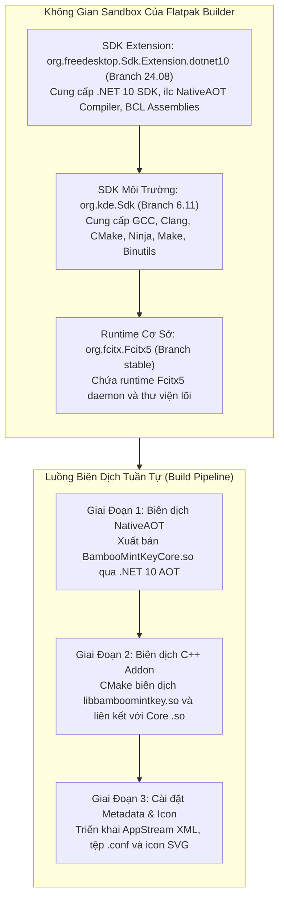
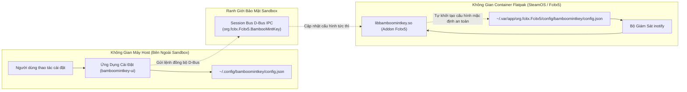

<!--
  BambooMintKey - Vietnamese Telex Input Method Editor
  Copyright (c) 2026 Dương Gia Long and LMO contributors
  SPDX-License-Identifier: MIT
-->

# 009_03 — Thiết Kế Chi Tiết Đóng Gói Flatpak & Kỹ Thuật Xử Lý Build Offline

**Mã tài liệu:** `009_03_Flatpak_Packaging_and_Offline_Build_Design`  
**Giai đoạn:** Phase 9 — Phân phối Flatpak & Tương thích Steam Deck  
**Thuộc module:** `manifests/flatpak/`, `scripts/linux/package_flatpak.sh`, `BambooMintKey.Fcitx5`  
**Trạng thái:** ✅ Thiết kế kỹ thuật chi tiết (Packaging & Build Specification)  
**Tài liệu liên quan:**
- Báo cáo điều tra tính khả thi: [009_01_Flatpak_Investigation.md](009_01_Flatpak_Investigation.md)
- Kiến trúc phân ly Flathub độc lập: [009_02_Flathub_Independent_Architecture.md](009_02_Flathub_Independent_Architecture.md)
- Kế hoạch triển khai Phase 9: [004_Flatpak_Progres.md](../../4.Progress/004_Flatpak_Progres.md)

---

## 1. Mục Tiêu & Phạm Vi Thiết Kế

Tài liệu này đặc tả chi tiết toàn bộ các khía cạnh kỹ thuật liên quan đến quy trình biên dịch, đóng gói và hoạt động trong môi trường sandbox của gói mở rộng **BambooMintKey Fcitx5 Flatpak Extension** (`org.fcitx.Fcitx5.Addon.BambooMintKey`), phục vụ việc nộp duyệt chính thức lên Flathub và tích hợp vào hệ điều hành SteamOS trên Steam Deck.

### Các nguyên tắc kỹ thuật bắt buộc:
1. **Tuân thủ tuyệt đối quy định của Flathub:** Đáp ứng đầy đủ các tiêu chuẩn kiểm định tự động (linting), quy chuẩn định dạng AppStream Metadata 1.0, và đặc biệt là yêu cầu **biên dịch trong điều kiện cô lập mạng hoàn toàn (Offline Build)**.
2. **Không xâm lấn mã nguồn (Zero Source Intrusion):** Toàn bộ quy trình chỉ sử dụng cấu hình manifest và tham số môi trường bên ngoài, tuyệt đối không sửa đổi mã nguồn nghiệp vụ trong thư mục mã nguồn lõi.
3. **Độc lập và an toàn tuyệt đối với hệ điều hành:** Hoạt động độc lập trong không gian người dùng, không can thiệp vào phân vùng hệ thống chỉ đọc của SteamOS, bảo đảm khả năng tồn tại sau các đợt cập nhật hệ điều hành OTA.

---

## 2. Đặc Tả Môi Trường Biên Dịch trong Sandbox (Sandbox Environment Specification)

Quy trình đóng gói Flatpak được thực thi trong một môi trường sandbox cô lập ba tầng, được tổ chức như sau:



### 2.1. Phân Tích Các Thành Phần Môi Trường
- **Runtime cơ sở (`org.fcitx.Fcitx5`):** Đóng vai trò là ứng dụng nền mà gói extension này sẽ gắn kết vào. Phiên bản runtime Fcitx5 trên Flathub hiện được xây dựng trên nền tảng KDE Platform, đảm bảo khả năng tích hợp mượt mà vào giao diện Desktop Mode (KDE Plasma) của Steam Deck.
- **SDK môi trường (`org.kde.Sdk//6.11`):** Cung cấp toàn bộ công cụ phát triển C/C++ hiện đại, bao gồm trình biên dịch Clang và GCC hỗ trợ chuẩn C++17, hệ thống build CMake phiên bản 3.20+ và Ninja. Môi trường này tương thích hoàn toàn với các yêu cầu xây dựng của thư viện `libfcitx5core`.
- **SDK Extension (`org.freedesktop.Sdk.Extension.dotnet10//24.08`):** Cung cấp công cụ .NET SDK 10.0 chính thức được đóng gói cho Flatpak. Khi được khai báo trong manifest, extension này được gắn kết vào đường dẫn `/usr/lib/sdk/dotnet10`, mang theo trình biên dịch AOT (`ilc`) và toàn bộ các thư viện cơ sở (BCL) cần thiết.

### 2.2. Cơ Chế Thiết Lập Biến Môi Trường Build
Để hệ thống build nhận diện được trình biên dịch .NET 10 trong sandbox, manifest thiết lập hai biến môi trường cục bộ trong suốt tiến trình biên dịch:
- **Bổ sung PATH:** Đưa đường dẫn `/usr/lib/sdk/dotnet10/bin` vào danh sách ưu tiên hàng đầu của biến môi trường PATH để lệnh thực thi .NET có thể được triệu gọi trực tiếp.
- **Bổ sung LD_LIBRARY_PATH:** Đưa đường dẫn `/usr/lib/sdk/dotnet10/lib` vào môi trường liên kết để trình biên dịch NativeAOT có thể nạp các thư viện phụ trợ unmanaged trong quá trình link nhị phân.

---

## 3. Kỹ Thuật Biên Dịch NativeAOT Trong Điều Kiện Cấm Mạng (Offline Build Strategy)

Một trong những quy định khắt khe nhất của hệ thống Flathub Build Bot là **chế độ cấm truy cập mạng (`--disable-network`)** trong giai đoạn build module. Trình biên dịch không được phép gửi bất kỳ yêu cầu HTTP/HTTPS nào ra Internet để tải thêm gói thư viện.

```
┌────────────────────────────────────────────────────────────────────────┐
│            ĐÁNH GIÁ ĐẶC TÍNH MÃ NGUỒN VỚI YÊU CẦU OFFLINE              │
├────────────────────────────────────────────────────────────────────────┤
│ 1. Zero External NuGet Dependencies:                                   │
│    Dự án Core (F#) và Core.Native (C#) hoàn toàn không tham chiếu      │
│    bất kỳ gói thư viện bên thứ ba nào từ nuget.org.                    │
│                                                                        │
│ 2. Embedded Resource Dictionaries:                                     │
│    Bộ từ điển tiếng Việt và tiếng Anh được nhúng trực tiếp thành       │
│    tài nguyên nhị phân bên trong assembly thông qua EmbeddedResource.  │
│    Không phát sinh thao tác tải từ điển động qua mạng.                 │
│                                                                        │
│ 3. Standalone BCL & NativeAOT Compiler:                                │
│    SDK Extension dotnet10 đã tích hợp sẵn toàn bộ trình biên dịch      │
│    ilc, runtime packs và các tệp tiêu đề C runtime cơ bản.             │
└────────────────────────────────────────────────────────────────────────┘
```

### 3.1. Phân Tích Tiến Trình Xuất Bản C-ABI NativeAOT
Khi thực hiện lệnh xuất bản thư viện `BambooMintKey.Core.Native` với cấu hình Release và mục tiêu kiến trúc `linux-x64`:
1. **Phân tích cú pháp và tối ưu hóa:** Trình biên dịch F# biên dịch mã nguồn thuật toán xử lý âm tiết và quản lý trạng thái thành Intermediate Language (IL). Toàn bộ logic gõ tiếng Việt là mã thuần chức năng, deterministic, không gọi các API hướng nền tảng.
2. **Biên dịch AOT trực tiếp (Ahead-Of-Time Compilation):** Trình biên dịch `ilc` quét toàn bộ đồ thị phụ thuộc của mã IL, loại bỏ các thành phần BCL không sử dụng (Tree Shaking / Dead Code Elimination).
3. **Cờ tối ưu hóa kích thước và hiệu năng:**
   - Thiết lập `StripSymbols` để loại bỏ toàn bộ bảng ký hiệu gỡ lỗi, giúp kích thước tệp thư viện `.so` thu gọn tối đa.
   - Thiết lập `InvariantGlobalization` để tắt cơ chế định dạng văn hóa phức tạp của hệ thống, vì engine gõ Telex chỉ xử lý bảng ký tự Unicode và chuẩn ngữ pháp tiếng Việt đã được định nghĩa độc lập.
4. **Gán nhãn thư viện động (SONAME):** Trình liên kết bổ sung cờ nhãn định danh nhị phân `BambooMintKeyCore.so`. Điều này ngăn chặn việc trình liên kết nhúng đường dẫn thư mục tạm thời của môi trường build vào bảng ELF của tệp nhị phân đầu ra.

### 3.2. Kiểm Soát Sự Cố Khi Không Có Mạng & Phương Án Dự Phòng
Trong trường hợp trình biên dịch .NET SDK cố gắng thực hiện bước Restore ngầm định và thất bại do cấm mạng, manifest áp dụng các cơ chế kiểm soát sau:
- Sử dụng cờ vô hiệu hóa restore trực tuyến nếu các phụ thuộc nội bộ đã được giải quyết đầy đủ.
- Khai báo biến môi trường tắt chức năng thu thập dữ liệu viễn thám và chào mừng của .NET để tăng tốc độ khởi động trong container.
- Nếu môi trường builder yêu cầu một bản sao cục bộ của runtime pack, giải pháp dự phòng là khai báo một nguồn gói cục bộ rỗng hoặc nạp tệp manifest phụ trợ thông qua công cụ chuyên dụng của Flatpak để khai báo trước toàn bộ checksum SHA256 của các tệp nén cần thiết mà không vi phạm nguyên tắc kiểm tra bảo mật.

---

## 4. Đặc Tả Biên Dịch C++ Addon & Cơ Chế Liên Kết Động (C++ Addon & Dynamic Linking)

Thành phần Addon C++ đóng vai trò là cây cầu tích hợp giữa framework Fcitx 5 và thư viện tính toán NativeAOT.

### 4.1. Quy Trình Cấu Hình CMake Trong Sandbox
Tiến trình biên dịch Addon sử dụng CMake với các tham số định hướng:
- **Tiền tố cài đặt (`CMAKE_INSTALL_PREFIX`):** Được gán trực tiếp vào biến đích của Flatpak Builder (`${FLATPAK_DEST}`), tương ứng với vị trí `/app/addons/BambooMintKey`. Toàn bộ sản phẩm đầu ra sẽ được đặt chính xác vào cây thư mục của extension.
- **Chỉ định vị trí thư viện Core C-ABI:** CMake được truyền đường dẫn tuyệt đối tới tệp `BambooMintKeyCore.so` đã được biên dịch thành công từ Giai đoạn 1 để thực hiện bước đối chiếu ký hiệu liên kết thời điểm build.

### 4.2. Cơ Chế Định Vị Thư Viện Thời Gian Chạy (Runtime Dynamic Linking)
Để bảo đảm addon có thể nạp được thư viện Core trong môi trường sandbox mà không phụ thuộc vào đường dẫn cố định của hệ điều hành:
1. **Liên kết qua $ORIGIN RPATH:** Tệp `libbamboomintkey.so` được biên dịch với thuộc tính đường dẫn tìm kiếm thư viện (RPATH) mang giá trị `$ORIGIN`. Khi Fcitx 5 nạp addon từ thư mục `lib/fcitx5/`, dynamic linker của Linux (`ld.so`) sẽ tự động tìm kiếm các thư viện phụ thuộc ngay tại cùng thư mục chứa tệp addon.
2. **SONAME khớp chính xác:** Vì thư viện Core được định danh với SONAME là `BambooMintKeyCore.so` và tệp CMake khai báo thuộc tính `IMPORTED_SONAME` trùng khớp, bảng nhập khẩu của addon chỉ ghi nhận tên tệp thuần túy thay vì ghi nhận đường dẫn tuyệt đối trên máy build.
3. **Độc lập phụ thuộc bên ngoài:** Kiểm tra cấu trúc liên kết nhị phân cho thấy `BambooMintKeyCore.so` chỉ phụ thuộc duy nhất vào hai thư viện cơ bản của hệ thống Linux là `libc.so.6` và `libm.so.6`. Cả hai thư viện này đều được cung cấp sẵn bởi runtime cơ sở của Flatpak, loại bỏ hoàn toàn nguy cơ thiếu hụt thư viện runtime.

---

## 5. Đặc Tả Cô Lập Hệ Thống Tệp & Quản Lý Cấu Hình (Filesystem & XDG Config Sandbox Management)

Hoạt động bên trong sandbox Flatpak đặt ra các rào cản đặc thù về việc đọc và ghi tệp cấu hình mà bộ gõ cần phải xử lý thấu đáo.

### 5.1. Cơ Chế Phân Giải Không Gian Cấu Hình XDG
Theo tiêu chuẩn bảo mật của Flatpak, mỗi ứng dụng hoặc container có một không gian lưu trữ cô lập riêng biệt trong thư mục người dùng:
- Trên máy host thông thường: Biến môi trường `$XDG_CONFIG_HOME` phân giải về `~/.config/bamboomintkey/config.json`.
- Bên trong container Flatpak của `org.fcitx.Fcitx5`: Do container Fcitx5 chỉ được cấp quyền ghi vào không gian của chính nó, biến môi trường `$XDG_CONFIG_HOME` sẽ phân giải về:
  `~/.var/app/org.fcitx.Fcitx5/config/bamboomintkey/config.json`.



### 5.2. Giải Pháp Đồng Bộ & Hoạt Động An Toàn Trong Sandbox
Để bộ gõ hoạt động ổn định và chính xác trên Steam Deck mà không yêu cầu người dùng phải gõ các lệnh can thiệp phân quyền phức tạp, kiến trúc áp dụng 3 cơ chế đồng bộ:

1. **Khởi tạo cấu hình tự động (Self-Initialization):**
   Khi Fcitx 5 nạp addon lần đầu trong môi trường Flatpak, addon kiểm tra sự tồn tại của tệp cấu hình tại đường dẫn phân giải nội bộ của container. Nếu tệp chưa tồn tại, addon tự động tạo mới thư mục và ghi tệp cấu hình mặc định chuẩn tiếng Việt Telex (bật kiểm tra chính tả, kiểu dấu mới, tự động khôi phục từ tiếng Anh, phím tắt chuyển đổi chế độ). Điều này đảm bảo bộ gõ luôn sẵn sàng hoạt động ngay sau khi cài đặt từ Discover Store mà không cần mở bảng điều khiển.

2. **Giám sát tệp nội bộ qua `inotify`:**
   Addon duy trì một trình theo dõi tệp tin cấp nhân Linux (`inotify`) trỏ tới tệp cấu hình trong thư mục `.var`. Khi có bất kỳ ứng dụng nào can thiệp ghi đè cấu hình, addon lập tức nạp lại các tham số trong bộ nhớ mà không cần khởi động lại tiến trình Fcitx 5.

3. **Kênh điều khiển liên tiến trình qua D-Bus Session Bus:**
   Container Flatpak của `org.fcitx.Fcitx5` được Flathub cấp quyền chia sẻ Session Bus của người dùng (`--socket=session-bus`). Nhờ đó, dịch vụ D-Bus `org.fcitx.Fcitx5.BambooMintKey` xuất bản các phương thức điều khiển trạng thái (chuyển đổi V/E, thay đổi kiểu gõ, cập nhật tham số) ra toàn hệ thống. Mọi ứng dụng điều khiển bên ngoài host hoặc các script tiện ích trên Steam Deck đều có thể tương tác với bộ gõ thông qua các cuộc gọi RPC tiêu chuẩn mà không bị rào cản hệ thống tệp ngăn chặn.

---

## 6. Đặc Tả Chuẩn Hóa AppStream Metadata (AppStream 1.0 Compliance)

AppStream Metadata là thành phần quyết định việc bộ gõ có được trung tâm phần mềm **KDE Discover trên Steam Deck** nhận diện và hiển thị một cách chuyên nghiệp hay không.

### 6.1. Định Danh Mở Rộng (Addon Specification)
Tệp metadata được cấu hình với các thẻ định danh chuyên biệt cho gói mở rộng:
- **Kiểu thành phần (`component type="addon"`):** Khai báo tường minh đây là một gói phần mềm phụ trợ, không phải là một ứng dụng độc lập có cửa sổ chính.
- **Thẻ liên kết ứng dụng gốc (`<extends>`):** Thiết lập giá trị `org.fcitx.Fcitx5`. Thẻ này chỉ thị cho KDE Discover biết rằng gói này thuộc về ứng dụng Fcitx 5. Khi người dùng duyệt trang thông tin của Fcitx 5 trong Discover, BambooMintKey sẽ tự động xuất hiện trong danh sách "Add-ons / Tiện ích mở rộng" có thể cài đặt bằng một nút bấm.
- **Thẻ cung cấp chức năng (`<provides>`):** Chứa thẻ con `<addon>bamboomintkey</addon>`, giúp hệ thống quản lý input method của Plasma tự động kích hoạt bộ gõ vào danh sách lựa chọn sau khi cài đặt hoàn tất.

### 6.2. Yêu Cầu Về Nội Dung & Bản Quyền
- **Hỗ trợ song ngữ:** Toàn bộ tên gọi (`<name>`), tóm tắt (`<summary>`), và mô tả chi tiết (`<description>`) được cấu trúc với cả tiếng Anh chuẩn và bản dịch tiếng Việt tương ứng. Khi Steam Deck được thiết lập ngôn ngữ tiếng Việt (`vi_VN`), hệ thống sẽ ưu tiên hiển thị bản địa hóa tiếng Việt.
- **Bản quyền theo chuẩn SPDX:**
  - `metadata_license`: Khai báo `CC0-1.0` hoặc `FSFAP` theo đúng quy định nghiêm ngặt của Flathub đối với tệp mô tả AppStream.
  - `project_license`: Khai báo `MIT` đại diện cho giấy phép mã nguồn mở của dự án BambooMintKey.
- **Đánh giá nội dung OARS:** Khai báo chuẩn OARS phiên bản 1.1 (`<content_rating type="oars-1.1" />`) để đáp ứng bộ lọc an toàn nội dung của Discover.
- **Hình ảnh minh họa:** Cung cấp liên kết ảnh chụp màn hình chất lượng cao lưu trữ tại repository chính thức trên GitHub, mô tả rõ nét giao diện gõ tiếng Việt và icon trạng thái trên thanh Taskbar.

---

## 7. Cấu Trúc Cài Đặt Thành Phẩm Trong Container

Sau khi quy trình biên dịch và cài đặt hoàn tất, toàn bộ sản phẩm của BambooMintKey được đặt trọn vẹn bên trong phân vùng dành riêng cho extension tại `/app/addons/BambooMintKey`.

```
/app/addons/BambooMintKey/
├── lib/
│   └── fcitx5/
│       ├── libbamboomintkey.so
│       │   ├── Vai trò: Addon C++ xử lý sự kiện bàn phím và giao tiếp Fcitx5
│       │   ├── RPATH: $ORIGIN (tự tìm thư viện cùng thư mục)
│       │   └── Ký hiệu: Tương thích Fcitx5 ABI phiên bản 5.x
│       │
│       └── BambooMintKeyCore.so
│           ├── Vai trò: Lõi F# Telex Engine biên dịch NativeAOT
│           ├── SONAME: BambooMintKeyCore.so
│           └── Phụ thuộc: Chỉ libc.so.6 và libm.so.6 (zero external deps)
│
└── share/
    ├── fcitx5/
    │   ├── addon/
    │   │   └── bamboomintkey.conf
    │   │       └── Khai báo Addon metadata (tên, thư viện nạp, mức độ ưu tiên, 0=core)
    │   │
    │   └── inputmethod/
    │       └── bamboomintkey.conf
    │           └── Khai báo Input Method hiển thị trong fcitx5-configtool (LangCode=vi)
    │
    ├── icons/
    │   └── hicolor/
    │       └── scalable/
    │           └── apps/
    │               ├── fcitx_bamboomintkey.svg    (Icon trạng thái V - Tiếng Việt)
    │               ├── fcitx_bamboomintkey_e.svg  (Icon trạng thái E - Tiếng Anh)
    │               └── bamboomintkey.svg          (Icon nhận diện thương hiệu)
    │
    └── metainfo/
        └── org.fcitx.Fcitx5.Addon.BambooMintKey.metainfo.xml
            └── Dữ liệu AppStream hiển thị trên KDE Discover và trang chủ Flathub
```

### Đánh Giá Cơ Chế Khám Phá Của Fcitx5:
Khi người dùng khởi chạy Fcitx 5 trên Steam Deck, wrapper script khởi động `/app/bin/fcitx5` sẽ thực hiện quét toàn bộ thư mục `/app/addons/*`:
1. Tự động bổ sung `/app/addons/BambooMintKey/lib/fcitx5` vào biến `FCITX_ADDON_DIRS`, giúp Fcitx 5 đọc được tệp `bamboomintkey.conf`.
2. Tự động bổ sung `/app/addons/BambooMintKey/share` vào biến `XDG_DATA_DIRS`, giúp Fcitx 5 nạp được metadata bộ gõ tiếng Việt và các biểu tượng SVG.
3. Tự động bổ sung `/app/addons/BambooMintKey/lib` vào biến `LD_LIBRARY_PATH`, bảo đảm hệ thống nạp thư viện động tìm thấy các module một cách trơn tru.

---

## 8. Tiêu Chí Nghiệm Thu Kỹ Thuật (Acceptance Criteria)

Tài liệu thiết kế này được coi là hiện thực hóa thành công khi gói cài đặt đáp ứng đầy đủ các tiêu chí kiểm tra sau:

| Mã kiểm tra | Hạng mục kiểm tra | Tiêu chuẩn đạt yêu cầu |
|---|---|---|
| **AC-BUILD-01** | Biên dịch không có mạng | Lệnh `flatpak-builder --disable-network` hoàn thành với mã thoát 0, không phát sinh lỗi kết nối mạng. |
| **AC-BUILD-02** | Toàn vẹn mã nguồn | Không có bất kỳ tệp tin nào trong thư mục `src/` bị biến đổi sau khi kết thúc quá trình build Flatpak. |
| **AC-LINK-01** | Kiểm tra liên kết động | Lệnh kiểm tra bảng nhập ELF xác nhận `libbamboomintkey.so` nạp thành công `BambooMintKeyCore.so` qua `$ORIGIN`. |
| **AC-META-01** | Xác thực AppStream | Lệnh `appstreamcli validate` trên tệp `metainfo.xml` không báo bất kỳ lỗi nghiêm trọng nào. |
| **AC-LINT-01** | Xác thực Flathub Lint | Công cụ `flatpak-builder-lint` xác nhận manifest tuân thủ đầy đủ quy định nộp duyệt của Flathub. |
