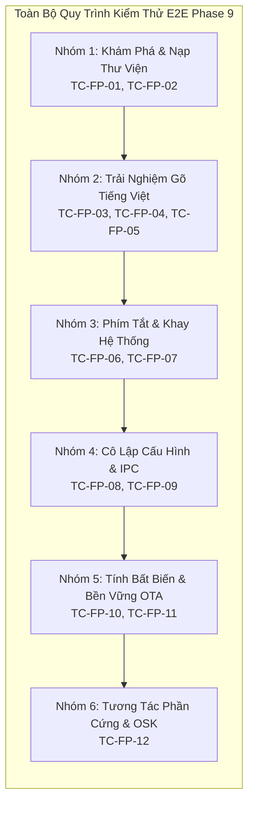

<!--
  BambooMintKey - Vietnamese Telex Input Method Editor
  Copyright (c) 2026 Dương Gia Long and LMO contributors
  SPDX-License-Identifier: MIT
-->

# 009_04 — Kế Hoạch Kiểm Thử E2E & Ma Trận Nghiệm Thu Trên Steam Deck & Flatpak

**Mã tài liệu:** `009_04_SteamDeck_E2E_TestPlan`  
**Giai đoạn:** Phase 9 — Phân phối Flatpak & Tương thích Steam Deck  
**Thuộc module:** `manifests/flatpak/`, `scripts/linux/package_flatpak.sh`, `BambooMintKey.Fcitx5`  
**Trạng thái:** ✅ Kế hoạch kiểm thử hoàn thiện (E2E Test Plan & Acceptance Matrix)  
**Tài liệu liên quan:**
- Báo cáo điều tra tính khả thi: [009_01_Flatpak_Investigation.md](009_01_Flatpak_Investigation.md)
- Kiến trúc phân ly Flathub độc lập: [009_02_Flathub_Independent_Architecture.md](009_02_Flathub_Independent_Architecture.md)
- Thiết kế đóng gói & build offline: [009_03_Flatpak_Packaging_and_Offline_Build_Design.md](009_03_Flatpak_Packaging_and_Offline_Build_Design.md)
- Kế hoạch triển khai Phase 9: [004_Flatpak_Progres.md](../../4.Progress/004_Flatpak_Progres.md)

---

## 1. Mục Tiêu & Phạm Vi Kiểm Thử

Tài liệu này xác lập ma trận kiểm thử toàn diện từ đầu đến cuối (End-to-End Test Plan) nhằm thẩm định và nghiệm thu chất lượng hoạt động của **BambooMintKey Fcitx5 Flatpak Extension** trên thiết bị **Steam Deck (SteamOS)** cũng như các hệ thống Linux sử dụng bộ gõ Fcitx 5 đóng gói qua Flatpak.

### Mục tiêu chất lượng:
1. **Kiểm chứng khả năng tự động nạp addon:** Đảm bảo container Fcitx 5 nhận diện và nạp thành công bộ gõ tiếng Việt ngay sau khi cài đặt mà không cần thao tác cấu hình thủ công phức tạp.
2. **Đảm bảo tính chính xác của thuật toán gõ:** Toàn bộ tính năng gõ Telex, xử lý vần, bỏ dấu tự do và bảo vệ từ tiếng Anh hoạt động đồng nhất 100% với phiên bản native trên Windows và Linux.
3. **Thẩm định tính an toàn với hệ điều hành:** Xác nhận bộ gõ được cô lập hoàn toàn trong không gian lưu trữ người dùng, không can thiệp vào phân vùng hệ thống chỉ đọc (`steamos-readonly`) của Steam Deck, và bảo toàn nguyên vẹn sau các bản cập nhật hệ điều hành OTA của Valve.

---

## 2. Ma Trận Môi Trường Kiểm Thử (Test Environment Matrix)

Kiểm thử được thực hiện trên ba môi trường có tính chất đại diện:

| Mã môi trường | Tên môi trường | Đặc điểm hệ thống | Mục đích kiểm thử |
|:---:|---|---|---|
| **ENV-DECK-DESK** | **Steam Deck Desktop Mode** | Hệ điều hành SteamOS 3.x, giao diện KDE Plasma (Wayland/X11), phân vùng hệ thống chỉ đọc A/B, Fcitx 5 Flatpak. | Môi trường mục tiêu chính: kiểm tra gõ văn bản, lướt web, lập trình, chat và làm việc thường nhật trên Steam Deck. |
| **ENV-DECK-GAME** | **Steam Deck Gaming Mode** | Giao diện Gamescope cầm tay tối ưu cho tay cầm điều khiển, bàn phím ảo Steam On-Screen Keyboard (OSK). | Kiểm tra gõ tiếng Việt trong các tựa game có hỗ trợ IME (nhập tên nhân vật, chat trong game) và tương tác với bàn phím ảo. |
| **ENV-LINUX-PC** | **Linux Desktop Chuẩn** | Ubuntu / Linux Mint / Fedora / Arch Linux cài đặt Fcitx 5 bản Flatpak chính thức từ Flathub. | Kiểm tra tính tương thích rộng rãi của gói Flatpak trên các bản phân phối Linux phổ biến khác nhau. |

---

## 3. Danh Mục Các Ca Kiểm Thử Chi Tiết (Test Cases Matrix)

### 3.1. Nhóm 1: Kiểm Thử Khám Phá & Nạp Thư Viện (Discovery & Linking)

#### `TC-FP-01`: Kiểm Tra Cơ Chế Tự Động Khám Phá Addon Extension
- **Mục đích:** Xác minh Fcitx 5 Flatpak tự động quét và nạp các tệp cấu hình của BambooMintKey từ thư mục gắn kết `/app/addons/BambooMintKey`.
- **Điều kiện tiên quyết:** Extension đã được cài đặt vào session người dùng (`flatpak install --user`).
- **Các bước thực hiện:**
  1. Khởi động Fcitx 5 Flatpak với cờ ghi nhật ký chi tiết trong Terminal.
  2. Quan sát luồng thực thi của wrapper script `/app/bin/fcitx5`.
  3. Mở công cụ cấu hình Fcitx 5 (`fcitx5-configtool`).
  4. Kiểm tra danh sách Addons và danh sách Input Methods.
- **Kết quả kỳ vọng:**
  - Biến `FCITX_ADDON_DIRS` được tự động gán thêm đường dẫn `/app/addons/BambooMintKey/lib/fcitx5`.
  - Biến `XDG_DATA_DIRS` được tự động gán thêm đường dẫn `/app/addons/BambooMintKey/share`.
  - Bộ gõ `BambooMintKey` xuất hiện trong mục ngôn ngữ Tiếng Việt (`vi`) với trạng thái sẵn sàng sử dụng (Available), không bị ẩn hoặc báo lỗi thiếu cấu hình.

#### `TC-FP-02`: Kiểm Tra Liên Kết Động C-ABI NativeAOT Trong Sandbox
- **Mục đích:** Đảm bảo thư viện Addon C++ nạp thành công thư viện Core F# NativeAOT qua cơ chế `$ORIGIN` mà không gặp lỗi thiếu thư viện liên kết.
- **Điều kiện tiên quyết:** Fcitx 5 đang chạy trong container Flatpak.
- **Các bước thực hiện:**
  1. Kiểm tra nhật ký khởi động của tiến trình Fcitx 5.
  2. Tìm kiếm các thông báo liên quan đến việc nạp tệp thư viện `libbamboomintkey.so` và `BambooMintKeyCore.so`.
- **Kết quả kỳ vọng:**
  - Dynamic linker tìm thấy `BambooMintKeyCore.so` ngay tại cùng thư mục `lib/fcitx5/` nhờ cờ `$ORIGIN`.
  - Không xuất hiện bất kỳ thông báo lỗi nào dạng `cannot open shared object file` hoặc ký hiệu chưa được định nghĩa (`undefined symbol`).
  - Addon khởi tạo thành công engine và sẵn sàng nhận sự kiện bàn phím.

---

### 3.2. Nhóm 2: Kiểm Thử Trải Nghiệm Gõ Tiếng Việt (Typing & Grammar)

#### `TC-FP-03`: Kiểm Thử Gõ Tiếng Việt Trong Ứng Dụng Chạy Flatpak
- **Mục đích:** Xác minh khả năng giao tiếp giữa bộ gõ Fcitx 5 và các ứng dụng chạy trong sandbox Flatpak độc lập khác.
- **Điều kiện tiên quyết:** Khởi chạy một ứng dụng Flatpak phổ biến (ví dụ: Firefox Flatpak hoặc VS Code Flatpak trên Steam Deck).
- **Các bước thực hiện:**
  1. Chuyển bộ gõ sang chế độ BambooMintKey.
  2. Đặt con trỏ vào ô nhập liệu văn bản của trình duyệt hoặc trình soạn thảo.
  3. Gõ các chuỗi ký tự kiểm thử âm tiết tiếng Việt cơ bản và nâng cao:
     - Dấu thanh chuẩn: gõ chuỗi tạo từ *đường*, *tiếng*, *Việt*, *trường*, *sách*.
     - Âm đệm và nguyên âm đôi: gõ chuỗi tạo từ *thuyền*, *nghiêng*, *xoay*, *thuở*.
     - Bỏ dấu tự do: gõ phím dấu thanh ở cuối từ hoặc ngay sau nguyên âm.
- **Kết quả kỳ vọng:**
  - Chuỗi tiền chỉnh sửa (inline preedit) hiển thị rõ nét tại vị trí con trỏ.
  - Sau khi kết thúc từ (bằng phím cách hoặc dấu ngắt câu), từ tiếng Việt hoàn chỉnh được xác nhận (commit) chính xác, không bị hiện tượng nuốt ký tự, lặp ký tự hoặc mất dấu thanh.

#### `TC-FP-04`: Kiểm Thử Gõ Tiếng Việt Trong Ứng Dụng Chạy Ngoài Host
- **Mục đích:** Xác minh ứng dụng chạy trên hệ điều hành host (ngoài container) kết nối thông suốt với Fcitx 5 Flatpak qua socket chuẩn Wayland/X11.
- **Điều kiện tiên quyết:** Mở ứng dụng gốc của hệ thống (ví dụ: KDE Konsole, KWrite trên Steam Deck Desktop Mode).
- **Các bước thực hiện:**
  1. Nhập liệu văn bản trực tiếp trong cửa sổ dòng lệnh Terminal hoặc trình soạn văn bản gốc.
  2. Thực hiện các thao tác gõ tiếng Việt tương tự `TC-FP-03`.
- **Kết quả kỳ vọng:**
  - Cơ chế IM Module của hệ thống truyền nhận sự kiện phím thông suốt tới container Fcitx 5.
  - Văn bản tiếng Việt xuất hiện mượt mà với độ trễ phản hồi không đáng kể.

#### `TC-FP-05`: Kiểm Thử Tính Năng Bảo Vệ Từ Tiếng Anh & Phục Hồi Ký Tự
- **Mục đích:** Đảm bảo các tính năng thông minh của Core Engine hoạt động chính xác trong môi trường Flatpak.
- **Điều kiện tiên quyết:** Bộ gõ đang bật chế độ tiếng Việt Telex.
- **Các bước thực hiện:**
  1. Gõ các từ tiếng Anh thông dụng dễ bị biến dạng do quy tắc Telex: *internet*, *password*, *simple*, *microsoft*, *valve*, *steam*.
  2. Thử nghiệm tính năng gõ lặp phím để khôi phục ký tự thô: gõ hai lần phím dấu (*ss* để ra *s*, *ff* để ra *f*).
  3. Thử nghiệm phím lùi (Backspace): gõ một phần từ, bấm Backspace từng ký tự để kiểm tra việc đảo ngược trạng thái ngữ pháp.
- **Kết quả kỳ vọng:**
  - Từ tiếng Anh được tự động giữ nguyên vẹn hoặc khôi phục về dạng ký tự gốc đúng theo từ điển nhúng.
  - Phím lùi hoạt động mượt mà, tính toán chính xác số ký tự cần xóa bỏ mà không làm treo ứng dụng.

---

### 3.3. Nhóm 3: Kiểm Thử Phím Tắt & Biểu Tượng Khay Hệ Thống (Hotkeys & Tray)

#### `TC-FP-06`: Kiểm Thử Phím Tắt Chuyển Đổi V/E Tức Thì
- **Mục đích:** Xác minh cơ chế chuyển đổi chế độ gõ bằng phím tắt hoạt động nhạy bén, không xung đột với phím tắt của trò chơi hoặc hệ thống.
- **Điều kiện tiên quyết:** Đang mở bất kỳ ứng dụng nào trên Steam Deck.
- **Các bước thực hiện:**
  1. Đang ở chế độ tiếng Việt (V), bấm phím tắt mặc định (phím `` ` `` grave nằm ngay dưới phím Escape).
  2. Gõ thử một chuỗi ký tự Telex (ví dụ: *dd*).
  3. Bấm lại phím tắt một lần nữa và gõ lại chuỗi ký tự trên.
- **Kết quả kỳ vọng:**
  - Lần bấm thứ nhất: Bộ gõ lập tức chuyển sang chế độ tiếng Anh (E), chuỗi *dd* xuất hiện nguyên vẹn là hai chữ *d*.
  - Lần bấm thứ hai: Bộ gõ lập tức chuyển về chế độ tiếng Việt (V), chuỗi *dd* tự động chuyển đổi thành chữ *đ*.
  - Toàn bộ quá trình chuyển đổi diễn ra tức thì, không gây khựng hay trễ thao tác gõ.

#### `TC-FP-07`: Kiểm Thử Biểu Tượng Trạng Thái Trên Khay Hệ Thống Plasma
- **Mục đích:** Xác minh biểu tượng SVG động hiển thị đúng và sắc nét trên thanh Taskbar của KDE Plasma trên Steam Deck.
- **Điều kiện tiên quyết:** Quan sát khay hệ thống (System Tray) ở góc dưới màn hình Desktop Mode.
- **Các bước thực hiện:**
  1. Quan sát biểu tượng bộ gõ khi đang ở chế độ tiếng Việt.
  2. Bấm chuyển sang chế độ tiếng Anh.
  3. Đổi kích thước thanh Taskbar hoặc đổi chủ đề giao diện (Dark Mode / Light Mode).
- **Kết quả kỳ vọng:**
  - Ở chế độ tiếng Việt: Khay hệ thống hiển thị biểu tượng chữ `V` sắc nét (`fcitx_bamboomintkey.svg`).
  - Ở chế độ tiếng Anh: Khay hệ thống hiển thị biểu tượng chữ `E` sắc nét (`fcitx_bamboomintkey_e.svg`).
  - Biểu tượng dạng vector SVG tự động co giãn sắc nét ở mọi độ phân giải màn hình (màn hình tích hợp của Steam Deck 1280x800 và màn hình ngoài 1080p/4K khi cắm Dock).

---

### 3.4. Nhóm 4: Kiểm Thử Cô Lập Cấu Hình & Giao Tiếp D-Bus (Config & IPC)

#### `TC-FP-08`: Kiểm Thử Cơ Chế Tự Khởi Tạo Cấu Hình Mặc Định Trong Sandbox
- **Mục đích:** Xác nhận bộ gõ tự khởi tạo tệp cấu hình hợp lệ bên trong thư mục sandbox của container Fcitx 5.
- **Điều kiện tiên quyết:** Xóa bỏ toàn bộ tệp cấu hình cũ nếu có tại đường dẫn `~/.var/app/org.fcitx.Fcitx5/config/bamboomintkey/`.
- **Các bước thực hiện:**
  1. Khởi động lại Fcitx 5 Flatpak.
  2. Kiểm tra sự xuất hiện của thư mục và tệp cấu hình mới trong thư mục `.var`.
  3. Kiểm tra nội dung tệp `config.json` vừa được sinh ra.
- **Kết quả kỳ vọng:**
  - Thư mục cấu hình được tự động tạo mới với đầy đủ quyền đọc/ghi cho người dùng.
  - Tệp `config.json` chứa đầy đủ các khóa cấu hình chuẩn JSON v2 với các giá trị mặc định hợp lý và an toàn.
  - Addon nạp cấu hình thành công mà không phát sinh lỗi đọc tệp.

#### `TC-FP-09`: Kiểm Thử Giao Tiếp D-Bus Session Bus Xuyên Ranh Giới Sandbox
- **Mục đích:** Xác minh dịch vụ D-Bus của BambooMintKey có thể tiếp nhận lệnh điều khiển từ các tiến trình bên ngoài container.
- **Điều kiện tiên quyết:** Fcitx 5 Flatpak đang chạy.
- **Các bước thực hiện:**
  1. Mở Terminal trên máy host và gửi lệnh truy vấn trạng thái gõ qua công cụ dòng lệnh D-Bus tiêu chuẩn tới đích `org.fcitx.Fcitx5.BambooMintKey`.
  2. Gửi lệnh chuyển đổi chế độ gõ qua D-Bus.
  3. Lắng nghe tín hiệu `ModeChanged` được phát ra trên Session Bus.
- **Kết quả kỳ vọng:**
  - Dịch vụ D-Bus phản hồi chính xác giá trị boolean đại diện cho trạng thái V/E hiện tại.
  - Lệnh chuyển đổi chế độ thực thi thành công, biểu tượng khay hệ thống cập nhật đồng bộ và tín hiệu `ModeChanged` được phát sóng ra toàn hệ thống.

---

### 3.5. Nhóm 5: Kiểm Thử Tính Bất Biến & Bền Vững OTA Trên SteamOS (SteamOS Compliance)

#### `TC-FP-10`: Thẩm Định Tính Toàn Vẹn Của Hệ Thống Tệp Chỉ Đọc (Immutable Rootfs)
- **Mục đích:** Chứng minh 100% tệp tin của BambooMintKey chỉ nằm trong không gian người dùng, tuyệt đối không xâm phạm phân vùng hệ thống của SteamOS.
- **Điều kiện tiên quyết:** Hoàn tất việc cài đặt gói mở rộng trên Steam Deck.
- **Các bước thực hiện:**
  1. Kiểm tra trạng thái bảo vệ của hệ điều hành: Chế độ `steamos-readonly` phải đang ở trạng thái BẬT (Enabled).
  2. Quét toàn bộ hệ thống tệp tại các thư mục hệ thống như `/usr`, `/etc`, `/var/lib`: Kiểm tra xem có bất kỳ tệp tin nào mang tên `bamboomintkey` rơi vào các thư mục này hay không.
  3. Quét kiểm tra thư mục người dùng tại `~/.local/share/flatpak/` và `~/.var/app/`.
- **Kết quả kỳ vọng:**
  - Chế độ `steamos-readonly` được giữ nguyên vẹn, không cần quyền quản trị viên (`sudo`) trong toàn bộ vòng đời cài đặt và sử dụng.
  - Không có bất kỳ tệp tin nào được ghi vào `/usr` hay `/etc`.
  - Toàn bộ nhị phân và dữ liệu của bộ gõ nằm trọn vẹn trong không gian người dùng, đáp ứng chuẩn mực phân phối phần mềm an toàn của Valve.

#### `TC-FP-11`: Kiểm Chứng Độ Bền Vững Sau Cập Nhật Hệ Điều Hành SteamOS OTA
- **Mục đích:** Đảm bảo bộ gõ vẫn duy trì hoạt động hoàn hảo và không bị mất sau khi Steam Deck cập nhật phiên bản SteamOS mới.
- **Điều kiện tiên quyết:** Steam Deck đang sử dụng bộ gõ BambooMintKey ổn định.
- **Các bước thực hiện:**
  1. Thực hiện quy trình cập nhật hệ điều hành SteamOS qua kênh cập nhật chính thức của Valve (System Settings -> Check for Updates -> Apply and Restart).
  2. Sau khi thiết bị hoàn tất cập nhật và khởi động lại vào Desktop Mode:
  3. Kiểm tra danh sách bộ gõ trong Fcitx 5.
  4. Thực hiện thao tác gõ tiếng Việt trong trình duyệt web.
- **Kết quả kỳ vọng:**
  - Bộ gõ BambooMintKey vẫn tồn tại nguyên vẹn trong danh sách lựa chọn của Fcitx 5.
  - Tính năng gõ tiếng Việt hoạt động bình thường ngay lập tức mà người dùng không cần phải cài đặt lại từ đầu.

---

### 3.6. Nhóm 6: Kiểm Thử Tương Tác Phần Cứng & Bàn Phím Ảo (Hardware & OSK)

#### `TC-FP-12`: Kiểm Thử Tương Tác Với Bàn Phím Ảo & Thiết Bị Ngoại Vi
- **Mục đích:** Đảm bảo trải nghiệm nhập liệu ổn định khi người dùng sử dụng bàn phím ảo tích hợp của Steam Deck hoặc bàn phím vật lý gắn ngoài.
- **Điều kiện tiên quyết:** Thử nghiệm trên thiết bị Steam Deck thật.
- **Các bước thực hiện:**
  1. Sử dụng tổ hợp phím tắt phần cứng của Steam Deck (nút `STEAM` + nút `X`) để kích hoạt bàn phím ảo On-Screen Keyboard trên màn hình cảm ứng.
  2. Bấm các phím chữ cái tiếng Việt trên bàn phím ảo để gõ văn bản.
  3. Gắn bàn phím vật lý qua kết nối Bluetooth hoặc qua cổng USB-C Dock và thực hiện gõ phím với tốc độ cao (>80 từ/phút).
- **Kết quả kỳ vọng:**
  - Bàn phím ảo gửi đúng sự kiện ký tự tới Fcitx 5, bộ gõ tiếp nhận và ghép dấu tiếng Việt chính xác trên màn hình.
  - Khi dùng bàn phím vật lý ngoại vi, bộ gõ xử lý mượt mà ở tốc độ gõ cao, không có hiện tượng mất ký tự hay đơ trễ luồng nhập liệu.

---

## 4. Ma Trận Nghiệm Thu & Tiêu Chí Đánh Giá (Pass / Fail Criteria)

Tất cả các ca kiểm thử trong ma trận đều phải đạt kết quả thành công trước khi tiến hành nộp hồ sơ chính thức lên Flathub:

| Nhóm kiểm thử | Tổng số ca | Yêu cầu đạt (Pass) | Mức độ nghiêm trọng nếu lỗi |
|---|:---:|:---:|---|
| **Nhóm 1: Khám phá & Nạp thư viện** | 2 | 2 / 2 (100%) | **Blocker** (Không thể nạp addon) |
| **Nhóm 2: Trải nghiệm gõ tiếng Việt** | 3 | 3 / 3 (100%) | **Blocker** (Sai lệch ngữ pháp gõ) |
| **Nhóm 3: Phím tắt & Khay hệ thống** | 2 | 2 / 2 (100%) | **Major** (Ảnh hưởng tiện ích người dùng) |
| **Nhóm 4: Cô lập cấu hình & D-Bus** | 2 | 2 / 2 (100%) | **Major** (Không lưu được cài đặt) |
| **Nhóm 5: Tính bất biến & Bền vững OTA** | 2 | 2 / 2 (100%) | **Blocker** (Vi phạm nguyên tắc SteamOS) |
| **Nhóm 6: Phần cứng & Bàn phím ảo** | 1 | 1 / 1 (100%) | **Normal** (Trải nghiệm người dùng cầm tay) |
| **Tổng cộng** | **12** | **12 / 12 (100%)** | **Sẵn sàng nộp duyệt Flathub** |
