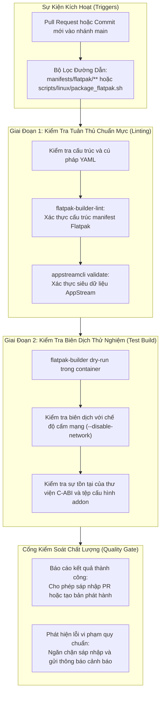
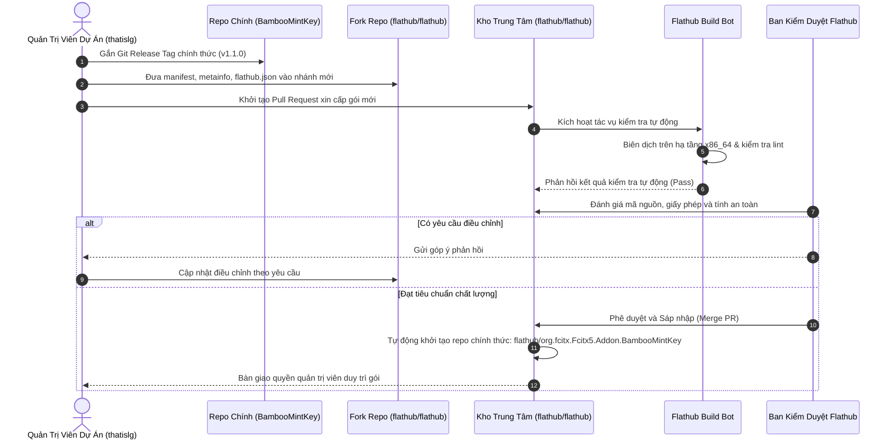
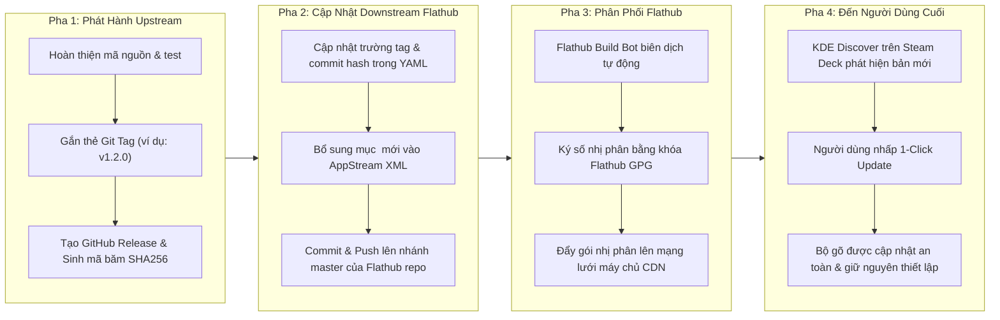

<!--
  BambooMintKey - Vietnamese Telex Input Method Editor
  Copyright (c) 2026 Dương Gia Long and LMO contributors
  SPDX-License-Identifier: MIT
-->

# 009_05 — Thiết Kế Quy Trình CI/CD & Vận Hành Phát Hành Flathub (Release SOP)

**Mã tài liệu:** `009_05_Flathub_CICD_and_Release_SOP`  
**Giai đoạn:** Phase 9 — Phân phối Flatpak & Tương thích Steam Deck  
**Thuộc module:** `manifests/flatpak/`, `.github/workflows/`, Flathub Repository  
**Trạng thái:** ✅ Thiết kế quy trình hoàn thiện (CI/CD & Operation Specification)  
**Tài liệu liên quan:**
- Kiến trúc phân ly Flathub độc lập: [009_02_Flathub_Independent_Architecture.md](009_02_Flathub_Independent_Architecture.md)
- Thiết kế đóng gói & build offline: [009_03_Flatpak_Packaging_and_Offline_Build_Design.md](009_03_Flatpak_Packaging_and_Offline_Build_Design.md)
- Kế hoạch kiểm thử E2E: [009_04_SteamDeck_E2E_TestPlan.md](009_04_SteamDeck_E2E_TestPlan.md)
- Kế hoạch triển khai Phase 9: [004_Flatpak_Progres.md](../../4.Progress/004_Flatpak_Progres.md)

---

## 1. Mục Tiêu & Tầm Nhìn Vận Hành

Tài liệu này xác lập quy trình tự động hóa kiểm định chất lượng (CI/CD) và Quy trình Thao tác Chuẩn (Standard Operating Procedure - SOP) cho toàn bộ vòng đời phát hành của gói mở rộng **BambooMintKey** trên hệ thống **Flathub**, hướng tới việc phục vụ cộng đồng người dùng Steam Deck và Linux Desktop.

### Triết lý vận hành cốt lõi:
1. **Phát hành phân ly (Decoupled Release Cycle):** Việc đóng gói và phát hành gói Flatpak đóng vai trò là một kênh tiêu thụ hạ nguồn (Downstream Consumer). Mọi cải tiến, sửa lỗi và tính năng mới được hoàn thiện và đóng gói phiên bản ổn định tại kho mã nguồn gốc (Upstream Repo), sau đó gói Flatpak chỉ tiếp nhận và biên dịch từ các mốc phát hành chính thức này.
2. **Nguyên tắc "Zero-Touch Source Code":** Mỗi khi có một phiên bản cập nhật mới, quy trình phát hành Flathub chỉ thực hiện các thao tác khai báo tham số phiên bản và kiểm định tính toàn vẹn nhị phân, tuyệt đối không can thiệp hay sửa đổi bất kỳ dòng mã nguồn nào của các nền tảng khác.
3. **Tự động hóa tối đa (High Automation):** Tối ưu hóa các tác vụ kiểm tra cú pháp, kiểm định siêu dữ liệu, đóng gói thử nghiệm và đồng bộ phát hành thông qua hệ thống CI/CD để giảm thiểu tối đa sai sót từ thao tác thủ công.

---

## 2. Thiết Kế Quy Trình Tự Động Hóa Kiểm Định (CI/CD Pipeline)

Hệ thống tích hợp liên tục (CI) được thiết kế nhằm mục đích phát hiện sớm mọi vi phạm quy chuẩn đóng gói ngay khi có thay đổi liên quan đến cấu hình Flatpak trong kho mã nguồn chính.

### 2.1. Chi Tiết Các Bước Kiểm Định Trong Pipeline
1. **Kiểm tra cú pháp và cấu trúc Flatpak (Flatpak Manifest Linting):**
   - Sử dụng công cụ chính thức `flatpak-builder-lint` được duy trì bởi Flathub.
   - Kiểm tra các quy tắc bắt buộc: Tên định danh gói phải theo chuẩn ngược tên miền (`org.fcitx.Fcitx5.Addon.BambooMintKey`), nhánh phát hành mặc định phải là `stable`, quyền hạn sandbox không được khai báo các cờ bị cấm đối với gói mở rộng, và nguồn mã nguồn phải chỉ định rõ ràng loại nguồn và phương thức xác thực.
2. **Kiểm tra tính hợp lệ của siêu dữ liệu AppStream (AppStream Validation):**
   - Sử dụng công cụ `appstreamcli` với cờ kiểm tra nghiêm ngặt.
   - Thẩm định: Cấu trúc thẻ `<component type="addon">`, sự hiện diện của thẻ liên kết ứng dụng gốc `<extends>`, khai báo định danh `<provides>`, sự hiện diện của thông tin bản quyền theo chuẩn SPDX (`CC0-1.0` cho metadata và `MIT` cho dự án), tính đầy đủ của nội dung mô tả song ngữ Anh - Việt, và định dạng URL ảnh chụp màn hình hợp lệ.
3. **Biên dịch thử nghiệm trong môi trường cách ly (Sandbox Build Verification):**
   - Pipeline kích hoạt môi trường container chứa sẵn các SDK và runtime cần thiết (`org.kde.Sdk` và `org.freedesktop.Sdk.Extension.dotnet10`).
   - Thực thi tiến trình biên dịch với cờ cách ly mạng hoàn toàn. Bước này bảo đảm rằng việc xuất bản NativeAOT và liên kết CMake không ngầm phát sinh bất kỳ yêu cầu tải gói nào ra bên ngoài, đảm bảo tỷ lệ thành công 100% khi đưa lên hạ tầng build bot của Flathub.

---

## 3. Quy Trình Nộp Duyệt Lần Đầu Lên Flathub (Initial Submission Protocol)

Để đưa BambooMintKey chính thức xuất hiện trên danh mục ứng dụng của Flathub và trung tâm phần mềm KDE Discover của Steam Deck, dự án thực hiện quy trình nộp duyệt gồm 6 bước tiêu chuẩn:

### 3.1. Danh Mục Chuẩn Bị Hồ Sơ Nộp Duyệt
Trước khi khởi tạo Pull Request tại kho trung tâm của Flathub, hồ sơ nộp duyệt phải hoàn tất các điều kiện sau:
- **Tệp Manifest YAML:** Khai báo nguồn mã nguồn trỏ tới tệp nén lưu trữ (Release Tarball) hoặc Git commit hash tương ứng với phiên bản ổn định đã được phát hành trên GitHub.
- **Tệp AppStream XML:** Đầy đủ thông tin giới thiệu, ảnh minh họa trực quan, phân loại nội dung OARS và thông tin tác giả.
- **Tệp Cấu Hình Flathub (`flathub.json`):** Khai báo các kiến trúc biên dịch mục tiêu (ưu tiên kiến trúc 64-bit `x86_64` tương thích với Steam Deck và các dòng máy tính cá nhân phổ thông).
- **Tính Minh Bạch Về Bản Quyền:** Giấy phép mã nguồn mở MIT được xác nhận rõ ràng, các thành phần từ điển được chứng minh có nguồn gốc mở tự do hoặc thuộc phạm vi công cộng, không vi phạm bản quyền sở hữu trí tuệ.

---

## 4. Quy Trình Vận Hành Phát Hành Chuẩn Định Kỳ (Release SOP)

Sau khi gói phần mềm đã được duyệt và hoạt động trên Flathub, mỗi khi đội ngũ phát triển phát hành một phiên bản nâng cấp của BambooMintKey, quy trình cập nhật được thực hiện theo 4 pha tuần tự với cam kết không tác động vào mã nguồn:

### 4.1. Chi Tiết Các Thao Tác Trong Từng Pha

#### Pha 1: Phát Hành Tại Kho Mã Nguồn Chính (Upstream Release)
1. Đảm bảo toàn bộ các ca kiểm thử đơn vị của lõi F# và kiểm thử liên kết C-ABI trên các nền tảng đều đạt kết quả tuyệt đối.
2. Tạo nhãn phiên bản theo chuẩn định danh ngữ nghĩa (Semantic Versioning), ví dụ: `v1.2.0`.
3. Đẩy nhãn phiên bản lên kho lưu trữ GitHub: `git push origin v1.2.0`.
4. Tạo thông báo phát hành (GitHub Release) đính kèm tệp nén mã nguồn. Hệ thống tự động tính toán chuỗi băm bảo mật SHA256 của tệp nén này để phục vụ việc kiểm tra tính toàn vẹn.

#### Pha 2: Cập Nhật Tại Kho Quản Trị Flathub (Downstream Update)
1. Quản trị viên mở bản sao cục bộ của kho lưu trữ Flathub (`flathub/org.fcitx.Fcitx5.Addon.BambooMintKey`).
2. Mở tệp manifest YAML và thực hiện điều chỉnh 2 giá trị duy nhất:
   - Cập nhật giá trị trường `tag` thành tên phiên bản mới (ví dụ: `v1.2.0`).
   - Cập nhật giá trị trường `commit` hoặc chuỗi băm `sha256` tương ứng với bản phát hành mới.
3. Mở tệp AppStream XML và thêm một khối `<release>` mới ở đầu danh sách phát hành:
   - Khai báo số hiệu phiên bản mới và ngày phát hành tương ứng.
   - Liệt kê ngắn gọn các điểm cải tiến, tính năng mới hoặc lỗi đã được khắc phục bằng cả tiếng Anh và tiếng Việt.
4. Tạo commit với thông điệp chuẩn mực (ví dụ: *Update to version 1.2.0*) và đẩy lên nhánh `master` của kho Flathub.

#### Pha 3: Quy Trình Xử Lý Của Hạ Tầng Flathub (Build & Distribution)
1. Ngay khi có commit mới trên nhánh `master`, Flathub Build Bot tự động khởi tạo môi trường container và bắt đầu quá trình biên dịch độc lập.
2. Sau khi biên dịch và đóng gói hoàn tất, hệ thống tự động chạy các bài kiểm tra tính toàn vẹn và ký số gói phần mềm bằng khóa GPG chính thức của Flathub.
3. Gói cập nhật được tự động đồng bộ hóa lên toàn bộ mạng lưới máy chủ CDN phân phối toàn cầu của Flathub trong khoảng thời gian từ 15 đến 30 phút.

#### Pha 4: Tiếp Nhận Cập Nhật Tại Thiết Bị Người Dùng (Client Rollout)
1. Khi người dùng khởi động Steam Deck hoặc máy tính Linux, dịch vụ nền của trung tâm phần mềm KDE Discover sẽ định kỳ kiểm tra các bản cập nhật từ Flathub.
2. Discover hiển thị thông báo có phiên bản mới của BambooMintKey kèm theo thông tin chi tiết về các điểm cải tiến được trích xuất từ tệp AppStream.
3. Người dùng chỉ cần nhấp một nút cập nhật duy nhất. Hệ thống Flatpak sẽ tự động tải các lớp nhị phân thay đổi và cập nhật trực tiếp vào thư mục `/app/addons/BambooMintKey` mà không gây ảnh hưởng tới cấu hình cá nhân hay phân vùng hệ điều hành của thiết bị.

---

## 5. Kế Hoạch Tự Động Hóa Đồng Bộ Bằng Bot (Automated Sync Vision)

Nhằm mục tiêu tiến tới việc loại bỏ hoàn toàn các thao tác thủ công trong Pha 2, dự án quy hoạch một quy trình tự động hóa thông qua GitHub Actions chạy tại kho mã nguồn chính:

1. **Bộ lắng nghe sự kiện phát hành:** Một workflow tự động được kích hoạt mỗi khi có sự kiện xuất bản một GitHub Release mới trên kho mã nguồn chính.
2. **Tự động tính toán chuỗi băm:** Kịch bản tự động tải tệp nén phát hành, tính toán giá trị băm SHA256 và giải nén nhật ký thay đổi từ thông báo phát hành.
3. **Tự động khởi tạo Pull Request sang Flathub:** Thông qua khóa truy cập API được cấu hình an toàn, kịch bản tự động tạo một nhánh mới trên kho Flathub, cập nhật các giá trị tag, chuỗi băm và nhật ký phát hành, sau đó tự động gửi Pull Request cập nhật phiên bản. Quản trị viên chỉ cần kiểm tra nhanh kết quả build tự động của bot và nhấn nút duyệt để phát hành bản cập nhật ra toàn cầu.

---

## 6. Bảng Tiêu Chí Tuân Thủ Phát Hành (Release Compliance Checklist)

Trước khi kích hoạt bất kỳ đợt phát hành phiên bản mới nào lên Flathub, danh mục kiểm tra sau đây phải được xác nhận hoàn tất:

| STT | Nội dung kiểm tra | Tiêu chuẩn đạt yêu cầu | Người thực hiện |
|:---:|---|---|:---:|
| 1 | **Kiểm tra mã nguồn lõi** | Toàn bộ các bài kiểm thử đơn vị và kiểm thử liên kết C-ABI trên các nền tảng đều đạt kết quả 100% thành công. | Kỹ sư phát triển |
| 2 | **Kiểm tra tính độc lập mã nguồn** | Không có bất kỳ thay đổi nào trong `src/` phát sinh riêng biệt cho mục đích Flatpak. | Quản trị viên |
| 3 | **Kiểm tra chuỗi băm bảo mật** | Giá trị chuỗi băm SHA256 trong manifest YAML khớp chính xác 100% với tệp phát hành trên GitHub. | Quản trị viên |
| 4 | **Xác thực AppStream Metadata** | Lệnh `appstreamcli validate` xác nhận tệp XML không có lỗi cảnh báo nghiêm trọng. | Quản trị viên |
| 5 | **Kiểm tra Flathub Build Bot** | Tiến trình build tự động của Flathub Bot trên kiến trúc `x86_64` kết thúc thành công với trạng thái xanh (Passed). | Hệ thống Bot |
| 6 | **Kiểm tra cập nhật trên Steam Deck** | Kiểm tra thử nghiệm trên thiết bị Steam Deck thật xác nhận bản mới hoạt động ổn định và giữ nguyên thiết lập người dùng. | Kiểm thử viên |
