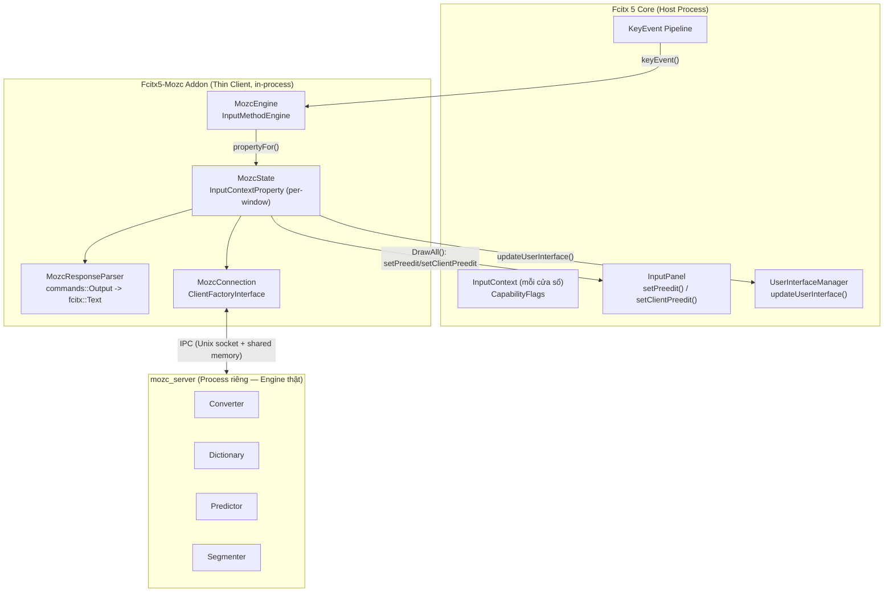
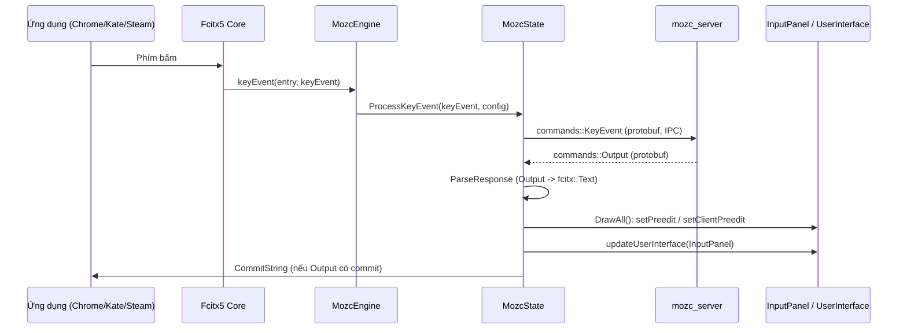
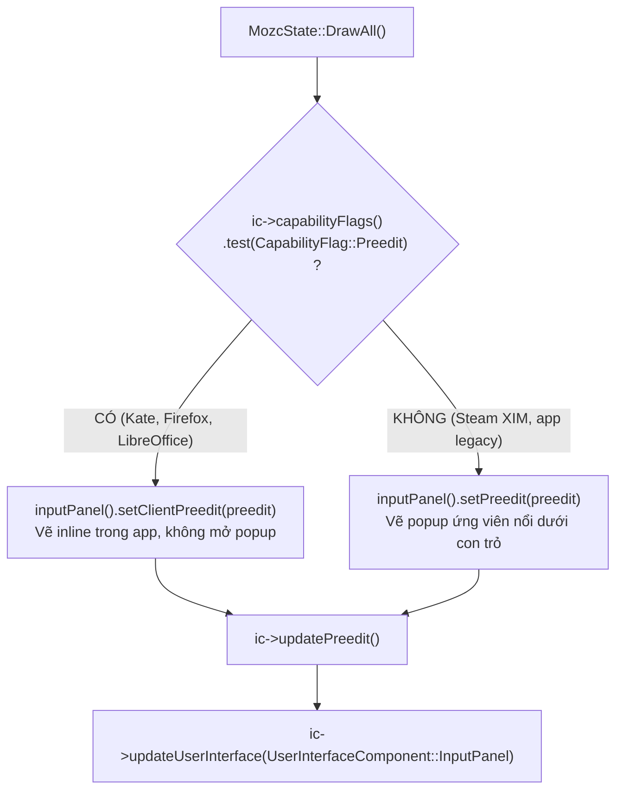
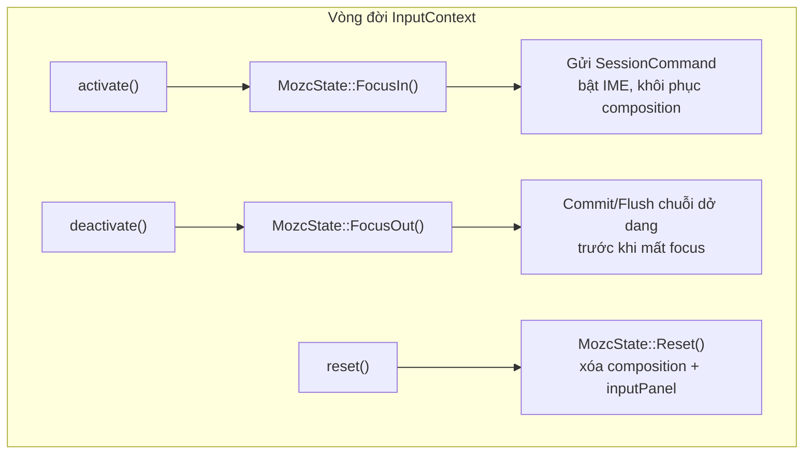
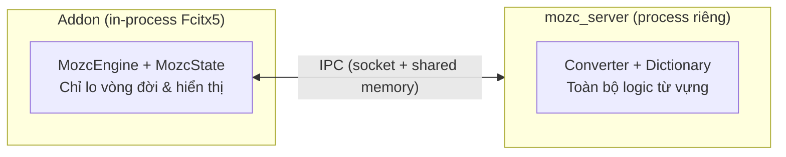

<!--
  BambooMintKey - Vietnamese Telex Input Method Editor
  Copyright (c) 2026 Dương Gia Long and LMO contributors
  SPDX-License-Identifier: MIT
-->

# 009_07 — Sơ Đồ Kiến Trúc Chuẩn của Fcitx5-Mozc Addon (Kim Chỉ Nam cho BambooMintKey Engine)

**Mã tài liệu:** `009_07_Mozc_Reference_Architecture`  
**Giai đoạn:** Phase 9 — Phân phối Flatpak & Tương thích Steam Deck  
**Thuộc module:** `src/BambooMintKey.Fcitx5/` (tham chiếu chuẩn mực từ `fcitx5-mozc`)  
**Trạng thái:** ✅ Tài liệu kiến trúc tham chiếu (Reference Architecture — Kim chỉ nam)  
**Tài liệu liên quan:**
- Issue khắc phục: [011_Flatpak_Incompatibility_Chrome_Opera_Zed_Steam.md](../../3.Issue/011_Flatpak_Incompatibility_Chrome_Opera_Zed_Steam.md)
- Kiến trúc phân ly Flathub: [009_02_Flathub_Independent_Architecture.md](009_02_Flathub_Independent_Architecture.md)
- Kế hoạch tiến độ (M3.6): [004_Flatpak_Progress.md](../../4.Progress/004_Flatpak_Progress.md)

---

## 1. Mục tiêu & Vai trò của tài liệu

Tài liệu này đúc kết **kiến trúc chuẩn mực** của addon `fcitx5-mozc` — bộ gõ tiếng Nhật đã vận hành bền bỉ trên Flatpak, SteamOS và mọi lớp ứng dụng (GTK/Qt, XIM legacy, Wayland text-input) — để làm **kim chỉ nam** cho việc tái cấu trúc `BambooMintKeyEngine` trong hạng mục **M3.6** (khắc phục Issue 011).

Ba trụ cột chuẩn mực mà BambooMintKey cần thừa hưởng từ Mozc:

```
┌────────────────────────────────────────────────────────────────────────┐
│          3 TRỤ CỘT CHUẨN MỰC CỦA FCITX5-MOZC (KIM CHỈ NAM)             │
├────────────────────────────────────────────────────────────────────────┤
│ 1. Tách rời Engine & UI hiển thị (Engine/UI Separation):              │
│    Mozc chia InputPanel thành 2 kênh độc lập: Client Preedit (inline  │
│    trong app) và InputPanel Preedit (popup ứng viên nổi của Fcitx5).   │
├────────────────────────────────────────────────────────────────────────┤
│ 2. Phân nhánh theo CapabilityFlag::Preedit (Capability-Driven):       │
│    Mọi quyết định hiển thị đều rẽ nhánh theo năng lực thật của app.    │
│    App có Preedit -> vẽ inline; App thiếu Preedit -> vẽ popup nổi.     │
├────────────────────────────────────────────────────────────────────────┤
│ 3. Đồng bộ vòng đời InputContext 100% (Lifecycle Compliance):         │
│    activate/deactivate/reset/focus-in/focus-out đều được xử lý tường  │
│    minh để flush/commit chuỗi dở dang, không bao giờ nuốt phím.        │
└────────────────────────────────────────────────────────────────────────┘
```

---

## 2. Sơ đồ kiến trúc tổng thể (Process / Component Model)

Mozc tổ chức addon thành **3 tầng**: Host (Fcitx5 Core) → Thin Client (Addon in-process) → Engine Server (process riêng). Điểm cốt lõi là addon chỉ đóng vai trò **client mỏng (Thin Client)** tuân thủ tuyệt đối vòng đời `InputContext`, còn toàn bộ logic từ vựng nằm ở `mozc_server` bên ngoài.



---

## 3. Phân tầng & Trách nhiệm từng thành phần

| Tầng | Thành phần | Trách nhiệm chuẩn mực |
| :--- | :--- | :--- |
| **Host** | `InputContext` | Mang `CapabilityFlags` — mô tả năng lực thật của ứng dụng (có Preedit, có SurroundingText, có FormattedPreedit…). |
| **Host** | `InputPanel` | Hai kênh hiển thị độc lập: `setClientPreedit` (inline trong app) và `setPreedit` (popup nổi của Fcitx5). |
| **Host** | `UserInterfaceManager` | Điều phối làm mới giao diện; addon **chủ động** gọi `updateUserInterface(InputPanel)`. |
| **Addon** | `MozcEngine` | Điểm vào `InputMethodEngine`: nhận `keyEvent`, `activate`, `deactivate`, `reset`, quản lý config & factory. |
| **Addon** | `MozcState` | Trạng thái per-window (`InputContextProperty`): giữ session, client, `last_output_`; quyết định Draw/Commit. |
| **Addon** | `MozcResponseParser` | Chuyển protobuf `commands::Output` từ server thành `fcitx::Text` (preedit, candidates, segments). |
| **Addon** | `MozcConnection` | Factory tạo kết nối IPC tới `mozc_server`; tách biệt hoàn toàn với logic hiển thị. |
| **Server** | `mozc_server` | Engine thật: Converter, Dictionary, Predictor, Segmenter; giao tiếp qua IPC. |

---

## 4. Luồng xử lý sự kiện phím (Key Event Flow)



---

## 5. Mô hình hiển thị UI — `MozcState::DrawAll()` (Trọng tâm khắc phục Issue 011)

Đây là phần **quyết định** sự tương thích với mọi lớp ứng dụng. Mozc rẽ nhánh theo `CapabilityFlag::Preedit`:



Đoạn mã chuẩn mực tham chiếu từ upstream `src/unix/fcitx5/mozc_state.cc`:

```cpp
if (ic_->capabilityFlags().test(CapabilityFlag::Preedit)) {
    // Ứng dụng hỗ trợ inline preedit (Kate, Firefox, LibreOffice)
    ic_->inputPanel().setClientPreedit(preedit);
} else {
    // Ứng dụng KHÔNG hỗ trợ inline preedit (Steam, XIM legacy apps)
    // Tự động chuyển chuỗi dở dang sang vẽ ở cửa sổ popup InputPanel
    ic_->inputPanel().setPreedit(preedit);
}
ic_->updatePreedit();
// Luôn yêu cầu Fcitx5 làm mới giao diện UI InputPanel
ic_->updateUserInterface(UserInterfaceComponent::InputPanel);
```

**Hệ quả chuẩn mực:** không bao giờ có tình huống "phím bị nuốt mà không hiển thị gì". Nếu app không vẽ được inline, Fcitx5 tự bật popup ứng viên thay thế.

---

## 6. Vòng đời InputContext (Lifecycle / Focus Flow)

Mozc xử lý tường minh từng sự kiện vòng đời để tránh kẹt buffer khi chuyển cửa sổ:



Ba nguyên tắc vòng đời cần tuân thủ:

| Sự kiện | Hành vi chuẩn Mozc | Áp dụng cho BambooMintKey |
| :--- | :--- | :--- |
| `activate` / FocusIn | Khôi phục trạng thái IME, không reset trắng bộ đệm | `activate()` hiện đã gọi `applyConfigToState` — bổ sung thao tác khôi phục trạng thái gõ dở. |
| `deactivate` / FocusOut | Chủ động commit/flush chuỗi dở dang | Cần bổ sung: flush `bmk_get_preedit_text` trước khi mất focus. |
| `reset` | Xóa composition + reset `inputPanel` | Hiện đã có `state->reset()` + `inputPanel().reset()` — cần bổ sung `updateUserInterface(InputPanel)`. |

---

## 7. Cơ chế cách ly Engine & UI

Mozc tách rời **tiến trình xử lý từ vựng** (`mozc_server`) khỏi addon Fcitx5. Addon chỉ là client mỏng qua IPC:



**Ánh xạ sang BambooMintKey:** BambooMintKey không cần process server riêng — `BambooMintKeyCore.so` (NativeAOT C-ABI) đã cô lập sạch logic Telex qua `bmk_context_create()` cho từng `InputContext`. Vì vậy BambooMintKey kế thừa **tinh thần cách ly** của Mozc một cách tự nhiên, và chỉ cần bổ sung **tầng hiển thị chuẩn mực** (Mục 5) cùng **vòng đời chuẩn mực** (Mục 6).

---

## 8. Đối chiếu & Phân tích khoảng cách (Gap Analysis)

| Trụ cột chuẩn Mozc | Hiện trạng BambooMintKey | Khoảng cách cần lấp (M3.6) |
| :--- | :--- | :--- |
| Phân nhánh `CapabilityFlag::Preedit` | `updatePreedit()` luôn set **cả** `setPreedit` lẫn `setClientPreedit`, không kiểm tra cờ | Bổ sung rẽ nhánh `capabilityFlags().test(Preedit)` |
| `updateUserInterface(InputPanel)` | Không được gọi trong `updatePreedit` | Luôn gọi đồng bộ sau `updatePreedit()` |
| Flush khi mất focus | Chưa xử lý `deactivate`/FocusOut | Bổ sung commit chuỗi dở dang khi mất focus |
| Tách biệt 2 kênh UI | Đang trộn lẫn inline + popup | Tách rạch ròi `setClientPreedit` vs `setPreedit` |

---

## 9. Kết luận & Checklist áp dụng cho M3.6

Sơ đồ kiến trúc chuẩn của `fcitx5-mozc` xác lập **chuẩn mực tham chiếu** cho việc tái cấu trúc `BambooMintKeyEngine`:

- [ ] **M3.6.1** — Thay `updatePreedit()` đơn tuyến bằng mô hình `DrawAll()` phân tầng (Mục 5).
- [ ] **M3.6.2** — Phân nhánh theo `CapabilityFlag::Preedit`: `setClientPreedit` (inline) vs `setPreedit` (popup nổi).
- [ ] **M3.6.3** — Đồng bộ vòng đời: bổ sung flush/commit trên `deactivate`/FocusOut và `updateUserInterface` trên `reset` (Mục 6).
- [ ] **M3.6.4** — Kiểm thử hồi quy ma trận ứng dụng (Steam, Chrome/Opera, Zed, Kate, Firefox, LibreOffice, Konsole).

> **Lưu ý:** Tài liệu này là **bản thiết kế kiến trúc tham chiếu**, chưa thực hiện sửa mã nguồn. Việc triển khai mã C++ thuộc hạng mục M3.6 (theo dõi trong [004_Flatpak_Progress.md](../../4.Progress/004_Flatpak_Progress.md)).
