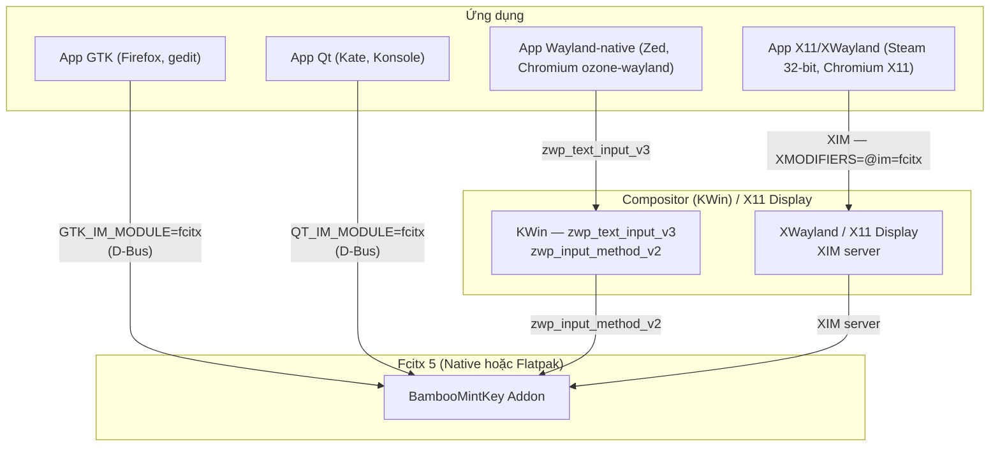

<!--
  BambooMintKey - Vietnamese Telex Input Method Editor
  Copyright (c) 2026 Dương Gia Long and LMO contributors
  SPDX-License-Identifier: MIT
-->

# 009_08 — Ma Trận Tương Thích Ứng Dụng & Biện Pháp Khắc Phục (Chrome / Opera / Zed / Steam)

**Mã tài liệu:** `009_08_App_Compatibility_Fix_Matrix`  
**Giai đoạn:** Phase 9 — Phân phối Flatpak & Tương thích Steam Deck  
**Thuộc module:** `scripts/linux/`, `manifests/flatpak/`, `src/BambooMintKey.Fcitx5/`  
**Trạng thái:** 🔍 Điều tra gốc rễ & thiết kế biện pháp (Root Cause & Fix Matrix)  
**Tài liệu liên quan:**
- Issue gốc: [011_Flatpak_Incompatibility_Chrome_Opera_Zed_Steam.md](../../3.Issue/011_Flatpak_Incompatibility_Chrome_Opera_Zed_Steam.md)
- Kiến trúc chuẩn Mozc: [009_07_Mozc_Reference_Architecture.md](009_07_Mozc_Reference_Architecture.md)
- Kế hoạch kiểm thử E2E: [009_04_SteamDeck_E2E_TestPlan.md](009_04_SteamDeck_E2E_TestPlan.md)

---

## 1. Mục tiêu

Xác định **chính xác** nguyên nhân khiến 4 nhóm ứng dụng (Chrome, Opera, Zed, Steam) không gõ được tiếng Việt, phân tách rạch ròi giữa **lỗi engine** (đã khắc phục tại M3.6) và **lỗi môi trường/cấu hình** (cần xử lý tại tầng hệ điều hành hoặc manifest Flatpak).

> **Điểm mấu chốt người dùng nêu:** bộ gõ Native đã hoạt động tốt trên Kate/Konsole/Firefox/LibreOffice, nhưng **Steam vẫn không gõ được ngay cả khi Native**. Điều này chứng tỏ có một lớp nguyên nhân nằm ngoài `engine.cpp`.

---

## 2. Bản đồ kênh giao tiếp Input Method của Fcitx 5

Trước khi chẩn đoán từng app, cần nắm rõ **4 kênh frontend** mà Fcitx 5 dùng để cấp input method cho ứng dụng. Mỗi ứng dụng dùng **đúng một kênh** tùy toolkit và nền tảng đồ họa:



| Kênh | Cơ chế | Biến môi trường / cờ bắt buộc | Ứng dụng điển hình |
| :--- | :--- | :--- | :--- |
| **GTK IM module** | Client `libfcitx5gclient.so` nói chuyện Fcitx5 qua D-Bus | `GTK_IM_MODULE=fcitx` | Firefox, gedit, GIMP |
| **Qt IM module** | Client Qt Fcitx5 nói chuyện qua D-Bus | `QT_IM_MODULE=fcitx` | Kate, Konsole, Dolphin |
| **Wayland text-input** | App nói `zwp_text_input_v3` với KWin; KWin chuyển cho Fcitx5 qua `zwp_input_method_v2` | Cờ riêng của app (Chromium: `--enable-wayland-ime`) | Zed, Chromium (ozone-wayland) |
| **XIM** | Protocol X11 cổ điển, Fcitx5 chạy XIM server trên display | `XMODIFIERS=@im=fcitx` | Steam (32-bit), app X11 legacy |

> **Lưu ý quan trọng:** các app GTK/Qt (kênh 1–2) và Wayland (kênh 3) **không** nói D-Bus trực tiếp tới `org.fcitx.Fcitx5` theo cách Issue 011 mô tả ở mục 2.1.2. Chẩn đoán "thiếu quyền `--talk-name=org.fcitx.Fcitx5`" là **không chính xác** đối với Chromium — xem Mục 3.1.

---

## 3. Phân tích gốc rễ & biện pháp từng nhóm

### 3.1. Chrome & Opera (Chromium, Flatpak)

| Khía cạnh | Mô tả |
| :--- | :--- |
| **Kênh chính** | Wayland `zwp_text_input_v3` (khi chạy `--ozone-platform=wayland`) |
| **Kênh dự phòng** | XIM qua XWayland (khi chạy nền X11) |
| **Nguyên nhân gốc thật** | Nhân Chromium **mặc định tắt IME Wayland**; chỉ bật khi có cờ `--enable-wayland-ime`. Không liên quan quyền sandbox D-Bus. |
| **Bằng chứng** | Firefox (Flatpak, kênh GTK IM module) gõ tốt cùng môi trường → sandbox Flatpak **không** chặn input method; lỗi nằm ở cách Chromium chọn kênh. |

**Biện pháp (chọn 1 trong 2):**

1. **Bật cờ IME Wayland (khuyến nghị):**
   - Giao diện: mở `chrome://flags/#enable-wayland-ime` → **Enabled** → relaunch.
   - Hoặc khởi chạy: `flatpak run com.google.Chrome --enable-wayland-ime`.
   - Đối với Opera: `flatpak run com.opera.Opera --enable-wayland-ime`.
2. **Ép dùng kênh XIM (fallback):** đảm bảo `XMODIFIERS=@im=fcitx` được set khi Chromium chạy trên nền X11/XWayland.

> Không cần sửa manifest addon; đây là cấu hình phía ứng dụng Chromium, không phải quyền của extension BambooMintKey.

### 3.2. Zed Editor (native, Wayland, GPUI/Rust)

| Khía cạnh | Mô tả |
| :--- | :--- |
| **Kênh chính** | Wayland `zwp_text_input_v3` (Zed nói trực tiếp với KWin, bỏ qua GTK/Qt) |
| **Nguyên nhân gốc thật** | Triển khai `zwp_text_input_v3` của GPUI còn lỗi handshake với KWin; `GTK_IM_MODULE`/`QT_IM_MODULE` vô hiệu vì Zed không dùng toolkit đó. |
| **Tính chất** | Đây là lỗi **upstream** của Zed/GPUI, không thuộc phạm vi BambooMintKey. |

**Biện pháp (chọn 1 trong 2):**

1. **Cập nhật Zed** lên bản mới nhất (cải thiện IME Wayland liên tục qua các release).
2. **Workaround chạy qua XWayland + XIM:**
   ```bash
   env -u WAYLAND_DISPLAY XMODIFIERS=@im=fcitx zed
   ```
   Khi bỏ `WAYLAND_DISPLAY`, Zed chạy nền X11 và fallback về XIM.

### 3.3. Steam Client (native 32-bit, CEF/GTK, XIM) — ✅ Đã giải quyết

| Khía cạnh | Mô tả |
| :--- | :--- |
| **Kênh** | XIM qua CEF/GTK (app 32-bit, không nạp được `libfcitx5gclient.so` 64-bit) |
| **Nguyên nhân gốc thật** | Steam dùng CEF (nền GTK) cho ô nhập liệu. `GTK_IM_MODULE=fcitx` nạp thư viện client 64-bit → Steam 32-bit không nạp được → im lặng không kết nối. Cần `GTK_IM_MODULE=xim` để đi qua giao thức XIM thuần túy. |
| **Bằng chứng** | `env XMODIFIERS="@im=fcitx" GTK_IM_MODULE="xim" QT_IM_MODULE="xim" steam` → gõ tiếng Việt bình thường. |

**Biện pháp chuẩn (đã xác minh, áp dụng cho mọi người dùng):**

`im-config` set `GTK_IM_MODULE=fcitx` toàn cục (trong `/etc/environment`) — đây là nguồn gốc lỗi. Đổi sang `xim` toàn cục (chỉ GTK; giữ `QT_IM_MODULE=fcitx`):

```bash
sed -i 's/GTK_IM_MODULE=fcitx/GTK_IM_MODULE=xim/' ~/.config/environment.d/bamboomintkey.conf
sudo sed -i 's/GTK_IM_MODULE=fcitx/GTK_IM_MODULE=xim/' /etc/environment
```

rồi đăng xuất/đăng nhập lại. Tự động hóa: `scripts/linux/setup_ime_compat.sh`.

Khởi chạy thủ công 1 lần (không cần đổi toàn cục): `env XMODIFIERS="@im=fcitx" GTK_IM_MODULE="xim" QT_IM_MODULE="xim" steam`.

**Áp dụng cho native & Flatpak:** biến môi trường được set ở phía Steam (không phải phía Fcitx5), nên **giống hệt nhau** dù Fcitx5 chạy native hay flatpak (cả hai đều dựng XIM server trên cùng XWayland display).

---

## 4. Thiết lập biến môi trường IME (áp dụng toàn hệ thống)

Để mọi app (đặc biệt Steam/XIM và Chromium/X11 fallback) nhận đúng kênh, cần đảm bảo bộ 3 biến sau được set cho **toàn bộ phiên làm việc**:

```bash
export GTK_IM_MODULE=fcitx
export QT_IM_MODULE=fcitx
export XMODIFIERS=@im=fcitx
```

Vị trí đặt tùy nền tảng:

| Môi trường | Vị trí cấu hình |
| :--- | :--- |
| X11 (Linux Mint Cinnamon/MATE/Xfce) | `~/.xprofile` |
| Wayland (KDE Plasma) | `~/.config/plasma-workspace/env/ime.sh` |
| systemd user session | `~/.config/environment.d/bamboomintkey.conf` |
| Toàn hệ thống | `/etc/environment` (cần root) |

Script tự động hóa: `scripts/linux/setup_ime_compat.sh` (xem Mục 6).

---

## 5. Ma trận tổng hợp Fix (Fix Matrix)

| Ứng dụng | Kênh | Lớp engine (M3.6) | Lớp môi trường | Lớp app upstream |
| :--- | :--- | :---: | :---: | :---: |
| **Chrome / Opera** | Wayland text-input / XIM | ✅ | `XMODIFIERS` + `--enable-wayland-ime` | Chromium flag |
| **Zed Editor** | Wayland text-input | ✅ | `XMODIFIERS` (XWayland fallback) | ⚠️ Lỗi GPUI (cập nhật Zed) |
| **Steam Client** | XIM qua CEF/GTK | ✅ (bổ trợ popup) | `GTK_IM_MODULE=xim` + `XMODIFIERS=@im=fcitx` | — |
| **Kate / Konsole / Firefox / LibreOffice** | Qt / GTK IM module | ✅ | `QT_IM_MODULE` / `GTK_IM_MODULE` | — |

---

## 6. Script hỗ trợ

`scripts/linux/setup_ime_compat.sh` thực hiện:

1. Phát hiện phiên làm việc (X11 / Wayland).
2. Ghi bộ 3 biến môi trường vào đúng vị trí theo nền tảng.
3. Hướng dẫn riêng cho Steam (wrapper `steam-ime.sh`), Chrome/Opera (cờ Chromium), Zed.

`scripts/linux/steam-ime.sh` khởi chạy Steam với `GTK_IM_MODULE=xim` + `XMODIFIERS=@im=fcitx`; cờ `--install` cài wrapper `~/.local/bin/steam`.

---

## 7. Kết luận

- **Steam (native lẫn Flatpak):** đã giải quyết — nguyên nhân là Steam 32-bit không nạp được IM module 64-bit, cần `GTK_IM_MODULE=xim` + `XMODIFIERS=@im=fcitx`. Đã xác minh hoạt động.
- **Chrome/Opera:** nguyên nhân là cờ Chromium (`--enable-wayland-ime`), **không** phải quyền D-Bus sandbox như Issue 011 từng nhận định.
- **Zed:** lỗi upstream GPUI; workaround qua XWayland/XIM hoặc cập nhật Zed.
- **Không cần thay đổi manifest addon** hay quyền sandbox của extension — toàn bộ fix nằm ở tầng engine (đã xong) và tầng môi trường app.
