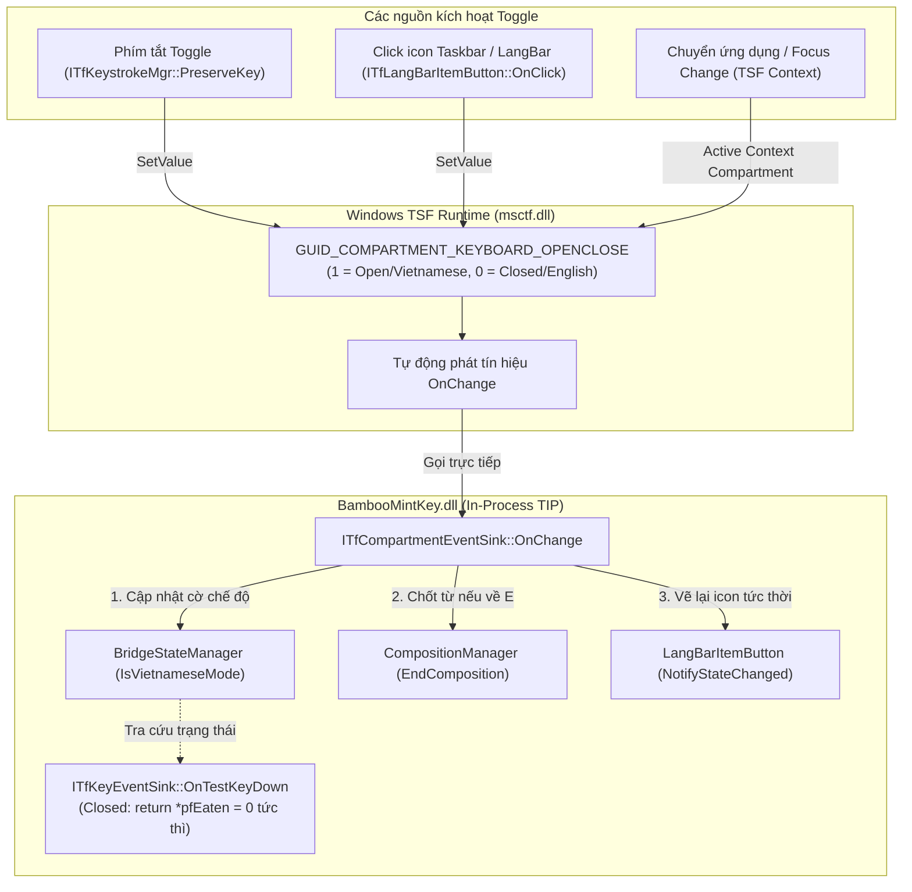

<!--
  BambooMintKey - Vietnamese Telex Input Method Editor for Windows
  Copyright (c) 2026 Dương Gia Long and LMO contributors
  SPDX-License-Identifier: MIT
-->

# Giải Pháp 005_01: Tái Cấu Trúc Cơ Chế Kích Hoạt V/E Theo Mô Hình Google Japanese Input (Mozc / TSF Native)

**Mã tài liệu:** `005_01_Mozc_TSF_Mode_Activation`  
**Trạng thái:** 🚀 Sẵn sàng thực thi (Ready for Execution)  
**Liên quan:** 
- `docs/3.Issue/005_ShortcutKeyAutoResetError.md` (Issue gốc)
- `docs/3.Issue/004_EV_IconError.md` (Lỗi lệch icon V/E)
- `docs/3.Issue/008_PerApplicationVEMode.md` (Lỗi xung đột focus per-application)

---

## 1. Bối cảnh & Bản chất vấn đề

### 1.1. Lối mòn của bộ gõ Unikey cũ (Legacy Global Hook)
Bộ gõ Unikey ra đời hơn 20 năm trước trên nền tảng Win32 với mô hình:
- Sử dụng hook bàn phím toàn cục `SetWindowsHookEx(WH_KEYBOARD_LL)`.
- Duy trì **duy nhất một cờ toàn cục** `bVietnamese = true/false`.
- Khi bấm phím tắt (Ctrl+Shift, Alt+Z), hook đánh chặn và đảo cờ này.
- Khi gõ, hook can thiệp gửi phím ảo xóa lùi (`SendInput` với `VK_BACK`).

### 1.2. Hậu quả khi áp dụng tư duy Unikey vào Windows TSF trong BambooMintKey
Kiến trúc Windows TSF (Text Services Framework) là mô hình **In-Process Text Input Processor (TIP)**. Mỗi tiến trình ứng dụng (Notepad, Chrome, Word,...) đều nạp một bản sao DLL `BambooMintKey.dll` riêng biệt.

Việc cố gắng tái hiện "biến cờ toàn cục Unikey" bằng **Shared Memory 64-byte + Win32 Event Broadcast (`SetEvent`/`ResetEvent`) + `GlobalVEState`** đã dẫn tới hàng loạt lỗi nghiêm trọng:
1. **Lỗi Issue 005 (Cần thêm Space mới kích hoạt mode mới)**:
   - Khi bấm phím tắt (`Ctrl + Shift`), `OnTestKeyDown` trong `KeyEventSinkImpl` nhận phím modifier (`vk=17` là Ctrl) và tự ý kiểm tra `KeyInputTranslator.IsToggleHotkeyPressed` hoặc nhận diện thay đổi `StateSequence`.
   - Cùng lúc đó, TSF Keystroke Manager cũng phát hiện phím tắt đã đăng ký và bắn tiếp sự kiện `OnPreservedKey`.
   - Kết quả: **Toggle bị kích hoạt 2 lần trong 1 nhịp** (True -> False -> True), khiến trạng thái bị giữ nguyên.
   - Hơn nữa, việc cập nhật Compartment bị trì hoãn bên trong `OnTestKeyDown`, nên chỉ khi người dùng bấm thêm một phím bất kỳ (như `Space` hoặc ký tự chữ), `OnTestKeyDown` mới chạy và đồng bộ lại.
2. **Lỗi Issue 004 (Lệch pha giữa Icon Taskbar và khả năng gõ)**:
   - Các luồng cập nhật icon, shared memory và TSF compartment chạy bất đồng bộ, thiếu cơ chế reactive chuẩn từ OS.
3. **Lỗi Issue 008 (Xung đột khi chuyển ứng dụng)**:
   - Ép buộc đồng bộ cưỡng bức từ Shared Memory trong `OnSetFocus` phá vỡ mô hình quản lý context tự nhiên của TSF giữa các cửa sổ ứng dụng.

---

## 2. Giải pháp: Kiến trúc Reactive TSF Native của Google Japanese Input (Mozc)

Google Japanese Input (Mozc trên Windows) và Microsoft IME giải quyết triệt để vấn đề này bằng cách tuân thủ 100% chuẩn TSF, biến bộ gõ thành một công dân hạng nhất (First-class Citizen) trong Windows:

### 2.1. TSF Compartment `GUID_COMPARTMENT_KEYBOARD_OPENCLOSE` là Single Source of Truth
- `1` (Open): Chế độ gõ Tiếng Việt (**V**) đang mở, engine xử lý Telex/VNI.
- `0` (Closed): Chế độ gõ Tiếng Anh (**E**) trực tiếp (Direct Input / Pass-through).
- Windows Taskbar, Touch Keyboard và toàn bộ hệ sinh thái Windows đều tự nhiên kiểm soát và hiển thị đúng theo compartment này.

### 2.2. Cơ chế Reactive 100% qua `ITfCompartmentEventSink`
- Không polling, không kiểm tra `StateSequence` trên từng phím gõ.
- TIP đăng ký `ITfCompartmentEventSink` lắng nghe `GUID_COMPARTMENT_KEYBOARD_OPENCLOSE`.
- Khi giá trị OpenClose thay đổi (bất kể do phím tắt, do click icon Taskbar, hoặc do chuyển cửa sổ), Windows TSF gọi ngay vào callback `ITfCompartmentEventSink::OnChange`.
- Trong `OnChange`:
  1. Cập nhật `BridgeStateManager.IsVietnameseMode` theo giá trị mới.
  2. Nếu chuyển sang **E** (`0`): Gọi ngay `CompositionManager.EndComposition()` để chốt văn bản đang gõ dở.
  3. Gọi `LangBarItemButton.NotifyStateChanged()` để icon Taskbar lập tức đổi sang `V` hoặc `E` ngay tức khắc mà không cần đợi người dùng bấm thêm bất kỳ phím nào.

### 2.3. Bóc tách triệt để giữa PreservedKey và KeyEventSink
- **PreservedKey độc quyền xử lý phím tắt**:
  - Giao toàn bộ việc nhận diện phím tắt chuyển mode (`Ctrl + Shift`, `Alt + Z`,...) cho `ITfKeystrokeMgr::PreserveKey`.
  - Khi người dùng bấm đúng tổ hợp phím tắt, TSF sẽ đánh chặn trước và chuyển thẳng vào `OnPreservedKey`.
  - Trong `OnPreservedKey`: Đọc giá trị OpenClose hiện tại, đảo bit (`!isOpen`) và gọi `SetValue` vào compartment. Thế là xong! Sự kiện `OnChange` sẽ lo toàn bộ phần việc còn lại.
- **KeyEventSink chỉ tập trung gõ phím**:
  - **Xóa bỏ hoàn toàn** logic `KeyInputTranslator.IsToggleHotkeyPressed` trong cả `OnTestKeyDown` và `OnKeyDown`.
  - Chấm dứt 100% nguy cơ double-toggle hoặc nhận diện nhầm phím `vk=17` (Ctrl).
  - Trong `OnTestKeyDown`: Dòng đầu tiên kiểm tra `if (!BridgeStateManager.IsVietnameseMode) { *pfEaten = 0; return HResult.Ok; }`. Khi ở chế độ tiếng Anh, phím được thả trôi ngay lập tức cho ứng dụng với độ trễ bằng 0.

### 2.4. Trả lại vai trò nguyên bản cho Shared Memory
- `SharedMemoryManager` chỉ lưu trữ **cấu hình người dùng dài hạn** (Kiểu gõ: Telex/VNI, Bảng mã, Tùy chọn đặt dấu, Phím tắt ưa thích, Gõ tắt).
- Không dùng Shared Memory làm cờ chuyển đổi trạng thái V/E tức thời giữa các keystroke.

---

## 3. Các thành phần cần Refactor chi tiết

| # | File / Thành phần | Hành động | Nội dung sửa đổi chính |
|---|-------------------|-----------|-------------------------|
| 1 | `src/BambooMintKey.NativeBridge/TSF/TfCompartmentEventSinkImpl.cs` | **[NEW]** | Triển khai `ITfCompartmentEventSink` (IID `7434DD71-70E2-11D1-B656-0080C736B2D9`), tiếp nhận `OnChange` và kích hoạt cập nhật trạng thái/icon tức thì. |
| 2 | `src/BambooMintKey.NativeBridge/TSF/TsfCompartmentHelper.cs` | **[MODIFY]** | Thêm hàm `GetOpenClose`, `SetOpenClose`, `ToggleOpenClose`, `AdviseCompartmentEventSink`, `UnadviseCompartmentEventSink`. |
| 3 | `src/BambooMintKey.NativeBridge/TSF/KeyEventSinkImpl.cs` | **[MODIFY]** | Xóa logic bắt phím tắt tự chế trong `OnTestKeyDown`/`OnKeyDown`. Xóa polling `StateSequence`. `OnPreservedKey` chỉ gọi `ToggleOpenClose`. `OnTestKeyDown` pass-through ngay nếu `IsVietnameseMode == false`. |
| 4 | `src/BambooMintKey.NativeBridge/TSF/BambooMintKeyTextService.cs` | **[MODIFY]** | Thêm vtable `ITfCompartmentEventSink` vào `NativeLayout`. Đăng ký sink khi `ActivateEx`, gỡ sink khi `Deactivate`. Điều chỉnh `OnSetFocus` để đọc trạng thái context tự nhiên. |
| 5 | `src/BambooMintKey.NativeBridge/TSF/LangBarItemButton.cs` | **[MODIFY]** | Click chuột trái gọi `TsfCompartmentHelper.ToggleOpenClose()`. |
| 6 | `src/BambooMintKey.NativeBridge/TSF/BridgeStateManager.cs` | **[MODIFY]** | Quản lý cờ `IsVietnameseMode` cục bộ trong bộ nhớ tiến trình, đồng bộ trực tiếp từ TSF Compartment. |
| 7 | `src/BambooMintKey.NativeBridge/Interop/KeyInputTranslator.cs` | **[MODIFY]** | Loại bỏ hàm `IsToggleHotkeyPressed` dư thừa để tránh bắt nhầm modifier keys. |

---

## 4. Kế hoạch Kiểm tra & Nghiệm thu (Verification)

1. **Khắc phục Issue 005 (Không cần phím Space)**:
   - Bấm `Ctrl + Shift` trong Notepad/Word/Windows Search.
   - Icon Taskbar chuyển ngay tức khắc từ `V` sang `E` hoặc ngược lại.
   - Gõ ngay ký tự tiếp theo: chế độ mới có hiệu lực 100% ngay từ ký tự đầu tiên, không cần bấm thêm phím Space mồi.
2. **Không còn Double-Toggle**:
   - Log `BambooMintKey_Runtime.log` chỉ ghi nhận đúng 1 lần thay đổi `OpenClose` cho mỗi lần bấm phím tắt.
3. **Bảo toàn 100% chất lượng gõ tiếng Việt**:
   - Chạy toàn bộ 119 Unit Tests của `BambooMintKey.Core.Tests`.
