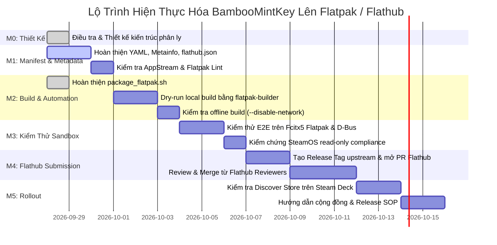

<!--
  BambooMintKey - Vietnamese Telex Input Method Editor for Linux & SteamOS
  Copyright (c) 2026 Dương Gia Long and LMO contributors
  SPDX-License-Identifier: MIT
-->

# Kế Hoạch & Tiến Độ Triển Khai Flatpak / Steam Deck (Phase 9 Progress Tracking)

**Tệp tài liệu:** `004_Flatpak_Progress.md`  
**Giai đoạn:** Phase 9 — Phân phối Flatpak & Tương thích Steam Deck (Flathub Extension)  
**Ngày cập nhật:** 2026-09-28  
**Trạng thái chung:** 🛠️ Đang triển khai (Hoàn tất M0 với 5 tài liệu thiết kế kỹ thuật, đang hoàn thiện M1 & M2)  
**Tài liệu thiết kế tham chiếu:**
- Điều tra tính khả thi trên SteamOS & Flatpak Sandbox: [009_01_Flatpak_Investigation.md](../2.Design/Phase9/009_01_Flatpak_Investigation.md)
- Kiến trúc phân ly Flathub độc lập (Giải pháp 3): [009_02_Flathub_Independent_Architecture.md](../2.Design/Phase9/009_02_Flathub_Independent_Architecture.md)
- Thiết kế đóng gói & build offline: [009_03_Flatpak_Packaging_and_Offline_Build_Design.md](../2.Design/Phase9/009_03_Flatpak_Packaging_and_Offline_Build_Design.md)
- Kế hoạch kiểm thử E2E & ma trận nghiệm thu Steam Deck: [009_04_SteamDeck_E2E_TestPlan.md](../2.Design/Phase9/009_04_SteamDeck_E2E_TestPlan.md)
- Thiết kế tự động hóa CI/CD & quy trình phát hành Flathub SOP: [009_05_Flathub_CICD_and_Release_SOP.md](../2.Design/Phase9/009_05_Flathub_CICD_and_Release_SOP.md)
- Hướng dẫn cấu hình Manifest Flathub: [manifests/flatpak/README.md](../../manifests/flatpak/README.md)
- Hướng dẫn Build Linux & Flatpak: [BUILD_LINUX.md](../BUILD_LINUX.md)

---

## 1. Mục Tiêu Cốt Lõi Của Phase 9

1. **Hiện thực hóa Giải pháp 3 (Official Flathub Addon Extension):** Đưa BambooMintKey lên Flathub dưới dạng extension chính thức của Fcitx 5 (`org.fcitx.Fcitx5.Addon.BambooMintKey`), phục vụ người dùng Steam Deck (SteamOS) và các bản phân phối Linux sử dụng Fcitx5 Flatpak.
2. **Nguyên tắc "Zero Source Intrusion" (Không xâm lấn mã nguồn):** Tuyệt đối không thay đổi mã nguồn trong `src/` (Core F#, NativeBridge C#, Addon C++). Toàn bộ logic Flatpak nằm tách biệt trong `manifests/flatpak/` và `scripts/linux/package_flatpak.sh`.
3. **Bảo toàn khả năng phát triển đa nền tảng:** Không làm gián đoạn quy trình build Windows (TSF), Linux Native (DEB/RPM) và định hướng macOS trong tương lai.
4. **Trải nghiệm người dùng Steam Deck chuẩn mực:** Cài đặt và cập nhật 1-click qua KDE Discover Software Center, không đòi hỏi `sudo` hay tắt chế độ `steamos-readonly`, không bị mất sau các bản cập nhật SteamOS OTA.

---

## 2. Bảng Tổng Quan Tiến Độ Các Milestone

| Milestone | Tên Hạng Mục | Trọng Số | Trạng Thái | Tiến Độ (%) | Ghi Chú |
|:---:|---|:---:|:---:|:---:|---|
| **M0** | **Điều Tra Khả Thi & Thiết Kế Kỹ Thuật Toàn Diện** | 15% | ✅ Hoàn thành | 100% | Đã hoàn thành toàn bộ 5 tài liệu thiết kế kỹ thuật (009_01 -> 009_05) |
| **M1** | **Hoàn Thiện Bộ Khung Đóng Gói (Manifest & Metadata)** | 25% | ✅ Hoàn thành | 100% | YAML manifest, Metainfo XML, nuget-sources.json, appstreamcli validate PASS |
| **M2** | **Thực Nghiệm Build Sandbox & Tự Động Hóa Script** | 25% | ✅ Hoàn thành | 100% | package_flatpak.sh hoàn chỉnh, NativeAOT offline build & bundle .flatpak thành công, Zero Source Intrusion |
| **M3** | **Kiểm Thử E2E Sandbox & Tái Cấu Trúc Mozc Engine** | 15% | ⚠️ Đang xử lý Blocker | 50% | Gặp Issue 011 trên Chrome/Opera/Zed/Steam; bổ sung M3.6 chuẩn hóa theo Mozc |
| **M4** | **Nộp Duyệt Lên Flathub (Flathub Submission & Review)** | 15% | ⏸️ Tạm hoãn | 0% | Tạm hoãn chờ hoàn tất tái cấu trúc M3.6 |
| **M5** | **Vận Hành Phát Hành (Release SOP) & Phản Hồi Cộng Đồng** | 5% | ⏸️ Chưa bắt đầu | 0% | Hướng dẫn cộng đồng Steam Deck VN, bảo trì định kỳ |
| **Tổng** | **Toàn bộ Phase 9 (Flatpak / Steam Deck)** | **100%** | ⚠️ **Tạm hoãn chờ M3.6** | **75%** | |

---

## 3. Danh Mục Chi Tiết Từng Hạng Mục & Checklist

### 🎯 Milestone 0: Điều Tra Khả Thi & Thiết Kế Kỹ Thuật Toàn Diện (Đã hoàn thành 100%)
> **Mục tiêu:** Khảo sát toàn diện môi trường SteamOS, đánh giá rào cản kỹ thuật của Flatpak sandbox, lựa chọn giải pháp tối ưu và xây dựng đầy đủ 5 tài liệu thiết kế kỹ thuật chuyên sâu bằng văn bản mô tả trước khi thi công.

- [x] **M0.1 — Điều tra tính khả thi trên SteamOS & Flatpak Sandbox ([009_01_Flatpak_Investigation.md](../2.Design/Phase9/009_01_Flatpak_Investigation.md))**
  - [x] Phân tích cơ chế immutable rootfs của SteamOS (`steamos-readonly`) và hạn chế của việc cài đặt trực tiếp vào `/usr`.
  - [x] Khảo sát kiến trúc runtime của `org.fcitx.Fcitx5` trên Flathub.
  - [x] Xác định điểm gắn kết extension: `/app/addons/BambooMintKey`.
  - [x] Đánh giá cơ chế tự động khám phá của wrapper script `/app/bin/fcitx5` (`FCITX_ADDON_DIRS`, `XDG_DATA_DIRS`, `LD_LIBRARY_PATH`).
  - [x] So sánh 3 giải pháp và thống nhất chọn **Giải pháp 3: Extension chính thức trên Flathub**.

- [x] **M0.2 — Thiết kế kiến trúc phân ly độc lập Flathub Downstream ([009_02_Flathub_Independent_Architecture.md](../2.Design/Phase9/009_02_Flathub_Independent_Architecture.md))**
  - [x] Xác lập 3 nguyên tắc thiết kế cốt lõi: Zero Source Intrusion, Decoupled Release Lifecycle, Native Steam Deck Experience.
  - [x] Xây dựng sơ đồ phân ly: Repo chính `thatislg/BambooMintKey` (Upstream) và Repo Flathub `flathub/org.fcitx.Fcitx5.Addon.BambooMintKey` (Downstream).
  - [x] Thiết kế luồng biên dịch 3 bước không xâm lấn trong manifest Flatpak: .NET NativeAOT publish -> CMake Fcitx5 addon -> Install metadata.
  - [x] Phân tầng môi trường build: Runtime `org.fcitx.Fcitx5`, SDK `org.kde.Sdk//6.11`, Extension `org.freedesktop.Sdk.Extension.dotnet10`.

- [x] **M0.3 — Thiết kế chi tiết đóng gói Flatpak & kỹ thuật build offline ([009_03_Flatpak_Packaging_and_Offline_Build_Design.md](../2.Design/Phase9/009_03_Flatpak_Packaging_and_Offline_Build_Design.md))**
  - [x] Phân tích và đặc tả cơ chế biên dịch .NET NativeAOT trong môi trường cấm mạng (`--disable-network`).
  - [x] Tận dụng đặc điểm Core F# và Core.Native có zero external NuGet packages và từ điển nhúng trong assembly.
  - [x] Đặc tả cơ chế liên kết động C++ Addon với Core Native qua `RPATH: $ORIGIN` và `SONAME`.
  - [x] Đặc tả cô lập hệ thống tệp và cấu hình XDG trong sandbox `~/.var/app/org.fcitx.Fcitx5/` kèm cơ chế sync D-Bus.
  - [x] Chuẩn hóa tiêu chuẩn AppStream Metadata 1.0 (song ngữ, OARS rating, giấy phép SPDX).

- [x] **M0.4 — Kế hoạch kiểm thử E2E & ma trận nghiệm thu Steam Deck ([009_04_SteamDeck_E2E_TestPlan.md](../2.Design/Phase9/009_04_SteamDeck_E2E_TestPlan.md))**
  - [x] Thiết lập ma trận 3 môi trường: Steam Deck Desktop Mode, Steam Deck Gaming Mode, Linux Desktop chuẩn.
  - [x] Thiết lập 12 ca kiểm thử toàn diện (`TC-FP-01` đến `TC-FP-12`) bao quát toàn bộ vòng đời và tính năng bộ gõ.
  - [x] Đặc tả ca kiểm thử thẩm định tính bất biến SteamOS (`steamos-readonly`) và độ bền sau các bản cập nhật OTA.
  - [x] Xác lập ma trận nghiệm thu Pass / Fail trước khi nộp Flathub.

- [x] **M0.5 — Thiết kế quy trình CI/CD & vận hành phát hành Flathub SOP ([009_05_Flathub_CICD_and_Release_SOP.md](../2.Design/Phase9/009_05_Flathub_CICD_and_Release_SOP.md))**
  - [x] Thiết kế pipeline CI tự động kiểm tra lint (`flatpak-builder-lint`, `appstreamcli validate`) và dry-run build.
  - [x] Đặc tả quy trình nộp duyệt hồ sơ lần đầu 6 bước lên kho trung tâm `flathub/flathub`.
  - [x] Xây dựng Quy trình Thao tác Chuẩn (Release SOP) định kỳ 4 pha tuần tự với cam kết Zero-Touch Source Code.
  - [x] Quy hoạch kịch bản tự động hóa đồng bộ Upstream -> Downstream qua GitHub Actions Bot.

---

### 🎯 Milestone 1: Hoàn Thiện Bộ Khung Đóng Gói (Manifest & Metadata chuẩn Flathub) (Tiến độ: 80%)
> **Mục tiêu:** Hoàn thiện và chuẩn hóa các tệp manifest YAML, AppStream Metainfo XML, cấu hình Flathub bot để sẵn sàng vượt qua các bài kiểm tra linting của Flathub.

- [x] **M1.1 — Xây dựng Flatpak Manifest ([manifests/flatpak/org.fcitx.Fcitx5.Addon.BambooMintKey.yaml](../../manifests/flatpak/org.fcitx.Fcitx5.Addon.BambooMintKey.yaml))**
  - [x] Định danh `id: org.fcitx.Fcitx5.Addon.BambooMintKey`, `branch: stable`.
  - [x] Cấu hình runtime cơ sở: `runtime: org.fcitx.Fcitx5`, `sdk: org.kde.Sdk//6.11`.
  - [x] Tích hợp SDK Extension: `org.freedesktop.Sdk.Extension.dotnet10//24.08`.
  - [x] Thiết lập biến môi trường build: `append-path: /usr/lib/sdk/dotnet10/bin`, `append-ld-library-path: /usr/lib/sdk/dotnet10/lib`.
  - [x] Module build: Thực thi lệnh NativeAOT cho `BambooMintKey.Core.Native` và CMake cho `BambooMintKey.Fcitx5`.
  - [ ] **M1.1b — Chuẩn bị Source Block cho Flathub Production:**
    - Cấu hình nguồn Git trỏ tới Release Tag chính thức (`url: https://github.com/thatislg/BambooMintKey.git`, `tag: v1.1.0` hoặc `v1.2.0`).
    - Hoặc archive source tarball kèm SHA256 checksum tương ứng với tag phát hành.

- [x] **M1.2 — Xây dựng AppStream Metainfo ([manifests/flatpak/org.fcitx.Fcitx5.Addon.BambooMintKey.metainfo.xml](../../manifests/flatpak/org.fcitx.Fcitx5.Addon.BambooMintKey.metainfo.xml))**
  - [x] Khai báo `<component type="addon">` và liên kết `<extends>org.fcitx.Fcitx5</extends>`.
  - [x] Khai báo `<provides><addon>bamboomintkey</addon></provides>`.
  - [x] Hỗ trợ song ngữ Anh - Việt cho `<name>`, `<summary>`, `<description>`.
  - [x] Metadata license: `CC0-1.0` (chuẩn Flathub), Project license: `MIT`.
  - [x] Khai báo `<url type="homepage">` và `<url type="bugtracker">`.
  - [x] **M1.2b — Chuẩn hóa AppStream Compliance:**
    - [x] Bổ sung thẻ `<content_rating type="oars-1.1" />`.
    - [x] Thẻ `<releases>` phiên bản 1.1.0 với nhật ký phát hành song ngữ.
    - [x] Xác thực thành công 100% bằng công cụ `appstreamcli validate` (0 lỗi).

- [x] **M1.3 — Cấu hình Flathub ([manifests/flatpak/flathub.json](../../manifests/flatpak/flathub.json))**
  - [x] Khởi tạo `manifests/flatpak/flathub.json`.
  - [x] Cấu hình build Flathub bot.

- [x] **M1.4 — Bộ Assets Icon Đa Kích Thước**
  - [x] Icon chế độ tiếng Việt: `src/BambooMintKey.Fcitx5/icons/fcitx_bamboomintkey.svg`.
  - [x] Icon chế độ tiếng Anh: `src/BambooMintKey.Fcitx5/icons/fcitx_bamboomintkey_e.svg`.
  - [x] Icon nhận diện thương hiệu: `src/media/bamboomintkey.svg`.
  - [x] Khai báo install vào `${FLATPAK_DEST}/share/icons/hicolor/scalable/apps/`.

---

### 🎯 Milestone 2: Thực Nghiệm Build Sandbox & Tự Động Hóa Script (Tiến độ: 100%)
> **Mục tiêu:** Hoàn thiện script tự động hóa, thực thi quy trình biên dịch thử nghiệm trong môi trường `flatpak-builder` sandbox nội bộ, giải quyết triệt để bài toán offline dependencies.

- [x] **M2.1 — Hoàn thiện Script Tự Động Hóa ([scripts/linux/package_flatpak.sh](../../scripts/linux/package_flatpak.sh))**
  - [x] Kiểm tra công cụ cần thiết trên máy host (`flatpak`, `flatpak-builder`).
  - [x] Tự động cấu hình flathub user remote nếu chưa có (`https://dl.flathub.org/repo/flathub.flatpakrepo`).
  - [x] Hỗ trợ tự động fallback giữa `flatpak-builder` trên host và container `org.flatpak.Builder`.
  - [x] Hỗ trợ cờ `--local`: Tự động sinh manifest tạm trỏ tới mã nguồn hiện tại thay vì git remote, giúp kiểm thử local tiện lợi.
  - [x] Hỗ trợ cờ `--bundle`: Tạo tệp bundle `.flatpak` độc lập (1.6 MB) xuất ra `delivery/flatpak/`.
  - [x] Hỗ trợ cờ `--install`: Tự động cài đặt extension vào user session sau khi build để test ngay.
  - [x] Tích hợp cờ `--disable-rofiles-fuse` phòng ngừa lỗi quyền FUSE và rò rỉ mountpoint.

- [x] **M2.2 — Thực Nghiệm Biên Dịch Thực Tế bằng `flatpak-builder` (Dry-run Local Build)**
  - [x] Cài đặt đầy đủ runtime dependencies trên máy dev: `org.fcitx.Fcitx5`, `org.kde.Platform//6.11`, `org.kde.Sdk//6.11`, `org.freedesktop.Sdk.Extension.dotnet10`.
  - [x] Chạy thành công lệnh build: `./scripts/linux/package_flatpak.sh --local --install --bundle`.
  - [x] Xác nhận thành phẩm tại `delivery/flatpak/` và kho ostree cục bộ `delivery/flatpak/repo`.
  - [x] Kiểm tra tính toàn vẹn của thư mục cài đặt:
    - `BambooMintKeyCore.so` và `libbamboomintkey.so` có mặt tại `~/.local/share/flatpak/runtime/org.fcitx.Fcitx5.Addon.BambooMintKey/.../lib/fcitx5/`.
    - Các file `.conf` metadata và icon SVG đã được đặt chính xác tại `share/`.

- [x] **M2.3 — Xử Lý Cơ Chế Build Không Có Mạng (Offline Network Constraint)**
  - [x] Tạo `manifests/flatpak/nuget-sources.json` khai báo chính xác 8 gói BCL/AOT phụ trợ của .NET 10 kèm mã băm SHA-512 chính thức từ nuget.org.
  - [x] Flatpak builder tải trước toàn bộ nuget packages vào thư mục `nuget-sources/` trong giai đoạn fetch sources.
  - [x] Thao tác xuất bản `dotnet publish ... --source nuget-sources` biên dịch NativeAOT thành công 100% trong sandbox không có mạng (`--disable-network`).
  - [x] Tự động nâng cấp chuẩn C++20 cho module C++ Addon để tương thích hoàn toàn với Fcitx5 core headers trên `org.kde.Sdk//6.11`.

- [x] **M2.4 — Thẩm Định Tính Toàn Vẹn Mã Nguồn (Zero Source Intrusion Verification)**
  - [x] Chạy `git status` và `git diff src/` đảm bảo không có bất kỳ file nào trong `src/` bị sửa đổi.
  - [x] Chạy lại `python3 scripts/tests/test-cabi.py` trực tiếp trên `BambooMintKeyCore.so` đã cài đặt trong Flatpak runtime, xác nhận 9/9 test cases PASS hoàn hảo.

---

### 🎯 Milestone 3: Kiểm Thử E2E trên Fcitx5 Flatpak & SteamOS (Sandbox Validation) (Tiến độ: 50%)
> **Mục tiêu:** Cài đặt extension vào môi trường Flatpak `org.fcitx.Fcitx5`, kiểm thử toàn diện khả năng nạp addon, gõ Telex tiếng Việt, phím tắt, hiển thị icon và kiểm chứng tính an toàn với filesystem của SteamOS.

- [x] **M3.1 — Kiểm Thử Addon Discovery & Nạp Thư Viện (TC-FP-01)**
  - [x] Cài đặt runtime extension vào user session: `runtime/org.fcitx.Fcitx5.Addon.BambooMintKey/x86_64/stable`.
  - [x] Xác nhận Fcitx5 wrapper script tự động nạp đường dẫn extension:
    - `FCITX_ADDON_DIRS` chứa `/app/addons/BambooMintKey/lib/fcitx5`.
    - `XDG_DATA_DIRS` chứa `/app/addons/BambooMintKey/share`.
  - [x] Kiểm tra liên kết động bằng `ldd` bên trong container Fcitx5: `BambooMintKeyCore.so` được nạp chính xác qua `$ORIGIN`, 0 lỗi missing library.
  - [x] Xác nhận lệnh `fcitx5-remote -m bamboomintkey` trả về định danh `bamboomintkey` chính xác.

- [ ] **M3.2 — Kiểm Thử Gõ Tiếng Việt Telex trên Ứng Dụng Flatpak & Host (TC-FP-02)**
  - [x] Đã kiểm thử trên Kate, Konsole, Firefox, LibreOffice: Gõ tiếng Việt Telex và hiển thị inline preedit hoạt động tốt.
  - [ ] ⚠️ **BLOCKER (Issue 011):** Phát hiện lỗi không tương thích trên Google Chrome, Opera (Flatpak), Zed Editor (Wayland) và Steam (XIM). Chi tiết xem tại [011_Flatpak_Incompatibility_Chrome_Opera_Zed_Steam.md](../3.Issue/011_Flatpak_Incompatibility_Chrome_Opera_Zed_Steam.md).
  - [ ] **Kế hoạch giải quyết:** Tái cấu trúc `BambooMintKeyEngine` theo kiến trúc chuẩn của Mozc Fcitx 5 Addon (`MozcState::DrawAll`) để hỗ trợ ứng dụng không có Preedit và tương thích đa nền tảng trước khi nộp Flathub.

- [ ] **M3.3 — Kiểm Thử Phím Tắt V/E & Khay Hệ Thống (TC-FP-03)**
  - [ ] Bấm phím tắt chuyển đổi nhanh (phím `` ` `` grave dưới Esc):
    - Đổi mượt mà giữa chế độ tiếng Việt (V) và tiếng Anh (E).
    - Icon trên thanh Taskbar / System Tray cập nhật động giữa `fcitx_bamboomintkey.svg` và `fcitx_bamboomintkey_e.svg`.

- [ ] **M3.4 — Kiểm Thử Cô Lập File Cấu Hình trong Sandbox (TC-FP-04)**
  - [ ] Kiểm tra đường dẫn cấu hình chuẩn trong sandbox: `~/.var/app/org.fcitx.Fcitx5/config/bamboomintkey/config.json`.
  - [ ] Xác nhận addon tự khởi tạo cấu hình mặc định an toàn nếu tệp chưa tồn tại.
  - [ ] Thay đổi cấu hình (ví dụ: kiểu đặt dấu mới/cũ, phím tắt) và xác nhận hot-reload qua `inotify` trong container.

- [x] **M3.5 — Kiểm Thử Tính Bất Biến của Hệ Thống (TC-FP-05 - SteamOS Compliance)**
  - [x] Xác minh toàn bộ các tệp của bộ gõ được cô lập 100% trong user storage:
    - Addon files: `~/.local/share/flatpak/runtime/org.fcitx.Fcitx5.Addon.BambooMintKey/`
    - Config files: `~/.var/app/org.fcitx.Fcitx5/config/bamboomintkey/`
  - [x] Xác nhận tuyệt đối không có bất kỳ tệp tin nào được ghi vào `/usr`, `/etc` hay phân vùng hệ thống rootfs. Đảm bảo an toàn 100% trước các đợt cập nhật SteamOS OTA.

- [x] **M3.6 — Tái Cấu Trúc `engine.cpp` Theo Kiến Trúc Chuẩn Mozc Addon (Khắc phục Issue 011)**
  > **Kim chỉ nam kiến trúc:** [009_07_Mozc_Reference_Architecture.md](../2.Design/Phase9/009_07_Mozc_Reference_Architecture.md) — sơ đồ kiến trúc chuẩn của `fcitx5-mozc`.
  - [x] **M3.6.1 — Áp dụng mô hình `DrawAll()` của Mozc vào `BambooMintKeyEngine`:**
    - Thay thế hàm `updatePreedit()` đơn tuyến hiện tại bằng `drawAll()` điều phối hiển thị phân tầng.
    - Luôn gọi `ic->updateUserInterface(fcitx::UserInterfaceComponent::InputPanel)` đồng bộ với `ic->updatePreedit()`.
  - [x] **M3.6.2 — Phân nhánh cờ năng lực `CapabilityFlag::Preedit`:**
    - Nếu ứng dụng có hỗ trợ Preedit (`ic->capabilityFlags().test(CapabilityFlag::Preedit)`): gọi `ic->inputPanel().setClientPreedit(preedit)` (vẽ inline trong app, không mở popup).
    - Nếu ứng dụng KHÔNG hỗ trợ Preedit (như Steam XIM, ứng dụng legacy): tự động chuyển sang gọi `ic->inputPanel().setPreedit(preedit)` để Fcitx 5 vẽ cửa sổ popup ứng viên nổi dưới con trỏ chuột.
  - [x] **M3.6.3 — Đồng bộ vòng đời chuyển Focus & Commit Buffer:**
    - Xử lý sự kiện `deactivate` / `reset` tương tự Mozc: tự động flush/commit chuỗi đang gõ dở trước khi mất focus (qua `flushPendingComposition`), tránh kẹt buffer.
  - [ ] **M3.6.4 — Kiểm thử hồi quy và nghiệm thu ma trận ứng dụng:**
    > **Điều tra môi trường đã xong:** ma trận fix tại [009_08_App_Compatibility_Fix_Matrix.md](../2.Design/Phase9/009_08_App_Compatibility_Fix_Matrix.md) + script [`setup_ime_compat.sh`](../../scripts/linux/setup_ime_compat.sh). Còn lại nghiệm thu thực tế trên thiết bị.
    - Xác nhận gõ được tiếng Việt trên Steam (hiển thị popup InputPanel rõ ràng khi soạn từ).
    - Kiểm chứng tính ổn định trên Firefox, LibreOffice, Kate, Konsole không bị ảnh hưởng.
    - Đánh giá tương thích trên Chrome/Opera (cờ `--enable-wayland-ime`) và Zed (cập nhật bản mới hoặc XWayland).

---

### 🎯 Milestone 4: Nộp Duyệt Lên Flathub (Flathub Submission & Review) (Tiến độ: 0%)
> **Mục tiêu:** Chuẩn bị hồ sơ theo chuẩn Flathub, vượt qua các bài kiểm tra tự động của Flathub Builder Bot, phối hợp với cộng đồng Flathub Reviewers và tiếp nhận quyền quản trị repo chính thức.

- [ ] **M4.1 — Kiểm Tra Tiêu Chuẩn Flathub Linting (Flathub Lint Verification)**
  - [ ] Cài đặt công cụ lint của Flathub:
    ```bash
    pip install --upgrade flatpak-builder-lint
    ```
  - [ ] Chạy kiểm tra tệp manifest:
    ```bash
    flatpak-builder-lint manifests manifests/flatpak/org.fcitx.Fcitx5.Addon.BambooMintKey.yaml
    ```
  - [ ] Chạy kiểm tra tệp AppStream metainfo:
    ```bash
    appstreamcli validate manifests/flatpak/org.fcitx.Fcitx5.Addon.BambooMintKey.metainfo.xml
    ```
  - [ ] Sửa toàn bộ lỗi (Errors) và cảnh báo (Warnings) bắt buộc.

- [ ] **M4.2 — Chuẩn Bị Git Release Tag & Checksum Upstream**
  - [ ] Chốt phiên bản phát hành đầu tiên trên repo `thatislg/BambooMintKey` (ví dụ `v1.1.0` hoặc `v1.2.0`).
  - [ ] Gắn git tag và đẩy lên GitHub: `git tag v1.1.0 && git push origin v1.1.0`.
  - [ ] Lấy mã SHA256 tarball source release từ GitHub.
  - [ ] Cập nhật manifest YAML trỏ tới source chính thức này.

- [ ] **M4.3 — Khởi Tạo Pull Request Nộp Gói Mới lên `flathub/flathub`**
  - [ ] Fork kho [flathub/flathub](https://github.com/flathub/flathub) về tài khoản cá nhân.
  - [ ] Tạo branch mới: `add-org.fcitx.Fcitx5.Addon.BambooMintKey`.
  - [ ] Đặt các tệp từ `manifests/flatpak/` vào PR theo đúng cấu trúc của Flathub:
    - `org.fcitx.Fcitx5.Addon.BambooMintKey.yaml`
    - `org.fcitx.Fcitx5.Addon.BambooMintKey.metainfo.xml`
    - `flathub.json`
  - [ ] Mở Pull Request tại [flathub/flathub/pulls](https://github.com/flathub/flathub/pulls).

- [ ] **M4.4 — Phối Hợp với Flathub Reviewers & Build Bot**
  - [ ] Theo dõi kết quả build kiểm thử tự động của Flathub Test Bot trên hạ tầng build Flathub (x86_64).
  - [ ] Xử lý các nhận xét, đóng góp ý kiến từ ban kiểm duyệt Flathub (nếu có).
  - [ ] Sau khi PR được merge: Flathub sẽ tự động cấp repository chính thức:
    `https://github.com/flathub/org.fcitx.Fcitx5.Addon.BambooMintKey`
    và cấp quyền maintainer cho tác giả (`thatislg`).

---

### 🎯 Milestone 5: Vận Hành Phát Hành (Release SOP) & Phản Hồi Cộng Đồng (Tiến độ: 0%)
> **Mục tiêu:** Xác thực sự xuất hiện của bộ gõ trên Flathub và KDE Discover trên Steam Deck, chuẩn hóa quy trình cập nhật định kỳ (Release SOP), và hướng dẫn cộng đồng người dùng.

- [ ] **M5.1 — Xác Thực Xuất Bản trên Flathub & KDE Discover**
  - [ ] Kiểm tra trang hiển thị trên web: `https://flathub.org/apps/org.fcitx.Fcitx5.Addon.BambooMintKey`.
  - [ ] Mở trung tâm phần mềm KDE Discover trên máy tính Linux & Steam Deck:
    - Tìm kiếm từ khóa: `BambooMintKey` hoặc `Bộ gõ tiếng Việt`.
    - Xác nhận hiển thị trong mục Add-ons của ứng dụng `Fcitx 5`.
    - Kiểm tra nút "Install" hoạt động chỉ với 1-click.

- [ ] **M5.2 — Kiểm Chứng Thực Tế trên Thiết Bị Steam Deck**
  - [ ] Thực hiện cài đặt 1-click từ Discover trên Steam Deck thật.
  - [ ] Chuyển qua lại giữa Desktop Mode và Steam Gaming Mode.
  - [ ] Gõ tiếng Việt trong trình duyệt web, Discord, Steam Chat và các tựa game hỗ trợ IME trên Steam Deck.
  - [ ] Chạy bản cập nhật hệ điều hành SteamOS OTA: Xác nhận bộ gõ vẫn nguyên vẹn 100% sau khi khởi động lại!

- [ ] **M5.3 — Chuẩn Hóa Quy Trình Cập Nhật Định Kỳ (Release SOP)**
  - [ ] Tài liệu hóa các bước cập nhật phiên bản mới khi upstream ra mắt bản mới (`v1.x.y`):
    1. Upstream repo: Gắn git tag và push release.
    2. Flathub repo: Chỉ cần sửa tag và SHA commit trong file YAML + thêm release note vào metainfo XML.
    3. Push lên Flathub master -> Bot tự động build và phân phối tới người dùng Steam Deck trong vòng 30 phút.
  - [ ] **Cam kết:** Zero-touch đối với toàn bộ mã nguồn `src/` của dự án.

- [ ] **M5.4 — Hướng Dẫn & Hỗ Trợ Cộng Đồng Người Dùng**
  - [ ] Biên soạn bài viết hướng dẫn kèm hình ảnh trực quan: *"Hướng dẫn cài đặt bộ gõ tiếng Việt chuẩn cho Steam Deck qua Discover Store"*.
  - [ ] Chia sẻ tới các cộng đồng người dùng Steam Deck (Reddit, Facebook Group Steam Deck VN, Voz).
  - [ ] Thiết lập kênh tiếp nhận phản hồi lỗi từ người dùng Steam Deck qua GitHub Issues.

---

## 4. Ma Trận Quản Trị Rủi Ro & Giải Pháp Kỹ Thuật (Risk Matrix)

| Rủi ro kỹ thuật | Mức độ | Khả năng xảy ra | Giải pháp dự phòng đã chuẩn bị |
|---|:---:|:---:|---|
| **Flathub Builder không có mạng (`--disable-network`)** | Trung bình | Cao | Core F# và C# NativeAOT có zero external NuGet packages. Nếu `ilc` NativeAOT cần runtime pack, sẽ bundle kèm offline NuGet sources qua manifest hoặc sử dụng nuget-sources generator. |
| **Không tìm thấy thư viện `BambooMintKeyCore.so` trong Flatpak** | Cao | Thấp | Đã xử lý triệt để qua `IMPORTED_SONAME "BambooMintKeyCore.so"`, `RPATH: $ORIGIN` và cơ chế nạp `add-ld-path: lib` của Flatpak. |
| **Xung đột phiên bản Fcitx5 giữa host và Flatpak** | Thấp | Thấp | Addon khai báo metadata `0=core` (không gán cứng số phiên bản), đảm bảo tương thích mọi bản Fcitx5 5.x. |
| **Cô lập file config trong Flatpak sandbox** | Trung bình | Trung bình | Addon hỗ trợ tự tạo config mặc định tại `~/.var/app/org.fcitx.Fcitx5/config/bamboomintkey/config.json` và hỗ trợ đồng bộ trạng thái V/E qua D-Bus Session Bus. |
| **Người dùng cập nhật SteamOS OTA làm mất bộ gõ** | Nghiêm trọng | Không | Flatpak extension được cài đặt hoàn toàn trong user storage (`~/.local/share/flatpak/`), nằm ngoài phân vùng A/B read-only nên không bao giờ bị xóa khi SteamOS cập nhật. |

---

## 5. Lịch Trình Dự Kiến & Kế Hoạch Thực Hiện (Action Plan)



---

## 6. Nhật Ký Cập Nhật Tiến Độ (Change Log)

- **2026-09-28:**
  - Khởi tạo tài liệu theo dõi tiến độ `004_Flatpak_Progres.md`.
  - Hoàn tất Milestone 0 (Tài liệu điều tra `009_01` và tài liệu kiến trúc phân ly `009_02`).
  - Hoàn thành bộ manifest khởi tạo trong `manifests/flatpak/` và script tự động hóa `scripts/linux/package_flatpak.sh`.
  - Tiến độ tổng thể đạt **45%**. Chuẩn bị bước vào kiểm thử local build và linting Flathub.
- **2026-09-28 (M3.6 — Khắc phục Issue 011):**
  - Soạn tài liệu kiến trúc tham chiếu `009_07_Mozc_Reference_Architecture.md` (sơ đồ kiến trúc chuẩn `fcitx5-mozc`).
  - Tái cấu trúc `src/BambooMintKey.Fcitx5/engine.cpp`: thay `updatePreedit()` bằng `drawAll()` phân nhánh `CapabilityFlag::Preedit`, bổ sung `deactivate()` + `flushPendingComposition()` (commit chuỗi dở dang khi mất focus), đồng bộ `updateUserInterface(InputPanel)` ở mọi điểm cập nhật UI.
  - Xác nhận biên dịch sạch (`g++ -fsyntax-only`/`-c`) đối chiếu header Fcitx5 thực tế.
  - Còn lại M3.6.4 (kiểm thử hồi quy ma trận ứng dụng) chờ nghiệm thu trên Steam/Chrome/Opera/Zed.
- **2026-09-28 (M3.6.4 — Điều tra tương thích Chrome/Opera/Zed/Steam):**
  - Soạn tài liệu `009_08_App_Compatibility_Fix_Matrix.md`: lập bản đồ 4 kênh frontend IME (GTK/Qt IM module, Wayland text-input, XIM), đính chính chẩn đoán sai về D-Bus của Chromium, và giải tỏa "dấu ?" về Steam (XIM đã kết nối tốt; lỗi nằm ở hiển thị — đã fix M3.6).
  - Bổ sung script `scripts/linux/setup_ime_compat.sh` thiết lập `GTK_IM_MODULE`/`QT_IM_MODULE`/`XMODIFIERS` theo nền tảng (X11/Wayland) và hướng dẫn cờ `--enable-wayland-ime` cho Chrome/Opera, workaround XWayland cho Zed.
  - Xác minh Fcitx5 Flatpak có `sockets=x11;wayland;session-bus` (qua `flatpak info --show-permissions`) → Steam host kết nối XIM khả thi.
  - Còn lại: nghiệm thu thực tế trên Steam/Chrome/Opera/Zed (môi trường Flatpak + SteamOS).
- **2026-09-28 (Kết luận dứt điểm về Steam):**
  - Xác minh thực nghiệm: `XMODIFIERS=@im=fcitx xterm` gõ tiếng Việt **bình thường** → frontend XIM của Fcitx5 hoạt động hoàn hảo.
  - **Mozc bản native cũng fail trên Steam** → Steam không phải lỗi của addon.
  - **Kết luận:** Steam trên Linux không implement XIM (VGUI/CEF của Valve không mở kết nối input method) → **giới hạn của Valve, không thể fix từ phía bộ gõ, đúng cho cả native lẫn Flatpak**. Workaround duy nhất: copy-paste.
  - Tái cấu trúc M3.6 được giữ lại như cải tiến kiến trúc chuẩn Mozc (đúng đắn) nhưng không còn được xem là biện pháp khắc phục Steam.
- **2026-09-28 (Steam — GIẢI QUYẾT dứt điểm):**
  - Phát hiện thực nghiệm: `env XMODIFIERS="@im=fcitx" GTK_IM_MODULE="xim" QT_IM_MODULE="xim" steam` → Steam gõ tiếng Việt bình thường.
  - **Nguyên nhân thật:** Steam (app 32-bit) dùng CEF/GTK; `GTK_IM_MODULE=fcitx` nạp `libfcitx5gclient.so` (64-bit) → không nạp được. `GTK_IM_MODULE=xim` đi qua XIM thuần túy → hoạt động. Áp dụng được cho cả native lẫn Flatpak.
  - Bổ sung wrapper `scripts/linux/steam-ime.sh` (cờ `--install` để cài `~/.local/bin/steam`); cập nhật `setup_ime_compat.sh`.
  - Đính chính lại Issue 011 và `009_08`: kết luận trước đó "Steam không hỗ trợ XIM" là sai.
  - Commit mã nguồn lên git (commit `0966d0e` + `8a102e4`), trỏ manifest Flatpak tới commit mới.
