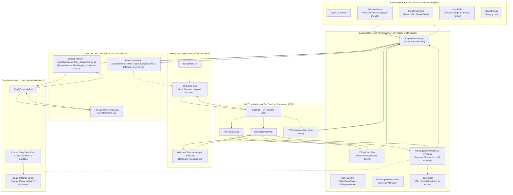
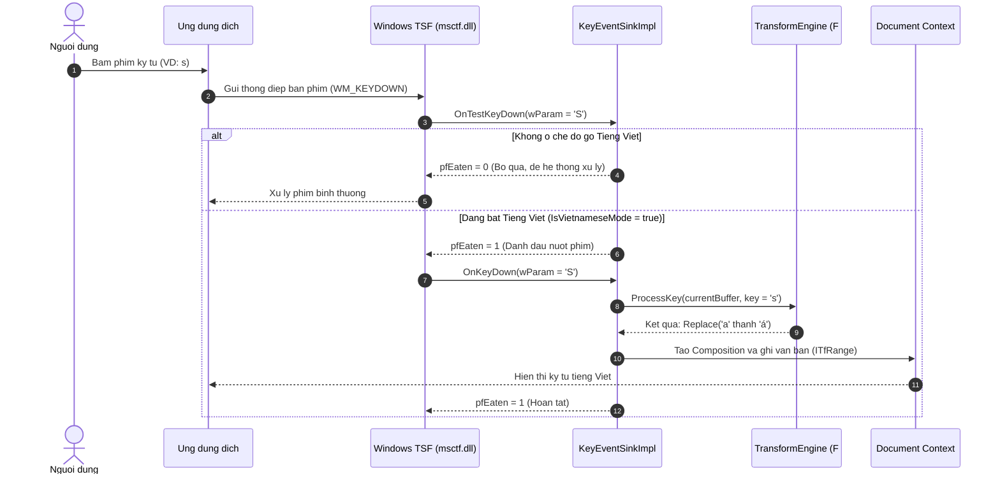
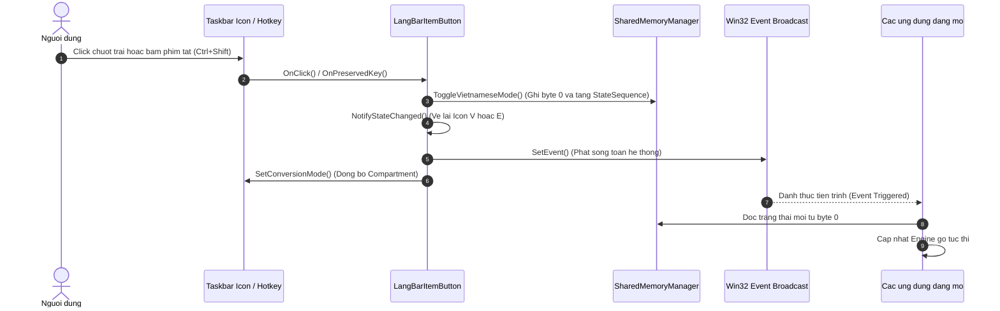
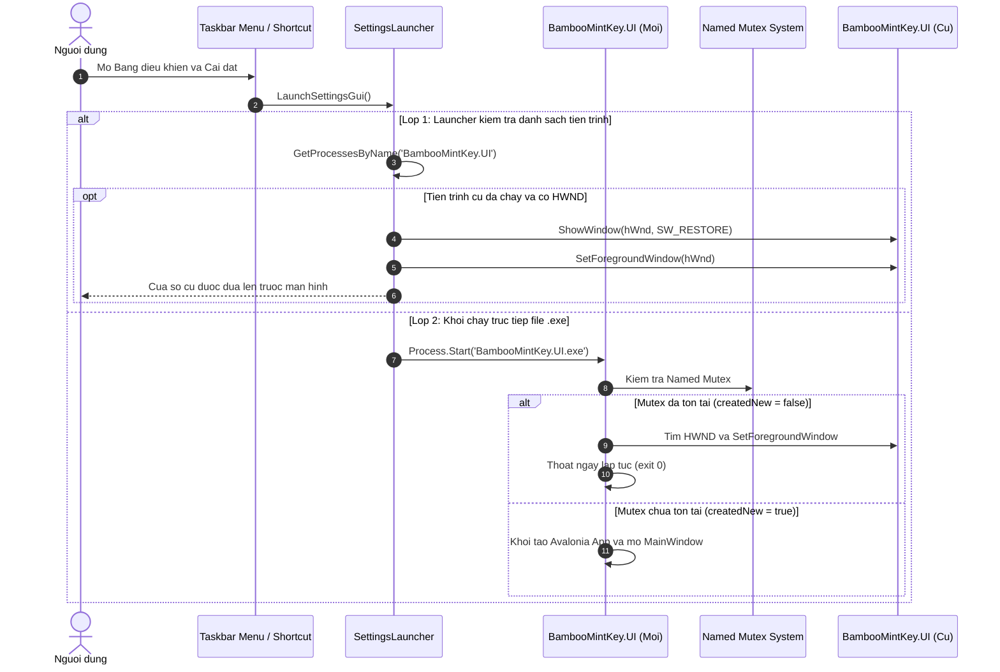

<!--
  BambooMintKey - Vietnamese Telex Input Method Editor for Windows
  Copyright (c) 2026 Dương Gia Long and LMO contributors
  SPDX-License-Identifier: MIT
-->

# BambooMintKey — Kiến Trúc Hệ Thống (System Architecture)

Tài liệu này cung cấp cái nhìn tổng quan toàn diện và chi tiết về mặt kỹ thuật của dự án **BambooMintKey** sau khi toàn bộ mã nguồn đã hoàn thiện và hoạt động ổn định trên hệ điều hành Windows 10/11.

---

## 1. Tổng Quan Kiến Trúc (Architecture Overview)

Khác biệt hoàn toàn với các bộ gõ truyền thống trên Windows sử dụng cơ chế Windows Hook toàn cục (`WH_KEYBOARD_LL`) và giả lập phím ảo (`SendInput`/`keybd_event`) vốn tiềm ẩn độ trễ cao và hay bị các phần mềm bảo mật (antivirus, anti-cheat) chặn, **BambooMintKey** được xây dựng theo mô hình **In-Process Text Input Processor (TIP)** tích hợp sâu vào kiến trúc **Windows Text Services Framework (TSF)**.

Hệ thống kết hợp mô hình Hybrid đa công nghệ:
1. **Lõi thuật toán (BambooMintKey.Core)**: Viết bằng **F# thuần chức năng (Functional Programming)**, đảm bảo tính bất biến (immutability), an toàn luồng tuyệt đối và không có tác dụng phụ (no side-effects).
2. **Cầu nối hệ thống (BambooMintKey.NativeBridge)**: Viết bằng **C# và biên dịch NativeAOT thành DLL C gốc (`BambooMintKey.dll`)**, đóng vai trò là một In-Process COM Server được nạp trực tiếp vào không gian tiến trình (address space) của mọi ứng dụng đích (Notepad, Word, Browser, Discord, Games,...).
3. **Bộ nhớ dùng chung liên tiến trình (SharedMemoryManager)**: Sử dụng **Win32 Named File Mapping** với Universal SDDL để đồng bộ trạng thái V/E và cấu hình thời gian thực (zero-latency) giữa mọi tiến trình và thanh Taskbar Windows.
4. **Giao diện điều khiển (BambooMintKey.UI)**: Viết bằng **F# Avalonia Desktop 12**, độc lập, nhẹ và được bảo vệ bởi cơ chế **Single-Instance Mutex** liên tiến trình.

---

## 2. Sơ Đồ Kiến Trúc Tổng Thể (System Architecture Diagram)

---

## 3. Chi Tiết Các Phân Hệ (Component Details)

### 3.1. Phân Hệ Lõi: `BambooMintKey.Core` (F#)
- **Đặc điểm**: Mã nguồn thuần F#, không phụ thuộc vào bất kỳ thư viện bên ngoài hay API nền tảng Windows. Đảm bảo deterministic 100%, dễ viết Unit Test độc lập.
- **Các thành phần chính**:
  - `Types.fs`: Định nghĩa các kiểu dữ liệu cốt lõi (`InputMethod`, `Charset`, `ToneStyle`, `TonePosition`, `SyllableComponents`).
  - `CharTable.fs`: Bảng mã tra cứu siêu tốc cho Unicode dựng sẵn (NFC), Unicode tổ hợp (NFD), TCVN3 (ABC).
  - `SyllableParser.fs`: Thuật toán bóc tách âm tiết tiếng Việt thành 3 phần: Phụ âm đầu (Initial Consonant), Âm đệm & Âm chính (Medial & Nucleus Vowel), Phụ âm cuối (Final Consonant).
  - `TransformEngine.fs`: Cỗ máy biến đổi âm tiết theo các quy tắc ngữ pháp tiếng Việt:
    - Quy tắc đặt dấu thanh (Mới: *òa, xòe, thủy* vs Cũ: *oà, xoè, thuỷ*).
    - Tự động phục hồi từ gốc khi gõ từ tiếng Anh sai ngữ pháp tiếng Việt (`AutoRestoreEnglishWords`).
    - Gõ lặp dấu để khôi phục ký tự thô (`AllowRepeatKeyUndo`: *ss* $\rightarrow$ *s*).
    - Phím `w` đầu từ thành `ư` (`AllowLeadingWAsU`: *w* $\rightarrow$ *ư*).
  - `MacroEngine.fs`: Khớp chuỗi gõ tắt cực nhanh từ bộ nhớ đệm.

### 3.2. Phân Hệ Cầu Nối: `BambooMintKey.NativeBridge` (C# NativeAOT)
- **Đặc điểm**: Được biên dịch thành thư viện C native (`BambooMintKey.dll`) qua công nghệ **.NET NativeAOT**, không cần nạp CLR runtime nặng nề, tốc độ khởi tạo tính bằng microsecond.
- **COM Exports & Interfaces**:
  - `DllRegisterServer` / `DllUnregisterServer`: Đăng ký CLSID COM Server `{B8A5A29D-68B1-4A59-B41E-D8B383D6F2C1}` và đăng ký TSF Language Profile Tiếng Việt (`0x042A`, GUID `{C2F31A8E-92D0-4F81-9C3E-A52889211D44}`).
  - `ITfTextInputProcessorEx`: Quản lý vòng đời khởi động (`ActivateEx`) và tắt (`Deactivate`) TIP khi ứng dụng được kích hoạt/thoát.
  - `ITfKeyEventSink`: Đánh chặn phím cấp thấp:
    - `OnTestKeyDown`: Kiểm tra xem phím có thuộc diện TIP cần xử lý hay không. Nếu cần, trả về `*pfEaten = 1` để hệ điều hành chuyển phím tiếp sang `OnKeyDown`.
    - `OnKeyDown`: Bóc tách phím, chuyển dữ liệu vào F# Core Engine để tổng hợp văn bản tiếng Việt, sau đó chèn vào vị trí con trỏ bằng `ITfInsertAtSelection`.
    - `OnPreservedKey`: Tiếp nhận sự kiện bấm phím tắt chuyển chế độ (Hotkeys).
  - `ITfLangBarItemButton` & `ITfSource`: Nút điều khiển trên Taskbar:
    - Render icon `V` hoặc `E` động qua GDI+ ([IconHelper.cs](file:///D:/Kojin/BambooMintKey/src/BambooMintKey.NativeBridge/Interop/IconHelper.cs)).
    - Xử lý click chuột trái: Đảo trạng thái V/E tức thì.
    - Xử lý click chuột phải: Tạo Win32 Popup Context Menu với phím tắt động.
  - `SettingsLauncher`: Khởi chạy hoặc kích hoạt cửa sổ cài đặt UI đảm bảo Single-Instance.

### 3.3. Phân Hệ Đồng Bộ: `SharedMemoryManager` (Inter-Process Sync)
- **Vấn đề giải quyết**: Windows TSF chạy TIP phân tán trong từng tiến trình độc lập (mỗi process Notepad, Word, Chrome đều nạp 1 bản sao `BambooMintKey.dll` riêng). Do đó, khi người dùng đổi chế độ từ Taskbar hoặc từ Bảng điều khiển, trạng thái phải được cập nhật sang tất cả các tiến trình ngay lập tức.
- **Giải pháp**:
  - Sử dụng **Win32 Named File Mapping** mang tên `Local\BambooMintKey_SharedConfig_v1`.
  - Thiết lập Universal SDDL `D:(A;;GA;;;WD)(A;;GA;;;AC)S:(ML;;NW;;;LW)` cho phép cả các tiến trình chạy trong Sandbox bảo mật ngặt nghèo (Chromium Renderer Low-Integrity, UWP/AppContainer) đều có quyền đọc/ghi mà không bị Windows Access Denied.
  - Cập nhật số phiên bản trạng thái `StateSequence` (offset 8) kiểu atomic (`Interlocked.Increment`).
  - Kích hoạt Win32 Manual-Reset Event `Local\BambooMintKey_StateChangedEvent_v1` để đánh thức tức thì tất cả các tiến trình đang chờ.

#### Cấu Trúc Vùng Nhớ Dùng Chung (Shared Memory 64-byte Layout):
| Offset | Kích thước | Kiểu dữ liệu | Tên trường | Ý nghĩa |
|:------:|:----------:|:------------:|:-----------|:--------|
| `0` | 1 byte | `byte` | `IsVietnameseMode` | `1`: Chế độ Tiếng Việt (`V`), `0`: Tiếng Anh (`E`) |
| `1` | 1 byte | `byte` | `ToneStyle` | `0`: Kiểu mới (*òa, xòe*), `1`: Kiểu cũ (*oà, xoè*) |
| `2` | 1 byte | `byte` | `AutoRestoreEnglish`| `1`: Bật tự khôi phục tiếng Anh, `0`: Tắt |
| `3` | 1 byte | `byte` | `AllowRepeatKeyUndo`| `1`: Bật lặp dấu khôi phục (*ss* $\rightarrow$ *s*), `0`: Tắt |
| `4` | 1 byte | `byte` | `AllowLeadingWAsU`  | `1`: Phím *w* đầu từ thành *ư*, `0`: Giữ nguyên *w* |
| `5` | 1 byte | `byte` | `InputMethod`       | `0`: Telex, `1`: VNI, `2`: Simple Telex |
| `6` | 1 byte | `byte` | `Charset`           | `0`: Unicode dựng sẵn, `1`: Tổ hợp, `2`: TCVN3 |
| `7` | 1 byte | `byte` | `ToggleHotkey`      | `0`: Ctrl+Shift, `1`: Alt+Z, `2`: Ctrl+Space, `3`: None, `4`: Custom |
| `8` | 4 bytes | `uint32` | `StateSequence`    | Số đếm vòng lặp thay đổi trạng thái (Monotonic Counter) |
| `12` | 4 bytes | `uint32` | `HotkeyVKey`       | Virtual-Key Code của phím tắt (VD: `0x10`, `0x5A`,...) |
| `16` | 4 bytes | `uint32` | `HotkeyModifiers`  | TSF Modifiers của phím tắt (VD: `0x0202`, `0x0001`,...) |
| `20..63` | 44 bytes| `byte[]` | *Reserved*         | Dành cho mở rộng trong tương lai |

### 3.4. Phân Hệ Giao Diện: `BambooMintKey.UI` (Avalonia F#)
- **Công nghệ**: Avalonia 12 Fluent Design, chạy cross-thread an toàn.
- **Tính năng**:
  - Cài đặt kiểu gõ, bảng mã, phím tắt linh hoạt (bấm để gán phím trực tiếp).
  - Gõ thử nghiệm (Sandbox) trực tiếp ngay trên cửa sổ cấu hình.
  - Tùy chọn khởi động cùng Windows (ghi Registry `HKCU\Software\Microsoft\Windows\CurrentVersion\Run`).
  - Cơ chế **Single-Instance 2 lớp**:
    - Sử dụng `System.Threading.Mutex` (`Local\BambooMintKey_UI_SingleInstance_Mutex`).
    - Nếu đã có instance đang chạy, tìm `HWND` và gọi Win32 API `ShowWindow(hWnd, SW_RESTORE)` kèm `SetForegroundWindow(hWnd)` để kéo cửa sổ cũ lên trước màn hình, instance mới lập tức kết thúc.

---

## 4. Sơ Đồ Các Luồng Xử Lý Chính (Core Sequence Diagrams)

### 4.1. Luồng Xử Lý Gõ Phím (Key Interception and Typing Pipeline)

### 4.2. Luồng Chuyển Đổi Chế Độ V/E và Đồng Bộ Đa Tiến Trình (State Synchronization Flow)

### 4.3. Luồng Bảo Vệ Single-Instance Khi Khởi Chạy Bảng Điều Khiển (Single-Instance Lifecycle)

---

## 5. Đặc Tả Tích Hợp Hệ Thống Windows TSF (Windows Integration Spec)

| Thành phần | Định danh / Giá trị | Ý nghĩa |
|:-----------|:--------------------|:--------|
| **Text Service CLSID** | `{B8A5A29D-68B1-4A59-B41E-D8B383D6F2C1}` | Định danh COM In-Process Server của BambooMintKey |
| **Language Profile GUID** | `{C2F31A8E-92D0-4F81-9C3E-A52889211D44}` | Định danh cấu hình ngôn ngữ Tiếng Việt trong Windows TSF |
| **Language ID (LCID)** | `0x042A` (`vi-VN`) | Mã ngôn ngữ Tiếng Việt chuẩn của Microsoft Windows |
| **Language Bar Item GUID** | `{5A70B60B-A57E-4C23-8BBE-9A2E12F6B8E1}` | Định danh nút bấm icon `V`/`E` trên Language Bar |
| **Preserved Key GUID** | `{F618B0DE-E6E4-427E-B8E3-E5F6BD660E04}` | Định danh phím tắt chuyển đổi chế độ gõ hệ thống |
| **Registry COM Server** | `HKLM\SOFTWARE\Classes\CLSID\{B8A5A29D-...}` | Đăng ký đường dẫn file `BambooMintKey.dll` |
| **Registry TSF TIP** | `HKLM\SOFTWARE\Microsoft\CTF\TIP\{B8A5A29D-...}` | Đăng ký TIP vào hệ thống TSF của máy tính |
| **Registry User Profile** | `HKCU\SOFTWARE\Microsoft\CTF\TIP\{B8A5A29D-...}` | Kích hoạt bộ gõ cho tài khoản người dùng hiện tại |
| **Registry SortOrder** | `HKCU\Software\Microsoft\CTF\SortOrder\...` | Đưa BambooMintKey vào danh sách chuyển đổi `Win + Space` |

---

## 6. Lộ Trình Sẵn Sàng Công Bố (Release & Public Readiness)

Hệ thống hiện tại đã hoàn tất toàn bộ các phân hệ cốt lõi:
1. ✅ **Core Engine**: F# Telex / VNI / Simple Telex, xử lý âm tiết tiếng Việt chính xác cao, 119/119 unit tests passing.
2. ✅ **TSF Native Bridge**: NativeAOT x64, đăng ký COM in-process mượt mà, Taskbar Icon GDI+ động, Context menu nhãn động theo phím tắt.
3. ✅ **Cross-Process Sync**: Shared Memory + Event broadcast, tương thích mọi loại sandbox của Windows.
4. ✅ **Settings GUI**: Avalonia 12 hiện đại, bảo vệ Single-Instance tuyệt đối.

**Các công đoạn tiếp theo trước khi phát hành (Public Release):**
- **Đóng gói bộ cài đặt (Installer)**: Sử dụng Inno Setup hoặc WiX Toolset để đóng gói `BambooMintKey.dll`, `BambooMintKey.UI.exe` và các dependency thành 1 file `Setup.exe` duy nhất có chức năng tự động `regsvr32` và `enable-tip`.
- **Ký số mã nguồn (Code Signing)**: Ký số file DLL và EXE bằng chứng chỉ số (Authenticode Certificate) để tránh cảnh báo Windows SmartScreen.
- **Tài liệu hướng dẫn người dùng cuối (User Guide)**: Ảnh chụp màn hình và hướng dẫn sử dụng nhanh trên GitHub Release.
