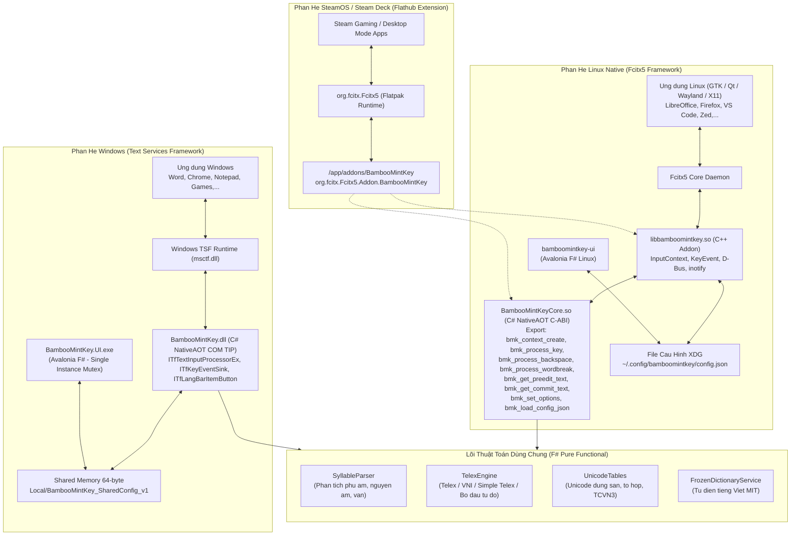
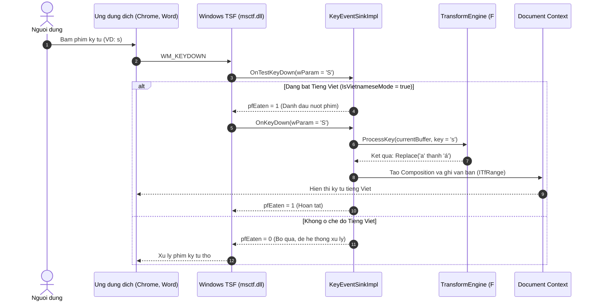
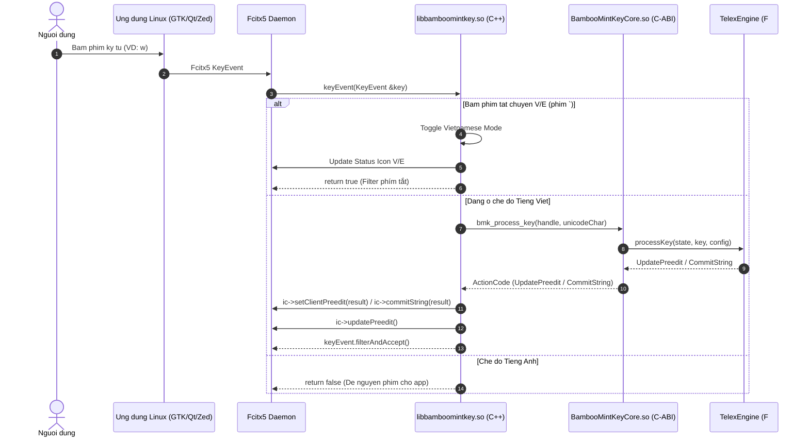
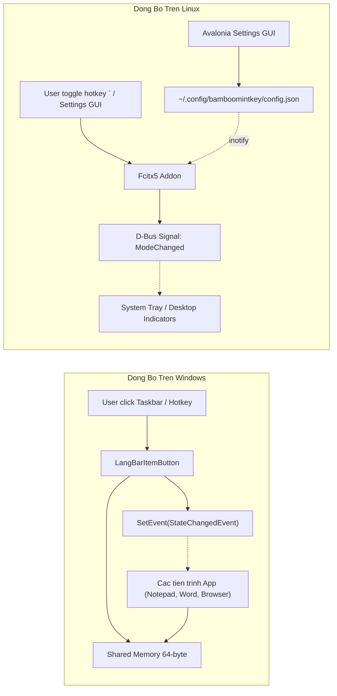

<!--
  BambooMintKey - Vietnamese Telex Input Method Editor for Windows, macOS & Linux
  Copyright (c) 2026 Dương Gia Long and LMO contributors
  SPDX-License-Identifier: MIT
-->

# BambooMintKey — Kiến Trúc Hệ Thống (System Architecture)

Tài liệu này cung cấp cái nhìn tổng quan toàn diện và chi tiết về mặt kỹ thuật của dự án **BambooMintKey**, bao gồm kiến trúc lõi dùng chung (F# Functional Core) và các tầng tích hợp hệ thống chuyên biệt trên **Windows** (Text Services Framework), **Linux** (Fcitx5 Native), và **SteamOS / Steam Deck** (Flathub Flatpak Extension).

---

## 1. Tổng Quan Kiến Trúc (Architecture Overview)

Khác biệt hoàn toàn với các bộ gõ truyền thống sử dụng cơ chế Hook bàn phím toàn cục và giả lập phím ảo (`SendInput` / `keybd_event` / `XTest`) vốn tiềm ẩn độ trễ cao, gây xung đột và hay bị các phần mềm bảo mật (antivirus, anti-cheat) chặn, **BambooMintKey** được xây dựng theo mô hình **Tích hợp sâu vào Input Method Framework chuẩn của hệ điều hành**:

1. **Lõi thuật toán bất biến (`BambooMintKey.Core`)**: Viết bằng **F# thuần chức năng (Functional Programming)**, đảm bảo tính bất biến (immutability), an toàn luồng tuyệt đối (thread-safe), deterministic 100% và không có tác dụng phụ (no side-effects). Lõi này hoàn toàn không phụ thuộc vào bất kỳ API hệ điều hành nào và được chia sẻ nguyên vẹn cho mọi nền tảng.
2. **Nền tảng Windows (In-Process TIP qua TSF)**:
   - `BambooMintKey.NativeBridge`: Viết bằng **C# và biên dịch NativeAOT thành DLL C gốc (`BambooMintKey.dll`)**, đóng vai trò là một In-Process COM Server được nạp trực tiếp vào không gian tiến trình (address space) của mọi ứng dụng đích (Word, Chrome, Notepad, Games,...).
   - `SharedMemoryManager`: Sử dụng **Win32 Named File Mapping** với Universal SDDL để đồng bộ trạng thái V/E và cấu hình thời gian thực (zero-latency) giữa mọi tiến trình và thanh Taskbar Windows.
   - `BambooMintKey.UI`: Giao diện điều khiển viết bằng **F# Avalonia Desktop 12**, độc lập, nhẹ và được bảo vệ bởi cơ chế **Single-Instance Mutex** liên tiến trình.
3. **Nền tảng Linux Native (Fcitx5 Addon)**:
   - `BambooMintKey.Core.Native`: C# NativeAOT đóng gói lõi F# thành thư viện gốc C-ABI `BambooMintKeyCore.so`, liên kết duy nhất với `libc` và `libm` chuẩn (không phụ thuộc .NET runtime trên máy người dùng).
   - `BambooMintKey.Fcitx5`: C++ Addon biên dịch thành `libbamboomintkey.so`, tích hợp trực tiếp vào vòng đời Fcitx5 (KeyEvent, InputContext, Preedit, Commit), quản lý D-Bus service và tự động reload cấu hình qua `inotify`.
   - `BambooMintKey.UI.Linux`: Bảng điều khiển cấu hình độc lập viết bằng F# Avalonia.
4. **Nền tảng SteamOS / Steam Deck (Flathub Flatpak Extension)**:
   - Đóng gói theo chuẩn **Fcitx5 Addon Extension** (`org.fcitx.Fcitx5.Addon.BambooMintKey`).
   - Được nạp tự động vào container Fcitx5 Flatpak tại `/app/addons/BambooMintKey` mà không cần quyền ghi vào phân vùng rootfs A/B read-only của SteamOS, bảo toàn nguyên vẹn sau mỗi lần cập nhật hệ điều hành của Valve.

---

## 2. Sơ Đồ Kiến Trúc Tổng Thể (System Architecture Diagram)


```mermaid
flowchart TB
    subgraph CoreEngine ["Lõi Thuật Toán Dùng Chung (F# Pure Functional)"]
        direction TB
        SyllableParser["SyllableParser<br/>(Phan tich phu am, nguyen am, van)"]
        TelexEngine["TelexEngine<br/>(Telex / VNI / Simple Telex / Bo dau tu do)"]
        UnicodeTables["UnicodeTables<br/>(Unicode dung san, to hop, TCVN3)"]
        FrozenDictionary["FrozenDictionaryService<br/>(Tu dien tieng Viet MIT)"]
    end

    subgraph WindowsPlatform ["Phan He Windows (Text Services Framework)"]
        direction TB
        MsCtf["Windows TSF Runtime (msctf.dll)"]
        NativeBridge["BambooMintKey.dll (C# NativeAOT COM TIP)<br/>ITfTextInputProcessorEx, ITfKeyEventSink, ITfLangBarItemButton"]
        WinSharedMem["Shared Memory 64-byte<br/>Local/BambooMintKey_SharedConfig_v1"]
        WinUI["BambooMintKey.UI.exe<br/>(Avalonia F# - Single Instance Mutex)"]
        WindowsApps["Ung dung Windows<br/>Word, Chrome, Notepad, Games,..."]

        WindowsApps <--> MsCtf
        MsCtf <--> NativeBridge
        NativeBridge <--> WinSharedMem
        WinUI <--> WinSharedMem
    end

    subgraph LinuxPlatform ["Phan He Linux Native (Fcitx5 Framework)"]
        direction TB
        Fcitx5Core["Fcitx5 Core Daemon"]
        CoreNativeSo["BambooMintKeyCore.so (C# NativeAOT C-ABI)<br/>Export: bmk_context_create, bmk_process_key,<br/>bmk_process_backspace, bmk_process_wordbreak,<br/>bmk_get_preedit_text, bmk_get_commit_text,<br/>bmk_set_options, bmk_load_config_json"]
        Fcitx5Addon["libbamboomintkey.so (C++ Addon)<br/>InputContext, KeyEvent, D-Bus, inotify"]
        LinuxConfig["File Cau Hinh XDG<br/>~/.config/bamboomintkey/config.json"]
        LinuxUI["bamboomintkey-ui<br/>(Avalonia F# Linux)"]
        LinuxApps["Ung dung Linux (GTK / Qt / Wayland / X11)<br/>LibreOffice, Firefox, VS Code, Zed,..."]

        LinuxApps <--> Fcitx5Core
        Fcitx5Core <--> Fcitx5Addon
        Fcitx5Addon <--> CoreNativeSo
        Fcitx5Addon <--> LinuxConfig
        LinuxUI <--> LinuxConfig
    end

    subgraph SteamDeckPlatform ["Phan He SteamOS / Steam Deck (Flathub Extension)"]
        direction TB
        SteamFcitx5["org.fcitx.Fcitx5 (Flatpak Runtime)"]
        FlatpakAddon["/app/addons/BambooMintKey<br/>org.fcitx.Fcitx5.Addon.BambooMintKey"]
        SteamApps["Steam Gaming / Desktop Mode Apps"]

        SteamApps <--> SteamFcitx5
        SteamFcitx5 <--> FlatpakAddon
    end

    NativeBridge --> CoreEngine
    CoreNativeSo --> CoreEngine
    FlatpakAddon -.-> CoreNativeSo
    FlatpakAddon -.-> Fcitx5Addon
```

---

## 3. Chi Tiết Các Phân Hệ (Component Details)

### 3.1. Phân Hệ Lõi Dùng Chung: `BambooMintKey.Core` (F#)

- **Đặc điểm:** Mã nguồn thuần F#, không phụ thuộc vào bất kỳ thư viện bên ngoài hay API nền tảng Windows/Linux. Đảm bảo deterministic 100%, dễ viết Unit Test độc lập.
- **Các thành phần chính:**
  - `Types.fs`: Định nghĩa các kiểu dữ liệu cốt lõi (`InputMethod`, `Charset`, `ToneStyle`, `TonePosition`, `SyllableComponents`, `EngineState`, `EngineAction`).
  - `UnicodeTables.fs`: Bảng mã tra cứu siêu tốc cho Unicode dựng sẵn (NFC), Unicode tổ hợp (NFD), TCVN3 (ABC).
  - `SyllableParser.fs`: Thuật toán bóc tách âm tiết tiếng Việt thành 3 phần: Phụ âm đầu (Initial Consonant), Âm đệm & Âm chính (Medial & Nucleus Vowel), Phụ âm cuối (Final Consonant).
  - `EngineConfig.fs`: Cấu hình engine và các tùy chọn gõ.
  - `TelexEngine.fs`: Cỗ máy biến đổi âm tiết theo các quy tắc ngữ pháp tiếng Việt:
    - Quy tắc đặt dấu thanh (Mới: *òa, xòe, thủy* vs Cũ: *oà, xoè, thuỷ*).
    - Tự động phục hồi từ gốc khi gõ từ tiếng Anh sai ngữ pháp tiếng Việt (`AutoRestoreEnglishWords`).
    - Gõ lặp dấu để khôi phục ký tự thô (`AllowRepeatKeyUndo`: *ss* $\rightarrow$ *s*).
    - Phím `w` đầu từ thành `ư` (`AllowLeadingWAsU`: *w* $\rightarrow$ *ư*).
    - Bỏ dấu tự do (`AllowFreeTonePlacement`).
  - Các module hỗ trợ: `ModifierRules.fs`, `ToneRules.fs`, `WordBuffer.fs`, `EnglishProtection.fs`, `FreeTonePlacement.fs`.
  - `FrozenDictionaryService.fs`: Dịch vụ từ điển dùng `FrozenDictionary` để tra cứu nhanh từ tiếng Việt và tiếng Anh đã nhúng vào assembly.

---

### 3.2. Phân Hệ Windows (Windows TSF & COM Server)

#### 3.2.1. Cầu Nối C# NativeAOT: `BambooMintKey.NativeBridge`
- **Biên dịch:** Đóng gói thành DLL C gốc (`BambooMintKey.dll`) qua **.NET NativeAOT**, không cần nạp CLR runtime nặng nề, tốc độ nạp tính bằng microsecond.
- **COM Interfaces:**
  - `DllRegisterServer` / `DllUnregisterServer`: Đăng ký CLSID COM Server `{B8A5A29D-68B1-4A59-B41E-D8B383D6F2C1}` và TSF Language Profile Tiếng Việt (`0x042A`, GUID `{C2F31A8E-92D0-4F81-9C3E-A52889211D44}`).
  - `ITfTextInputProcessorEx`: Quản lý vòng đời khởi động (`ActivateEx`) và tắt (`Deactivate`) TIP khi ứng dụng được kích hoạt/thoát.
  - `ITfKeyEventSink`: Đánh chặn phím cấp thấp:
    - `OnTestKeyDown`: Kiểm tra xem phím có thuộc diện TIP cần xử lý hay không (`*pfEaten = 1`).
    - `OnKeyDown`: Bóc tách phím, chuyển dữ liệu vào F# Core Engine để tổng hợp văn bản tiếng Việt, sau đó chèn vào vị trí con trỏ bằng `ITfInsertAtSelection`.
    - `OnPreservedKey`: Tiếp nhận sự kiện bấm phím tắt chuyển chế độ (Hotkeys).
  - `ITfLangBarItemButton` & `ITfSource`: Nút điều khiển trên Taskbar:
    - Render icon `V` hoặc `E` động qua GDI+ ([IconHelper.cs](file:///src/BambooMintKey.NativeBridge/Interop/IconHelper.cs)).
    - Xử lý click chuột trái: Đảo trạng thái V/E tức thì.
    - Xử lý click chuột phải: Tạo Win32 Popup Context Menu với phím tắt động.
  - `SettingsLauncher`: Khởi chạy hoặc kích hoạt cửa sổ cài đặt UI đảm bảo Single-Instance.

#### 3.2.2. Phân Hệ Đồng Bộ Liên Tiến Trình: `SharedMemoryManager`
- Sử dụng **Win32 Named File Mapping** mang tên `Local\BambooMintKey_SharedConfig_v1`.
- Universal SDDL `D:(A;;GA;;;WD)(A;;GA;;;AC)S:(ML;;NW;;;LW)` cho phép cả các tiến trình chạy trong Sandbox bảo mật ngặt nghèo (Chromium Renderer Low-Integrity, UWP/AppContainer) đều có quyền đọc/ghi mà không bị Windows Access Denied.
- Kích hoạt Win32 Manual-Reset Event `Local\BambooMintKey_StateChangedEvent_v1` để đánh thức tức thì tất cả các tiến trình đang chờ khi có thay đổi cấu hình.

##### Cấu Trúc Vùng Nhớ Dùng Chung (Shared Memory 64-byte Layout):
| Offset | Kích thước | Kiểu dữ liệu | Tên trường | Ý nghĩa |
|:------:|:----------:|:------------:|:-----------|:--------|
| `0` | 1 byte | `byte` | `IsVietnameseMode` | `1`: Chế độ Tiếng Việt (`V`), `0`: Tiếng Anh (`E`) |
| `1` | 1 byte | `byte` | `ToneStyle` | `0`: Kiểu mới (*òa, xòe*), `1`: Kiểu cũ (*oà, xoè*) |
| `2` | 1 byte | `byte` | `AutoRestoreEnglish`| `1`: Bật tự khôi phục tiếng Anh, `0`: Tắt |
| `3` | 1 byte | `byte` | `AllowRepeatKeyUndo`| `1`: Bật lặp dấu khôi phục (*ss* $\rightarrow$ *s*), `0`: Tắt |
| `4` | 1 byte | `byte` | `AllowLeadingWAsU`  | `1`: Phím *w* đầu từ thành *ư*, `0`: Giữ nguyên *w* |
| `5` | 1 byte | `byte` | `InputMethod`       | `0`: Telex, `1`: VNI, `2`: Simple Telex |
| `6` | 1 byte | `byte` | `Charset`           | `0`: Unicode dựng sẵn, `1`: Tổ hợp, `2`: TCVN3 |
| `7` | 1 byte | `byte` | `ToggleHotkey`      | `0`: Ctrl+Shift, `1`: Alt+Z, `2`: Ctrl+Space, `3`: None, `4`: Custom |
| `8` | 4 bytes | `uint32` | `StateSequence`    | Số đếm vòng lặp thay đổi trạng thái (Monotonic Counter) |
| `12` | 4 bytes | `uint32` | `HotkeyVKey`       | Virtual-Key Code của phím tắt (VD: `0x10`, `0x5A`,...) |
| `16` | 4 bytes | `uint32` | `HotkeyModifiers`  | TSF Modifiers của phím tắt (VD: `0x0202`, `0x0001`,...) |
| `20..63` | 44 bytes| `byte[]` | *Reserved*         | Dành cho mở rộng trong tương lai |

#### 3.2.3. Giao Diện Người Dùng: `BambooMintKey.UI` (Avalonia F#)
- Giao diện Fluent Design hiện đại, bảo vệ **Single-Instance 2 lớp**:
  - Lớp 1: Named Mutex (`Local\BambooMintKey_UI_SingleInstance_Mutex`).
  - Lớp 2: Tìm HWND và gọi Win32 API `ShowWindow(hWnd, SW_RESTORE)` kèm `SetForegroundWindow(hWnd)`.

---

### 3.3. Phân Hệ Linux Native (Fcitx5 & C-ABI)

#### 3.3.1. C-ABI NativeAOT Library: `BambooMintKey.Core.Native`
- Đóng gói lõi F# thành `BambooMintKeyCore.so` xuất khẩu các hàm C-ABI thuần (`bmk_*`) qua `UnmanagedCallersOnly`:
  - `bmk_context_create()`: Tạo engine context mới, trả về handle (dùng `GCHandle`).
  - `bmk_context_free(handle)`: Giải phóng context và thu hồi `GCHandle`.
  - `bmk_context_reset(handle)`: Đặt lại trạng thái về rỗng.
  - `bmk_process_key(handle, unicodeChar)`: Xử lý ký tự Unicode và trả về mã hành động (`PassThrough`, `UpdatePreedit`, `CommitString`).
  - `bmk_process_backspace(handle)`: Xử lý phím Backspace.
  - `bmk_process_wordbreak(handle, breakChar)`: Xử lý ký tự ngắt từ (space, enter, dấu câu).
  - `bmk_get_preedit_text(handle)` / `bmk_get_commit_text(handle)`: Trích xuất chuỗi UTF-8 hiện tại (read-only, null-terminated).
  - `bmk_set_options(handle, ...)` / `bmk_load_config_json(handle, jsonUtf8)`: Cập nhật tùy chọn gõ từ addon C++.
  - `bmk_version()` / `bmk_get_live_context_count()` / `bmk_gc_collect()`: Hỗ trợ diagnostics và kiểm tra rò rỉ.
- **Tính độc lập & Portable:**
  - Biên dịch NativeAOT chỉ liên kết với `libc.so.6` và `libm.so.6`.
  - Được gán `-Wl,-soname,BambooMintKeyCore.so` để tránh bị hardcode đường dẫn tuyệt đối khi liên kết với addon C++.

#### 3.3.2. Addon C++ Fcitx5: `BambooMintKey.Fcitx5`
- Thư viện `libbamboomintkey.so` nạp `BambooMintKeyCore.so` qua cơ chế `$ORIGIN` rpath.
- **Các thành phần xử lý:**
  - `InputMethodEngine`: Đăng ký input method với Fcitx5 core, quản lý `InputContext`.
  - `KeyEvent Filter`: Bắt các sự kiện phím, chuyển vào C-ABI `bmk_process_key`. Khi engine trả về chuỗi biến đổi, addon gửi `commitString` hoặc cập nhật `preedit` trên màn hình.
  - `Hotkey Manager`: Bắt phím tắt nhanh (mặc định `` ` `` grave bên dưới Esc) để chuyển đổi V/E tức thì mà không cần qua menu phức tạp.
  - `D-Bus Service`: Đăng ký service `org.fcitx.Fcitx5.BambooMintKey` trên Session Bus, phát signal `ModeChanged(bool is_vietnamese)` cho toàn hệ thống khi đổi chế độ.
  - `Config Reloader (inotify)`: Theo dõi file cấu hình XDG `~/.config/bamboomintkey/config.json`, tự động nạp lại cài đặt khi người dùng lưu từ Settings GUI mà không cần khởi động lại Fcitx5 daemon.

#### 3.3.3. Giao Diện Cài Đặt Linux: `BambooMintKey.UI.Linux` (Avalonia F#)
- Ứng dụng Avalonia 12 Desktop độc lập cho Linux.
- Đọc/ghi cấu hình trực tiếp vào chuẩn XDG `~/.config/bamboomintkey/config.json`.
- Cung cấp launcher script `bamboomintkey-ui` trên PATH và file `.desktop` tích hợp vào menu ứng dụng cũng như menu chuột phải của Fcitx5 tray.

---

### 3.4. Phân Hệ SteamOS / Steam Deck (Flathub Extension)

SteamOS sử dụng mô hình hệ điều hành bất biến (immutable root filesystem với cơ chế A/B updates qua `steamos-readonly`). Mọi thay đổi ghi trực tiếp vào `/usr` sẽ bị ghi đè sau mỗi lần cập nhật hệ điều hành.

BambooMintKey giải quyết vấn đề này triệt để bằng mô hình **Flathub Addon Extension độc lập**:
- **Extension ID:** `org.fcitx.Fcitx5.Addon.BambooMintKey`
- **Mục tiêu mở rộng (Extension Point):** `org.fcitx.Fcitx5` (bộ gõ Fcitx5 Flatpak chính thức của Flathub)
- **Điểm gắn kết (Mount Point):** `/app/addons/BambooMintKey`
- **Cơ chế nạp:** Wrapper script `/app/bin/fcitx5` của container Fcitx5 Flatpak tự động quét thư mục `/app/addons/*` và thiết lập các biến môi trường:
  - `FCITX_ADDON_DIRS`: Khám phá metadata addon `bamboomintkey.conf`.
  - `XDG_DATA_DIRS`: Khám phá input method metadata và icon SVG.
  - `LD_LIBRARY_PATH`: Nạp thư viện `libbamboomintkey.so` và `BambooMintKeyCore.so`.
- **Độc lập mã nguồn:** Toàn bộ cấu hình đóng gói Flatpak nằm tách biệt trong `manifests/flatpak/` và `scripts/linux/package_flatpak.sh`, tuyệt đối không can thiệp hay làm ảnh hưởng tới mã nguồn build native của Windows hay Linux.

---

## 4. Sơ Đồ Các Luồng Xử Lý Chính (Core Sequence Diagrams)

### 4.1. Luồng Xử Lý Phím trên Windows TSF


```mermaid
sequenceDiagram
    autonumber
    actor User as Nguoi dung
    participant App as Ung dung dich (Chrome, Word)
    participant TSF as Windows TSF (msctf.dll)
    participant Sink as KeyEventSinkImpl
    participant Core as TransformEngine (F#)
    participant Target as Document Context

    User->>App: Bam phim ky tu (VD: s)
    App->>TSF: WM_KEYDOWN
    TSF->>Sink: OnTestKeyDown(wParam = 'S')
    
    alt Dang bat Tieng Viet (IsVietnameseMode = true)
        Sink-->>TSF: pfEaten = 1 (Danh dau nuot phim)
        TSF->>Sink: OnKeyDown(wParam = 'S')
        Sink->>Core: ProcessKey(currentBuffer, key = 's')
        Core-->>Sink: Ket qua: Replace('a' thanh 'á')
        Sink->>Target: Tao Composition va ghi van ban (ITfRange)
        Target-->>App: Hien thi ky tu tieng Viet
        Sink-->>TSF: pfEaten = 1 (Hoan tat)
    else Khong o che do Tieng Viet
        Sink-->>TSF: pfEaten = 0 (Bo qua, de he thong xu ly)
        TSF-->>App: Xu ly phim ky tu tho
    end
```

### 4.2. Luồng Xử Lý Phím trên Linux Fcitx5


```mermaid
sequenceDiagram
    autonumber
    actor User as Nguoi dung
    participant App as Ung dung Linux (GTK/Qt/Zed)
    participant Fcitx as Fcitx5 Daemon
    participant Addon as libbamboomintkey.so (C++)
    participant CABI as BambooMintKeyCore.so (C-ABI)
    participant Core as TelexEngine (F#)

    User->>App: Bam phim ky tu (VD: w)
    App->>Fcitx: Fcitx5 KeyEvent
    Fcitx->>Addon: keyEvent(KeyEvent &key)

    alt Bam phim tat chuyen V/E (phim `)
        Addon->>Addon: Toggle Vietnamese Mode
        Addon->>Fcitx: Update Status Icon V/E
        Addon-->>Fcitx: return true (Filter phím tắt)
    else Dang o che do Tieng Viet
        Addon->>CABI: bmk_process_key(handle, unicodeChar)
        CABI->>Core: processKey(state, key, config)
        Core-->>CABI: UpdatePreedit / CommitString
        CABI-->>Addon: ActionCode (UpdatePreedit / CommitString)
        Addon->>Fcitx: ic->setClientPreedit(result) / ic->commitString(result)
        Addon->>Fcitx: ic->updatePreedit()
        Addon-->>Fcitx: keyEvent.filterAndAccept()
    else Che do Tieng Anh
        Addon-->>Fcitx: return false (De nguyen phim cho app)
    end
```

### 4.3. Luồng Đồng Bộ Trạng Thái V/E và Cấu Hình


```mermaid
flowchart LR
    subgraph WindowsSync ["Dong Bo Tren Windows"]
        WinUser["User click Taskbar / Hotkey"] --> WinLangBar["LangBarItemButton"]
        WinLangBar --> WinMap["Shared Memory 64-byte"]
        WinLangBar --> WinEvt["SetEvent(StateChangedEvent)"]
        WinEvt -.-> WinProcesses["Cac tien trinh App (Notepad, Word, Browser)"]
        WinProcesses --> WinMap
    end

    subgraph LinuxSync ["Dong Bo Tren Linux"]
        LinUser["User toggle hotkey ` / Settings GUI"] --> LinAddon["Fcitx5 Addon"]
        LinAddon --> LinDBus["D-Bus Signal: ModeChanged"]
        LinDBus -.-> LinDesktop["System Tray / Desktop Indicators"]
        LinSettings["Avalonia Settings GUI"] --> LinFile["~/.config/bamboomintkey/config.json"]
        LinFile -. inotify .-> LinAddon
    end
```

---

## 5. Đặc Tả Tích Hợp Hệ Thống (Integration Specifications)

### 5.1. Đặc Tả Windows TSF

| Thành phần | Định danh / Giá trị | Ý nghĩa |
|:-----------|:--------------------|:--------|
| **Text Service CLSID** | `{B8A5A29D-68B1-4A59-B41E-D8B383D6F2C1}` | Định danh COM In-Process Server của BambooMintKey |
| **Language Profile GUID** | `{C2F31A8E-92D0-4F81-9C3E-A52889211D44}` | Định danh cấu hình ngôn ngữ Tiếng Việt trong Windows TSF |
| **Language ID (LCID)** | `0x042A` (`vi-VN`) | Mã ngôn ngữ Tiếng Việt chuẩn của Microsoft Windows |
| **Language Bar Item GUID** | `{5A70B60B-A57E-4C23-8BBE-9A2E12F6B8E1}` | Định danh nút bấm icon `V`/`E` trên Language Bar |
| **Preserved Key GUID** | `{F618B0DE-E6E4-427E-B8E3-E5F6BD660E04}` | Định danh phím tắt chuyển đổi chế độ gõ hệ thống |
| **Shared Memory Name** | `Local\BambooMintKey_SharedConfig_v1` | Tên vùng nhớ chia sẻ liên tiến trình |
| **Broadcast Event Name** | `Local\BambooMintKey_StateChangedEvent_v1` | Tên sự kiện broadcast đồng bộ cấu hình |

### 5.2. Đặc Tả Linux Fcitx5

| Thành phần | Định danh / Giá trị | Ý nghĩa |
|:-----------|:--------------------|:--------|
| **Addon Name** | `bamboomintkey` | Tên định danh Fcitx5 Addon |
| **Input Method Name** | `bamboomintkey` (`LangCode=vi`) | Bộ gõ hiển thị trong fcitx5-configtool |
| **D-Bus Service** | `org.fcitx.Fcitx5.BambooMintKey` | Tên dịch vụ D-Bus trên Session Bus |
| **D-Bus Path** | `/org/fcitx/Fcitx5/BambooMintKey` | Đường dẫn Object D-Bus |
| **D-Bus Interface** | `org.fcitx.Fcitx5.BambooMintKey1` | Interface quản lý và đồng bộ trạng thái V/E |
| **Config File** | `~/.config/bamboomintkey/config.json` | Tệp cấu hình chuẩn XDG |
| **Launcher Command** | `bamboomintkey-ui` | Lệnh khởi chạy giao diện cài đặt Avalonia |

### 5.3. Đặc Tả SteamOS Flathub Flatpak Extension

| Thành phần | Định danh / Giá trị | Ý nghĩa |
|:-----------|:--------------------|:--------|
| **Flatpak ID** | `org.fcitx.Fcitx5.Addon.BambooMintKey` | Định danh extension trên Flathub |
| **Base App** | `org.fcitx.Fcitx5` | Ứng dụng Fcitx5 chính thức của Flathub |
| **Extension Point** | `org.fcitx.Fcitx5.Addon` | Điểm mở rộng của Fcitx5 Flatpak |
| **Extension Mount Point** | `/app/addons/BambooMintKey` | Thư mục gắn kết extension trong sandbox |
| **Runtime Version** | `org.kde.Platform // 6.8` | Runtime SDK dùng để build extension |

---

## 6. Cấu Trúc Script Tự Động Hóa & Đóng Gói (`scripts/`)

Hệ thống script được phân loại rành mạch theo 4 nhóm chuyên trách:

```
scripts/
├── windows/                    # Tự động hóa nền tảng Windows
│   ├── build-native.ps1        # Publish NativeAOT DLL BambooMintKey.dll
│   ├── test-register.ps1       # Đăng ký COM Server & TSF Profile (Admin)
│   ├── enable-tip.ps1          # Kích hoạt TIP cho người dùng hiện tại
│   ├── unregister-tip.ps1      # Hủy đăng ký TIP sạch sẽ
│   ├── build-installer.ps1     # Đóng gói Inno Setup thành BambooMintKey-Setup.exe
│   └── update-winget-manifest.ps1 # Cập nhật hash và version cho WinGet manifest
├── linux/                      # Tự động hóa nền tảng Linux & Flatpak
│   ├── install_linux.sh        # Build và cài đặt toàn bộ addon + core + UI vào /usr
│   ├── uninstall_linux.sh      # Gỡ sạch toàn bộ cài đặt khỏi hệ thống
│   ├── install-ui-linux.sh     # Cài đặt riêng giao diện Avalonia Settings
│   ├── package_linux.sh        # Đóng gói DEB, RPM, tarball vào delivery/linux/
│   ├── package_flatpak.sh      # Đóng gói Flatpak extension vào delivery/flatpak/
│   └── bamboomintkey.spec      # File Spec RPM cho Fedora / RHEL
├── tools/                      # Công cụ tạo asset & dữ liệu
│   ├── generate_mit_dict.py    # Tự sinh tập từ điển tiếng Việt MIT
│   ├── fetch_vi_wikipedia.py   # Thu thập dữ liệu corpus từ Wikipedia tiếng Việt
│   ├── generate-icon.py        # Tạo bộ icon đa kích thước (.ico, .svg)
│   └── add-license-headers.ps1 # Tự động chèn header MIT vào source code
└── tests/                      # Kiểm thử tự động
    └── test-cabi.py            # Kiểm thử C-ABI 9 kịch bản với BambooMintKeyCore.so
```

---

## 7. Lộ Trình & Trạng Thái Hoàn Thiện

| Phân hệ | Thành phần | Trạng thái | Ghi chú |
|---|---|:---:|---|
| **Core** | Thuật toán Telex, phân tích âm tiết, bảng mã Unicode | ✅ Hoàn tất | 119/119 Unit Tests pass |
| | Tập từ điển tiếng Việt MIT (`dict_vi.txt`) | ✅ Hoàn tất | Cấp phép CC0/MIT, độc lập bản quyền |
| **Windows** | COM Server NativeAOT TSF (`BambooMintKey.dll`) | ✅ Hoàn tất | In-process, không dùng hook |
| | Taskbar Icon V/E động & Context Menu | ✅ Hoàn tất | GDI+ dynamic render, đồng bộ TSF Compartment |
| | Shared Memory & Inter-process Event | ✅ Hoàn tất | Low-Integrity / Sandbox-safe SDDL |
| | Avalonia Settings GUI (`BambooMintKey.UI.exe`) | ✅ Hoàn tất | Single-Instance Mutex 2 lớp |
| | Bộ cài đặt Inno Setup & WinGet Package | ✅ Hoàn tất | Xuất bản Microsoft Store & GitHub Releases |
| **Linux Native** | C-ABI NativeAOT (`BambooMintKeyCore.so`) | ✅ Hoàn tất | Portable SONAME, $ORIGIN rpath |
| | C++ Fcitx5 Addon (`libbamboomintkey.so`) | ✅ Hoàn tất | Preedit, Commit, Hotkey `` ` ``, D-Bus, inotify |
| | Giao diện cài đặt Linux (`BambooMintKey.UI.Linux`) | ✅ Hoàn tất | Avalonia F# 6 tab, XDG config |
| | Gói đóng gói DEB, RPM, Tarball | ✅ Hoàn tất | Script `scripts/linux/package_linux.sh` |
| **SteamOS Flatpak**| Manifest Flatpak Flathub Extension | ✅ Hoàn tất | `manifests/flatpak/` độc lập |
| | Script đóng gói Flatpak Bundle | ✅ Hoàn tất | `scripts/linux/package_flatpak.sh` |
